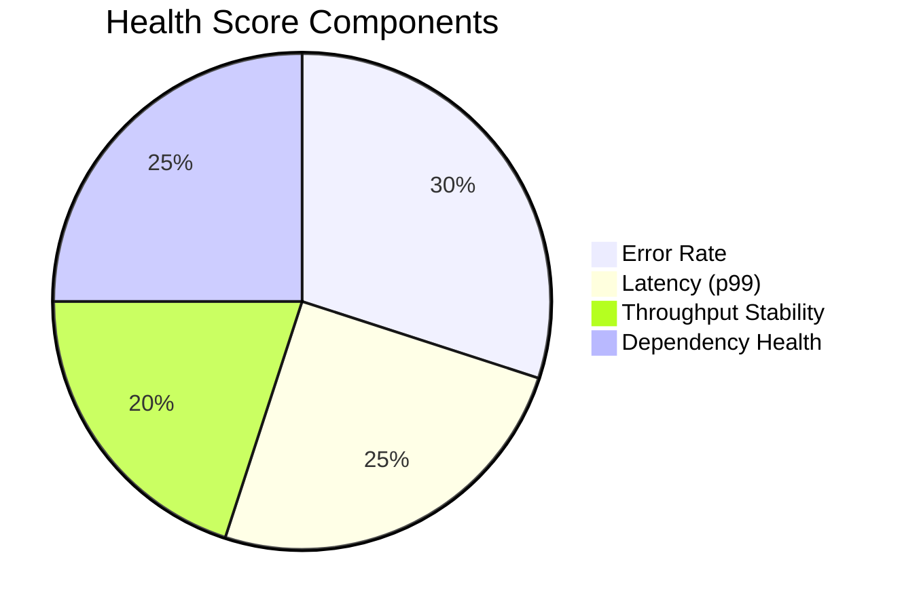

# How to Build a Service Catalog with Automatic Health Scores from OpenTelemetry Data

Author: [nawazdhandala](https://www.github.com/nawazdhandala)

Tags: OpenTelemetry, Service Catalog, Health Scores, Observability

Description: Build a service catalog that computes real-time health scores from OpenTelemetry metrics, traces, and logs to give teams a single view of service reliability.

A service catalog that only lists service names and owners is just a spreadsheet with extra steps. The real value comes when the catalog shows live health information derived from actual telemetry data. Instead of asking "is the payment service healthy?", you can open the catalog and see a score of 92/100 because error rates are slightly elevated but latency and throughput are normal.

OpenTelemetry data provides everything needed to compute these scores. HTTP metrics give you request rates and error percentages. Trace data reveals latency distributions and dependency health. Logs surface error patterns. Combined, these signals produce a meaningful health score per service.

## Health Score Components

Break the health score into weighted components that reflect what matters for your organization. A typical model uses four signals.



## Defining the Scoring Model

Each component maps to a query against your OpenTelemetry data. The scorer normalizes each signal to a 0-100 scale and applies the weights.

```python
# health_scorer/model.py
from dataclasses import dataclass
from typing import List

@dataclass
class HealthComponent:
    name: str
    weight: float
    score: float  # 0-100

@dataclass
class ServiceHealthScore:
    service_name: str
    overall_score: float
    components: List[HealthComponent]
    timestamp: str

def compute_health_score(
    error_rate: float,
    p99_latency_ms: float,
    throughput_change_pct: float,
    dependency_error_rate: float,
    slo_latency_target_ms: float = 500.0,
) -> ServiceHealthScore:
    """
    Compute a health score from OpenTelemetry-derived metrics.

    error_rate: percentage of requests returning 5xx (0.0 to 100.0)
    p99_latency_ms: 99th percentile latency in milliseconds
    throughput_change_pct: change in request rate vs baseline (-100 to +100)
    dependency_error_rate: error rate of downstream services
    slo_latency_target_ms: the latency SLO target for scoring
    """

    # Error rate scoring: 0% errors = 100, >5% errors = 0
    error_score = max(0, 100 - (error_rate * 20))

    # Latency scoring: at or below SLO target = 100, 3x target = 0
    latency_ratio = p99_latency_ms / slo_latency_target_ms
    latency_score = max(0, min(100, 100 - ((latency_ratio - 1) * 50)))

    # Throughput stability: no change = 100, >50% drop = 0
    if throughput_change_pct < 0:
        throughput_score = max(0, 100 + (throughput_change_pct * 2))
    else:
        throughput_score = 100  # Increased traffic is not a health problem

    # Dependency health: similar to error rate scoring
    dep_score = max(0, 100 - (dependency_error_rate * 20))

    components = [
        HealthComponent("Error Rate", 0.30, round(error_score, 1)),
        HealthComponent("Latency (p99)", 0.25, round(latency_score, 1)),
        HealthComponent("Throughput Stability", 0.20, round(throughput_score, 1)),
        HealthComponent("Dependency Health", 0.25, round(dep_score, 1)),
    ]

    overall = sum(c.weight * c.score for c in components)

    return ServiceHealthScore(
        service_name="",
        overall_score=round(overall, 1),
        components=components,
        timestamp="",
    )
```

## Fetching OpenTelemetry Metrics

The scorer pulls data from your metrics backend. These queries use the semantic conventions from OpenTelemetry, specifically the `http.server.request.duration` metric that HTTP instrumentation produces.

```python
# health_scorer/metrics_client.py
import requests

METRICS_API = "https://metrics.internal/api/v1/query"

def get_error_rate(service_name: str, window: str = "5m") -> float:
    """Compute error rate from OTel HTTP server metrics."""
    query = f"""
      sum(rate(http_server_request_duration_seconds_count{{
        service_name="{service_name}",
        http_response_status_code=~"5.."
      }}[{window}]))
      /
      sum(rate(http_server_request_duration_seconds_count{{
        service_name="{service_name}"
      }}[{window}]))
      * 100
    """
    result = requests.get(METRICS_API, params={"query": query})
    data = result.json()["data"]["result"]
    return float(data[0]["value"][1]) if data else 0.0

def get_p99_latency(service_name: str, window: str = "5m") -> float:
    """Get p99 latency in milliseconds from OTel histogram metrics."""
    query = f"""
      histogram_quantile(0.99,
        sum(rate(http_server_request_duration_seconds_bucket{{
          service_name="{service_name}"
        }}[{window}])) by (le)
      ) * 1000
    """
    result = requests.get(METRICS_API, params={"query": query})
    data = result.json()["data"]["result"]
    return float(data[0]["value"][1]) if data else 0.0

def get_dependency_error_rate(service_name: str, window: str = "5m") -> float:
    """Check error rates of services this service calls."""
    query = f"""
      sum(rate(http_client_request_duration_seconds_count{{
        service_name="{service_name}",
        http_response_status_code=~"5.."
      }}[{window}]))
      /
      sum(rate(http_client_request_duration_seconds_count{{
        service_name="{service_name}"
      }}[{window}]))
      * 100
    """
    result = requests.get(METRICS_API, params={"query": query})
    data = result.json()["data"]["result"]
    return float(data[0]["value"][1]) if data else 0.0
```

## Catalog API

Expose the health scores through a REST API that your internal developer portal consumes. The API refreshes scores every minute and caches results.

```python
# catalog_api/routes.py
from flask import Flask, jsonify
from health_scorer.model import compute_health_score
from health_scorer.metrics_client import (
    get_error_rate, get_p99_latency, get_dependency_error_rate
)
from datetime import datetime

app = Flask(__name__)

@app.route("/api/v1/services/<service_name>/health")
def service_health(service_name: str):
    """
    Returns the current health score for a service,
    computed from live OpenTelemetry metrics.
    """
    error_rate = get_error_rate(service_name)
    p99_latency = get_p99_latency(service_name)
    dep_error_rate = get_dependency_error_rate(service_name)

    score = compute_health_score(
        error_rate=error_rate,
        p99_latency_ms=p99_latency,
        throughput_change_pct=0.0,  # computed separately via baseline comparison
        dependency_error_rate=dep_error_rate,
    )

    return jsonify({
        "service": service_name,
        "health_score": score.overall_score,
        "status": _score_to_status(score.overall_score),
        "components": [
            {"name": c.name, "score": c.score, "weight": c.weight}
            for c in score.components
        ],
        "computed_at": datetime.utcnow().isoformat(),
    })

def _score_to_status(score: float) -> str:
    """Map numeric score to a human-readable status."""
    if score >= 90:
        return "healthy"
    elif score >= 70:
        return "degraded"
    elif score >= 50:
        return "unhealthy"
    return "critical"
```

## Displaying Scores in the Catalog

The catalog UI fetches health scores and renders them alongside ownership and metadata. A simple table view with color-coded scores gives leadership and on-call engineers a quick overview of system health.

The health score is most useful when it changes over time. Store historical scores and show a trend line so teams can see whether their service is improving or degrading week over week. This turns the catalog from a static directory into a living reliability dashboard that is driven entirely by OpenTelemetry data flowing through your existing instrumentation.
