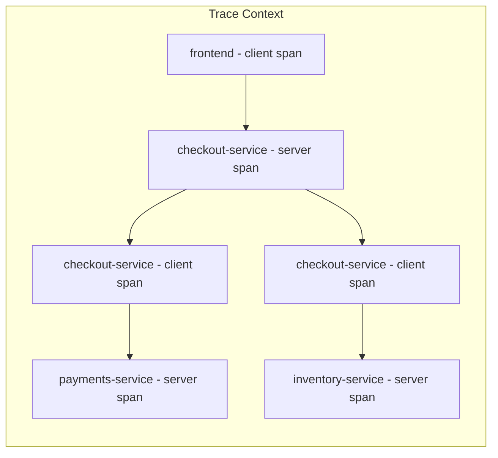

# How to Create a Real-Time Service Dependency Map Dashboard from OpenTelemetry Trace Data

Author: [nawazdhandala](https://www.github.com/nawazdhandala)

Tags: OpenTelemetry, Grafana, Service Map, Trace Data

Description: Build a real-time service dependency map in Grafana that visualizes inter-service communication patterns extracted from OpenTelemetry distributed traces.

Documentation about service dependencies goes stale the moment it is written. A developer adds a new gRPC call to a downstream service and forgets to update the architecture diagram. Six months later, nobody knows the full dependency graph. OpenTelemetry traces solve this because they encode actual service-to-service calls as parent-child span relationships. By extracting these relationships, you get a live dependency map that always reflects reality.

## How Traces Encode Dependencies

When Service A calls Service B, the OpenTelemetry SDK propagates the trace context. Service A creates a client span, and Service B creates a server span with a `parent_span_id` pointing back to A's client span. This parent-child relationship, combined with the `service.name` resource attribute on each span, gives you a directed edge in the dependency graph.



From this single trace, you can extract three edges:
- `frontend` calls `checkout-service`
- `checkout-service` calls `payments-service`
- `checkout-service` calls `inventory-service`

## Step 1: Generate Service Graph Metrics

The OpenTelemetry Collector's `servicegraph` connector processes traces and emits metrics that represent service-to-service edges. Each edge includes call rate, error rate, and latency:

```yaml
# otel-collector-config.yaml
# Extract service dependency graph metrics from trace data
receivers:
  otlp:
    protocols:
      grpc:
        endpoint: "0.0.0.0:4317"

connectors:
  # The servicegraph connector builds a dependency graph from traces
  servicegraph:
    # How long to wait for matching client/server span pairs
    latency_histogram_buckets: [0.01, 0.05, 0.1, 0.25, 0.5, 1.0, 2.5, 5.0]
    dimensions:
      - http.method
      - rpc.method
    # Store edges and virtual nodes for services that only appear as clients
    store:
      ttl: 2s
      max_items: 1000
    # Cache size for in-flight traces waiting for span pairs
    cache_loop: 2m
    store_expiration_loop: 10s

processors:
  batch:
    timeout: 10s

exporters:
  prometheus:
    endpoint: "0.0.0.0:8889"
    resource_to_telemetry_conversion:
      enabled: true
  otlp/tempo:
    endpoint: "tempo:4317"
    tls:
      insecure: true

service:
  pipelines:
    traces:
      receivers: [otlp]
      processors: [batch]
      exporters: [otlp/tempo, servicegraph]
    metrics:
      receivers: [servicegraph]
      processors: [batch]
      exporters: [prometheus]
```

The servicegraph connector produces these metrics:

- `traces_service_graph_request_total` - request count per edge
- `traces_service_graph_request_failed_total` - failed request count per edge
- `traces_service_graph_request_server_seconds_bucket` - server-side latency histogram per edge

Each metric has labels `client` and `server` identifying the two services in the edge.

## Step 2: Use Grafana's Node Graph Panel

Grafana has a built-in Node Graph panel type that renders directed graphs. It requires two data frames: one for nodes (services) and one for edges (calls between services). Configure a Prometheus data source with these queries.

**Nodes query** - list all services with their current request rate as a size indicator:

```promql
# Node data: each service with its inbound request rate
# This becomes the node size in the graph visualization
sum by (server) (
  rate(traces_service_graph_request_total[5m])
)
```

**Edges query** - list all service-to-service call relationships:

```promql
# Edge data: call rate between each service pair
sum by (client, server) (
  rate(traces_service_graph_request_total[5m])
)
```

**Edge error rate** - color edges by their error rate:

```promql
# Error rate per edge (used to color edges red when errors are high)
sum by (client, server) (
  rate(traces_service_graph_request_failed_total[5m])
)
/
sum by (client, server) (
  rate(traces_service_graph_request_total[5m])
)
```

## Step 3: Configure the Node Graph Panel

The Node Graph panel needs field mappings to understand your data. Here is the panel JSON configuration:

```json
{
  "type": "nodeGraph",
  "title": "Service Dependency Map",
  "targets": [
    {
      "refId": "nodes",
      "expr": "sum by (server) (rate(traces_service_graph_request_total[5m]))",
      "format": "table",
      "instant": true
    },
    {
      "refId": "edges",
      "expr": "sum by (client, server) (rate(traces_service_graph_request_total[5m]))",
      "format": "table",
      "instant": true
    }
  ],
  "transformations": [
    {
      "id": "configFromData",
      "options": {
        "configRefId": "nodes",
        "mappings": [
          {
            "fieldName": "server",
            "handlerKey": "field.name"
          },
          {
            "fieldName": "Value",
            "handlerKey": "field.name"
          }
        ]
      }
    }
  ]
}
```

## Step 4: Use Tempo's Service Graph Feature

If you use Grafana Tempo as your trace backend, it has a built-in service graph feature that works directly with the Node Graph panel without needing separate Prometheus metrics. Enable it in Tempo:

```yaml
# tempo-config.yaml
# Enable the metrics generator to produce service graph data
metrics_generator:
  registry:
    external_labels:
      source: tempo
      cluster: production
  storage:
    path: /var/tempo/generator/wal
    remote_write:
      - url: http://prometheus:9090/api/v1/write
  processor:
    # Enable the service graph processor
    service_graphs:
      dimensions:
        - http.method
        - http.status_code
      enable_client_server_prefix: true
      peer_attributes:
        - service.name
        - db.system
        - messaging.system
      max_items: 10000
      wait: 10s
    # Also enable span metrics for RED dashboards
    span_metrics:
      dimensions:
        - http.method
        - http.route
        - http.status_code
```

In Grafana, add Tempo as a data source and enable the "Service Graph" feature:

```yaml
# grafana/provisioning/datasources/tempo.yaml
# Configure Tempo data source with service graph enabled
apiVersion: 1
datasources:
  - name: Tempo
    type: tempo
    url: http://tempo:3200
    jsonData:
      tracesToMetrics:
        datasourceUid: prometheus
        spanStartTimeShift: '-1h'
        spanEndTimeShift: '1h'
        tags:
          - key: service.name
            value: service_name
      serviceMap:
        datasourceUid: prometheus
      nodeGraph:
        enabled: true
```

## Step 5: Add Health Indicators to the Map

A plain dependency map shows structure but not health. Overlay the error rate and latency data to turn it into a health map:

```promql
# P95 latency per edge - use this to color slow edges
histogram_quantile(0.95,
  sum by (client, server, le) (
    rate(traces_service_graph_request_server_seconds_bucket[5m])
  )
)
```

Configure the Node Graph panel to use color thresholds:

- **Node color**: Green when error rate is below 0.1%, yellow between 0.1-1%, red above 1%
- **Edge color**: Green when p95 latency is under 200ms, yellow between 200-500ms, red above 500ms
- **Edge thickness**: Proportional to request rate (thicker lines mean more traffic)

## Step 6: Add Click-Through Drill-Downs

Each node and edge in the graph should link to deeper dashboards. Configure data links on the Node Graph panel:

```json
{
  "fieldConfig": {
    "defaults": {
      "links": [
        {
          "title": "View RED metrics for ${__data.fields.id}",
          "url": "/d/red-dashboard?var-service=${__data.fields.id}&from=${__from}&to=${__to}"
        },
        {
          "title": "View traces between ${__data.fields.source} and ${__data.fields.target}",
          "url": "/explore?left={\"datasource\":\"Tempo\",\"queries\":[{\"queryType\":\"traceql\",\"query\":\"{resource.service.name=\\\"${__data.fields.source}\\\"}\"}]}"
        }
      ]
    }
  }
}
```

## Handling External Dependencies

Not all dependencies are OpenTelemetry-instrumented services. Databases, message queues, and third-party APIs appear in traces as client spans without corresponding server spans. The servicegraph connector handles these as "virtual nodes" using the `db.system`, `messaging.system`, or `peer.service` span attributes. Make sure your instrumentation sets these attributes on outgoing calls:

```python
# Python example: setting peer attributes for external dependencies
from opentelemetry import trace

tracer = trace.get_tracer("checkout-service")

with tracer.start_as_current_span(
    "query_orders",
    attributes={
        "db.system": "postgresql",
        "db.name": "orders",
        "server.address": "orders-db.internal",
    }
) as span:
    # Database query happens here
    results = db.execute("SELECT * FROM orders WHERE id = %s", order_id)
```

This ensures that your dependency map shows the full picture, including databases, caches, and external APIs that your services depend on. The result is a live architecture diagram that updates itself as your system evolves, eliminating the need for manually maintained documentation about service relationships.
