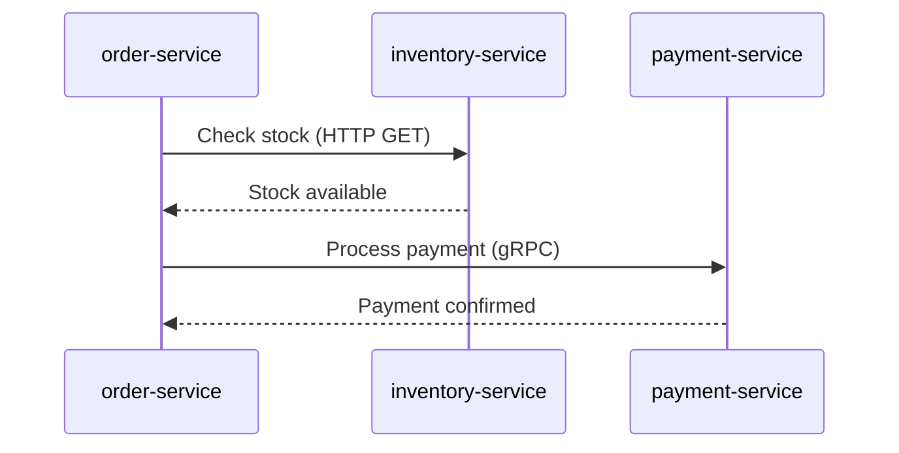

# How to Build a Platform-Wide Service Dependency Map from OpenTelemetry Trace Data

Author: [nawazdhandala](https://www.github.com/nawazdhandala)

Tags: OpenTelemetry, Service Dependency Map, Distributed Tracing, Platform Engineering

Description: Extract service-to-service dependency relationships from OpenTelemetry trace spans and build an automated service map for your platform.

Service dependency maps drawn on whiteboards go stale within weeks. Engineers add new service calls, deprecate old ones, and forget to update the diagram. The only accurate dependency map is one generated from actual production traffic.

OpenTelemetry trace data already contains everything you need. Every span records the calling service, the called service, and the type of communication. You just need to extract and aggregate this information.

## How Traces Encode Dependencies

When Service A calls Service B, the trace contains a client span in Service A and a server span in Service B. Both spans share the same parent-child relationship through their trace and span IDs. The `service.name` resource attribute on each span tells you which service produced it.



Each arrow in this diagram becomes a dependency edge that we can extract from trace data.

## Extracting Dependencies with the Spanmetrics Connector

The OpenTelemetry Collector has a `spanmetrics` connector that generates metrics from span data. This is the simplest way to build a dependency map without writing custom code.

This Collector config generates call metrics between services from trace data:

```yaml
# dependency-map-collector.yaml
receivers:
  otlp:
    protocols:
      grpc:
        endpoint: 0.0.0.0:4317

connectors:
  # The spanmetrics connector reads traces and produces metrics
  spanmetrics:
    histogram:
      explicit:
        buckets: [10ms, 50ms, 100ms, 500ms, 1s, 5s]
    dimensions:
      # These span attributes become metric labels
      - name: rpc.system
      - name: http.method
      - name: peer.service
    # Include resource attributes as metric labels
    dimensions_cache_size: 1000
    resource_metrics_key_attributes:
      - service.name
      - deployment.environment

exporters:
  otlphttp/traces:
    endpoint: https://traces-backend:4318
  otlphttp/metrics:
    endpoint: https://metrics-backend:4318

service:
  pipelines:
    # Traces flow through the spanmetrics connector
    traces:
      receivers: [otlp]
      exporters: [spanmetrics, otlphttp/traces]
    # Metrics generated by spanmetrics get exported
    metrics/spanmetrics:
      receivers: [spanmetrics]
      exporters: [otlphttp/metrics]
```

The connector produces metrics like `calls_total` and `duration_bucket` with labels for the source service, destination service, and operation. These metrics are the raw data for your dependency map.

## Building the Dependency Graph with Code

For more control, you can process trace data directly and build a graph. This Python script reads spans from an OTLP-compatible backend and extracts edges.

This script queries span data and builds a directed graph of service dependencies:

```python
# build_dependency_map.py
import requests
from collections import defaultdict

def fetch_traces(backend_url: str, lookback_hours: int = 24) -> list:
    """Fetch recent traces from your trace backend API."""
    # Adjust this to match your backend's API
    response = requests.get(
        f"{backend_url}/api/traces",
        params={"lookback": f"{lookback_hours}h", "limit": 10000},
    )
    return response.json()["data"]

def extract_dependencies(traces: list) -> dict:
    """
    Extract service-to-service edges from trace data.

    Returns a dict mapping (source, target) tuples to call metadata
    including count, error rate, and latency percentiles.
    """
    edges = defaultdict(lambda: {"count": 0, "errors": 0, "durations": []})

    for trace_data in traces:
        spans = trace_data["spans"]
        # Index spans by span ID for parent lookup
        span_index = {s["spanID"]: s for s in spans}

        for span in spans:
            # Only look at client/producer spans - these represent outgoing calls
            span_kind = get_tag(span, "span.kind")
            if span_kind not in ("client", "producer"):
                continue

            source_service = span["process"]["serviceName"]
            # The target service comes from peer.service or the child span's service
            target_service = (
                get_tag(span, "peer.service")
                or resolve_target_from_children(span, spans, span_index)
            )

            if target_service and target_service != source_service:
                edge_key = (source_service, target_service)
                edges[edge_key]["count"] += 1
                edges[edge_key]["durations"].append(span["duration"])
                if has_error(span):
                    edges[edge_key]["errors"] += 1

    return dict(edges)

def get_tag(span: dict, key: str) -> str:
    """Extract a tag value from a span."""
    for tag in span.get("tags", []):
        if tag["key"] == key:
            return tag["value"]
    return None

def has_error(span: dict) -> bool:
    """Check if a span has an error status."""
    return get_tag(span, "otel.status_code") == "ERROR"

def resolve_target_from_children(span, all_spans, span_index):
    """Find the target service by looking at child server spans."""
    for candidate in all_spans:
        if candidate.get("parentSpanID") == span["spanID"]:
            child_kind = get_tag(candidate, "span.kind")
            if child_kind == "server":
                return candidate["process"]["serviceName"]
    return None
```

## Generating a Visual Map

Once you have the edges, render them as a graph. Mermaid works well for documentation. For dynamic dashboards, export to a graph visualization tool.

This function generates a Mermaid diagram from the extracted dependency data:

```python
# generate_map.py
def to_mermaid(edges: dict) -> str:
    """Convert dependency edges to a Mermaid flowchart."""
    lines = ["flowchart LR"]

    # Create node definitions with sanitized IDs
    services = set()
    for (source, target) in edges:
        services.add(source)
        services.add(target)

    for service in sorted(services):
        node_id = service.replace("-", "_")
        lines.append(f"    {node_id}[{service}]")

    # Create edges with call count labels
    for (source, target), data in sorted(edges.items()):
        src_id = source.replace("-", "_")
        tgt_id = target.replace("-", "_")
        error_rate = (data["errors"] / data["count"] * 100) if data["count"] > 0 else 0
        label = f"{data['count']} calls"
        if error_rate > 1:
            label += f" ({error_rate:.1f}% errors)"
        lines.append(f"    {src_id} -->|{label}| {tgt_id}")

    return "\n".join(lines)

# Example output:
# flowchart LR
#     order_service[order-service]
#     inventory_service[inventory-service]
#     payment_service[payment-service]
#     order_service -->|4523 calls| inventory_service
#     order_service -->|4501 calls (0.3% errors)| payment_service
```

## Automating Updates

Run the dependency extraction as a scheduled job - daily or hourly depending on how frequently your architecture changes. Store historical snapshots so you can diff the graph over time and detect when new dependencies appear or old ones disappear.

```yaml
# dependency-map-cronjob.yaml
apiVersion: batch/v1
kind: CronJob
metadata:
  name: dependency-map-builder
spec:
  schedule: "0 */6 * * *"  # Every 6 hours
  jobTemplate:
    spec:
      template:
        spec:
          containers:
            - name: builder
              image: internal/dependency-map-builder:latest
              env:
                - name: TRACE_BACKEND_URL
                  value: "http://traces-backend:16686"
                - name: LOOKBACK_HOURS
                  value: "6"
          restartPolicy: OnFailure
```

## Using the Map

A dependency map is only useful if it drives decisions. Here are specific ways to use it:

**Incident response.** When a service is degraded, immediately see which upstream services are affected. This turns "something is slow" into "the payment service is slow, which affects order-service and checkout-service."

**Change risk assessment.** Before deploying a breaking change to a service's API, check which services depend on it. Automated dependency data eliminates the "I did not know anyone was calling that endpoint" problem.

**Architecture review.** Spot unexpected dependencies - like a frontend service directly calling a database service, bypassing the intended API layer.

The dependency map generated from real trace data is always accurate because it reflects what is actually happening in production, not what someone thinks is happening.
