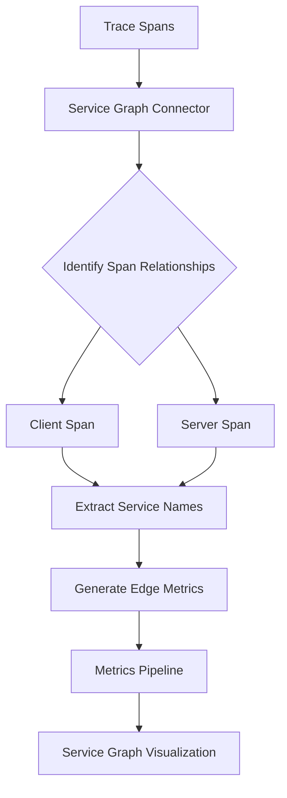

# How to Configure the Service Graph Connector in the OpenTelemetry Collector

Author: [nawazdhandala](https://www.github.com/nawazdhandala)

Tags: OpenTelemetry, Collector, Connectors, Service Graph, Service Mesh, Distributed Tracing

Description: Learn how to configure the Service Graph Connector in OpenTelemetry Collector to automatically generate service topology metrics from distributed traces for dependency mapping and analysis.

The Service Graph Connector in the OpenTelemetry Collector analyzes distributed traces to automatically generate metrics representing the relationships between services in your system. These metrics enable visualization of service dependencies, identification of bottlenecks, and understanding of system architecture without manual mapping.

## Understanding Service Graphs

A service graph represents the topology of a distributed system, showing which services communicate with each other and how. Traditional service dependency mapping requires manual documentation or specialized agents. The Service Graph Connector derives this information automatically from trace data.

The connector examines spans within traces, identifies client-server relationships, and generates metrics representing these connections. These metrics include request rates, error rates, and latency distributions between service pairs.

## How the Service Graph Connector Works

The connector processes traces to identify service-to-service communication:



For each trace, the connector:
1. Identifies client and server spans based on span kind
2. Extracts source and destination service names
3. Generates metrics for the edge between services
4. Tracks request counts, durations, and failures

## Basic Configuration

Here's a minimal configuration to generate service graph metrics:

```yaml
receivers:
  otlp:
    protocols:
      grpc:
        endpoint: 0.0.0.0:4317

processors:
  batch:
    timeout: 10s

exporters:
  otlp/traces:
    endpoint: traces-backend:4317

  otlp/metrics:
    endpoint: metrics-backend:4317

connectors:
  servicegraph:
    # How long to cache spans waiting for their pair
    latency_histogram_buckets: [2ms, 4ms, 6ms, 8ms, 10ms, 50ms, 100ms, 200ms, 400ms, 800ms, 1s, 1400ms, 2s, 5s, 10s, 15s]

    # Dimensions to add to metrics
    dimensions:
      - service.namespace
      - deployment.environment

    # Store configuration
    store:
      # Time to wait for span pairs
      ttl: 2s
      # Maximum number of items in the store
      max_items: 1000

service:
  pipelines:
    # Traces pipeline feeds the connector
    traces:
      receivers: [otlp]
      processors: [batch]
      exporters: [servicegraph, otlp/traces]

    # Metrics pipeline receives generated service graph metrics
    metrics:
      receivers: [servicegraph]
      processors: [batch]
      exporters: [otlp/metrics]
```

This configuration generates three key metrics:
- `traces_service_graph_request_total`: Total requests between service pairs
- `traces_service_graph_request_failed_total`: Failed requests between service pairs
- `traces_service_graph_request_server_seconds`: Server-side latency histogram

## Configuring Latency Buckets

Customize histogram buckets to match your service latency characteristics:

```yaml
connectors:
  servicegraph:
    # Fine-grained buckets for low-latency services (microseconds to milliseconds)
    latency_histogram_buckets: [
      100us, 250us, 500us, 750us,
      1ms, 2ms, 5ms, 10ms, 25ms, 50ms, 100ms, 250ms, 500ms,
      1s, 2s, 5s, 10s
    ]

    dimensions:
      - service.namespace
      - deployment.environment

    store:
      ttl: 2s
      max_items: 5000

receivers:
  otlp:
    protocols:
      grpc:
        endpoint: 0.0.0.0:4317

processors:
  batch:
    timeout: 10s

exporters:
  otlp/traces:
    endpoint: traces-backend:4317
  otlp/metrics:
    endpoint: metrics-backend:4317

service:
  pipelines:
    traces:
      receivers: [otlp]
      processors: [batch]
      exporters: [servicegraph, otlp/traces]

    metrics:
      receivers: [servicegraph]
      processors: [batch]
      exporters: [otlp/metrics]
```

Choose buckets that align with your SLOs. For high-performance services, use smaller buckets. For services with variable latency, use exponentially-spaced buckets.

## Adding Dimensions for Richer Metrics

Include additional dimensions to segment service graph metrics:

```yaml
connectors:
  servicegraph:
    latency_histogram_buckets: [2ms, 4ms, 6ms, 8ms, 10ms, 50ms, 100ms, 200ms, 400ms, 800ms, 1s, 2s, 5s, 10s]

    # Add multiple dimensions for detailed analysis
    dimensions:
      # Deployment information
      - deployment.environment
      - service.namespace
      - service.version

      # Infrastructure information
      - cloud.provider
      - cloud.region
      - k8s.cluster.name

      # Custom business dimensions
      - tenant.id
      - feature.flag

    store:
      ttl: 2s
      max_items: 10000

processors:
  # Ensure required attributes are present
  resource:
    attributes:
      - key: deployment.environment
        value: ${ENVIRONMENT}
        action: upsert
      - key: cloud.provider
        value: ${CLOUD_PROVIDER}
        action: upsert

receivers:
  otlp:
    protocols:
      grpc:
        endpoint: 0.0.0.0:4317

exporters:
  otlp/traces:
    endpoint: traces-backend:4317
  otlp/metrics:
    endpoint: metrics-backend:4317

service:
  pipelines:
    traces:
      receivers: [otlp]
      processors: [resource, batch]
      exporters: [servicegraph, otlp/traces]

    metrics:
      receivers: [servicegraph]
      processors: [batch]
      exporters: [otlp/metrics]
```

Be cautious with dimensions as each unique combination creates a new metric series, increasing cardinality and storage costs.

## Configuring the Store

The Service Graph Connector maintains an in-memory store to correlate client and server spans. Configure the store based on your trace volume and span timing:

```yaml
connectors:
  servicegraph:
    latency_histogram_buckets: [10ms, 50ms, 100ms, 200ms, 500ms, 1s, 2s, 5s, 10s]

    dimensions:
      - deployment.environment

    store:
      # Time to keep spans waiting for their pair
      # Increase if spans arrive with significant delay
      ttl: 5s

      # Maximum entries in the store
      # Increase for high-volume systems
      max_items: 50000

receivers:
  otlp:
    protocols:
      grpc:
        endpoint: 0.0.0.0:4317

processors:
  batch:
    timeout: 10s

exporters:
  otlp/traces:
    endpoint: traces-backend:4317
  otlp/metrics:
    endpoint: metrics-backend:4317

service:
  pipelines:
    traces:
      receivers: [otlp]
      processors: [batch]
      exporters: [servicegraph, otlp/traces]

    metrics:
      receivers: [servicegraph]
      processors: [batch]
      exporters: [otlp/metrics]
```

Monitor the `traces_service_graph_unmatched_spans` metric to determine if TTL needs adjustment. High unmatched spans indicate spans arrive too far apart or the store size is insufficient.

## Multi-Environment Service Graphs

Generate separate service graphs for different environments:

```yaml
processors:
  # Ensure environment attribute exists
  resource/environment:
    attributes:
      - key: deployment.environment
        value: ${ENVIRONMENT}
        action: upsert

connectors:
  # Separate connector for each environment
  servicegraph/production:
    latency_histogram_buckets: [5ms, 10ms, 25ms, 50ms, 100ms, 250ms, 500ms, 1s, 2s, 5s]
    dimensions:
      - service.namespace
      - service.version
    store:
      ttl: 2s
      max_items: 20000

  servicegraph/staging:
    latency_histogram_buckets: [10ms, 50ms, 100ms, 500ms, 1s, 5s, 10s]
    dimensions:
      - service.namespace
    store:
      ttl: 3s
      max_items: 5000

  servicegraph/development:
    latency_histogram_buckets: [50ms, 100ms, 500ms, 1s, 5s, 10s, 30s]
    dimensions:
      - service.namespace
    store:
      ttl: 5s
      max_items: 1000

receivers:
  otlp:
    protocols:
      grpc:
        endpoint: 0.0.0.0:4317

exporters:
  otlp/traces:
    endpoint: traces-backend:4317
  otlp/metrics-prod:
    endpoint: prod-metrics:4317
  otlp/metrics-staging:
    endpoint: staging-metrics:4317
  otlp/metrics-dev:
    endpoint: dev-metrics:4317

service:
  pipelines:
    traces:
      receivers: [otlp]
      processors: [resource/environment, batch]
      exporters: [servicegraph/production, servicegraph/staging, servicegraph/development, otlp/traces]

    metrics/production:
      receivers: [servicegraph/production]
      processors: [batch]
      exporters: [otlp/metrics-prod]

    metrics/staging:
      receivers: [servicegraph/staging]
      processors: [batch]
      exporters: [otlp/metrics-staging]

    metrics/development:
      receivers: [servicegraph/development]
      processors: [batch]
      exporters: [otlp/metrics-dev]
```

## Service Graph for Specific Services

Generate service graphs only for critical services to reduce cardinality:

```yaml
processors:
  # Filter traces to only critical services
  filter/critical:
    traces:
      span:
        - 'resource.attributes["service.namespace"] == "production"'
        - 'resource.attributes["service.criticality"] == "high"'

connectors:
  servicegraph:
    latency_histogram_buckets: [5ms, 10ms, 25ms, 50ms, 100ms, 250ms, 500ms, 1s, 2s]

    dimensions:
      - service.namespace
      - service.version
      - deployment.environment

    store:
      ttl: 2s
      max_items: 10000

receivers:
  otlp:
    protocols:
      grpc:
        endpoint: 0.0.0.0:4317

processors:
  batch:
    timeout: 10s

exporters:
  otlp/traces:
    endpoint: traces-backend:4317
  otlp/metrics:
    endpoint: metrics-backend:4317

service:
  pipelines:
    # All traces go to storage
    traces/all:
      receivers: [otlp]
      processors: [batch]
      exporters: [otlp/traces]

    # Only critical traces generate service graph
    traces/critical:
      receivers: [otlp]
      processors: [filter/critical, batch]
      exporters: [servicegraph]

    metrics:
      receivers: [servicegraph]
      processors: [batch]
      exporters: [otlp/metrics]
```

## Enhancing Service Graphs with Virtual Nodes

Create virtual nodes for external services like databases, message queues, or third-party APIs:

```yaml
processors:
  # Transform database spans into virtual service nodes
  transform/virtual-nodes:
    trace_statements:
      - context: span
        statements:
          # Create virtual nodes for databases
          - set(attributes["peer.service"], Concat(["db-", attributes["db.system"]])) where attributes["db.system"] != nil and attributes["peer.service"] == nil

          # Create virtual nodes for message queues
          - set(attributes["peer.service"], Concat(["queue-", attributes["messaging.system"]])) where attributes["messaging.system"] != nil and attributes["peer.service"] == nil

          # Create virtual nodes for HTTP external calls
          - set(attributes["peer.service"], "external-api") where attributes["http.url"] != nil and IsMatch(attributes["http.url"], "^https://external") and attributes["peer.service"] == nil

connectors:
  servicegraph:
    latency_histogram_buckets: [2ms, 5ms, 10ms, 25ms, 50ms, 100ms, 250ms, 500ms, 1s, 2s, 5s]

    dimensions:
      - deployment.environment
      - service.namespace

    # Virtual nodes appear as regular services in the graph
    store:
      ttl: 2s
      max_items: 10000

receivers:
  otlp:
    protocols:
      grpc:
        endpoint: 0.0.0.0:4317

processors:
  batch:
    timeout: 10s

exporters:
  otlp/traces:
    endpoint: traces-backend:4317
  otlp/metrics:
    endpoint: metrics-backend:4317

service:
  pipelines:
    traces:
      receivers: [otlp]
      processors: [transform/virtual-nodes, batch]
      exporters: [servicegraph, otlp/traces]

    metrics:
      receivers: [servicegraph]
      processors: [batch]
      exporters: [otlp/metrics]
```

## Combining with RED Metrics

Use the Service Graph Connector alongside the Span Metrics Connector for comprehensive service monitoring:

```yaml
connectors:
  # Service graph for topology
  servicegraph:
    latency_histogram_buckets: [5ms, 10ms, 25ms, 50ms, 100ms, 250ms, 500ms, 1s, 2s, 5s]
    dimensions:
      - deployment.environment
      - service.namespace
    store:
      ttl: 2s
      max_items: 10000

  # Span metrics for RED metrics per service
  spanmetrics:
    latency_histogram_buckets: [5ms, 10ms, 25ms, 50ms, 100ms, 250ms, 500ms, 1s, 2s, 5s]
    dimensions:
      - http.method
      - http.status_code
      - service.namespace
    namespace: span.metrics

receivers:
  otlp:
    protocols:
      grpc:
        endpoint: 0.0.0.0:4317

processors:
  batch:
    timeout: 10s

exporters:
  otlp/traces:
    endpoint: traces-backend:4317
  otlp/metrics:
    endpoint: metrics-backend:4317

service:
  pipelines:
    traces:
      receivers: [otlp]
      processors: [batch]
      # Generate both service graph and span metrics
      exporters: [servicegraph, spanmetrics, otlp/traces]

    # Service graph metrics
    metrics/servicegraph:
      receivers: [servicegraph]
      processors: [batch]
      exporters: [otlp/metrics]

    # Span metrics (RED metrics)
    metrics/spanmetrics:
      receivers: [spanmetrics]
      processors: [batch]
      exporters: [otlp/metrics]
```

Learn more about generating RED metrics at https://oneuptime.com/blog/post/span-metrics-connector-red-metrics/view.

## Production Configuration

Here's a comprehensive production-ready service graph configuration:

```yaml
receivers:
  otlp:
    protocols:
      grpc:
        endpoint: 0.0.0.0:4317
        max_recv_msg_size_mib: 16
      http:
        endpoint: 0.0.0.0:4318

processors:
  memory_limiter:
    check_interval: 1s
    limit_mib: 2048
    spike_limit_mib: 512

  batch:
    timeout: 10s
    send_batch_size: 1024
    send_batch_max_size: 2048

  resource/enrich:
    attributes:
      - key: deployment.environment
        value: ${ENVIRONMENT}
        action: upsert
      - key: k8s.cluster.name
        value: ${K8S_CLUSTER}
        action: upsert

  # Create virtual nodes for external dependencies
  transform/virtual-nodes:
    trace_statements:
      - context: span
        statements:
          # Database virtual nodes
          - set(attributes["peer.service"], Concat(["db.", attributes["db.system"]])) where attributes["db.system"] != nil and attributes["peer.service"] == nil

          # Cache virtual nodes
          - set(attributes["peer.service"], "cache.redis") where attributes["db.system"] == "redis" and attributes["peer.service"] == nil

          # Message queue virtual nodes
          - set(attributes["peer.service"], Concat(["mq.", attributes["messaging.system"]])) where attributes["messaging.system"] != nil and attributes["peer.service"] == nil

          # External HTTP services
          - set(attributes["peer.service"], "external.api") where attributes["http.url"] != nil and IsMatch(attributes["http.url"], "https://api\\.external\\.com") and attributes["peer.service"] == nil

connectors:
  servicegraph:
    # Latency buckets aligned with SLOs
    latency_histogram_buckets: [
      5ms, 10ms, 20ms, 50ms, 100ms,
      200ms, 500ms, 1s, 2s, 5s, 10s
    ]

    # Dimensions for detailed analysis
    dimensions:
      - deployment.environment
      - service.namespace
      - service.version
      - k8s.cluster.name

    # Store configuration for high-volume systems
    store:
      ttl: 3s
      max_items: 100000

exporters:
  otlp/traces:
    endpoint: ${TRACES_BACKEND}
    timeout: 10s
    compression: gzip
    retry_on_failure:
      enabled: true
      max_elapsed_time: 300s

  otlp/metrics:
    endpoint: ${METRICS_BACKEND}
    timeout: 10s
    compression: gzip
    retry_on_failure:
      enabled: true
      max_elapsed_time: 300s

  prometheus:
    endpoint: 0.0.0.0:8889
    namespace: otel_collector

service:
  telemetry:
    logs:
      level: ${LOG_LEVEL:-info}
      encoding: json

    metrics:
      level: detailed
      address: 0.0.0.0:8888

  pipelines:
    traces:
      receivers: [otlp]
      processors:
        - memory_limiter
        - resource/enrich
        - transform/virtual-nodes
        - batch
      exporters: [servicegraph, otlp/traces]

    metrics/servicegraph:
      receivers: [servicegraph]
      processors: [batch]
      exporters: [otlp/metrics]

    # Export collector's own metrics
    metrics/internal:
      receivers: []
      processors: []
      exporters: [prometheus]
```

## Visualizing Service Graphs

Service graph metrics can be visualized in Grafana, Prometheus, or other visualization tools. Here's a PromQL query to visualize request rates between services:

```promql
# Request rate between service pairs
rate(traces_service_graph_request_total[5m])

# Error rate between service pairs
rate(traces_service_graph_request_failed_total[5m])
/ rate(traces_service_graph_request_total[5m])

# P95 latency between service pairs
histogram_quantile(0.95,
  rate(traces_service_graph_request_server_seconds_bucket[5m])
)
```

Use these metrics to build service dependency maps and identify problematic service interactions.

## Monitoring Service Graph Health

Track Service Graph Connector metrics to ensure proper operation:

```yaml
service:
  telemetry:
    metrics:
      level: detailed
      address: 0.0.0.0:8888
```

Key metrics to monitor:
- `traces_service_graph_unmatched_spans`: Spans without matching client/server pairs
- `traces_service_graph_edges`: Number of unique service relationships
- `otelcol_connector_accepted_spans`: Spans processed by the connector
- `otelcol_processor_batch_batch_send_size`: Batch sizes for generated metrics

High unmatched spans may indicate:
- TTL too short for your trace latency
- Store size too small
- Incomplete traces missing client or server spans

## Integration with Other Connectors

The Service Graph Connector works well with other OpenTelemetry connectors. Use it alongside the Routing Connector at https://oneuptime.com/blog/post/routing-connector-opentelemetry-collector/view for multi-tenant service graphs, or combine it with the Count Connector at https://oneuptime.com/blog/post/count-connector-opentelemetry-collector/view to track service interaction volumes.

## Best Practices

1. **Choose Appropriate Latency Buckets**: Align histogram buckets with your service SLOs for meaningful percentile calculations.

2. **Minimize Dimensions**: Each dimension increases cardinality. Only include dimensions essential for analysis.

3. **Size the Store Appropriately**: Monitor unmatched spans and adjust TTL and max_items based on your trace volume and timing.

4. **Create Virtual Nodes**: Represent external dependencies as virtual services for complete topology visibility.

5. **Monitor Cardinality**: Track the number of unique service edges to prevent explosive cardinality growth.

6. **Combine with Span Metrics**: Use both Service Graph and Span Metrics connectors for comprehensive service observability.

7. **Filter High-Volume Services**: Consider filtering very high-volume, low-value services to reduce storage costs.

8. **Test with Production Traffic**: Validate service graph accuracy with realistic trace patterns before full deployment.

## Conclusion

The Service Graph Connector automatically generates service dependency metrics from distributed traces, providing visibility into system architecture without manual mapping or additional instrumentation. These metrics enable dependency visualization, bottleneck identification, and impact analysis for service changes.

Start with basic service graph generation and progressively add dimensions, virtual nodes, and filtering as your monitoring needs evolve. The combination of automatic topology discovery and customizable metrics makes the Service Graph Connector essential for understanding complex distributed systems.
