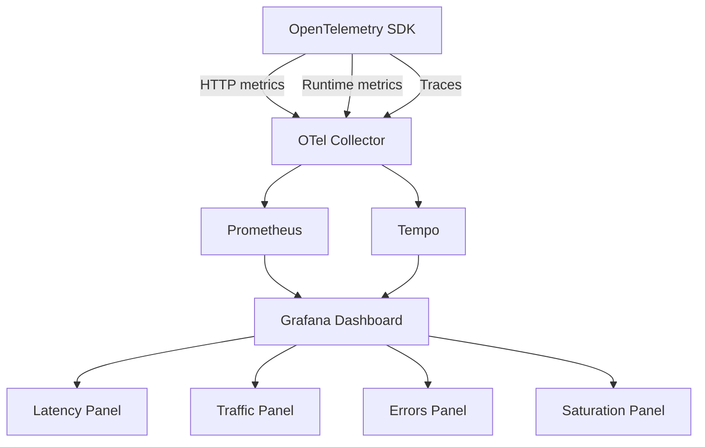

# How to Build a Service Health Overview Dashboard from OpenTelemetry Golden Signals

Author: [nawazdhandala](https://www.github.com/nawazdhandala)

Tags: OpenTelemetry, Grafana, Golden Signals, Service Health

Description: Build a multi-service health overview dashboard using the four Golden Signals from Google SRE, powered by OpenTelemetry metrics and traces.

The four Golden Signals from the Google SRE book - Latency, Traffic, Errors, and Saturation - give you the minimum set of metrics needed to understand whether a service is healthy. This post builds a Grafana dashboard that displays these signals for every OpenTelemetry-instrumented service in your system, providing a single-pane view of overall service health.

## Golden Signals Explained

- **Latency**: How long requests take. Track both successful and failed request latency separately, because a fast error is different from a slow success.
- **Traffic**: How much demand the service is handling. Measured in requests per second for HTTP services, messages per second for queues.
- **Errors**: The rate of requests that fail. This includes explicit errors (5xx responses) and implicit errors (200 responses with wrong content, or responses that violate an SLO).
- **Saturation**: How full the service is. Track the resource most constrained - CPU, memory, connection pool, queue depth.



## Step 1: Ensure Proper OpenTelemetry Instrumentation

The Golden Signals dashboard depends on specific OpenTelemetry semantic convention metrics. Your services need to emit HTTP server metrics and runtime metrics. Here is a Go example using the standard OTel SDK:

```go
// main.go
// Set up OpenTelemetry metrics that produce the Golden Signals data
package main

import (
    "context"
    "net/http"

    "go.opentelemetry.io/contrib/instrumentation/net/http/otelhttp"
    "go.opentelemetry.io/otel"
    "go.opentelemetry.io/otel/exporters/otlp/otlpmetric/otlpmetricgrpc"
    sdkmetric "go.opentelemetry.io/otel/sdk/metric"
    "go.opentelemetry.io/otel/sdk/resource"
    semconv "go.opentelemetry.io/otel/semconv/v1.24.0"
)

func setupMetrics(ctx context.Context) (*sdkmetric.MeterProvider, error) {
    exporter, err := otlpmetricgrpc.New(ctx,
        otlpmetricgrpc.WithEndpoint("otel-collector:4317"),
        otlpmetricgrpc.WithInsecure(),
    )
    if err != nil {
        return nil, err
    }

    res, err := resource.New(ctx,
        resource.WithAttributes(
            semconv.ServiceName("checkout-service"),
            semconv.ServiceVersion("1.4.2"),
            semconv.DeploymentEnvironment("production"),
        ),
    )
    if err != nil {
        return nil, err
    }

    mp := sdkmetric.NewMeterProvider(
        sdkmetric.WithResource(res),
        sdkmetric.WithReader(
            sdkmetric.NewPeriodicReader(exporter),
        ),
    )
    otel.SetMeterProvider(mp)
    return mp, nil
}

func main() {
    ctx := context.Background()
    mp, _ := setupMetrics(ctx)
    defer mp.Shutdown(ctx)

    // Wrap HTTP handler with OTel instrumentation
    // This automatically records http.server.request.duration metrics
    handler := otelhttp.NewHandler(
        http.DefaultServeMux,
        "checkout-service",
    )

    http.ListenAndServe(":8080", handler)
}
```

## Step 2: Build the Service Health Summary Row

The top row of the dashboard should show all services at a glance using Stat panels with color-coded health indicators. Each stat panel shows a single number with conditional coloring.

**Overall Health Score** - a composite score based on error rate and latency:

```promql
# Health score per service (100 = perfect, 0 = fully degraded)
# Combines error rate and latency SLI into a single number
(
  clamp_min(
    1 - (
      sum by (service_name) (
        rate(http_server_request_duration_seconds_count{http_status_code=~"5.."}[5m])
      )
      /
      sum by (service_name) (
        rate(http_server_request_duration_seconds_count[5m])
      )
    ),
    0
  )
  *
  clamp_max(
    sum by (service_name) (
      rate(http_server_request_duration_seconds_bucket{le="0.5"}[5m])
    )
    /
    sum by (service_name) (
      rate(http_server_request_duration_seconds_count[5m])
    ),
    1
  )
) * 100
```

## Step 3: Latency Panel

Show p50, p95, and p99 latency per service. Use a Time Series panel with each percentile as a separate query:

```promql
# P50 latency per service
histogram_quantile(0.5,
  sum by (service_name, le) (
    rate(http_server_request_duration_seconds_bucket[5m])
  )
)
```

```promql
# P95 latency per service
histogram_quantile(0.95,
  sum by (service_name, le) (
    rate(http_server_request_duration_seconds_bucket[5m])
  )
)
```

```promql
# P99 latency per service
histogram_quantile(0.99,
  sum by (service_name, le) (
    rate(http_server_request_duration_seconds_bucket[5m])
  )
)
```

Set the panel Y-axis to seconds. Add a horizontal threshold line at your latency SLO target (e.g., 500ms).

## Step 4: Traffic Panel

Show request throughput per service:

```promql
# Requests per second by service
sum by (service_name) (
  rate(http_server_request_duration_seconds_count[5m])
)
```

Add a second query to show the traffic split by HTTP method for additional context:

```promql
# Traffic breakdown by HTTP method for the selected service
sum by (http_method) (
  rate(http_server_request_duration_seconds_count{
    service_name=~"$service"
  }[5m])
)
```

## Step 5: Errors Panel

Show error rate as a percentage with a breakdown by status code:

```promql
# Error rate percentage per service
100 * (
  sum by (service_name) (
    rate(http_server_request_duration_seconds_count{http_status_code=~"5.."}[5m])
  )
  /
  sum by (service_name) (
    rate(http_server_request_duration_seconds_count[5m])
  )
)
```

Add a table panel below the chart that shows the top error-producing endpoints:

```promql
# Top 10 endpoints by error count in the last hour
topk(10,
  sum by (service_name, http_route, http_status_code) (
    increase(http_server_request_duration_seconds_count{
      http_status_code=~"5.."
    }[1h])
  )
)
```

## Step 6: Saturation Panel

Saturation metrics vary by service type. For application-level saturation, track connection pool usage, goroutine counts (Go), thread pool usage (Java), or active request counts:

```promql
# Go runtime: goroutine count as saturation proxy
# High goroutine counts indicate the service is handling many concurrent requests
process_runtime_go_goroutines{service_name=~"$service"}
```

```promql
# JVM: thread pool saturation
# Ratio of active threads to max threads
jvm_thread_count{service_name=~"$service"}
```

For infrastructure-level saturation, use the host metrics:

```promql
# CPU utilization of the host running the service
100 * (1 - avg by (host_name) (
  system_cpu_utilization{state="idle"}
))
```

## Step 7: Add Data Links for Drill-Down

Each panel should link to deeper views. Configure data links in Grafana to allow operators to click through:

- Latency panel links to the Tempo trace search filtered by slow traces
- Error panel links to the log explorer filtered by error-level logs
- Traffic panel links to the per-endpoint RED dashboard

```json
{
  "fieldConfig": {
    "defaults": {
      "links": [
        {
          "title": "View traces for ${__field.labels.service_name}",
          "url": "/explore?left={\"datasource\":\"Tempo\",\"queries\":[{\"queryType\":\"traceqlsearch\",\"serviceName\":\"${__field.labels.service_name}\",\"minDuration\":\"500ms\"}],\"range\":{\"from\":\"${__from}\",\"to\":\"${__to}\"}}",
          "targetBlank": true
        }
      ]
    }
  }
}
```

## Dashboard Variables

Add template variables at the top of the dashboard for filtering:

```promql
# Environment selector
label_values(http_server_request_duration_seconds_count, deployment_environment)

# Service selector (multi-value)
label_values(http_server_request_duration_seconds_count{deployment_environment=~"$environment"}, service_name)
```

The Golden Signals dashboard works as a starting point for any incident investigation. When something goes wrong, check the four signals: is latency up, is traffic unusual, are errors elevated, is something saturated? If any signal is abnormal, drill down from there. This dashboard gives you that starting point for every service in the system from a single screen.
