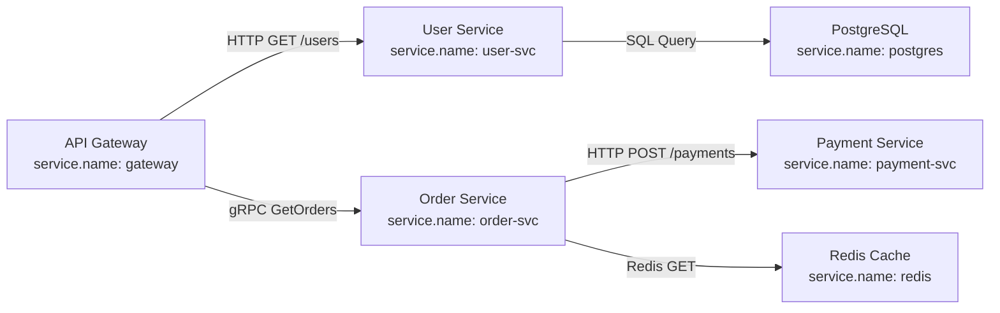
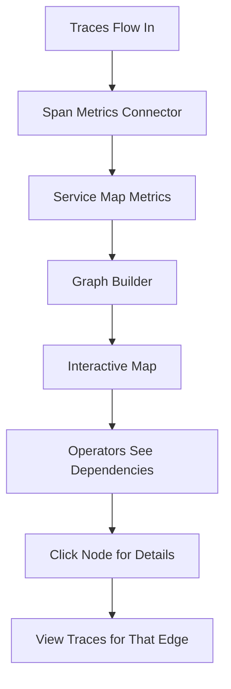

# How to Build Service Maps from OpenTelemetry Trace Data

Author: [nawazdhandala](https://www.github.com/nawazdhandala)

Tags: OpenTelemetry, Service Maps, Distributed Tracing, Microservices, Topology, Observability

Description: Learn how to automatically generate and maintain service dependency maps from OpenTelemetry trace data to visualize your microservices architecture in real time.

---

> Service maps give you a live picture of how your microservices connect to each other, how much traffic flows between them, and where errors are happening. Building them from OpenTelemetry trace data means they stay automatically up to date as your architecture evolves.

If you have ever been the new person on a team staring at a microservices architecture with no documentation, you know the pain. Service maps solve this by generating topology views directly from the telemetry your services already emit. No manual diagramming, no stale wiki pages, and no guessing about which service calls which.

This guide shows you how to extract service dependency information from OpenTelemetry traces, process it in the Collector, and build useful visualizations from the result.

---

## How Traces Reveal Service Dependencies

Every distributed trace in OpenTelemetry contains the information needed to build a service map. When Service A calls Service B, the trace contains a span from A (the client span) and a span from B (the server span). These two spans share the same parent-child relationship, and each span carries the `service.name` resource attribute.



By analyzing the parent-child relationships across all traces, you can reconstruct the entire service topology. The edges between nodes represent actual communication patterns, and you can annotate them with request rates, error rates, and latency percentiles.

---

## Configuring Trace Instrumentation for Service Maps

The quality of your service map depends on the quality of your trace instrumentation. At minimum, every service needs to set its `service.name` resource attribute and propagate trace context across service boundaries.

Here is a Node.js example that ensures proper resource attributes are set:

```javascript
// tracing.js
// Configure OpenTelemetry with the resource attributes needed for service map generation
const { NodeSDK } = require('@opentelemetry/sdk-node');
const { OTLPTraceExporter } = require('@opentelemetry/exporter-trace-otlp-grpc');
const { Resource } = require('@opentelemetry/resources');
const { ATTR_SERVICE_NAME, ATTR_SERVICE_VERSION } = require('@opentelemetry/semantic-conventions');
const { HttpInstrumentation } = require('@opentelemetry/instrumentation-http');
const { GrpcInstrumentation } = require('@opentelemetry/instrumentation-grpc');

const sdk = new NodeSDK({
  // Resource attributes identify this service in the service map
  // service.name is the most critical attribute for map generation
  resource: new Resource({
    [ATTR_SERVICE_NAME]: 'order-service',
    [ATTR_SERVICE_VERSION]: '2.3.1',
    'deployment.environment': 'production',
    'service.namespace': 'ecommerce',
    'service.instance.id': process.env.HOSTNAME || 'local',
  }),

  // OTLP exporter sends traces to the Collector
  traceExporter: new OTLPTraceExporter({
    url: 'http://otel-collector:4317',
  }),

  // HTTP and gRPC instrumentation capture inter-service calls
  // These create the client/server span pairs that form map edges
  instrumentations: [
    new HttpInstrumentation({
      // Include the target service URL in span attributes
      // This helps identify external dependencies
      ignoreIncomingRequestHook: (req) => req.url === '/health',
    }),
    new GrpcInstrumentation(),
  ],
});

sdk.start();
```

The key attributes for service map generation are `service.name`, `service.namespace`, and `deployment.environment`. These let you group services by team or domain and filter maps by environment.

---

## Using the Span Metrics Connector in the Collector

The OpenTelemetry Collector has a built-in connector called `spanmetrics` that extracts service-to-service dependency metrics from trace data. This is the most efficient way to generate service map data because it processes traces in a streaming fashion without storing the full trace.

```yaml
# otel-collector-config.yaml
receivers:
  otlp:
    protocols:
      grpc:
        endpoint: 0.0.0.0:4317

connectors:
  # The spanmetrics connector reads traces and produces metrics
  # These metrics contain the service-to-service call information
  spanmetrics:
    # Use the histogram of latencies for each service-to-service edge
    histogram:
      explicit:
        buckets: [5ms, 10ms, 25ms, 50ms, 100ms, 250ms, 500ms, 1s, 5s]
    # Include these attributes as metric dimensions
    # They become labels you can filter and group by
    dimensions:
      - name: http.method
      - name: http.status_code
      - name: rpc.method
      - name: rpc.service
    # Generate metrics for each service-to-service edge
    # This creates the data structure needed for service maps
    dimensions_cache_size: 10000
    aggregation_temporality: AGGREGATION_TEMPORALITY_CUMULATIVE

exporters:
  otlp/traces:
    endpoint: https://oneuptime.com/otlp
  otlp/metrics:
    endpoint: https://oneuptime.com/otlp

service:
  pipelines:
    # Traces flow in through OTLP and out to the backend
    # They also feed into the spanmetrics connector
    traces:
      receivers: [otlp]
      exporters: [otlp/traces, spanmetrics]
    # Metrics from spanmetrics go to the same backend
    metrics:
      receivers: [spanmetrics]
      exporters: [otlp/metrics]
```

The `spanmetrics` connector produces metrics like `traces_spanmetrics_latency` and `traces_spanmetrics_calls_total` with labels for `service.name`, `span.name`, `span.kind`, `status.code`, and your custom dimensions. These metrics contain everything you need to draw a service map with annotated edges.

---

## Building the Service Map Data Structure

To render a service map, you need to transform the raw span data into a graph structure with nodes (services) and edges (dependencies). Here is a Python script that processes span metrics to build this graph:

```python
# build_service_map.py
# Process OpenTelemetry span data to build a service dependency graph

from collections import defaultdict
from dataclasses import dataclass, field

@dataclass
class ServiceNode:
    """Represents a service in the topology map"""
    name: str
    request_rate: float = 0.0
    error_rate: float = 0.0
    avg_latency_ms: float = 0.0

@dataclass
class ServiceEdge:
    """Represents a dependency between two services"""
    source: str
    target: str
    request_rate: float = 0.0
    error_rate: float = 0.0
    p50_latency_ms: float = 0.0
    p99_latency_ms: float = 0.0
    protocol: str = "unknown"

def build_service_map(spans):
    """
    Build a service map from a list of OpenTelemetry spans.
    Each span must have resource attributes (service.name)
    and span kind (CLIENT or SERVER).
    """
    nodes = {}
    edges = defaultdict(lambda: {"calls": 0, "errors": 0, "latencies": []})

    for span in spans:
        service_name = span.resource.attributes.get("service.name", "unknown")

        # Track every service we see as a node
        if service_name not in nodes:
            nodes[service_name] = ServiceNode(name=service_name)

        # Client spans tell us about outgoing dependencies
        # The target service is identified by the peer.service attribute
        # or parsed from the URL/address attributes
        if span.kind == "SPAN_KIND_CLIENT":
            target = (
                span.attributes.get("peer.service")
                or span.attributes.get("db.system")
                or span.attributes.get("messaging.system")
                or extract_service_from_url(span.attributes.get("http.url", ""))
            )

            if target:
                edge_key = f"{service_name}->{target}"
                edges[edge_key]["calls"] += 1
                edges[edge_key]["source"] = service_name
                edges[edge_key]["target"] = target

                # Track latency from the span duration
                duration_ms = span.end_time_ns - span.start_time_ns
                duration_ms = duration_ms / 1_000_000
                edges[edge_key]["latencies"].append(duration_ms)

                # Track errors from the span status
                if span.status.code == "ERROR":
                    edges[edge_key]["errors"] += 1

    return nodes, edges

def extract_service_from_url(url):
    """Extract hostname from URL to use as service identifier"""
    if not url:
        return None
    from urllib.parse import urlparse
    parsed = urlparse(url)
    return parsed.hostname
```

This builds an in-memory graph that you can serialize to JSON and render in any graph visualization library.

---

## Rendering Interactive Service Maps

Once you have the graph structure, you can render it as an interactive visualization. Here is an approach using a simple frontend that queries your service map API:

```javascript
// service-map-renderer.js
// Fetch service map data and render it as an interactive graph
// Uses D3.js force-directed layout for automatic positioning

async function renderServiceMap(container) {
  // Fetch the computed service map from your API
  // This returns nodes and edges with traffic metadata
  const response = await fetch('/api/service-map?env=production&window=5m');
  const { nodes, edges } = await response.json();

  // Color nodes based on their error rate
  // Green = healthy, yellow = degraded, red = failing
  function getNodeColor(node) {
    if (node.error_rate > 0.05) return '#e74c3c';  // Red: >5% errors
    if (node.error_rate > 0.01) return '#f39c12';  // Yellow: >1% errors
    return '#2ecc71';                                // Green: healthy
  }

  // Scale edge width based on request rate
  // Thicker edges = more traffic between services
  function getEdgeWidth(edge) {
    return Math.max(1, Math.log10(edge.request_rate) * 2);
  }

  // Color edges based on latency relative to baseline
  // This highlights slow dependencies at a glance
  function getEdgeColor(edge) {
    if (edge.p99_latency_ms > 1000) return '#e74c3c';
    if (edge.p99_latency_ms > 200) return '#f39c12';
    return '#95a5a6';
  }

  // Render using D3 force-directed graph
  // Nodes repel each other, edges pull connected nodes together
  // The result is an automatically laid out topology
  const simulation = d3.forceSimulation(nodes)
    .force('link', d3.forceLink(edges).id(d => d.name).distance(150))
    .force('charge', d3.forceManyBody().strength(-300))
    .force('center', d3.forceCenter(width / 2, height / 2));

  // Add hover tooltips showing request rate, error rate, and latency
  // This lets operators quickly assess the health of each dependency
  console.log('Service map rendered with', nodes.length, 'services and', edges.length, 'dependencies');
}
```

---

## Keeping Service Maps Accurate

Service maps built from trace data are only as accurate as your instrumentation. Here are common pitfalls and how to avoid them:

1. **Missing `peer.service` attribute**: Without this, client spans cannot identify the downstream service. Set it explicitly in your instrumentation or configure semantic convention mapping in the Collector.

2. **Inconsistent `service.name` values**: If the same service reports different names (like "user-service" in one pod and "user-svc" in another), you get duplicate nodes. Standardize names through your deployment configuration.

3. **Sampling artifacts**: If you sample traces aggressively, low-traffic edges might disappear from the map. Use tail-based sampling to ensure you keep at least some traces for every service pair.

4. **Database and cache nodes**: External dependencies like PostgreSQL and Redis show up as nodes only if your instrumentation sets the `db.system` or `peer.service` attribute on client spans.



Service maps are one of the highest-value outputs you can get from your OpenTelemetry data. They answer the question "what depends on what?" automatically and keep the answer current as your architecture changes. Start by ensuring every service sets `service.name` and `peer.service` correctly, then let the spanmetrics connector do the rest.
