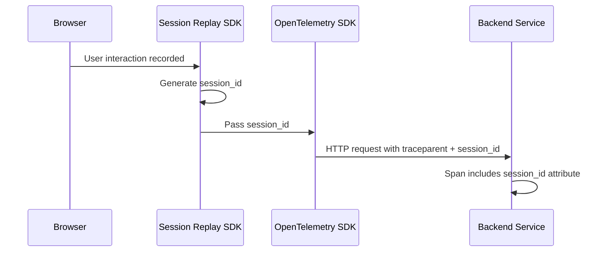

# How to Implement Session Replay Correlation with OpenTelemetry Traces

Author: [nawazdhandala](https://www.github.com/nawazdhandala)

Tags: OpenTelemetry, Session Replay, Tracing, Frontend Observability, Browser SDK, Correlation

Description: Learn how to correlate session replays with OpenTelemetry traces to connect visual user interactions with backend performance data for faster debugging.

---

Session replay tools record what users see and do in your application. OpenTelemetry traces capture the technical details of every request flowing through your system. On their own, each tells half the story. But when you connect them together, you can watch exactly what a user experienced and immediately jump to the trace data that explains why a page was slow or an error appeared.

This post walks through implementing session replay correlation with OpenTelemetry traces in a browser application. We will cover generating shared identifiers, attaching replay metadata to spans, and building a lookup system that lets you jump between replays and traces.

## The Correlation Problem

Session replays and distributed traces operate in different worlds. A replay tool records DOM mutations, mouse movements, and network requests from the user's perspective. OpenTelemetry records spans with timing data, attributes, and parent-child relationships across services. The challenge is linking these two data streams so that when you find a problematic trace, you can watch what the user saw, and when you spot odd behavior in a replay, you can pull up the exact traces involved.

The solution is straightforward: share a common session identifier between both systems and attach it as metadata to every span.



## Setting Up the Session Replay SDK

We will use the `rrweb` library for session recording since it is open source and works well with custom integrations. The first step is initializing the recorder and generating a session identifier that both systems can share.

```javascript
// src/replay/session-manager.js
import { v4 as uuidv4 } from 'uuid';

// SessionManager handles creating and persisting session identifiers
// so that both the replay SDK and OpenTelemetry can reference the same session
class SessionManager {
  constructor() {
    this.sessionId = this.getOrCreateSession();
    this.replayId = null;
  }

  // Check sessionStorage first so refreshes within the same tab
  // keep the same session identifier
  getOrCreateSession() {
    let sessionId = sessionStorage.getItem('otel_session_id');
    if (!sessionId) {
      sessionId = uuidv4();
      sessionStorage.setItem('otel_session_id', sessionId);
    }
    return sessionId;
  }

  // Called when a new replay recording segment starts
  setReplayId(replayId) {
    this.replayId = replayId;
  }

  getSessionId() {
    return this.sessionId;
  }

  getReplayId() {
    return this.replayId;
  }
}

// Export a singleton so all modules share the same session state
export const sessionManager = new SessionManager();
```

The `SessionManager` class stores identifiers in `sessionStorage` so they survive page navigations within the same tab but reset when the user opens a new tab or closes the browser. This matches the typical definition of a "session" in replay tools.

## Initializing Session Recording

Next, set up `rrweb` to record user interactions and tag each recording segment with the session identifier.

```javascript
// src/replay/recorder.js
import { record } from 'rrweb';
import { v4 as uuidv4 } from 'uuid';
import { sessionManager } from './session-manager';

const events = [];
let stopRecording = null;

// Start recording and assign a unique replay ID for this segment
export function startRecording() {
  const replayId = uuidv4();
  sessionManager.setReplayId(replayId);

  stopRecording = record({
    emit(event) {
      // Attach session and replay identifiers to each event
      events.push({
        ...event,
        sessionId: sessionManager.getSessionId(),
        replayId: replayId,
      });

      // Flush events in batches to avoid memory buildup
      if (events.length >= 100) {
        flushEvents([...events]);
        events.length = 0;
      }
    },
    // Record network requests so they can be matched to spans
    recordNetwork: true,
  });

  return replayId;
}

// Send recorded events to your replay storage backend
function flushEvents(batch) {
  fetch('/api/replays', {
    method: 'POST',
    headers: { 'Content-Type': 'application/json' },
    body: JSON.stringify({
      sessionId: sessionManager.getSessionId(),
      replayId: sessionManager.getReplayId(),
      events: batch,
    }),
  });
}
```

Each recording segment gets its own `replayId` while all segments within the same browser tab share a `sessionId`. This two-level identifier system lets you find all replays for a session or jump to the exact recording segment that matches a specific trace.

## Connecting OpenTelemetry to the Session

Now comes the critical piece: making sure every OpenTelemetry span carries the session and replay identifiers. We do this with a custom `SpanProcessor` that reads from the `SessionManager` and attaches the values as span attributes.

```javascript
// src/tracing/session-span-processor.js
import { sessionManager } from '../replay/session-manager';

// This processor runs every time a span starts and adds
// session replay metadata as span attributes
export class SessionReplaySpanProcessor {
  onStart(span) {
    const sessionId = sessionManager.getSessionId();
    const replayId = sessionManager.getReplayId();

    // Set the session ID on every span so backend traces
    // can be correlated back to the browser session
    if (sessionId) {
      span.setAttribute('session.id', sessionId);
    }

    // The replay ID links to a specific recording segment
    if (replayId) {
      span.setAttribute('session.replay.id', replayId);
    }

    // Add a timestamp offset so replay playback can seek
    // to the exact moment this span was created
    span.setAttribute(
      'session.replay.offset_ms',
      Date.now() - performance.timeOrigin
    );
  }

  onEnd(span) {
    // No additional processing needed on span end
  }

  shutdown() {
    return Promise.resolve();
  }

  forceFlush() {
    return Promise.resolve();
  }
}
```

The `session.replay.offset_ms` attribute records how far into the session the span occurred. When you view a trace later, this offset tells your replay viewer exactly where to seek so you can watch the user interaction that triggered the request.

## Initializing the Full Tracing Pipeline

Wire everything together in your application's entry point. The key is registering the `SessionReplaySpanProcessor` alongside your regular export processor.

```javascript
// src/tracing/init.js
import { WebTracerProvider } from '@opentelemetry/sdk-trace-web';
import { BatchSpanProcessor } from '@opentelemetry/sdk-trace-base';
import { OTLPTraceExporter } from '@opentelemetry/exporter-trace-otlp-http';
import { ZoneContextManager } from '@opentelemetry/context-zone';
import { registerInstrumentations } from '@opentelemetry/instrumentation';
import { getWebAutoInstrumentations } from '@opentelemetry/auto-instrumentations-web';
import { Resource } from '@opentelemetry/resources';
import { SessionReplaySpanProcessor } from './session-span-processor';
import { startRecording } from '../replay/recorder';

export function initTracing() {
  const provider = new WebTracerProvider({
    resource: new Resource({
      'service.name': 'frontend-app',
      'service.version': '1.0.0',
    }),
  });

  // The session processor must be added first so attributes
  // are present before the batch processor exports spans
  provider.addSpanProcessor(new SessionReplaySpanProcessor());

  // Export spans to your OpenTelemetry collector
  provider.addSpanProcessor(
    new BatchSpanProcessor(
      new OTLPTraceExporter({
        url: 'https://otel-collector.example.com/v1/traces',
      })
    )
  );

  provider.register({
    contextManager: new ZoneContextManager(),
  });

  // Enable automatic instrumentation for fetch, XHR, and user interactions
  registerInstrumentations({
    instrumentations: [getWebAutoInstrumentations()],
  });

  // Start session recording after tracing is initialized
  startRecording();
}
```

Registering the `SessionReplaySpanProcessor` before the `BatchSpanProcessor` is important. Span processors run in the order they are added, so the session attributes need to be set before the batch processor queues the span for export.

## Propagating Session Context to Backend Services

Frontend spans automatically carry the session attributes, but backend services need to see them too. The simplest approach is adding the session ID as a custom header that your backend extracts.

```javascript
// src/tracing/session-propagator.js
import { sessionManager } from '../replay/session-manager';

// Intercept fetch calls to inject the session ID as a custom header
const originalFetch = window.fetch;

window.fetch = function (url, options = {}) {
  const sessionId = sessionManager.getSessionId();
  const replayId = sessionManager.getReplayId();

  // Merge session headers with any existing headers
  const headers = new Headers(options.headers || {});
  if (sessionId) {
    headers.set('X-Session-Id', sessionId);
  }
  if (replayId) {
    headers.set('X-Replay-Id', replayId);
  }

  return originalFetch.call(this, url, { ...options, headers });
};
```

On the backend side, extract these headers and add them to your server-side spans.

```python
# middleware/session_context.py
from opentelemetry import trace

class SessionContextMiddleware:
    """Extract session replay identifiers from request headers
    and attach them to the current server span."""

    def __init__(self, get_response):
        self.get_response = get_response

    def __call__(self, request):
        span = trace.get_current_span()

        # Read session identifiers from the custom headers
        session_id = request.headers.get('X-Session-Id')
        replay_id = request.headers.get('X-Replay-Id')

        if session_id:
            span.set_attribute('session.id', session_id)
        if replay_id:
            span.set_attribute('session.replay.id', replay_id)

        return self.get_response(request)
```

With this middleware in place, every backend span in a request chain will carry the session and replay identifiers. When you search your trace backend for a specific session, you will see both frontend and backend spans together.

## Building the Correlation Lookup

The final piece is making it easy to jump between replays and traces. You need two lookup directions: from a trace to its replay, and from a replay to its traces.

```javascript
// src/api/correlation.js

// Given a trace ID, find the matching replay segment
export async function findReplayForTrace(traceId) {
  // Query your trace backend for the session.id attribute
  // on the root span of this trace
  const response = await fetch(
    `/api/traces/${traceId}/attributes?key=session.replay.id`
  );
  const data = await response.json();

  if (data.replayId) {
    // Return a deep link to the replay viewer at the correct timestamp
    const offsetMs = data.attributes['session.replay.offset_ms'];
    return `/replays/${data.replayId}?seek=${offsetMs}`;
  }
  return null;
}

// Given a session ID, find all traces generated during that session
export async function findTracesForSession(sessionId) {
  // Query your trace backend filtering by the session.id attribute
  const response = await fetch(
    `/api/traces?filter=session.id%3D${sessionId}&sort=start_time`
  );
  return response.json();
}
```

The `session.replay.offset_ms` attribute makes the replay viewer experience seamless. Instead of watching an entire session from the beginning, you land at the exact moment the traced operation occurred.

## Verifying the Correlation

To test that everything is connected, open your application in a browser and perform a few actions. Then check your trace backend for recent spans with `session.id` attributes.

```bash
# Query your OpenTelemetry backend for spans with session attributes
# This example uses a curl request against a Jaeger-compatible API
curl -s "http://localhost:16686/api/traces?service=frontend-app&tag=session.id" \
  | jq '.data[0].spans[0].tags[] | select(.key == "session.id")'
```

You should see the same session identifier appearing on both frontend and backend spans. Cross-reference this with your replay storage to confirm that a recording exists for that session.

## Summary

Correlating session replays with OpenTelemetry traces requires three things: a shared session identifier, a span processor that attaches the identifier to every span, and a way to propagate the identifier from browser to backend. The `SessionManager` singleton provides the shared state. The `SessionReplaySpanProcessor` ensures every span carries the session metadata. And the fetch interceptor plus server middleware propagate the context across service boundaries.

Once this is in place, debugging user-reported issues becomes significantly faster. Instead of guessing what the user did, you watch the replay. Instead of guessing which backend service was slow, you pull up the correlated traces. The two data streams reinforce each other, and the session identifier is the bridge between them.
