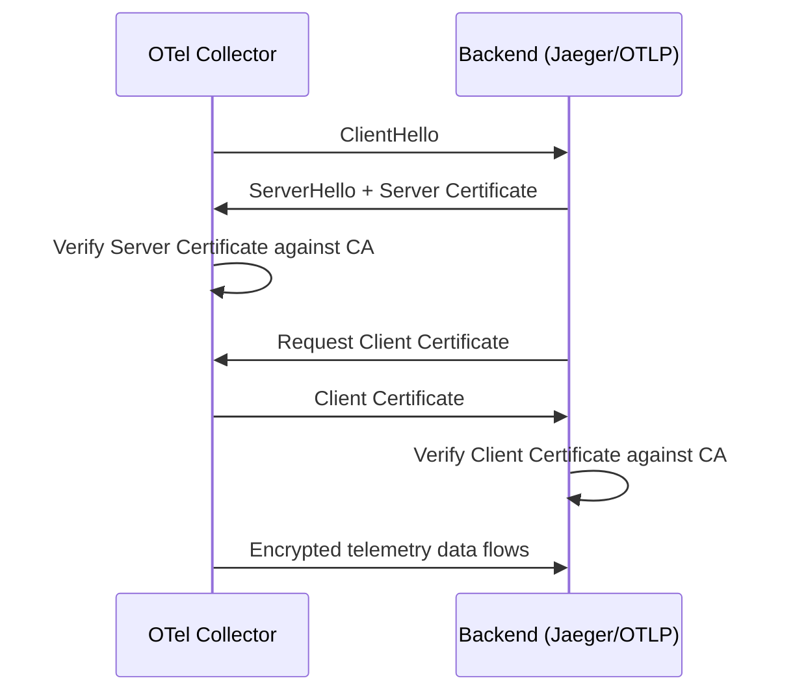
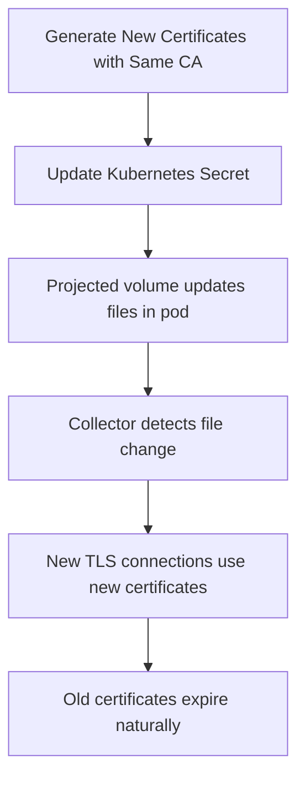

# How to Set Up mTLS Between OpenTelemetry Collectors and Backends

Author: [nawazdhandala](https://www.github.com/nawazdhandala)

Tags: OpenTelemetry, mTLS, Security, TLS, Collector, Observability

Description: Step-by-step guide to configuring mutual TLS authentication between OpenTelemetry Collectors and observability backends for secure telemetry transport.

---

Standard TLS encrypts traffic and lets the client verify the server's identity. Mutual TLS (mTLS) goes further: the server also verifies the client. In an OpenTelemetry deployment, this means your backend can cryptographically confirm that incoming telemetry data is actually coming from a trusted collector, not from an attacker or a misconfigured service.

Setting up mTLS between OpenTelemetry Collectors and backends is one of the most important security hardening steps you can take. This guide walks through the full process, from generating certificates to configuring both the collector and common backends.

## Why mTLS Matters for Telemetry Pipelines

Telemetry data often contains sensitive operational information: internal service names, database query patterns, error messages with stack traces, user identifiers. If someone gains network access and can impersonate a collector, they could either inject false telemetry or intercept real data.

With mTLS in place, both sides of the connection present certificates signed by a trusted Certificate Authority (CA). The handshake fails if either side cannot prove its identity.



## Step 1: Generate Certificates

You need three things: a CA certificate, a server certificate (for the backend), and a client certificate (for the collector). In production, use your organization's PKI or a tool like Vault. For this guide, we will use OpenSSL.

First, create the Certificate Authority that both sides will trust.

```bash
# Generate the CA private key
openssl genrsa -out ca.key 4096

# Create the CA certificate (valid for 10 years)
# This CA will sign both the server and client certificates
openssl req -new -x509 -key ca.key -sha256 \
  -subj "/CN=OTel Telemetry CA" \
  -days 3650 -out ca.crt
```

Next, generate the server certificate for your backend.

```bash
# Generate the backend server's private key
openssl genrsa -out server.key 4096

# Create a certificate signing request for the server
openssl req -new -key server.key \
  -subj "/CN=jaeger-backend.monitoring.svc.cluster.local" \
  -out server.csr

# Sign the server certificate with our CA
# The SAN (Subject Alternative Name) must match the hostname
# the collector uses to connect
openssl x509 -req -in server.csr -CA ca.crt -CAkey ca.key \
  -CAcreateserial -sha256 -days 365 \
  -extfile <(printf "subjectAltName=DNS:jaeger-backend.monitoring.svc.cluster.local,DNS:localhost") \
  -out server.crt
```

Now generate the client certificate for the collector.

```bash
# Generate the collector's client private key
openssl genrsa -out client.key 4096

# Create a certificate signing request for the collector
openssl req -new -key client.key \
  -subj "/CN=otel-collector.monitoring.svc.cluster.local" \
  -out client.csr

# Sign the client certificate with the same CA
openssl x509 -req -in client.csr -CA ca.crt -CAkey ca.key \
  -CAcreateserial -sha256 -days 365 \
  -out client.crt
```

At this point you should have six files: `ca.key`, `ca.crt`, `server.key`, `server.crt`, `client.key`, and `client.crt`.

## Step 2: Configure the OpenTelemetry Collector as an mTLS Client

The collector needs its client certificate, its private key, and the CA certificate to verify the backend's server certificate.

Here is a collector configuration that exports traces over OTLP/gRPC with mTLS enabled.

```yaml
# OpenTelemetry Collector configuration with mTLS client settings
# The collector presents its client certificate to the backend
receivers:
  otlp:
    protocols:
      grpc:
        endpoint: 0.0.0.0:4317

exporters:
  otlp/secure-backend:
    endpoint: jaeger-backend.monitoring.svc.cluster.local:4317
    tls:
      # Path to the CA certificate that signed the server's cert
      ca_file: /etc/otel/certs/ca.crt
      # Client certificate presented to the server during mTLS handshake
      cert_file: /etc/otel/certs/client.crt
      # Private key corresponding to the client certificate
      key_file: /etc/otel/certs/client.key
      # Ensure the server hostname matches the certificate SAN
      insecure: false
      insecure_skip_verify: false

processors:
  batch:
    timeout: 5s
    send_batch_size: 1024

service:
  pipelines:
    traces:
      receivers: [otlp]
      processors: [batch]
      exporters: [otlp/secure-backend]
```

## Step 3: Configure the Backend to Require Client Certificates

The backend must be configured to present its server certificate and demand a valid client certificate from incoming connections.

### OTLP-Compatible Backend (Another Collector as Gateway)

If your backend is another OpenTelemetry Collector running as a gateway, configure the receiver to require mTLS.

```yaml
# Gateway collector that requires mTLS from upstream collectors
# Any client without a valid certificate signed by the CA will be rejected
receivers:
  otlp:
    protocols:
      grpc:
        endpoint: 0.0.0.0:4317
        tls:
          # Server certificate presented to connecting collectors
          cert_file: /etc/otel/certs/server.crt
          # Server private key
          key_file: /etc/otel/certs/server.key
          # CA certificate used to verify client certificates
          client_ca_file: /etc/otel/certs/ca.crt

exporters:
  otlp/downstream:
    endpoint: final-backend:4317

service:
  pipelines:
    traces:
      receivers: [otlp]
      processors: [batch]
      exporters: [otlp/downstream]
```

The key setting here is `client_ca_file`. When this is specified, the receiver will require connecting clients to present a certificate signed by that CA. Connections without a valid client certificate are rejected at the TLS handshake level.

### Jaeger Backend

For Jaeger, configure mTLS on the OTLP receiver.

```yaml
# Jaeger collector configuration with mTLS
# Place this in your Jaeger configuration file
collector:
  otlp:
    enabled: true
    grpc:
      host-port: ":4317"
      tls:
        enabled: true
        cert: /etc/jaeger/certs/server.crt
        key: /etc/jaeger/certs/server.key
        client-ca: /etc/jaeger/certs/ca.crt
```

### Grafana Tempo

Tempo supports mTLS on its distributor's OTLP receiver.

```yaml
# Tempo configuration with mTLS on the OTLP gRPC receiver
distributor:
  receivers:
    otlp:
      protocols:
        grpc:
          endpoint: 0.0.0.0:4317
          tls:
            cert_file: /etc/tempo/certs/server.crt
            key_file: /etc/tempo/certs/server.key
            client_ca_file: /etc/tempo/certs/ca.crt
```

## Step 4: Deploy Certificates in Kubernetes

In Kubernetes, store your certificates as Secrets and mount them into the collector and backend pods.

```yaml
# Kubernetes Secret containing the mTLS certificates
# Create this secret before deploying the collector or backend
apiVersion: v1
kind: Secret
metadata:
  name: otel-mtls-certs
  namespace: monitoring
type: Opaque
data:
  # Base64-encoded certificate files
  ca.crt: <base64-encoded-ca-cert>
  client.crt: <base64-encoded-client-cert>
  client.key: <base64-encoded-client-key>
---
# Collector Deployment that mounts the mTLS certificates
apiVersion: apps/v1
kind: Deployment
metadata:
  name: otel-collector
  namespace: monitoring
spec:
  replicas: 2
  selector:
    matchLabels:
      app: otel-collector
  template:
    metadata:
      labels:
        app: otel-collector
    spec:
      containers:
        - name: collector
          image: otel/opentelemetry-collector-contrib:latest
          args: ["--config=/etc/otel/config.yaml"]
          volumeMounts:
            # Mount certificates into the container at the path
            # referenced in the collector config
            - name: mtls-certs
              mountPath: /etc/otel/certs
              readOnly: true
            - name: config
              mountPath: /etc/otel
      volumes:
        - name: mtls-certs
          secret:
            secretName: otel-mtls-certs
        - name: config
          configMap:
            name: otel-collector-config
```

## Step 5: Certificate Rotation

Certificates expire. You need a rotation strategy that does not cause downtime. The OpenTelemetry Collector supports automatic certificate reloading since version 0.88.0. When the certificate files on disk change, the collector picks up the new ones without a restart.

Here is the flow for zero-downtime rotation:



If you use cert-manager in Kubernetes, you can automate the entire lifecycle.

```yaml
# cert-manager Certificate resource for automatic rotation
# Generates and renews the collector's client certificate
apiVersion: cert-manager.io/v1
kind: Certificate
metadata:
  name: otel-collector-client-cert
  namespace: monitoring
spec:
  secretName: otel-collector-mtls
  duration: 720h       # 30 days
  renewBefore: 168h    # Renew 7 days before expiry
  issuerRef:
    name: telemetry-ca-issuer
    kind: ClusterIssuer
  commonName: otel-collector.monitoring.svc.cluster.local
  dnsNames:
    - otel-collector.monitoring.svc.cluster.local
  usages:
    - client auth
    - digital signature
```

## Troubleshooting Common mTLS Issues

Here are the problems you will likely run into and how to fix them.

**Certificate SAN mismatch**: The server certificate's Subject Alternative Name must match the hostname used in the exporter endpoint. If the collector connects to `jaeger-backend:4317` but the cert only has `localhost`, the handshake fails. Check with:

```bash
# Inspect the SANs on a certificate to verify hostname coverage
openssl x509 -in server.crt -noout -ext subjectAltName
```

**Wrong CA**: Both sides must trust the same CA. If the server certificate was signed by a different CA than what the client has in `ca_file`, verification fails silently.

**Permission errors on key files**: Private key files must be readable by the process running the collector. In Kubernetes, check that the secret mount has the right file permissions.

```bash
# Verify the collector can read its certificate files
kubectl exec -n monitoring otel-collector-pod -- ls -la /etc/otel/certs/
```

**Expired certificates**: Check the certificate's validity period with:

```bash
# Check when a certificate expires
openssl x509 -in client.crt -noout -dates
```

## Summary

Setting up mTLS between your OpenTelemetry Collectors and backends involves generating certificates from a shared CA, configuring the collector exporter with client certificates, configuring the backend receiver to require and verify client certificates, and planning for certificate rotation. The initial setup takes some effort, but once in place, mTLS provides strong authentication that prevents unauthorized services from sending or intercepting telemetry data. Combined with network policies and RBAC, it forms a solid foundation for securing your observability infrastructure.
