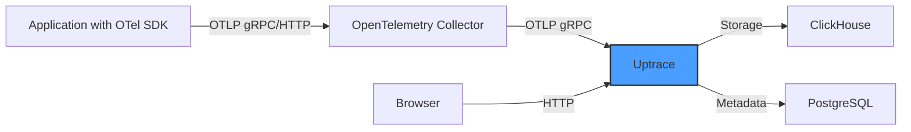

# How to Set Up Uptrace as an OpenTelemetry Backend

Author: [nawazdhandala](https://www.github.com/nawazdhandala)

Tags: OpenTelemetry, Uptrace, Tracing, Metrics, Observability, Backend

Description: Learn how to set up Uptrace as a native OpenTelemetry backend for collecting, storing, and analyzing distributed traces and metrics from your applications.

---

Uptrace is an open-source observability platform built specifically for OpenTelemetry. Unlike many backends that bolt on OpenTelemetry support as an afterthought, Uptrace was designed from the ground up to work with the OpenTelemetry protocol (OTLP). It stores traces, metrics, and logs in ClickHouse, giving you fast queries over large volumes of telemetry data. In this guide, we will walk through deploying Uptrace, connecting the OpenTelemetry Collector to it, and instrumenting a sample application to send telemetry.

## Why Uptrace for OpenTelemetry

Most observability backends started life as proprietary systems and later added OpenTelemetry ingestion. Uptrace takes the opposite approach. It speaks OTLP natively, which means there is no translation layer or data loss between what your applications emit and what gets stored. You get full access to all OpenTelemetry semantic conventions, resource attributes, and span events without any mapping or transformation.

Uptrace uses ClickHouse as its storage engine. ClickHouse is a columnar database optimized for analytical queries, which makes it well suited for scanning millions of spans or metric data points. The combination gives you both fast ingestion and responsive query performance.

## Architecture Overview

Here is how the components fit together in a typical Uptrace deployment:



Applications send telemetry to the OpenTelemetry Collector, which processes and forwards data to Uptrace over OTLP. Uptrace stores span and metric data in ClickHouse and uses PostgreSQL for metadata like project configurations and user accounts.

## Deploying Uptrace with Docker Compose

The easiest way to get Uptrace running is with Docker Compose. This brings up Uptrace along with ClickHouse and PostgreSQL in a single command.

Create a `docker-compose.yml` file with the following configuration:

```yaml
# Docker Compose file for Uptrace with all dependencies
version: "3"

services:
  # ClickHouse serves as the primary storage engine for telemetry data
  clickhouse:
    image: clickhouse/clickhouse-server:23.7
    restart: on-failure
    environment:
      CLICKHOUSE_DB: uptrace
    # Health check ensures ClickHouse is ready before Uptrace starts
    healthcheck:
      test: ["CMD", "wget", "--spider", "-q", "localhost:8123/ping"]
      interval: 1s
      timeout: 1s
      retries: 30
    volumes:
      - ch_data:/var/lib/clickhouse
    ports:
      - "8123:8123"
      - "9000:9000"

  # PostgreSQL stores project metadata and user accounts
  postgres:
    image: postgres:15-alpine
    restart: on-failure
    environment:
      POSTGRES_USER: uptrace
      POSTGRES_PASSWORD: uptrace
      POSTGRES_DB: uptrace
    healthcheck:
      test: ["CMD-SHELL", "pg_isready -U uptrace"]
      interval: 1s
      timeout: 1s
      retries: 30
    volumes:
      - pg_data:/var/lib/postgresql/data
    ports:
      - "5432:5432"

  # Uptrace is the main observability server
  uptrace:
    image: uptrace/uptrace:1.7
    restart: on-failure
    volumes:
      - ./uptrace.yml:/etc/uptrace/uptrace.yml
    ports:
      # Web UI
      - "14318:14318"
      # OTLP gRPC endpoint for receiving telemetry
      - "14317:14317"
    depends_on:
      clickhouse:
        condition: service_healthy
      postgres:
        condition: service_healthy

volumes:
  ch_data:
  pg_data:
```

## Configuring Uptrace

Next, create the `uptrace.yml` configuration file. This defines how Uptrace connects to its storage backends and how it accepts incoming telemetry data.

```yaml
# Uptrace server configuration
# This file controls OTLP ingestion, storage, and project settings

# ClickHouse connection for telemetry storage
ch:
  addr: clickhouse:9000
  user: default
  password: ""
  database: uptrace

# PostgreSQL connection for metadata
pg:
  addr: postgres:5432
  user: uptrace
  password: uptrace
  database: uptrace

# Retention settings control how long data is kept
# Adjust based on your storage capacity
ch_schema:
  # How many days to keep spans
  spans:
    storage_policy: "default"
    ttl_delete: "30 DAY"
  # How many days to keep metrics
  metrics:
    storage_policy: "default"
    ttl_delete: "90 DAY"

# Projects organize telemetry data from different services
# Each project gets its own DSN (connection string)
projects:
  # The first project is created automatically
  - id: 1
    name: "My Project"
    # This token is used by the OpenTelemetry Collector to authenticate
    token: "project1_secret_token"
    pinned_attrs:
      - service.name
      - host.name
      - deployment.environment

# OTLP listener configuration
listen:
  # gRPC endpoint for receiving telemetry
  grpc:
    addr: ":14317"
  # HTTP endpoint for receiving telemetry and serving the web UI
  http:
    addr: ":14318"

# Site URL for generating links in the web UI
site:
  addr: "http://localhost:14318"
```

Start all services with Docker Compose:

```bash
# Start Uptrace and all dependencies in the background
docker compose up -d

# Check that all services are running
docker compose ps

# View Uptrace logs to confirm successful startup
docker compose logs uptrace
```

Once everything is running, open your browser and navigate to `http://localhost:14318`. You should see the Uptrace web interface.

## Configuring the OpenTelemetry Collector

Now we need to configure the OpenTelemetry Collector to forward telemetry data to Uptrace. The key is setting up an OTLP exporter that points to the Uptrace gRPC endpoint with the correct authentication header.

```yaml
# OpenTelemetry Collector configuration for Uptrace
receivers:
  # Accept OTLP data from applications
  otlp:
    protocols:
      grpc:
        endpoint: 0.0.0.0:4317
      http:
        endpoint: 0.0.0.0:4318

processors:
  # Batch processor groups telemetry for efficient export
  batch:
    timeout: 10s
    send_batch_size: 10000

  # Memory limiter prevents out-of-memory crashes
  memory_limiter:
    check_interval: 1s
    limit_mib: 512
    spike_limit_mib: 128

exporters:
  # OTLP exporter configured to send data to Uptrace
  otlp/uptrace:
    endpoint: localhost:14317
    tls:
      # Disable TLS for local development
      # Enable TLS in production
      insecure: true
    headers:
      # The uptrace-dsn header authenticates the connection
      # Format: http://project_token@host:port/project_id
      uptrace-dsn: "http://project1_secret_token@localhost:14317/1"

service:
  pipelines:
    # Forward traces to Uptrace
    traces:
      receivers: [otlp]
      processors: [memory_limiter, batch]
      exporters: [otlp/uptrace]

    # Forward metrics to Uptrace
    metrics:
      receivers: [otlp]
      processors: [memory_limiter, batch]
      exporters: [otlp/uptrace]

    # Forward logs to Uptrace
    logs:
      receivers: [otlp]
      processors: [memory_limiter, batch]
      exporters: [otlp/uptrace]
```

The critical piece here is the `uptrace-dsn` header. This tells Uptrace which project the incoming data belongs to and authenticates the connection.

## Instrumenting a Python Application

Let us instrument a simple Python Flask application to send traces and metrics to our Uptrace setup.

First, install the required packages:

```bash
# Install OpenTelemetry SDK and Flask instrumentation
pip install opentelemetry-sdk \
  opentelemetry-exporter-otlp \
  opentelemetry-instrumentation-flask \
  flask
```

Then configure the application to send telemetry:

```python
# app.py - Flask application with OpenTelemetry instrumentation
from flask import Flask
from opentelemetry import trace
from opentelemetry.sdk.trace import TracerProvider
from opentelemetry.sdk.trace.export import BatchSpanProcessor
from opentelemetry.exporter.otlp.proto.grpc.trace_exporter import OTLPSpanExporter
from opentelemetry.sdk.resources import Resource
from opentelemetry.instrumentation.flask import FlaskInstrumentor

# Define a resource that identifies this service
resource = Resource.create({
    "service.name": "my-flask-app",
    "service.version": "1.0.0",
    "deployment.environment": "development",
})

# Create a tracer provider with the OTLP exporter
# This sends spans to the OpenTelemetry Collector
provider = TracerProvider(resource=resource)
exporter = OTLPSpanExporter(
    endpoint="localhost:4317",
    insecure=True,
)
provider.add_span_processor(BatchSpanProcessor(exporter))
trace.set_tracer_provider(provider)

# Create the Flask app and instrument it
app = Flask(__name__)
FlaskInstrumentor().instrument_app(app)

# Get a tracer for creating custom spans
tracer = trace.get_tracer(__name__)

@app.route("/")
def index():
    # Create a custom span for business logic
    with tracer.start_as_current_span("process-request") as span:
        span.set_attribute("user.action", "page_view")
        return "Hello from Uptrace!"

if __name__ == "__main__":
    app.run(port=8080)
```

Run the application and make a few requests. Then check the Uptrace web UI to see your traces flowing in.

## Querying Data in Uptrace

Once telemetry is flowing into Uptrace, you can explore it through the web interface. Uptrace provides several views for analyzing your data:

**Traces View**: Shows a list of traces with filtering by service name, span name, duration, and status. Click on any trace to see the full waterfall view with all spans.

**Metrics View**: Displays time-series charts for any metrics your applications emit. You can group by attributes, apply aggregation functions, and create dashboards.

**Logs View**: If your applications send logs through OpenTelemetry, they appear here correlated with their parent traces.

Uptrace also supports alerting based on metrics and trace data, so you can set up notifications when error rates spike or latency exceeds your thresholds.

## Production Considerations

When running Uptrace in production, there are a few things to keep in mind.

ClickHouse is the bottleneck for most deployments. Give it enough memory and fast storage (SSDs or NVMe). For high-volume environments, consider running a ClickHouse cluster with multiple shards.

Enable TLS on the OTLP endpoints. In the Uptrace configuration, add TLS certificate paths under the listen section. Update the Collector exporter to use secure connections.

Set up data retention policies carefully. Traces typically need shorter retention than metrics because they are much larger. The `ttl_delete` settings in the ClickHouse schema control how long data is kept.

Back up PostgreSQL regularly since it contains your project configurations, dashboards, and alert rules. ClickHouse data can be rebuilt from incoming telemetry, but metadata cannot.

## Summary

Uptrace provides a native OpenTelemetry backend that stores telemetry in ClickHouse for fast analytical queries. Setting it up involves deploying Uptrace with its dependencies, configuring the OpenTelemetry Collector to forward data, and instrumenting your applications with the OpenTelemetry SDK. The combination of OTLP-native ingestion and ClickHouse storage makes Uptrace a solid choice for teams that want a self-hosted observability platform built around the OpenTelemetry ecosystem.
