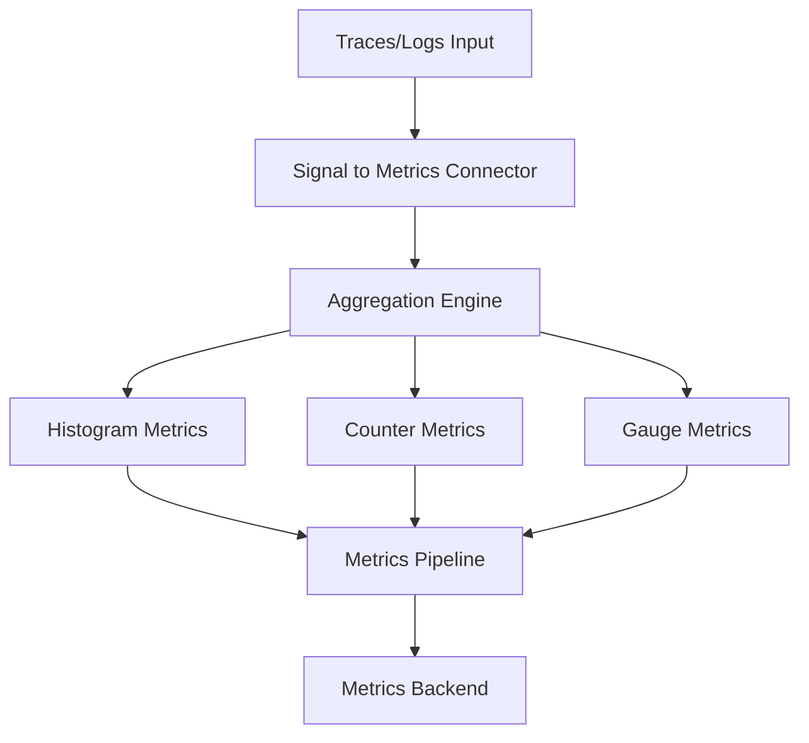

# How to Configure the Signal to Metrics Connector in the OpenTelemetry Collector

Author: [nawazdhandala](https://www.github.com/nawazdhandala)

Tags: OpenTelemetry, Collector, Connectors, Signal to Metrics, Metrics Generation, Telemetry Transformation

Description: Master the Signal to Metrics connector in OpenTelemetry Collector to transform traces and logs into actionable metrics for enhanced monitoring and observability.

The Signal to Metrics connector represents one of the most powerful capabilities in the OpenTelemetry Collector: the ability to derive metrics from other telemetry signals. This connector enables you to extract meaningful quantitative data from traces and logs, creating a unified observability experience where metrics, traces, and logs work together seamlessly.

## What is the Signal to Metrics Connector?

The Signal to Metrics connector is a specialized component that transforms telemetry signals (primarily traces and logs) into metrics. Rather than sending signals to external systems, this connector processes them internally and generates new metric data points based on configurable rules and aggregations.

This transformation capability is critical for several reasons. While traces provide detailed transaction data and logs capture discrete events, metrics offer aggregated time-series data that's efficient for alerting, dashboards, and long-term trend analysis. The Signal to Metrics connector bridges these observability pillars, allowing you to maintain rich detail in traces and logs while automatically generating the metrics you need for operational monitoring.

## Core Concepts and Architecture

The connector operates by analyzing incoming telemetry signals and applying transformation rules to generate metrics. Each signal type can contribute different metric dimensions and values:

**From Traces**: Extract duration, error rates, request counts, and custom span attributes as metric dimensions.

**From Logs**: Count log occurrences, categorize by severity, extract numeric values from log body or attributes.

The connector maintains state to perform aggregations over time windows, producing metrics that represent summaries of your telemetry data.



## Basic Configuration for Trace to Metrics Conversion

The most common use case is converting trace spans into metrics. Here's a foundational configuration:

```yaml
receivers:
  otlp:
    protocols:
      grpc:
        endpoint: 0.0.0.0:4317

connectors:
  signaltometrics:
    # Define which spans to process
    spans:
      # Create a histogram metric from span duration
      - name: span.duration
        description: Duration of spans
        unit: ms
        # Define metric dimensions from span attributes
        dimensions:
          - name: service.name
          - name: span.kind
          - name: http.method
          - name: http.status_code
        # Configure histogram buckets
        histogram:
          explicit:
            buckets: [10, 50, 100, 250, 500, 1000, 2500, 5000, 10000]

      # Create a counter for total span count
      - name: span.count
        description: Total number of spans
        unit: "1"
        dimensions:
          - name: service.name
          - name: span.kind

exporters:
  prometheusremotewrite:
    endpoint: http://prometheus:9090/api/v1/write

service:
  pipelines:
    # Input pipeline receives traces
    traces/input:
      receivers: [otlp]
      exporters: [signaltometrics]

    # Metrics pipeline exports generated metrics
    metrics/from-traces:
      receivers: [signaltometrics]
      exporters: [prometheusremotewrite]
```

This configuration creates two metrics from every span: a histogram tracking span duration and a counter for total spans, both tagged with service name and span kind.

## Generating Metrics from Span Attributes

You can extract custom business metrics from span attributes. This is particularly powerful for tracking domain-specific measurements:

```yaml
connectors:
  signaltometrics/business:
    spans:
      # Track shopping cart values
      - name: cart.value
        description: Shopping cart transaction value
        unit: USD
        # Only process spans with these attributes
        conditions:
          - key: span.kind
            value: "server"
          - key: service.name
            value: "checkout-service"
        dimensions:
          - name: user.tier
          - name: payment.method
          - name: region
        # Extract the value from a span attribute
        value:
          attribute: cart.total.amount

      # Track database query performance
      - name: db.query.duration
        description: Database query execution time
        unit: ms
        conditions:
          - key: db.system
            value: "postgresql"
        dimensions:
          - name: db.operation
          - name: db.name
          - name: service.name
        histogram:
          explicit:
            buckets: [5, 10, 25, 50, 100, 250, 500, 1000]

      # Count errors by type
      - name: error.count
        description: Number of errors by type
        unit: "1"
        conditions:
          - key: status.code
            value: "ERROR"
        dimensions:
          - name: error.type
          - name: service.name
          - name: http.status_code
```

This configuration creates business-specific metrics directly from your trace data, eliminating the need to instrument these metrics separately in your application code.

## Converting Logs to Metrics

The Signal to Metrics connector can also process log records to generate metrics. This is valuable for tracking log patterns, error rates, and extracting numeric data from log messages:

```yaml
receivers:
  otlp:
    protocols:
      grpc:
        endpoint: 0.0.0.0:4317

connectors:
  signaltometrics/logs:
    logs:
      # Count logs by severity
      - name: log.count
        description: Count of log records by severity
        unit: "1"
        dimensions:
          - name: severity_text
          - name: service.name
          - name: log.source

      # Track error logs specifically
      - name: log.error.count
        description: Count of error logs
        unit: "1"
        conditions:
          - key: severity_number
            operator: gte
            value: 17  # ERROR level and above
        dimensions:
          - name: service.name
          - name: error.category
          - name: deployment.environment

      # Extract numeric values from log body
      - name: custom.metric.from.log
        description: Custom metric extracted from log data
        unit: "1"
        conditions:
          - key: log.source
            value: "application"
        dimensions:
          - name: metric.type
          - name: service.name
        value:
          attribute: extracted.value

exporters:
  prometheusremotewrite:
    endpoint: http://prometheus:9090/api/v1/write

service:
  pipelines:
    logs/input:
      receivers: [otlp]
      exporters: [signaltometrics/logs]

    metrics/from-logs:
      receivers: [signaltometrics/logs]
      processors: [batch]
      exporters: [prometheusremotewrite]
```

This configuration monitors log volume and error rates, converting log events into time-series metrics suitable for alerting and trending.

## Advanced Dimension Configuration

Dimensions (labels in Prometheus terminology) are critical for making your metrics useful. The Signal to Metrics connector offers flexible dimension extraction:

```yaml
connectors:
  signaltometrics/advanced:
    spans:
      - name: http.server.duration
        description: HTTP server request duration
        unit: ms
        dimensions:
          # Direct attribute mapping
          - name: http.method
          - name: http.route
          - name: service.name

          # Rename an attribute
          - name: status_code
            source: http.status_code

          # Set default value if attribute is missing
          - name: environment
            source: deployment.environment
            default: "production"

          # Extract from resource attributes instead of span attributes
          - name: service.version
            source: service.version
            scope: resource

          # Create custom dimension based on conditions
          - name: status_class
            source: http.status_code
            mapping:
              "2xx": "200-299"
              "3xx": "300-399"
              "4xx": "400-499"
              "5xx": "500-599"

        histogram:
          explicit:
            buckets: [10, 25, 50, 100, 250, 500, 1000, 2500, 5000]
```

Properly configured dimensions enable powerful querying and filtering in your metrics backend, allowing you to slice and dice your telemetry data effectively.

## Aggregation Windows and Temporal Behavior

The Signal to Metrics connector aggregates data over time windows. Understanding temporal behavior is essential for accurate metrics:

```yaml
connectors:
  signaltometrics/temporal:
    # Configure aggregation window
    aggregation:
      # Time window for aggregation (default: 60s)
      interval: 30s
      # How long to wait for late data
      delay: 10s

    spans:
      - name: request.rate
        description: Request rate per service
        unit: "1/s"
        dimensions:
          - name: service.name
          - name: http.method
        # This creates a rate metric
        rate: true

      - name: request.duration.p99
        description: 99th percentile request duration
        unit: ms
        dimensions:
          - name: service.name
        histogram:
          explicit:
            buckets: [10, 50, 100, 250, 500, 1000, 2500, 5000]
        # Calculate percentiles
        percentiles: [50, 90, 95, 99]
```

Shorter aggregation intervals provide more granular metrics but increase cardinality and storage requirements. Balance temporal resolution with resource constraints.

## Resource Attribute Filtering

Control which spans or logs contribute to metrics using resource attribute filters:

```yaml
connectors:
  signaltometrics/filtered:
    # Global filter applied to all metric rules
    resource_filters:
      # Only process telemetry from production
      - key: deployment.environment
        value: "production"
      # Only specific services
      - key: service.name
        operator: in
        values: ["frontend", "api-gateway", "checkout"]

    spans:
      - name: critical.service.duration
        description: Duration for critical services
        unit: ms
        # Additional span-level conditions
        conditions:
          - key: http.route
            operator: regex
            value: "^/api/v1/.*"
        dimensions:
          - name: service.name
          - name: http.method
        histogram:
          explicit:
            buckets: [10, 50, 100, 250, 500, 1000]
```

Filtering reduces the volume of metrics generated and ensures you're only tracking relevant telemetry.

## Combining Multiple Signal Types

You can configure the connector to process both traces and logs simultaneously:

```yaml
connectors:
  signaltometrics/multi:
    # Generate metrics from traces
    spans:
      - name: span.duration
        description: Span duration by service
        unit: ms
        dimensions:
          - name: service.name
          - name: span.kind
        histogram:
          explicit:
            buckets: [10, 50, 100, 250, 500, 1000, 2500, 5000]

      - name: span.error.count
        description: Count of span errors
        unit: "1"
        conditions:
          - key: status.code
            value: "ERROR"
        dimensions:
          - name: service.name
          - name: error.type

    # Generate metrics from logs
    logs:
      - name: log.records
        description: Log record count by severity
        unit: "1"
        dimensions:
          - name: severity_text
          - name: service.name

      - name: log.error.rate
        description: Error log rate
        unit: "1/s"
        conditions:
          - key: severity_number
            operator: gte
            value: 17
        dimensions:
          - name: service.name
        rate: true

service:
  pipelines:
    # Traces feed into the connector
    traces/input:
      receivers: [otlp]
      exporters: [signaltometrics/multi]

    # Logs also feed into the same connector
    logs/input:
      receivers: [otlp]
      exporters: [signaltometrics/multi]

    # Single metrics pipeline receives all generated metrics
    metrics/from-signals:
      receivers: [signaltometrics/multi]
      processors: [batch]
      exporters: [prometheusremotewrite]
```

This unified approach ensures consistent metric generation across all your telemetry signals.

## Performance Optimization Strategies

The Signal to Metrics connector can generate significant metric volume. Optimize performance with these strategies:

**Control Cardinality**: Limit the number of dimensions and their possible values. High-cardinality dimensions like user IDs or transaction IDs can create millions of unique metric series.

```yaml
connectors:
  signaltometrics/optimized:
    spans:
      - name: optimized.duration
        description: Optimized duration metric
        unit: ms
        dimensions:
          # Good: low cardinality
          - name: service.name
          - name: http.method
          # Avoid: high cardinality
          # - name: user.id
          # - name: trace.id
        histogram:
          # Fewer buckets reduce storage
          explicit:
            buckets: [100, 500, 1000, 5000]
```

**Use Sampling**: For high-volume services, sample your telemetry before metric generation:

```yaml
processors:
  probabilistic_sampler:
    sampling_percentage: 10.0

service:
  pipelines:
    traces/input:
      receivers: [otlp]
      processors: [probabilistic_sampler]
      exporters: [signaltometrics]
```

**Adjust Aggregation Intervals**: Longer intervals reduce metric update frequency and storage requirements.

## Real-World Example: Comprehensive Service Monitoring

Here's a complete configuration that generates a full suite of metrics from traces:

```yaml
receivers:
  otlp:
    protocols:
      grpc:
        endpoint: 0.0.0.0:4317
      http:
        endpoint: 0.0.0.0:4318

processors:
  batch:
    timeout: 10s
    send_batch_size: 1024

  memory_limiter:
    check_interval: 1s
    limit_mib: 512

connectors:
  signaltometrics/comprehensive:
    aggregation:
      interval: 60s
      delay: 10s

    resource_filters:
      - key: deployment.environment
        value: "production"

    spans:
      # Request duration histogram
      - name: http.server.request.duration
        description: HTTP request duration
        unit: ms
        dimensions:
          - name: service.name
          - name: http.method
          - name: http.route
          - name: http.status_code
        histogram:
          explicit:
            buckets: [10, 25, 50, 100, 250, 500, 1000, 2500, 5000, 10000]

      # Request count
      - name: http.server.request.count
        description: HTTP request count
        unit: "1"
        dimensions:
          - name: service.name
          - name: http.method
          - name: http.status_code

      # Error count
      - name: http.server.error.count
        description: HTTP error count
        unit: "1"
        conditions:
          - key: http.status_code
            operator: gte
            value: 400
        dimensions:
          - name: service.name
          - name: http.method
          - name: http.status_code

      # Database query duration
      - name: db.client.operation.duration
        description: Database operation duration
        unit: ms
        conditions:
          - key: db.system
            operator: exists
        dimensions:
          - name: service.name
          - name: db.system
          - name: db.operation
          - name: db.name
        histogram:
          explicit:
            buckets: [5, 10, 25, 50, 100, 250, 500, 1000, 2500]

      # External API call duration
      - name: http.client.request.duration
        description: External HTTP request duration
        unit: ms
        conditions:
          - key: span.kind
            value: "client"
          - key: http.url
            operator: exists
        dimensions:
          - name: service.name
          - name: http.method
          - name: http.status_code
          - name: net.peer.name
        histogram:
          explicit:
            buckets: [50, 100, 250, 500, 1000, 2500, 5000]

exporters:
  prometheusremotewrite:
    endpoint: http://prometheus:9090/api/v1/write
    compression: snappy

service:
  pipelines:
    traces/input:
      receivers: [otlp]
      processors: [memory_limiter, batch]
      exporters: [signaltometrics/comprehensive]

    metrics/generated:
      receivers: [signaltometrics/comprehensive]
      processors: [batch]
      exporters: [prometheusremotewrite]
```

This configuration provides comprehensive RED (Rate, Error, Duration) metrics for HTTP services, database operations, and external dependencies, all derived automatically from traces.

## Monitoring and Validation

Verify that your Signal to Metrics connector is working correctly:

```yaml
service:
  telemetry:
    logs:
      level: info
    metrics:
      level: detailed
      address: 0.0.0.0:8888
```

Check the Collector's internal metrics:

- `otelcol_connector_signaltometrics_spans_processed`: Spans processed by the connector
- `otelcol_connector_signaltometrics_metrics_generated`: Metrics generated
- `otelcol_exporter_sent_metric_points`: Metric points sent to backend

## Troubleshooting Common Issues

**No Metrics Generated**: Verify that your conditions and filters match incoming telemetry. Enable debug logging to see which spans/logs are being processed.

**High Cardinality**: Review your dimensions. Remove or aggregate high-cardinality attributes like user IDs or request IDs.

**Missing Attributes**: Ensure the attributes you're extracting exist in your spans or logs. Use default values for optional attributes.

**Performance Issues**: Reduce the number of metric rules, increase aggregation intervals, or apply sampling.

## Related Resources

For more information about connectors and metrics generation in OpenTelemetry:

- [How to Use Connectors to Link Traces and Metrics Pipelines](https://oneuptime.com/blog/post/connectors-link-traces-metrics-pipelines-opentelemetry/view)
- [How to Convert Spans to Metrics Using the Span Metrics Connector](https://oneuptime.com/blog/post/convert-spans-to-metrics-span-metrics-connector/view)
- [How to Generate Service Graph Metrics from Traces in the Collector](https://oneuptime.com/blog/post/generate-service-graph-metrics-traces-collector/view)

The Signal to Metrics connector bridges the gap between detailed telemetry and operational metrics, enabling you to derive actionable insights from your traces and logs without additional instrumentation overhead.
