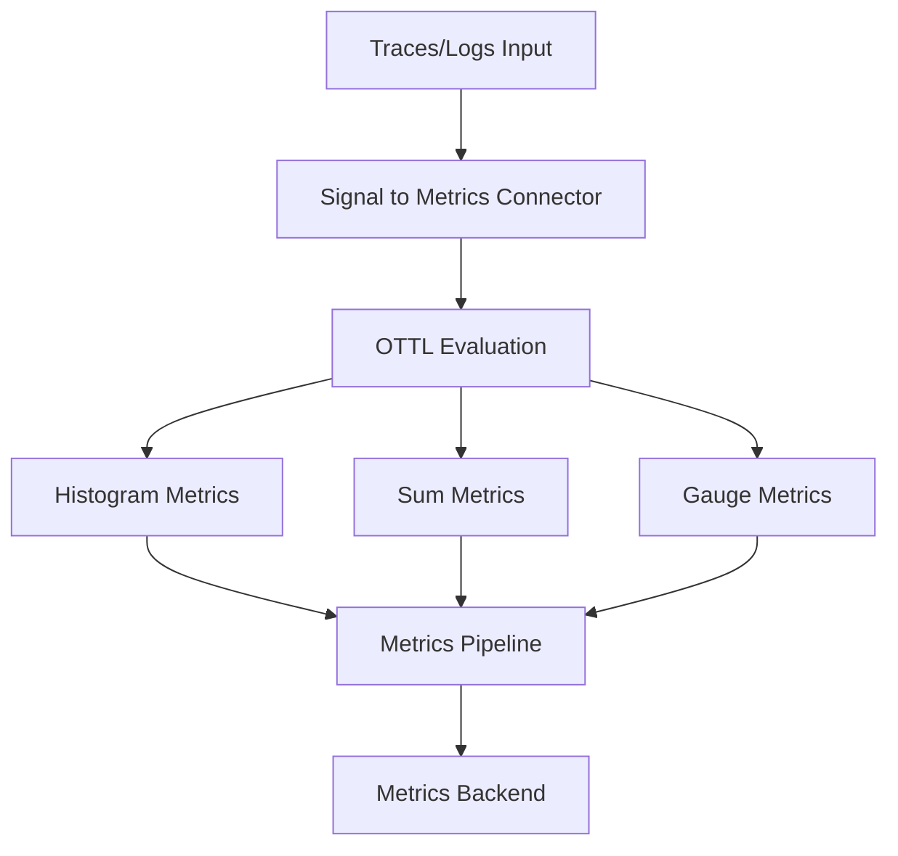

# How to Configure the Signal to Metrics Connector in the OpenTelemetry Collector

Author: [nawazdhandala](https://www.github.com/nawazdhandala)

Tags: OpenTelemetry, Collector, Connector, Signal to Metrics, Metrics Generation, Telemetry Transformation

Description: Master the Signal to Metrics connector in OpenTelemetry Collector to transform traces and logs into actionable metrics for enhanced monitoring and observability.

The Signal to Metrics connector represents one of the most powerful capabilities in OpenTelemetry Collector: the ability to derive metrics from other telemetry signals. This connector enables you to extract meaningful quantitative data from traces and logs, creating a unified observability experience where metrics, traces, and logs work together seamlessly.

## What is the Signal to Metrics Connector?

The Signal to Metrics connector is a specialized component that transforms telemetry signals into metrics. Rather than sending signals to external systems, this connector processes them internally and generates new metric data points based on configurable OpenTelemetry Transformation Language (OTTL) expressions.

This transformation capability is critical for several reasons. While traces provide detailed transaction data and logs capture discrete events, metrics offer time-series data that's efficient for alerting, dashboards, and long-term trend analysis. The Signal to Metrics connector bridges these observability pillars, allowing you to maintain rich detail in traces and logs while automatically generating the metrics you need for operational monitoring.

## Core Concepts and Architecture

The connector operates by analyzing incoming telemetry signals and applying OTTL expressions to generate metrics. Each signal type can contribute different metric attributes and values:

**From Traces**: Extract duration, request counts, error counts, and custom span attributes as metric attributes.

**From Logs**: Count log occurrences, filter by severity, and extract numeric values from log bodies or attributes.

The connector does not perform stateful or time-based aggregations. It aggregates metric points for the telemetry payload passed to each `Consume*` call and forwards the generated metrics to the metrics pipeline.


```mermaid
graph TB
    A[Traces/Logs Input] --> B[Signal to Metrics Connector]
    B --> C[OTTL Evaluation]
    C --> D[Histogram Metrics]
    C --> E[Sum Metrics]
    C --> F[Gauge Metrics]
    D --> G[Metrics Pipeline]
    E --> G
    F --> G
    G --> H[Metrics Backend]
```

## Basic Configuration for Trace to Metrics Conversion

The most common use case is converting trace spans into metrics. Here's a foundational configuration:

```yaml
receivers:
  otlp:
    protocols:
      grpc:
        endpoint: 0.0.0.0:4317

connectors:
  signal_to_metrics:
    # Define which spans to process
    spans:
      # Create a histogram metric from span duration
      - name: span.duration
        description: Duration of spans
        unit: us
        # Define metric attributes from span attributes
        attributes:
          - key: http.method
            optional: true
          - key: http.status_code
            optional: true
        # Keep selected resource attributes on the generated metrics
        include_resource_attributes:
          - key: service.name
            optional: true
        # Configure histogram buckets and the value expression
        histogram:
          buckets: [1000, 5000, 10000, 50000, 100000, 250000, 500000, 1000000, 2500000, 5000000]
          value: Microseconds(end_time - start_time)

      # Create a monotonic sum for total span count
      - name: span.count
        description: Total number of spans
        unit: "1"
        attributes:
          - key: http.method
            optional: true
        include_resource_attributes:
          - key: service.name
            optional: true
        sum:
          value: Int(AdjustedCount())
          monotonic: true

exporters:
  prometheusremotewrite:
    endpoint: http://prometheus:9090/api/v1/write

service:
  pipelines:
    # Input pipeline receives traces
    traces/input:
      receivers: [otlp]
      exporters: [signal_to_metrics]

    # Metrics pipeline exports generated metrics
    metrics/from-traces:
      receivers: [signal_to_metrics]
      exporters: [prometheusremotewrite]
```

This configuration creates two metrics from spans: a histogram tracking span duration and a monotonic sum for span counts, with selected span and resource attributes on the generated metrics.

## Generating Metrics from Span Attributes

You can extract custom business metrics from span attributes. This is particularly powerful for tracking domain-specific measurements:

```yaml
connectors:
  signal_to_metrics/business:
    spans:
      # Track shopping cart values
      - name: cart.value
        description: Shopping cart transaction value
        unit: USD
        # Only process spans with these attributes
        conditions:
          - 'span.kind == SPAN_KIND_SERVER AND resource.attributes["service.name"] == "checkout-service" AND attributes["cart.total.amount"] != nil'
        attributes:
          - key: user.tier
            optional: true
          - key: payment.method
            optional: true
          - key: region
            optional: true
        include_resource_attributes:
          - key: service.name
            optional: true
        # Extract the value from a span attribute
        gauge:
          value: Double(attributes["cart.total.amount"])

      # Track database query performance
      - name: db.query.duration
        description: Database query execution time
        unit: us
        conditions:
          - 'attributes["db.system"] == "postgresql"'
        attributes:
          - key: db.operation
            optional: true
          - key: db.name
            optional: true
        include_resource_attributes:
          - key: service.name
            optional: true
        histogram:
          buckets: [5000, 10000, 25000, 50000, 100000, 250000, 500000, 1000000]
          value: Microseconds(end_time - start_time)

      # Count errors by type
      - name: error.count
        description: Number of errors by type
        unit: "1"
        conditions:
          - 'span.status.code == STATUS_CODE_ERROR'
        attributes:
          - key: error.type
            optional: true
          - key: http.status_code
            optional: true
        include_resource_attributes:
          - key: service.name
            optional: true
        sum:
          value: Int(AdjustedCount())
          monotonic: true
```

This configuration creates business-specific metrics directly from your trace data, eliminating the need to instrument these metrics separately in your application code.

## Converting Logs to Metrics

The Signal to Metrics connector can also process log records to generate metrics. This is valuable for tracking log patterns, error rates, and extracting numeric data from log messages:

```yaml
receivers:
  otlp:
    protocols:
      grpc:
        endpoint: 0.0.0.0:4317

connectors:
  signal_to_metrics/logs:
    error_mode: ignore
    logs:
      # Count log records
      - name: log.count
        description: Count of log records
        unit: "1"
        attributes:
          - key: log.source
            optional: true
        include_resource_attributes:
          - key: service.name
            optional: true
        sum:
          value: "1"
          monotonic: true

      # Track error logs specifically
      - name: log.error.count
        description: Count of error logs
        unit: "1"
        conditions:
          - 'severity_number >= SEVERITY_NUMBER_ERROR'
        attributes:
          - key: error.category
            optional: true
          - key: deployment.environment
            optional: true
        include_resource_attributes:
          - key: service.name
            optional: true
        sum:
          value: "1"
          monotonic: true

      # Extract numeric values from log body
      - name: custom.metric.from.log
        description: Custom metric extracted from log data
        unit: "1"
        conditions:
          - 'attributes["log.source"] == "application"'
        attributes:
          - key: metric.type
            optional: true
        include_resource_attributes:
          - key: service.name
            optional: true
        gauge:
          value: ExtractGrokPatterns(body, "value=%{NUMBER:extracted_value:float}")["extracted_value"]

exporters:
  prometheusremotewrite:
    endpoint: http://prometheus:9090/api/v1/write

service:
  pipelines:
    logs/input:
      receivers: [otlp]
      exporters: [signal_to_metrics/logs]

    metrics/from-logs:
      receivers: [signal_to_metrics/logs]
      exporters: [prometheusremotewrite]
```

This configuration monitors log volume and error counts, converting log events into time-series metrics suitable for alerting and trending.

## Advanced Attribute Configuration

Attributes (labels in Prometheus terminology) are critical for making your metrics useful. The Signal to Metrics connector offers flexible attribute extraction:

```yaml
connectors:
  signal_to_metrics/advanced:
    spans:
      - name: http.server.duration
        description: HTTP server request duration
        unit: us
        attributes:
          # Direct span attribute mapping
          - key: http.method
            optional: true
          - key: http.route
            optional: true

        # Keep resource attributes on the generated metric
        include_resource_attributes:
          - key: service.name
            optional: true
          - key: service.version
            optional: true
          # Set default value if the resource attribute is missing
          - key: deployment.environment
            default_value: production

        histogram:
          buckets: [10000, 25000, 50000, 100000, 250000, 500000, 1000000, 2500000, 5000000]
          value: Microseconds(end_time - start_time)
```

Properly configured attributes enable powerful querying and filtering in your metrics backend, allowing you to slice and dice your telemetry data effectively.

## Aggregation Windows and Temporal Behavior

The Signal to Metrics connector does not configure aggregation windows, rates, or percentiles. It emits the metric type you define for each incoming payload; rate calculations and percentiles are typically calculated in your metrics backend from sums and histograms.

```yaml
connectors:
  signal_to_metrics/temporal:
    spans:
      - name: request.count
        description: Request count per service
        unit: "1"
        attributes:
          - key: http.method
            optional: true
        include_resource_attributes:
          - key: service.name
            optional: true
        sum:
          value: Int(AdjustedCount())
          monotonic: true

      - name: request.duration
        description: Request duration histogram
        unit: us
        include_resource_attributes:
          - key: service.name
            optional: true
        histogram:
          buckets: [10000, 50000, 100000, 250000, 500000, 1000000, 2500000, 5000000]
          value: Microseconds(end_time - start_time)
```

Use backend queries such as `rate()` on monotonic sums and histogram percentile functions to calculate request rates and latency percentiles.

Resource Attribute Filtering

Control which spans or logs contribute to metrics using OTTL conditions:

```yaml
connectors:
  signal_to_metrics/filtered:
    spans:
      - name: critical.service.duration
        description: Duration for critical services
        unit: us
        # Process telemetry from production and selected services
        conditions:
          - 'resource.attributes["deployment.environment"] == "production" AND (resource.attributes["service.name"] == "frontend" OR resource.attributes["service.name"] == "api-gateway" OR resource.attributes["service.name"] == "checkout") AND attributes["http.route"] != nil AND IsMatch(attributes["http.route"], "^/api/v1/.*")'
        attributes:
          - key: http.method
            optional: true
        include_resource_attributes:
          - key: service.name
            optional: true
        histogram:
          buckets: [10000, 50000, 100000, 250000, 500000, 1000000]
          value: Microseconds(end_time - start_time)
```

Filtering reduces the volume of metrics generated and ensures you're only tracking relevant telemetry.

## Combining Multiple Signal Types

You can configure the connector to process both traces and logs simultaneously:

```yaml
connectors:
  signal_to_metrics/multi:
    # Generate metrics from traces
    spans:
      - name: span.duration
        description: Span duration by service
        unit: us
        attributes:
          - key: http.method
            optional: true
        include_resource_attributes:
          - key: service.name
            optional: true
        histogram:
          buckets: [10000, 50000, 100000, 250000, 500000, 1000000, 2500000, 5000000]
          value: Microseconds(end_time - start_time)

      - name: span.error.count
        description: Count of span errors
        unit: "1"
        conditions:
          - 'span.status.code == STATUS_CODE_ERROR'
        attributes:
          - key: error.type
            optional: true
        include_resource_attributes:
          - key: service.name
            optional: true
        sum:
          value: Int(AdjustedCount())
          monotonic: true

    # Generate metrics from logs
    logs:
      - name: log.records
        description: Log record count
        unit: "1"
        include_resource_attributes:
          - key: service.name
            optional: true
        sum:
          value: "1"
          monotonic: true

      - name: log.error.count
        description: Error log count
        unit: "1"
        conditions:
          - 'severity_number >= SEVERITY_NUMBER_ERROR'
        include_resource_attributes:
          - key: service.name
            optional: true
        sum:
          value: "1"
          monotonic: true

service:
  pipelines:
    # Traces feed into the connector
    traces/input:
      receivers: [otlp]
      exporters: [signal_to_metrics/multi]

    # Logs also feed into the same connector
    logs/input:
      receivers: [otlp]
      exporters: [signal_to_metrics/multi]

    # Single metrics pipeline receives all generated metrics
    metrics/from-signals:
      receivers: [signal_to_metrics/multi]
      exporters: [prometheusremotewrite]
```

This unified approach ensures consistent metric generation across all your telemetry signals.

## Performance Optimization Strategies

The Signal to Metrics connector can generate significant metric volume. Optimize performance with these strategies:

**Control Cardinality**: Limit the number of attributes and their possible values. High-cardinality attributes like user IDs or transaction IDs can create millions of unique metric series.

```yaml
connectors:
  signal_to_metrics/optimized:
    spans:
      - name: optimized.duration
        description: Optimized duration metric
        unit: us
        attributes:
          # Good: low cardinality
          - key: http.method
            optional: true
          # Avoid: high cardinality
          # - key: user.id
          # - key: trace.id
        include_resource_attributes:
          - key: service.name
            optional: true
        histogram:
          # Fewer buckets reduce storage
          buckets: [100000, 500000, 1000000, 5000000]
          value: Microseconds(end_time - start_time)
```

**Use Sampling**: For high-volume services, sample your telemetry before metric generation:

```yaml
processors:
  probabilistic_sampler:
    sampling_percentage: 10.0

service:
  pipelines:
    traces/input:
      receivers: [otlp]
      processors: [probabilistic_sampler]
      exporters: [signal_to_metrics]
```

**Limit Attribute Sets**: Use `attributes` and `include_resource_attributes` carefully so each generated metric has only the dimensions you need.

## Real-World Example: Comprehensive Service Monitoring

Here's a complete configuration that generates a full suite of metrics from traces:

```yaml
receivers:
  otlp:
    protocols:
      grpc:
        endpoint: 0.0.0.0:4317
      http:
        endpoint: 0.0.0.0:4318

processors:
  batch:
    timeout: 10s
    send_batch_size: 1024

  memory_limiter:
    check_interval: 1s
    limit_mib: 512

connectors:
  signal_to_metrics/comprehensive:
    spans:
      # Request duration histogram
      - name: http.server.request.duration
        description: HTTP request duration
        unit: us
        conditions:
          - 'span.kind == SPAN_KIND_SERVER'
        attributes:
          - key: http.method
            optional: true
          - key: http.route
            optional: true
          - key: http.status_code
            optional: true
        include_resource_attributes:
          - key: service.name
            optional: true
          - key: deployment.environment
            optional: true
        histogram:
          buckets: [10000, 25000, 50000, 100000, 250000, 500000, 1000000, 2500000, 5000000, 10000000]
          value: Microseconds(end_time - start_time)

      # Request count
      - name: http.server.request.count
        description: HTTP request count
        unit: "1"
        conditions:
          - 'span.kind == SPAN_KIND_SERVER'
        attributes:
          - key: http.method
            optional: true
          - key: http.status_code
            optional: true
        include_resource_attributes:
          - key: service.name
            optional: true
        sum:
          value: Int(AdjustedCount())
          monotonic: true

      # Error count
      - name: http.server.error.count
        description: HTTP error count
        unit: "1"
        conditions:
          - 'attributes["http.status_code"] != nil AND attributes["http.status_code"] >= 400'
        attributes:
          - key: http.method
            optional: true
          - key: http.status_code
            optional: true
        include_resource_attributes:
          - key: service.name
            optional: true
        sum:
          value: Int(AdjustedCount())
          monotonic: true

      # Database query duration
      - name: db.client.operation.duration
        description: Database operation duration
        unit: us
        conditions:
          - 'attributes["db.system"] != nil'
        attributes:
          - key: db.system
            optional: true
          - key: db.operation
            optional: true
          - key: db.name
            optional: true
        include_resource_attributes:
          - key: service.name
            optional: true
        histogram:
          buckets: [5000, 10000, 25000, 50000, 100000, 250000, 500000, 1000000, 2500000]
          value: Microseconds(end_time - start_time)

      # External API call duration
      - name: http.client.request.duration
        description: External HTTP request duration
        unit: us
        conditions:
          - 'span.kind == SPAN_KIND_CLIENT AND attributes["http.url"] != nil'
        attributes:
          - key: http.method
            optional: true
          - key: http.status_code
            optional: true
          - key: net.peer.name
            optional: true
        include_resource_attributes:
          - key: service.name
            optional: true
        histogram:
          buckets: [50000, 100000, 250000, 500000, 1000000, 2500000, 5000000]
          value: Microseconds(end_time - start_time)

exporters:
  prometheusremotewrite:
    endpoint: http://prometheus:9090/api/v1/write
    compression: snappy

service:
  pipelines:
    traces/input:
      receivers: [otlp]
      processors: [memory_limiter, batch]
      exporters: [signal_to_metrics/comprehensive]

    metrics/generated:
      receivers: [signal_to_metrics/comprehensive]
      processors: [batch]
      exporters: [prometheusremotewrite]
```

This configuration provides comprehensive RED (Rate, Error, Duration) metrics for HTTP services, database operations, and external dependencies, all derived automatically from traces.

## Monitoring and Validation

Verify that your Signal to Metrics connector is working correctly:

```yaml
service:
  telemetry:
    logs:
      level: info
    metrics:
      level: detailed
      readers:
        - pull:
            exporter:
              prometheus:
                host: 0.0.0.0
                port: 8888
```

Check the Collector's internal metrics for pipeline health:

- `otelcol_receiver_accepted_spans`: Spans accepted by receivers
- `otelcol_exporter_sent_metric_points`: Metric points sent by exporters
- `otelcol_exporter_send_failed_metric_points`: Metric points that exporters failed to send

## Troubleshooting Common Issues

**No Metrics Generated**: Verify that your OTTL conditions match incoming telemetry. Enable debug logging to see which spans or logs are being processed.

**High Cardinality**: Review your attributes. Remove or aggregate high-cardinality attributes like user IDs or request IDs.

**Missing Attributes**: Ensure the attributes you're extracting exist in your spans or logs. Use `optional: true` or `default_value` for optional attributes.

**Performance Issues**: Reduce the number of metric rules, reduce metric attributes, or apply sampling.

## Related Resources

For more information about connectors and metrics generation in OpenTelemetry:

- [How to Use Connectors to Link Traces and Metrics Pipelines](https://oneuptime.com/blog/post/2026-02-06-connectors-link-traces-metrics-pipelines-opentelemetry/view)
- [How to Convert Spans to Metrics Using the Span Metrics Connector](https://oneuptime.com/blog/post/2026-02-06-convert-spans-to-metrics-span-metrics-connector/view)
- [How to Generate Service Graph Metrics from Traces in the Collector](https://oneuptime.com/blog/post/2026-02-06-generate-service-graph-metrics-traces-collector/view)

The Signal to Metrics connector bridges the gap between detailed telemetry and operational metrics, enabling you to derive actionable insights from your traces and logs without additional instrumentation overhead.
