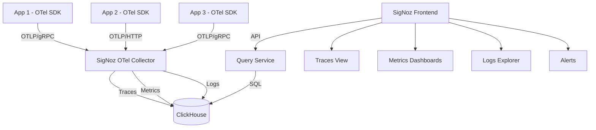

# How to Set Up SigNoz as a Self-Hosted OpenTelemetry Backend

Author: [nawazdhandala](https://www.github.com/nawazdhandala)

Tags: OpenTelemetry, SigNoz, Observability, Self-Hosted, Backend, Traces, Logs, Metrics, Open Source

Description: Complete guide to deploying SigNoz as a self-hosted OpenTelemetry backend with Docker and Kubernetes, covering all three telemetry signals.

---

SigNoz is an open-source observability platform built from the ground up for OpenTelemetry. Unlike backends that added OpenTelemetry support as an afterthought, SigNoz was designed around the OpenTelemetry data model from day one. It provides a unified UI for traces, metrics, and logs, uses ClickHouse for high-performance storage, and can be fully self-hosted so your data never leaves your infrastructure.

If you want a Datadog-like experience without the Datadog price tag, and you want native OpenTelemetry support without any translation layers or compatibility shims, SigNoz is one of the strongest options available. This guide walks through deploying SigNoz, connecting your applications, and getting the most out of its features.

## What SigNoz Includes

SigNoz is not just a storage backend. It is a complete observability platform that bundles several components together.

The SigNoz OTel Collector is a customized version of the OpenTelemetry Collector that is preconfigured to receive OTLP data and write it to ClickHouse. The Query Service provides APIs for the frontend to query trace, metric, and log data. The Frontend is a React-based web application that provides dashboards, trace exploration, log viewing, and alerting. And ClickHouse serves as the storage engine for all telemetry data.



## Deploying with Docker Compose

The fastest way to get SigNoz running is with Docker Compose. SigNoz provides an install script that handles the setup, but we will walk through the manual approach so you understand what each component does.

First, clone the SigNoz repository which contains the Docker Compose configuration.

```bash
# Clone the SigNoz repository
git clone -b main https://github.com/SigNoz/signoz.git

# Navigate to the Docker deployment directory
cd signoz/deploy/docker/clickhouse-setup
```

Before starting the stack, take a look at the Docker Compose file to understand the services. The key files are the main compose file and the environment configuration.

```bash
# Review the compose file structure
ls -la
# You will see:
#   docker-compose.yaml    - Main service definitions
#   otel-collector-config.yaml - Collector configuration
#   clickhouse-config.xml  - ClickHouse settings
```

Now start the entire stack. This will pull images for ClickHouse, the SigNoz Collector, the query service, and the frontend.

```bash
# Start SigNoz with all components
docker compose up -d

# Watch the logs to see when everything is ready
docker compose logs -f --tail=50
```

The startup takes a few minutes because ClickHouse needs to initialize its schema. Once everything is running, access the SigNoz UI at http://localhost:3301. You will be prompted to create an admin account on first login.

## Deploying with Kubernetes

For production environments, Kubernetes is the recommended deployment method. SigNoz provides a Helm chart that handles all the complexity.

First, add the SigNoz Helm repository and update your charts.

```bash
# Add the SigNoz Helm repository
helm repo add signoz https://charts.signoz.io

# Update the repository index
helm repo update

# Create a namespace for SigNoz
kubectl create namespace signoz
```

Now install SigNoz with a values file that configures storage and resource limits.

```yaml
# signoz-values.yaml
# Helm values for production SigNoz deployment

clickhouse:
  # Persistent storage for ClickHouse
  persistence:
    enabled: true
    size: 100Gi
    storageClass: standard

  # Resource limits for ClickHouse pods
  resources:
    requests:
      memory: 4Gi
      cpu: 2
    limits:
      memory: 8Gi
      cpu: 4

  # Data retention settings
  coldStorage:
    enabled: false

queryService:
  resources:
    requests:
      memory: 512Mi
      cpu: 500m
    limits:
      memory: 1Gi
      cpu: 1

frontend:
  resources:
    requests:
      memory: 128Mi
      cpu: 100m
    limits:
      memory: 256Mi
      cpu: 200m

otelCollector:
  resources:
    requests:
      memory: 512Mi
      cpu: 500m
    limits:
      memory: 1Gi
      cpu: 1
```

Install the chart with these values.

```bash
# Install SigNoz using Helm
helm install signoz signoz/signoz \
  --namespace signoz \
  --values signoz-values.yaml \
  --wait --timeout 10m

# Check that all pods are running
kubectl get pods -n signoz
```

To access the UI from outside the cluster, create a port forward or set up an Ingress.

```bash
# Quick access via port-forward
kubectl port-forward svc/signoz-frontend -n signoz 3301:3301
```

## Connecting Your Applications

With SigNoz running, you need to point your application's OpenTelemetry SDK at the SigNoz Collector's OTLP endpoint. The Collector listens on the standard OTLP ports: 4317 for gRPC and 4318 for HTTP.

Here is an example for a Node.js application using the OpenTelemetry Node SDK.

```javascript
// tracing.js
// OpenTelemetry setup for a Node.js application sending to SigNoz

const { NodeSDK } = require('@opentelemetry/sdk-node');
const { OTLPTraceExporter } = require('@opentelemetry/exporter-trace-otlp-grpc');
const { OTLPMetricExporter } = require('@opentelemetry/exporter-metrics-otlp-grpc');
const { OTLPLogExporter } = require('@opentelemetry/exporter-logs-otlp-grpc');
const { getNodeAutoInstrumentations } = require('@opentelemetry/auto-instrumentations-node');
const { PeriodicExportingMetricReader } = require('@opentelemetry/sdk-metrics');
const { Resource } = require('@opentelemetry/resources');
const { ATTR_SERVICE_NAME } = require('@opentelemetry/semantic-conventions');

// Point all exporters at the SigNoz Collector endpoint
const collectorEndpoint = 'http://localhost:4317';

const sdk = new NodeSDK({
  resource: new Resource({
    [ATTR_SERVICE_NAME]: 'my-node-service',
    'deployment.environment': 'production',
  }),
  // Trace exporter sends spans to SigNoz
  traceExporter: new OTLPTraceExporter({
    url: collectorEndpoint,
  }),
  // Metric reader sends metrics to SigNoz
  metricReader: new PeriodicExportingMetricReader({
    exporter: new OTLPMetricExporter({
      url: collectorEndpoint,
    }),
    exportIntervalMillis: 60000,
  }),
  // Auto-instrumentation for common Node.js libraries
  instrumentations: [
    getNodeAutoInstrumentations({
      // Instrument HTTP, Express, database clients, etc.
      '@opentelemetry/instrumentation-fs': { enabled: false },
    }),
  ],
});

// Start the SDK before your application code runs
sdk.start();

// Graceful shutdown on process exit
process.on('SIGTERM', () => {
  sdk.shutdown().then(() => process.exit(0));
});
```

For a Python application, the setup follows the same pattern.

```python
# otel_setup.py
# OpenTelemetry configuration for a Python application sending to SigNoz

from opentelemetry import trace, metrics
from opentelemetry.sdk.trace import TracerProvider
from opentelemetry.sdk.trace.export import BatchSpanProcessor
from opentelemetry.sdk.metrics import MeterProvider
from opentelemetry.sdk.metrics.export import PeriodicExportingMetricReader
from opentelemetry.exporter.otlp.proto.grpc.trace_exporter import OTLPSpanExporter
from opentelemetry.exporter.otlp.proto.grpc.metric_exporter import OTLPMetricExporter
from opentelemetry.sdk.resources import Resource

# SigNoz Collector endpoint
COLLECTOR_ENDPOINT = "http://localhost:4317"

# Create a resource identifying this service
resource = Resource.create({
    "service.name": "my-python-service",
    "deployment.environment": "production",
})

# Configure trace export to SigNoz
trace_provider = TracerProvider(resource=resource)
trace_provider.add_span_processor(
    BatchSpanProcessor(
        OTLPSpanExporter(endpoint=COLLECTOR_ENDPOINT, insecure=True)
    )
)
trace.set_tracer_provider(trace_provider)

# Configure metric export to SigNoz
metric_reader = PeriodicExportingMetricReader(
    OTLPMetricExporter(endpoint=COLLECTOR_ENDPOINT, insecure=True),
    export_interval_millis=60000,
)
metric_provider = MeterProvider(resource=resource, metric_readers=[metric_reader])
metrics.set_meter_provider(metric_provider)
```

## Exploring Data in the SigNoz UI

Once your applications are sending data, the SigNoz UI provides several built-in views.

The Services tab shows all services that are sending telemetry data, with key metrics like P99 latency, error rate, and request rate displayed as time-series graphs. Clicking on a service drills down into its operations and shows latency distributions.

The Traces tab lets you search for traces by service name, operation, duration, status, and any span attribute. The trace detail view shows a waterfall diagram of all spans in a trace, making it easy to identify where time is being spent.

The Logs tab provides a log explorer with a query builder that supports filtering by severity, service, and log attributes. You can also correlate logs with traces if your application includes trace context in its log records.

The Dashboards tab lets you build custom dashboards using ClickHouse queries, with support for time-series graphs, tables, and value panels.

## Setting Up Alerts

SigNoz includes an alerting system that can notify you when metrics cross thresholds. Alerts are configured in the UI under the Alerts tab. You can set up alerts based on any metric, trace, or log query.

For example, you might create an alert that fires when a service's P99 latency exceeds 500ms for more than 5 minutes, or when the error rate goes above 5%. Alert notifications can be sent to Slack, PagerDuty, email, or any webhook endpoint.

## Data Retention

SigNoz stores data in ClickHouse with configurable retention periods. You can set different retention durations for traces, metrics, and logs through the SigNoz UI under Settings, or by modifying the ClickHouse TTL settings directly.

A common configuration is 15 days for traces, 30 days for metrics, and 15 days for logs. Adjust these based on your storage capacity and how far back you typically need to investigate issues.

## Wrapping Up

SigNoz gives you a complete, self-hosted observability platform that speaks OpenTelemetry natively. There is no translation layer, no proprietary agents, and no vendor lock-in. Your applications use standard OpenTelemetry SDKs, the data is stored in ClickHouse (which you control), and the UI covers traces, metrics, logs, and alerting in a single interface. For teams that want full ownership of their observability stack without building everything from scratch, SigNoz is a compelling option.
