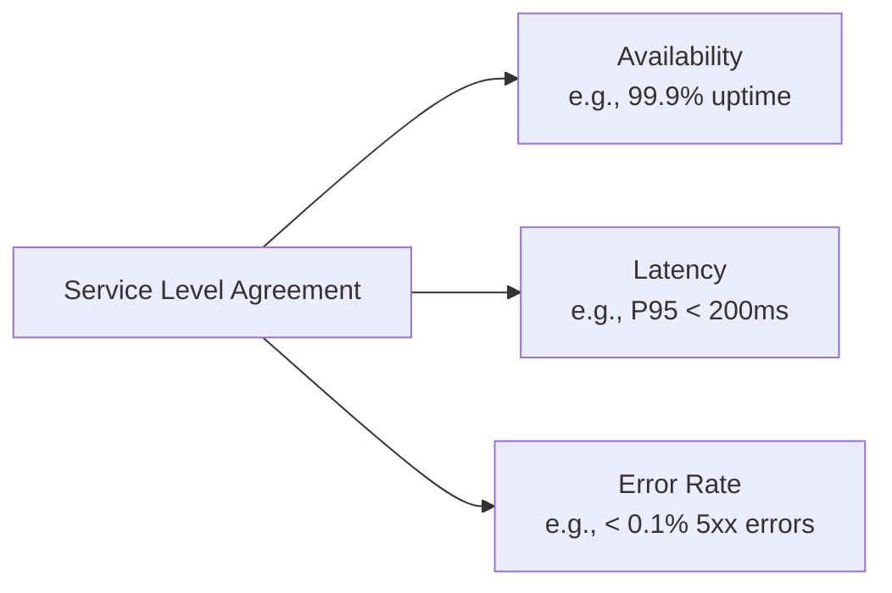
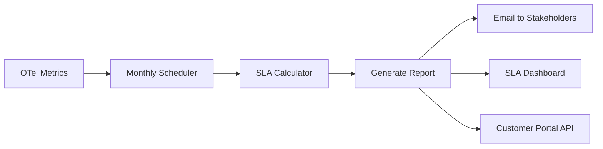

# How to Implement SLA Compliance Reporting with OpenTelemetry Data

Author: [nawazdhandala](https://www.github.com/nawazdhandala)

Tags: OpenTelemetry, SLA, Compliance, Reporting, Metrics, Observability, SLO, Reliability

Description: Learn how to build automated SLA compliance reports using OpenTelemetry metrics and traces, covering uptime calculations, latency commitments, and error rate thresholds.

---

SLA compliance reporting is often a painful manual process. Someone pulls numbers from multiple monitoring tools, drops them into a spreadsheet, and hopes the math is right. When a customer disputes the numbers, there is no easy way to drill into the underlying data.

OpenTelemetry changes this by giving you a single, consistent source of telemetry data across your entire stack. When your SLA metrics come from the same instrumentation that powers your operational monitoring, the numbers are always consistent and always auditable.

This guide shows you how to define SLA metrics in OpenTelemetry, collect the data you need for compliance calculations, and build automated reports that you can confidently share with customers.

---

## Understanding SLA Components

Before writing any code, let us clarify what typically goes into an SLA. Most SLAs include commitments around three dimensions:



Each of these needs to be measured consistently, calculated over the agreed reporting period (usually monthly), and compared against the committed threshold.

---

## Instrumenting for SLA Metrics

### Availability Tracking

Availability is typically measured as the percentage of time your service was operational during the reporting period. You need to track both successful and failed health checks or requests.

```python
# sla_metrics.py
from opentelemetry import metrics
from opentelemetry.sdk.metrics import MeterProvider
from opentelemetry.sdk.metrics.export import PeriodicExportingMetricReader
from opentelemetry.exporter.otlp.proto.http.metric_exporter import OTLPMetricExporter
from opentelemetry.sdk.resources import Resource, SERVICE_NAME
import time

# Configure the meter for SLA tracking
resource = Resource.create({
    SERVICE_NAME: "api-gateway",
    "service.tier": "premium",
})

reader = PeriodicExportingMetricReader(
    OTLPMetricExporter(endpoint="https://otel.oneuptime.com/v1/metrics"),
    export_interval_millis=15000,
)
provider = MeterProvider(resource=resource, metric_readers=[reader])
metrics.set_meter_provider(provider)
meter = metrics.get_meter("sla.compliance")

# Track total requests and successful requests for availability calculation
total_requests = meter.create_counter(
    name="sla.requests.total",
    description="Total number of requests received",
    unit="requests",
)

successful_requests = meter.create_counter(
    name="sla.requests.successful",
    description="Number of requests that completed successfully",
    unit="requests",
)

failed_requests = meter.create_counter(
    name="sla.requests.failed",
    description="Number of requests that failed with server errors",
    unit="requests",
)
```

These counters form the foundation of your availability calculation. Every request gets counted in `total_requests`, and based on the HTTP status code, it also gets counted as either successful or failed. The availability percentage is simply `successful / total * 100`.

### Latency Tracking with Histograms

SLA latency commitments are usually expressed as percentiles. "P95 latency must be under 200ms" is a common one. Histograms are the right metric type for this.

```python
# Histogram for response latency with SLA-relevant bucket boundaries
request_latency = meter.create_histogram(
    name="sla.request.duration",
    description="Duration of HTTP requests for SLA reporting",
    unit="ms",
)

def handle_request(request):
    """Middleware that tracks SLA-relevant metrics for every request."""
    start_time = time.perf_counter()

    # Common attributes for all SLA metrics
    attributes = {
        "service.name": "api-gateway",
        "sla.tier": request.headers.get("X-SLA-Tier", "standard"),
        "http.method": request.method,
        "api.version": "v2",
    }

    try:
        response = process_request(request)
        elapsed_ms = (time.perf_counter() - start_time) * 1000

        # Record the request in SLA counters
        total_requests.add(1, attributes)

        if response.status_code < 500:
            successful_requests.add(1, attributes)
        else:
            failed_requests.add(1, attributes)
            attributes["error.type"] = str(response.status_code)

        # Record latency for percentile calculations
        request_latency.record(elapsed_ms, {
            **attributes,
            "http.status_code": str(response.status_code),
        })

        return response
    except Exception as e:
        elapsed_ms = (time.perf_counter() - start_time) * 1000
        total_requests.add(1, attributes)
        failed_requests.add(1, {**attributes, "error.type": type(e).__name__})
        request_latency.record(elapsed_ms, attributes)
        raise
```

Notice the `sla.tier` attribute. If you have different SLA commitments for different customer tiers, this attribute lets you calculate compliance separately for each tier. A premium customer with a 99.99% uptime commitment gets different reporting than a standard customer with 99.9%.

---

## Building the Compliance Calculator

Once you have the raw metrics flowing, you need to aggregate them into SLA compliance numbers. This typically runs on a schedule, either daily for internal tracking or monthly for customer-facing reports.

```python
# sla_calculator.py
from dataclasses import dataclass
from datetime import datetime, timedelta
from typing import Optional

@dataclass
class SLATarget:
    """Defines the SLA commitments for a service tier."""
    availability_percent: float  # e.g., 99.9
    latency_p95_ms: float        # e.g., 200.0
    error_rate_percent: float    # e.g., 0.1

@dataclass
class SLAResult:
    """Results of SLA compliance calculation for a reporting period."""
    period_start: datetime
    period_end: datetime
    tier: str

    # Measured values
    actual_availability: float
    actual_latency_p95: float
    actual_error_rate: float

    # Targets
    target: SLATarget

    # Compliance status
    availability_met: bool
    latency_met: bool
    error_rate_met: bool

    @property
    def fully_compliant(self) -> bool:
        return self.availability_met and self.latency_met and self.error_rate_met

    @property
    def downtime_minutes(self) -> float:
        """Calculate actual downtime in minutes during the period."""
        total_minutes = (self.period_end - self.period_start).total_seconds() / 60
        return total_minutes * (1 - self.actual_availability / 100)

    @property
    def allowed_downtime_minutes(self) -> float:
        """Calculate allowed downtime based on SLA target."""
        total_minutes = (self.period_end - self.period_start).total_seconds() / 60
        return total_minutes * (1 - self.target.availability_percent / 100)


def calculate_sla_compliance(
    metrics_client,
    service: str,
    tier: str,
    period_start: datetime,
    period_end: datetime,
    target: SLATarget,
) -> SLAResult:
    """
    Calculate SLA compliance for a given service and period.

    Queries the metrics backend for the raw counter and histogram
    data, then computes availability, latency percentiles, and error rates.
    """
    # Query total and successful request counts for the period
    total = metrics_client.query_sum(
        metric="sla.requests.total",
        labels={"service.name": service, "sla.tier": tier},
        start=period_start,
        end=period_end,
    )

    successful = metrics_client.query_sum(
        metric="sla.requests.successful",
        labels={"service.name": service, "sla.tier": tier},
        start=period_start,
        end=period_end,
    )

    failed = metrics_client.query_sum(
        metric="sla.requests.failed",
        labels={"service.name": service, "sla.tier": tier},
        start=period_start,
        end=period_end,
    )

    # Query P95 latency from the histogram
    latency_p95 = metrics_client.query_percentile(
        metric="sla.request.duration",
        percentile=0.95,
        labels={"service.name": service, "sla.tier": tier},
        start=period_start,
        end=period_end,
    )

    # Calculate derived values
    availability = (successful / total * 100) if total > 0 else 100.0
    error_rate = (failed / total * 100) if total > 0 else 0.0

    return SLAResult(
        period_start=period_start,
        period_end=period_end,
        tier=tier,
        actual_availability=round(availability, 4),
        actual_latency_p95=round(latency_p95, 2),
        actual_error_rate=round(error_rate, 4),
        target=target,
        availability_met=availability >= target.availability_percent,
        latency_met=latency_p95 <= target.latency_p95_ms,
        error_rate_met=error_rate <= target.error_rate_percent,
    )
```

This calculator queries your metrics backend for the raw data and produces a clean compliance result. The `SLAResult` dataclass includes convenience properties for computing actual vs. allowed downtime, which is useful for credit calculations.

---

## Generating the Compliance Report

```python
# sla_report.py
def generate_monthly_report(results: list[SLAResult]) -> str:
    """Generate a formatted SLA compliance report."""
    report_lines = [
        "# SLA Compliance Report",
        f"Period: {results[0].period_start.strftime('%B %Y')}",
        "",
        "| Service | Tier | Availability | P95 Latency | Error Rate | Status |",
        "|---------|------|-------------|-------------|------------|--------|",
    ]

    for r in results:
        status = "COMPLIANT" if r.fully_compliant else "BREACH"
        report_lines.append(
            f"| {r.tier} | "
            f"{r.actual_availability:.3f}% (target: {r.target.availability_percent}%) | "
            f"{r.actual_latency_p95:.1f}ms (target: {r.target.latency_p95_ms}ms) | "
            f"{r.actual_error_rate:.4f}% (target: {r.target.error_rate_percent}%) | "
            f"{status} |"
        )

    # Add downtime summary
    report_lines.extend(["", "## Downtime Summary", ""])
    for r in results:
        report_lines.append(
            f"- **{r.tier}**: {r.downtime_minutes:.1f} minutes actual "
            f"/ {r.allowed_downtime_minutes:.1f} minutes allowed"
        )

    return "\n".join(report_lines)
```

This generates a human-readable compliance report that you can send to customers or stakeholders. Because all the data comes from OpenTelemetry metrics that are also used for operational monitoring, there is never a discrepancy between what your dashboards show and what your SLA reports say.

---

## Automating the Reporting Pipeline



Set up a cron job or scheduled task that runs at the end of each reporting period. It queries the metrics, runs the compliance calculation, generates the report, and distributes it through whatever channels your organization uses.

---

## Key Takeaways

Building SLA compliance reporting on top of OpenTelemetry data gives you several advantages. First, your SLA numbers are derived from the same telemetry data that powers your operational monitoring, so there is no possibility of discrepancy. Second, because OpenTelemetry provides structured attributes on every metric, you can easily segment by customer tier, region, API version, or any other relevant dimension. Third, the data is always available for drill-down investigation when a customer questions the numbers.

Start by identifying your SLA commitments and mapping them to specific OpenTelemetry metrics. Instrument your services to collect those metrics with the right attributes. Then build the calculation and reporting pipeline. Once it is running, SLA compliance reporting becomes a completely automated process instead of a monthly fire drill.
