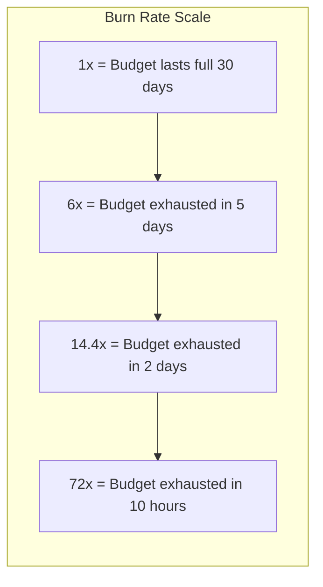

# How to Build SLO Burn Rate Alerts That Trigger PagerDuty Incidents from OpenTelemetry Data

Author: [nawazdhandala](https://www.github.com/nawazdhandala)

Tags: OpenTelemetry, SLO, Burn Rate, PagerDuty, Site Reliability

Description: Build SLO burn rate alerts from OpenTelemetry metrics that trigger PagerDuty incidents when error budgets deplete too fast.

Traditional threshold-based alerts do not capture the business impact of reliability problems. Your service might have a 5% error rate that sounds alarming, but if your SLO allows for 0.1% monthly errors and you have plenty of error budget remaining, it might not warrant a page. Burn rate alerting flips this model: instead of alerting on raw error rates, you alert when your error budget is being consumed faster than it can sustain for the SLO window.

This post covers how to compute SLO burn rates from OpenTelemetry metrics and wire them to PagerDuty for incident creation.

## SLO and Burn Rate Concepts

An SLO of 99.9% availability over 30 days gives you an error budget of 0.1%, which translates to roughly 43 minutes of downtime. A burn rate of 1x means you are consuming error budget at exactly the rate that would exhaust it by the end of the window. A burn rate of 14.4x means you will exhaust your entire 30-day error budget in just 2 days.



Google's SRE book recommends a multi-window, multi-burn-rate approach that balances detection speed with precision.

## Step 1: Instrument SLI Metrics with OpenTelemetry

Your Service Level Indicator (SLI) is the metric that measures whether a request was "good" or "bad". For availability SLOs, a good request is one that returns a non-5xx response within the latency threshold.

This instrumentation tracks both total requests and good requests:

```python
# Python OpenTelemetry SLI instrumentation
from opentelemetry import metrics
from opentelemetry.sdk.metrics import MeterProvider
from opentelemetry.sdk.resources import Resource
from opentelemetry.exporter.otlp.proto.grpc.metric_exporter import OTLPMetricExporter
from opentelemetry.sdk.metrics.export import PeriodicExportingMetricReader

resource = Resource.create({"service.name": "api-gateway"})
exporter = OTLPMetricExporter(endpoint="otel-collector:4317")
reader = PeriodicExportingMetricReader(exporter)
provider = MeterProvider(resource=resource, metric_readers=[reader])
metrics.set_meter_provider(provider)

meter = provider.get_meter("sli-metrics")

# Total request counter
total_requests = meter.create_counter(
    name="sli.requests.total",
    description="Total requests for SLO calculation",
    unit="1",
)

# Good request counter (non-5xx AND under latency threshold)
good_requests = meter.create_counter(
    name="sli.requests.good",
    description="Requests meeting SLO criteria",
    unit="1",
)

def handle_request(request):
    """Middleware that records SLI metrics for each request."""
    start = time.time()
    response = process_request(request)
    duration = time.time() - start

    labels = {"service_name": "api-gateway", "endpoint": request.path}

    # Every request counts toward total
    total_requests.add(1, labels)

    # Only count as good if status < 500 AND duration < 300ms
    if response.status_code < 500 and duration < 0.3:
        good_requests.add(1, labels)

    return response
```

## Step 2: Compute Error Ratios with Recording Rules

The error ratio is `1 - (good_requests / total_requests)`. Recording rules pre-compute this over multiple time windows needed for burn rate calculation.

These recording rules compute error ratios at different window sizes:

```yaml
# prometheus-recording-rules.yaml
groups:
  - name: slo_error_ratios
    interval: 30s
    rules:
      # Error ratio over 5 minutes (fast window)
      - record: service:sli_error_ratio:5m
        expr: |
          1 - (
            sum by (service_name) (rate(otel_sli_requests_good_total[5m]))
            /
            sum by (service_name) (rate(otel_sli_requests_total_total[5m]))
          )

      # Error ratio over 30 minutes
      - record: service:sli_error_ratio:30m
        expr: |
          1 - (
            sum by (service_name) (rate(otel_sli_requests_good_total[30m]))
            /
            sum by (service_name) (rate(otel_sli_requests_total_total[30m]))
          )

      # Error ratio over 1 hour (medium window)
      - record: service:sli_error_ratio:1h
        expr: |
          1 - (
            sum by (service_name) (rate(otel_sli_requests_good_total[1h]))
            /
            sum by (service_name) (rate(otel_sli_requests_total_total[1h]))
          )

      # Error ratio over 6 hours (slow window)
      - record: service:sli_error_ratio:6h
        expr: |
          1 - (
            sum by (service_name) (rate(otel_sli_requests_good_total[6h]))
            /
            sum by (service_name) (rate(otel_sli_requests_total_total[6h]))
          )

      # Error ratio over 3 days
      - record: service:sli_error_ratio:3d
        expr: |
          1 - (
            sum by (service_name) (rate(otel_sli_requests_good_total[3d]))
            /
            sum by (service_name) (rate(otel_sli_requests_total_total[3d]))
          )
```

## Step 3: Build Multi-Window Burn Rate Alerts

The multi-window approach uses a fast window and a slow window together. The fast window detects the problem quickly, and the slow window confirms it is not a transient spike. Both conditions must be true.

For a 99.9% SLO (error budget = 0.001), here are the burn rate alert rules:

```yaml
# prometheus-burn-rate-alerts.yaml
groups:
  - name: slo_burn_rate_alerts
    rules:
      # Page-worthy: 14.4x burn rate, detected in 5 min, confirmed over 1 hour
      # At this rate, 30-day budget exhausts in ~2 days
      - alert: SLOBurnRate_Critical
        expr: |
          service:sli_error_ratio:5m > (14.4 * 0.001)
          and
          service:sli_error_ratio:1h > (14.4 * 0.001)
        labels:
          severity: critical
          slo: "availability-99.9"
          burn_rate: "14.4x"
        annotations:
          summary: "SLO burn rate critical for {{ $labels.service_name }}"
          description: >
            Error budget is being consumed at 14.4x the sustainable rate.
            At this pace, the entire 30-day budget will be exhausted in approximately 2 days.
          dashboard_url: "https://grafana.example.com/d/slo-overview?var-service={{ $labels.service_name }}"
          runbook_url: "https://wiki.example.com/runbooks/slo-burn-rate"

      # Urgent ticket: 6x burn rate, detected in 30 min, confirmed over 6 hours
      # At this rate, 30-day budget exhausts in ~5 days
      - alert: SLOBurnRate_Warning
        expr: |
          service:sli_error_ratio:30m > (6 * 0.001)
          and
          service:sli_error_ratio:6h > (6 * 0.001)
        labels:
          severity: warning
          slo: "availability-99.9"
          burn_rate: "6x"
        annotations:
          summary: "SLO burn rate elevated for {{ $labels.service_name }}"
          description: >
            Error budget is being consumed at 6x the sustainable rate.
            Budget will be exhausted in approximately 5 days.

      # Low-priority: 1x burn rate over 3 days
      # Budget is on track to be exhausted by end of window
      - alert: SLOBurnRate_Low
        expr: |
          service:sli_error_ratio:3d > (1 * 0.001)
        labels:
          severity: info
          slo: "availability-99.9"
          burn_rate: "1x"
        annotations:
          summary: "SLO error budget trending toward exhaustion for {{ $labels.service_name }}"
```

## Step 4: Wire Critical Burn Rate Alerts to PagerDuty

Configure Alertmanager to create PagerDuty incidents for critical burn rate alerts. Include SLO context in the incident details.

```yaml
# alertmanager.yaml
receivers:
  - name: pagerduty-slo
    pagerduty_configs:
      - routing_key: "YOUR_PAGERDUTY_INTEGRATION_KEY"
        severity: >-
          {{ if eq .CommonLabels.severity "critical" }}critical{{ else }}warning{{ end }}
        description: "{{ .CommonAnnotations.summary }}"
        # Include SLO context as custom details
        details:
          slo: "{{ .CommonLabels.slo }}"
          burn_rate: "{{ .CommonLabels.burn_rate }}"
          description: "{{ .CommonAnnotations.description }}"
          dashboard: "{{ .CommonAnnotations.dashboard_url }}"
          runbook: "{{ .CommonAnnotations.runbook_url }}"
          affected_services: "{{ .CommonLabels.service_name }}"

route:
  receiver: default
  routes:
    # Critical burn rate - page immediately
    - match:
        severity: critical
        slo: "availability-99.9"
      receiver: pagerduty-slo
      group_wait: 10s
      repeat_interval: 1h

    # Warning burn rate - Slack notification
    - match:
        severity: warning
        slo: "availability-99.9"
      receiver: slack-slo-warnings
      repeat_interval: 6h
```

## Step 5: Add a Remaining Budget Dashboard Query

Include the current remaining error budget in your alert annotations using a Prometheus query:

```yaml
annotations:
  remaining_budget: >-
    {{ with printf "1 - (service:sli_error_ratio:30d{service_name='%s'} / 0.001)" .Labels.service_name | query }}
      {{ . | first | value | humanizePercentage }} of error budget remaining
    {{ end }}
```

## Choosing Your SLO Parameters

| SLO Target | Error Budget (30d) | 14.4x Threshold | 6x Threshold |
|------------|-------------------|-----------------|--------------|
| 99.9%      | 0.001             | 0.0144          | 0.006        |
| 99.5%      | 0.005             | 0.072           | 0.030        |
| 99.0%      | 0.01              | 0.144           | 0.060        |

Start with a 99.9% SLO only if your service genuinely needs that level of reliability. Most internal services work fine with 99.5% or 99.0%, which provides a more generous error budget and fewer pages.
