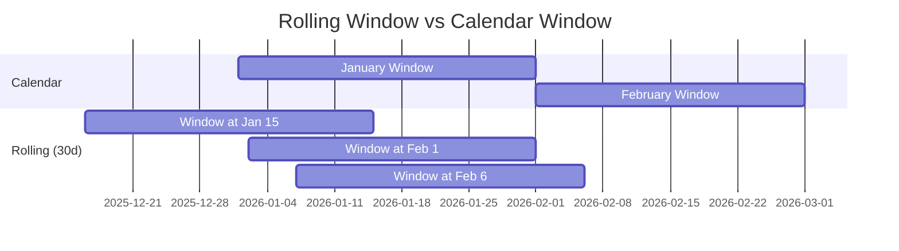

# How to Track SLO Compliance Over Rolling Windows Using OpenTelemetry Histograms

Author: [nawazdhandala](https://www.github.com/nawazdhandala)

Tags: OpenTelemetry, SLO, Histograms, Compliance

Description: Track SLO compliance using OpenTelemetry histogram data over rolling time windows with practical Prometheus examples.

Calendar-based SLO windows (like "this month") create perverse incentives. If you exhaust your budget on day 3, you have 27 days of either reckless spending or frustrated restraint. Rolling windows fix this by continuously measuring compliance over the trailing N days, where every hour of good behavior earns back budget spent earlier. OpenTelemetry histograms are particularly well-suited for rolling-window SLO tracking because they capture the full request duration distribution, enabling precise latency-based compliance calculations.

## Rolling Windows vs Calendar Windows

A 30-day rolling window looks at the last 720 hours from right now, continuously sliding forward. Bad events that happened 31 days ago drop out of the window, gradually restoring your error budget.



## Histogram Bucket Configuration for SLO Compliance

The precision of your latency SLO compliance depends on having histogram bucket boundaries that align with your SLO thresholds. If your SLO requires 95% of requests under 200ms, the 200ms bucket boundary must exist in your histogram.

Configure this in the OpenTelemetry SDK using Views.

```python
from opentelemetry.sdk.metrics import MeterProvider
from opentelemetry.sdk.metrics.view import View, ExplicitBucketHistogramAggregation
from opentelemetry.sdk.metrics.export import PeriodicExportingMetricReader
from opentelemetry.exporter.otlp.proto.grpc.metric_exporter import OTLPMetricExporter

# Define buckets that include all SLO threshold values
# Each SLO threshold MUST be a bucket boundary for accurate compliance tracking
slo_aligned_buckets = [
    5, 10, 25, 50, 75, 100, 150, 200, 300, 500, 750, 1000, 2500, 5000, 10000
]

latency_view = View(
    instrument_name="http.server.request.duration",
    aggregation=ExplicitBucketHistogramAggregation(boundaries=slo_aligned_buckets),
)

exporter = OTLPMetricExporter(endpoint="http://localhost:4317", insecure=True)
reader = PeriodicExportingMetricReader(exporter, export_interval_millis=15000)

provider = MeterProvider(
    metric_readers=[reader],
    views=[latency_view],
)
```

## Prometheus Queries for Rolling-Window Compliance

Once your OpenTelemetry histograms reach Prometheus, you can compute compliance over any rolling window. The key function is `increase()`, which sums the total count increase over the window.

```promql
# Latency SLO compliance: fraction of requests under 200ms over rolling 30 days
# This is the core compliance metric
sum(increase(http_server_request_duration_bucket{service="api-gateway", le="200"}[30d]))
/
sum(increase(http_server_request_duration_count{service="api-gateway"}[30d]))
```

For multiple percentile thresholds (p50, p95, p99 compliance):

```promql
# p50 compliance: requests under 50ms
sum(increase(http_server_request_duration_bucket{service="api-gateway", le="50"}[30d]))
/
sum(increase(http_server_request_duration_count{service="api-gateway"}[30d]))

# p99 compliance: requests under 1000ms
sum(increase(http_server_request_duration_bucket{service="api-gateway", le="1000"}[30d]))
/
sum(increase(http_server_request_duration_count{service="api-gateway"}[30d]))
```

## Recording Rules for Efficient Rolling-Window Queries

Querying 30 days of histogram data on every dashboard refresh is expensive. Recording rules pre-compute these values.

```yaml
# prometheus-rules/slo-compliance-rolling.yaml
groups:
  - name: slo_rolling_compliance
    interval: 1m
    rules:
      # Availability compliance over 7-day rolling window
      - record: slo:availability:compliance_7d
        expr: |
          1 - (
            sum(increase(http_server_request_errors_total{service="api-gateway"}[7d]))
            /
            sum(increase(http_server_request_total{service="api-gateway"}[7d]))
          )

      # Availability compliance over 30-day rolling window
      - record: slo:availability:compliance_30d
        expr: |
          1 - (
            sum(increase(http_server_request_errors_total{service="api-gateway"}[30d]))
            /
            sum(increase(http_server_request_total{service="api-gateway"}[30d]))
          )

      # Latency compliance (200ms threshold) over 7-day rolling window
      - record: slo:latency_200ms:compliance_7d
        expr: |
          sum(increase(http_server_request_duration_bucket{service="api-gateway", le="200"}[7d]))
          /
          sum(increase(http_server_request_duration_count{service="api-gateway"}[7d]))

      # Latency compliance (200ms threshold) over 30-day rolling window
      - record: slo:latency_200ms:compliance_30d
        expr: |
          sum(increase(http_server_request_duration_bucket{service="api-gateway", le="200"}[30d]))
          /
          sum(increase(http_server_request_duration_count{service="api-gateway"}[30d]))

      # Trend: compare 7-day compliance to 30-day compliance
      # Positive values mean recent reliability is better than the 30-day average
      - record: slo:latency_200ms:compliance_trend
        expr: |
          slo:latency_200ms:compliance_7d - slo:latency_200ms:compliance_30d
```

## Handling Histogram Precision Limitations

OpenTelemetry explicit bucket histograms have a known precision limitation: you can only measure compliance at bucket boundaries. If your SLO threshold is 200ms but your nearest bucket is 250ms, you are overestimating compliance. There are two approaches to handle this.

The first approach is to ensure bucket boundaries match SLO thresholds exactly, as shown in the SDK configuration above.

The second approach uses exponential bucket histograms, which provide higher resolution without needing to pre-define boundaries.

```python
from opentelemetry.sdk.metrics.view import View, ExponentialBucketHistogramAggregation

# Exponential histograms automatically provide fine-grained buckets
# across the entire value range, up to the configured max_size
exponential_view = View(
    instrument_name="http.server.request.duration",
    aggregation=ExponentialBucketHistogramAggregation(max_size=160),
)
```

Note that exponential histograms require backend support. Prometheus added native histogram support, and other backends like the OpenTelemetry Collector can convert between formats.

## Multi-Service Compliance Dashboard Queries

When tracking SLO compliance across multiple services, aggregate results provide a fleet-wide view.

```promql
# Per-service latency compliance, useful for a dashboard showing all services
sum by (service) (
  increase(http_server_request_duration_bucket{le="200"}[30d])
)
/
sum by (service) (
  increase(http_server_request_duration_count[30d])
)

# Fleet-wide compliance (all services combined)
sum(increase(http_server_request_duration_bucket{le="200"}[30d]))
/
sum(increase(http_server_request_duration_count[30d]))
```

## Alerting on Compliance Drift

Rather than only alerting when the SLO is breached, alert when compliance is trending downward. This gives teams time to react before the budget is exhausted.

```yaml
# Alert when 7-day compliance is significantly worse than 30-day compliance
- alert: SLOComplianceDrifting
  expr: slo:latency_200ms:compliance_trend < -0.01
  for: 1h
  labels:
    severity: warning
  annotations:
    summary: "SLO compliance is trending downward"
    description: >
      Recent 7-day latency compliance is {{ $value | humanizePercentage }}
      below the 30-day average. Investigate recent changes.
```

Rolling windows combined with OpenTelemetry histograms give you a continuously updated, precise view of SLO compliance. The key is aligning your histogram buckets with your SLO thresholds and using recording rules to make long-range queries efficient.
