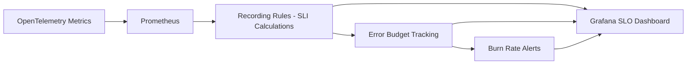

# How to Create an SLO Status Dashboard with Error Budget Burn Rate Visualization in Grafana

Author: [nawazdhandala](https://www.github.com/nawazdhandala)

Tags: OpenTelemetry, Grafana, SLO, Error Budget

Description: Build a Grafana dashboard that tracks SLO compliance, remaining error budget, and burn rate alerts using metrics from OpenTelemetry-instrumented services.

Service Level Objectives turn vague reliability goals into measurable targets. An SLO like "99.9% of requests complete successfully within 500ms" gives teams a concrete number to track. The error budget - the 0.1% of requests that are allowed to fail - becomes the currency you spend on deployments, experiments, and acceptable risk. This post builds a Grafana dashboard that visualizes SLO status, error budget consumption, and burn rate from OpenTelemetry metrics.

## Core Concepts

**Error budget**: If your SLO is 99.9% over 30 days, you have a budget of 0.1% of total requests that can fail. On a service handling 1 million requests per day, that is 30,000 failures allowed per month.

**Burn rate**: How fast you are consuming the error budget. A burn rate of 1x means you will exactly exhaust the budget by the end of the window. A burn rate of 10x means you will exhaust it in 1/10th of the window.



## Step 1: Define SLI Recording Rules

SLIs (Service Level Indicators) are the raw measurements behind your SLOs. Create Prometheus recording rules that pre-compute these from OpenTelemetry metrics:

```yaml
# prometheus-rules/sli-recording-rules.yaml
# Pre-compute SLI ratios from OpenTelemetry HTTP metrics
groups:
  - name: sli-availability
    interval: 30s
    rules:
      # Total request count over a sliding window
      - record: sli:http_requests:rate5m
        expr: |
          sum by (service_name) (
            rate(http_server_request_duration_seconds_count[5m])
          )

      # Successful request count (non-5xx responses under 500ms)
      - record: sli:http_requests_good:rate5m
        expr: |
          sum by (service_name) (
            rate(http_server_request_duration_seconds_count{
              http_status_code!~"5.."
            }[5m])
          )

      # SLI ratio: fraction of good requests
      - record: sli:http_availability:ratio_rate5m
        expr: |
          sli:http_requests_good:rate5m
          /
          sli:http_requests:rate5m

  - name: sli-latency
    interval: 30s
    rules:
      # Fraction of requests completing within 500ms SLO target
      - record: sli:http_latency_good:rate5m
        expr: |
          sum by (service_name) (
            rate(http_server_request_duration_seconds_bucket{le="0.5"}[5m])
          )

      # SLI ratio for latency SLO
      - record: sli:http_latency:ratio_rate5m
        expr: |
          sli:http_latency_good:rate5m
          /
          sli:http_requests:rate5m
```

## Step 2: Calculate Error Budget Consumption

Error budget tracking needs longer time windows. These recording rules compute budget consumption over 30-day rolling windows:

```yaml
# prometheus-rules/error-budget-rules.yaml
# Calculate error budget remaining over a 30-day rolling window
groups:
  - name: error-budget
    interval: 1m
    rules:
      # 30-day availability ratio
      - record: slo:http_availability:ratio_30d
        expr: |
          sum by (service_name) (
            sum_over_time(sli:http_requests_good:rate5m[30d])
          )
          /
          sum by (service_name) (
            sum_over_time(sli:http_requests:rate5m[30d])
          )

      # Error budget remaining as a fraction (1.0 = full budget, 0.0 = exhausted)
      # For a 99.9% SLO, the budget is 0.001
      - record: slo:http_availability:error_budget_remaining
        expr: |
          1 - (
            (1 - slo:http_availability:ratio_30d)
            /
            (1 - 0.999)
          )

      # Same for latency SLO (99.5% of requests under 500ms)
      - record: slo:http_latency:ratio_30d
        expr: |
          sum by (service_name) (
            sum_over_time(sli:http_latency_good:rate5m[30d])
          )
          /
          sum by (service_name) (
            sum_over_time(sli:http_requests:rate5m[30d])
          )

      - record: slo:http_latency:error_budget_remaining
        expr: |
          1 - (
            (1 - slo:http_latency:ratio_30d)
            /
            (1 - 0.995)
          )
```

## Step 3: Set Up Burn Rate Alerts

Burn rate alerting, as described in the Google SRE Workbook, uses multi-window checks to balance speed and sensitivity. A fast burn (consuming budget rapidly) should alert quickly, while a slow burn should alert only after sustained consumption:

```yaml
# prometheus-rules/burn-rate-alerts.yaml
# Multi-window burn rate alerts following the Google SRE approach
groups:
  - name: burn-rate-alerts
    rules:
      # Fast burn: 14.4x burn rate over 1 hour, confirmed over 5 minutes
      # Would exhaust monthly budget in ~2 days
      - alert: SLOHighBurnRate_Fast
        expr: |
          (
            1 - (
              sum by (service_name) (rate(http_server_request_duration_seconds_count{http_status_code!~"5.."}[1h]))
              /
              sum by (service_name) (rate(http_server_request_duration_seconds_count[1h]))
            )
          )
          /
          (1 - 0.999)
          > 14.4
          and
          (
            1 - (
              sum by (service_name) (rate(http_server_request_duration_seconds_count{http_status_code!~"5.."}[5m]))
              /
              sum by (service_name) (rate(http_server_request_duration_seconds_count[5m]))
            )
          )
          /
          (1 - 0.999)
          > 14.4
        for: 2m
        labels:
          severity: critical
          slo: availability
        annotations:
          summary: "{{ $labels.service_name }} is burning error budget 14x faster than normal"

      # Medium burn: 6x burn rate over 6 hours, confirmed over 30 minutes
      - alert: SLOHighBurnRate_Medium
        expr: |
          (
            1 - (
              sum by (service_name) (rate(http_server_request_duration_seconds_count{http_status_code!~"5.."}[6h]))
              /
              sum by (service_name) (rate(http_server_request_duration_seconds_count[6h]))
            )
          )
          /
          (1 - 0.999)
          > 6
          and
          (
            1 - (
              sum by (service_name) (rate(http_server_request_duration_seconds_count{http_status_code!~"5.."}[30m]))
              /
              sum by (service_name) (rate(http_server_request_duration_seconds_count[30m]))
            )
          )
          /
          (1 - 0.999)
          > 6
        for: 5m
        labels:
          severity: warning
          slo: availability
        annotations:
          summary: "{{ $labels.service_name }} is burning error budget 6x faster than normal"

      # Slow burn: 3x burn rate over 1 day, confirmed over 2 hours
      - alert: SLOHighBurnRate_Slow
        expr: |
          (
            1 - (
              sum by (service_name) (rate(http_server_request_duration_seconds_count{http_status_code!~"5.."}[1d]))
              /
              sum by (service_name) (rate(http_server_request_duration_seconds_count[1d]))
            )
          )
          /
          (1 - 0.999)
          > 3
          and
          (
            1 - (
              sum by (service_name) (rate(http_server_request_duration_seconds_count{http_status_code!~"5.."}[2h]))
              /
              sum by (service_name) (rate(http_server_request_duration_seconds_count[2h]))
            )
          )
          /
          (1 - 0.999)
          > 3
        for: 15m
        labels:
          severity: warning
          slo: availability
        annotations:
          summary: "{{ $labels.service_name }} has sustained elevated error budget burn for over 2 hours"
```

## Step 4: Build the Grafana Dashboard Panels

The SLO dashboard needs four key panels:

**Panel 1: SLO Compliance Gauge** - shows current SLI vs. target:

```promql
# Current availability SLI as a percentage
100 * slo:http_availability:ratio_30d{service_name=~"$service"}
```

Set the gauge thresholds: green above 99.9%, yellow at 99.5-99.9%, red below 99.5%. Add a marker at the 99.9% SLO target line.

**Panel 2: Error Budget Remaining** - shows how much budget is left:

```promql
# Error budget remaining as a percentage (100% = full, 0% = exhausted)
100 * slo:http_availability:error_budget_remaining{service_name=~"$service"}
```

Use a Gauge or Stat panel. Color it green above 50%, yellow at 20-50%, red below 20%.

**Panel 3: Burn Rate Over Time** - a time series showing how the burn rate changes:

```promql
# Current burn rate relative to budget (1.0 = sustainable pace)
(
  1 - sli:http_availability:ratio_rate5m{service_name=~"$service"}
)
/
(1 - 0.999)
```

Add horizontal threshold lines at 1x (sustainable), 6x (medium alert), and 14.4x (fast alert).

**Panel 4: Error Budget Consumption Over Time** - shows budget depletion as a downward slope:

```promql
# Error budget remaining over time
100 * slo:http_availability:error_budget_remaining{service_name=~"$service"}
```

This panel tells the story of the month. A steady, gentle decline means normal consumption. A sudden drop means an incident consumed a chunk of budget. A flat line near zero means the team should freeze risky deployments until the budget resets.

## Making Burn Rate Actionable

The dashboard should map directly to team actions. When the error budget is above 50%, deploy freely. When it drops below 30%, slow down and increase testing. When it hits 0%, stop all non-essential changes and focus on reliability improvements. Adding annotations for deployments and incidents on the burn rate panel gives context about what caused each drop, helping teams correlate budget consumption with specific changes.
