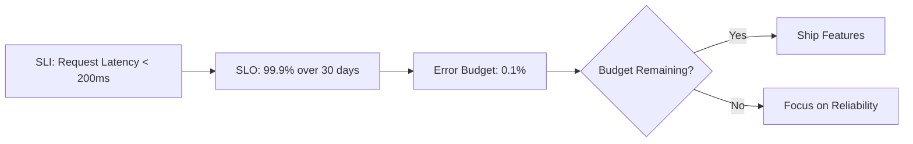
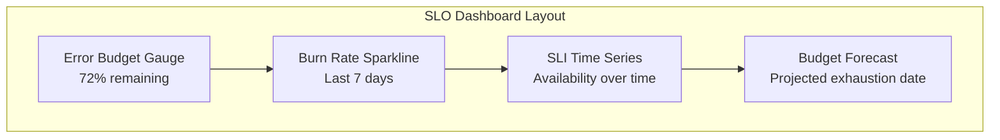

# How to Implement SLO Monitoring with OpenTelemetry Metrics

Author: [nawazdhandala](https://www.github.com/nawazdhandala)

Tags: OpenTelemetry, SLO, SLI, Metrics, Site Reliability Engineering, Monitoring, Error Budget

Description: Learn how to define service level objectives, compute error budgets, and build SLO monitoring dashboards using OpenTelemetry metrics and the Collector.

---

> Service Level Objectives turn vague reliability goals into measurable targets. When built on top of OpenTelemetry metrics, they give you a data-driven framework for deciding when to invest in reliability versus when to ship features.

Every engineering team has an intuitive sense of whether their service is "reliable enough." SLOs make that intuition concrete. Instead of arguing about whether 99.9% uptime is good enough, you define it as a target, measure it continuously, and track how much error budget you have left.

OpenTelemetry provides the instrumentation layer that feeds SLO monitoring. This guide shows you how to define SLIs (Service Level Indicators), compute SLOs from OpenTelemetry metrics, and set up error budget alerts.

---

## Understanding SLIs, SLOs, and Error Budgets

Before diving into implementation, let's clarify the terminology:

- **SLI (Service Level Indicator)**: A measurement of your service's behavior. For example, "the proportion of requests that complete in under 200ms" or "the proportion of requests that return a non-error status code."

- **SLO (Service Level Objective)**: A target value for an SLI. For example, "99.9% of requests should complete in under 200ms over a 30-day rolling window."

- **Error Budget**: The amount of allowed unreliability. If your SLO is 99.9%, your error budget is 0.1%. Over a 30-day window with 1 million requests, that means you can afford 1,000 failed requests before breaching your SLO.



---

## Instrumenting SLIs with OpenTelemetry

The first step is instrumenting your service to emit the metrics that form your SLIs. The two most common SLI types are availability (error rate) and latency.

Here is how to instrument both in a Go HTTP service:

```go
package main

import (
    "net/http"
    "time"

    "go.opentelemetry.io/otel"
    "go.opentelemetry.io/otel/attribute"
    "go.opentelemetry.io/otel/metric"
)

var (
    meter = otel.Meter("slo-instrumentation")

    // Counter for total requests - the denominator of our SLI
    // Every request increments this, regardless of outcome
    requestCounter, _ = meter.Int64Counter(
        "http.server.request.total",
        metric.WithDescription("Total number of HTTP requests received"),
        metric.WithUnit("1"),
    )

    // Counter for failed requests - the numerator of our error SLI
    // Only increments when a request results in a 5xx status code
    errorCounter, _ = meter.Int64Counter(
        "http.server.request.errors",
        metric.WithDescription("Number of HTTP requests that resulted in 5xx errors"),
        metric.WithUnit("1"),
    )

    // Histogram for request duration - used for latency SLI
    // The bucket boundaries are chosen to align with our SLO thresholds
    // We care about 200ms and 500ms as our fast/slow boundaries
    latencyHistogram, _ = meter.Float64Histogram(
        "http.server.request.duration",
        metric.WithDescription("Duration of HTTP requests in milliseconds"),
        metric.WithUnit("ms"),
        metric.WithExplicitBucketBoundaries(
            5, 10, 25, 50, 100, 200, 500, 1000, 2500, 5000,
        ),
    )
)

// SLI middleware wraps an HTTP handler and records metrics for SLO computation
func sliMiddleware(next http.Handler) http.Handler {
    return http.HandlerFunc(func(w http.ResponseWriter, r *http.Request) {
        start := time.Now()

        // Wrap the ResponseWriter to capture the status code
        wrapped := &statusRecorder{ResponseWriter: w, statusCode: 200}
        next.ServeHTTP(wrapped, r)

        duration := float64(time.Since(start).Milliseconds())

        // Common attributes for all SLI metrics
        attrs := []attribute.KeyValue{
            attribute.String("http.method", r.Method),
            attribute.String("http.route", r.URL.Path),
        }

        // Record total requests (SLI denominator)
        requestCounter.Add(r.Context(), 1, metric.WithAttributes(attrs...))

        // Record errors (SLI numerator for availability)
        if wrapped.statusCode >= 500 {
            errorCounter.Add(r.Context(), 1, metric.WithAttributes(attrs...))
        }

        // Record latency (SLI for latency objective)
        latencyHistogram.Record(r.Context(), duration, metric.WithAttributes(attrs...))
    })
}

type statusRecorder struct {
    http.ResponseWriter
    statusCode int
}

func (r *statusRecorder) WriteHeader(code int) {
    r.statusCode = code
    r.ResponseWriter.WriteHeader(code)
}
```

This middleware captures three metrics that together give you both an availability SLI and a latency SLI. The histogram bucket boundaries are deliberately aligned with the latency thresholds you plan to use in your SLOs.

---

## Computing SLOs from Raw Metrics

With the raw SLI metrics flowing, you need to compute the actual SLO values. This is typically done with PromQL queries if your backend supports it, or through custom computation in the Collector.

Here are the PromQL queries for common SLOs:

```yaml
# slo-recording-rules.yaml
# These recording rules pre-compute SLO values every 30 seconds
# so dashboards and alerts can query them efficiently

groups:
  - name: slo_computations
    interval: 30s
    rules:
      # Availability SLO: percentage of non-5xx responses
      # This computes the ratio over a 30-day rolling window
      - record: slo:availability:ratio_30d
        expr: |
          1 - (
            sum(increase(http_server_request_errors_total[30d]))
            /
            sum(increase(http_server_request_total[30d]))
          )

      # Latency SLO: percentage of requests faster than 200ms
      # Uses the histogram bucket for the 200ms boundary
      - record: slo:latency_200ms:ratio_30d
        expr: |
          sum(increase(http_server_request_duration_bucket{le="200"}[30d]))
          /
          sum(increase(http_server_request_duration_count[30d]))

      # Error budget remaining: how much of the budget is left
      # SLO target is 99.9%, so budget is 0.1%
      - record: slo:availability:error_budget_remaining
        expr: |
          1 - (
            (1 - slo:availability:ratio_30d)
            /
            (1 - 0.999)
          )

      # Error budget burn rate: how fast are we consuming the budget
      # A burn rate of 1 means we will exactly exhaust the budget in 30 days
      # A burn rate of 10 means we will exhaust it in 3 days
      - record: slo:availability:burn_rate_1h
        expr: |
          (
            sum(increase(http_server_request_errors_total[1h]))
            /
            sum(increase(http_server_request_total[1h]))
          )
          /
          (1 - 0.999)
```

The error budget remaining metric is the most actionable one. When it drops below zero, you have breached your SLO. When it is decreasing rapidly, you are burning through your budget and should prioritize reliability work.

---

## Multi-Window Error Budget Alerting

Simple threshold alerts on SLO metrics produce too many false positives. The industry standard approach is multi-window, multi-burn-rate alerting. This fires alerts only when the error budget is being consumed at an unsustainable rate across multiple time windows.

```yaml
# slo-alerts.yaml
# Multi-window burn rate alerts following Google SRE best practices
# These use two windows to catch both sudden spikes and sustained degradation

groups:
  - name: slo_alerts
    rules:
      # Critical: burning 14.4x the budget over 1 hour
      # AND sustained over a 5-minute window (not just a blip)
      # This catches sudden, severe incidents
      - alert: SLOBudgetBurnCritical
        expr: |
          (
            sum(increase(http_server_request_errors_total[1h]))
            / sum(increase(http_server_request_total[1h]))
          ) > (14.4 * (1 - 0.999))
          and
          (
            sum(increase(http_server_request_errors_total[5m]))
            / sum(increase(http_server_request_total[5m]))
          ) > (14.4 * (1 - 0.999))
        for: 2m
        labels:
          severity: critical
        annotations:
          summary: "SLO budget burning at 14.4x rate"
          description: "At this rate, the entire 30-day error budget will be exhausted in 2 days"

      # Warning: burning 3x the budget over 6 hours
      # AND sustained over a 30-minute window
      # This catches slower, sustained degradation
      - alert: SLOBudgetBurnWarning
        expr: |
          (
            sum(increase(http_server_request_errors_total[6h]))
            / sum(increase(http_server_request_total[6h]))
          ) > (3 * (1 - 0.999))
          and
          (
            sum(increase(http_server_request_errors_total[30m]))
            / sum(increase(http_server_request_total[30m]))
          ) > (3 * (1 - 0.999))
        for: 5m
        labels:
          severity: warning
        annotations:
          summary: "SLO budget burning at 3x rate"
          description: "At this rate, the entire 30-day error budget will be exhausted in 10 days"
```

The dual-window approach prevents alert fatigue. A brief spike in errors might trigger the 5-minute window but not the 1-hour window, so the critical alert does not fire. Conversely, a slow but steady degradation will show up in the 6-hour window even though no single 5-minute window looks alarming.

---

## SLO Dashboard Design

A good SLO dashboard answers three questions at a glance: Are we meeting our SLOs? How much error budget do we have left? How fast are we consuming it?



Here is a Python script that computes dashboard values from OpenTelemetry metrics:

```python
# slo_dashboard.py
# Compute SLO dashboard values from OpenTelemetry metric data

from datetime import datetime, timedelta

def compute_slo_status(metrics_client, slo_config):
    """
    Compute the current SLO status for a service.

    Args:
        metrics_client: Client to query your metrics backend
        slo_config: Dictionary with SLO parameters
    """
    target = slo_config["target"]  # e.g., 0.999
    window_days = slo_config["window_days"]  # e.g., 30
    service = slo_config["service_name"]

    # Query total and error counts over the SLO window
    end_time = datetime.utcnow()
    start_time = end_time - timedelta(days=window_days)

    total_requests = metrics_client.query_sum(
        metric="http.server.request.total",
        filters={"service.name": service},
        start=start_time,
        end=end_time,
    )

    error_requests = metrics_client.query_sum(
        metric="http.server.request.errors",
        filters={"service.name": service},
        start=start_time,
        end=end_time,
    )

    # Compute the current SLI value
    if total_requests == 0:
        current_sli = 1.0
    else:
        current_sli = 1 - (error_requests / total_requests)

    # Compute error budget
    # Budget is the allowed failure rate: 1 - target
    total_budget = (1 - target) * total_requests
    consumed_budget = error_requests
    remaining_budget = max(0, total_budget - consumed_budget)
    budget_percentage = (remaining_budget / total_budget * 100) if total_budget > 0 else 100

    # Compute burn rate over the last hour
    recent_total = metrics_client.query_sum(
        metric="http.server.request.total",
        filters={"service.name": service},
        start=end_time - timedelta(hours=1),
        end=end_time,
    )
    recent_errors = metrics_client.query_sum(
        metric="http.server.request.errors",
        filters={"service.name": service},
        start=end_time - timedelta(hours=1),
        end=end_time,
    )

    if recent_total > 0:
        recent_error_rate = recent_errors / recent_total
        burn_rate = recent_error_rate / (1 - target)
    else:
        burn_rate = 0

    return {
        "service": service,
        "slo_target": target,
        "current_sli": round(current_sli, 6),
        "meeting_slo": current_sli >= target,
        "error_budget_remaining_pct": round(budget_percentage, 2),
        "burn_rate_1h": round(burn_rate, 2),
        "budget_exhaustion_forecast": forecast_exhaustion(
            remaining_budget, burn_rate, target, window_days
        ),
    }

def forecast_exhaustion(remaining_budget, burn_rate, target, window_days):
    """Predict when the error budget will run out at current burn rate"""
    if burn_rate <= 1.0:
        return "Budget is sustainable"
    days_remaining = window_days / burn_rate
    return f"Budget exhausted in {days_remaining:.1f} days at current rate"
```

---

## Best Practices for SLO Monitoring

1. **Start with two SLOs per service**: One for availability and one for latency. More than that creates noise without adding clarity.

2. **Choose achievable targets**: If your service currently runs at 99.5% availability, do not set a 99.99% SLO. Start at 99.5% and tighten over time.

3. **Align SLO windows with business cycles**: A 30-day rolling window works for most services. Shorter windows are more responsive but noisier.

4. **Use SLOs in incident response**: When an incident burns error budget, quantify it. "This outage consumed 40% of our monthly error budget" is far more actionable than "we had 5 minutes of downtime."

5. **Review SLOs quarterly**: Adjust targets based on actual performance and business needs. SLOs that are never breached might be too loose. SLOs that are constantly breached erode trust.

Building SLO monitoring on OpenTelemetry metrics gives you a vendor-neutral, standardized approach to reliability measurement. The metrics are portable, the computation is straightforward, and the result is a shared language between engineering and business for talking about reliability.
