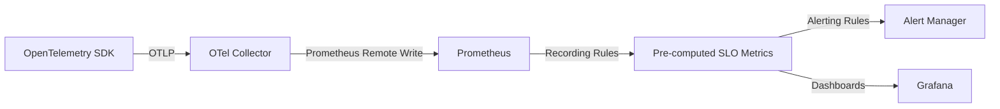

# How to Implement Service Level Objectives (SLOs) with OpenTelemetry and Prometheus Recording Rules

Author: [nawazdhandala](https://www.github.com/nawazdhandala)

Tags: OpenTelemetry, SLO, Prometheus, Recording Rules

Description: A practical guide to implementing SLOs using OpenTelemetry metrics pipelines and Prometheus recording rules for efficient querying.

Service Level Objectives define the target reliability for your service. An SLO states something like "99.9% of requests should succeed" or "95% of requests should complete within 200ms over a 30-day window." While SLIs give you the raw measurement, SLOs set the bar. This post walks through implementing SLOs using OpenTelemetry as the instrumentation layer and Prometheus recording rules for efficient, pre-computed SLO tracking.

## The Relationship Between SLIs and SLOs

An SLO is simply an SLI with a target attached. If your availability SLI is currently at 99.95%, and your SLO target is 99.9%, you are meeting your objective. The gap between the current SLI and the SLO target determines your error budget, which is covered in a separate post on calculating error budgets from OpenTelemetry data at https://oneuptime.com/blog/post/2026-02-06-error-budgets-opentelemetry/view.



## Defining SLOs in a Structured Format

Before writing any Prometheus rules, document your SLOs clearly. A well-defined SLO specification looks like this.

```yaml
# slo-definitions.yaml
# This file serves as the source of truth for all service SLOs
slos:
  - name: "payment-service-availability"
    description: "Payment API availability"
    sli_type: "availability"
    target: 0.999          # 99.9%
    window: "30d"          # 30-day rolling window
    metric_good: "http_server_request_total - http_server_request_errors_total"
    metric_total: "http_server_request_total"
    labels:
      service: "payment-service"

  - name: "payment-service-latency"
    description: "Payment API latency"
    sli_type: "latency"
    target: 0.95           # 95% of requests under threshold
    threshold_ms: 200
    window: "30d"
    metric_good: "http_server_request_duration_bucket{le='200'}"
    metric_total: "http_server_request_duration_count"
    labels:
      service: "payment-service"
```

## Prometheus Recording Rules for Availability SLOs

Recording rules pre-compute expensive queries so that dashboards and alerts do not need to run them on every evaluation. This is critical for SLOs because the underlying calculations involve rates over long time windows.

```yaml
# prometheus-rules/slo-availability.yaml
groups:
  - name: slo_availability_recording_rules
    # Evaluate every 30 seconds for near-real-time SLO tracking
    interval: 30s
    rules:
      # Short-window error rate (5m) - used for burn rate alerts
      - record: slo:http_error_rate:ratio_rate5m
        expr: |
          sum(rate(http_server_request_errors_total{service="payment-service"}[5m]))
          /
          sum(rate(http_server_request_total{service="payment-service"}[5m]))

      # Medium-window error rate (1h)
      - record: slo:http_error_rate:ratio_rate1h
        expr: |
          sum(rate(http_server_request_errors_total{service="payment-service"}[1h]))
          /
          sum(rate(http_server_request_total{service="payment-service"}[1h]))

      # Long-window error rate (30d) - the actual SLO compliance metric
      - record: slo:http_error_rate:ratio_rate30d
        expr: |
          sum(rate(http_server_request_errors_total{service="payment-service"}[30d]))
          /
          sum(rate(http_server_request_total{service="payment-service"}[30d]))

      # Current SLI value (availability = 1 - error rate)
      - record: slo:http_availability:ratio_rate30d
        expr: 1 - slo:http_error_rate:ratio_rate30d

      # Remaining error budget as a fraction (1.0 = full budget, 0.0 = exhausted)
      - record: slo:http_availability:error_budget_remaining
        expr: |
          1 - (
            slo:http_error_rate:ratio_rate30d
            /
            (1 - 0.999)
          )
```

## Prometheus Recording Rules for Latency SLOs

Latency SLOs work with histogram bucket data. The key metric is the ratio of requests that fell within the acceptable latency threshold.

```yaml
# prometheus-rules/slo-latency.yaml
groups:
  - name: slo_latency_recording_rules
    interval: 30s
    rules:
      # Fraction of requests under 200ms over 5 minutes
      - record: slo:http_latency_good:ratio_rate5m
        expr: |
          sum(rate(http_server_request_duration_bucket{service="payment-service", le="200"}[5m]))
          /
          sum(rate(http_server_request_duration_count{service="payment-service"}[5m]))

      # Fraction of requests under 200ms over 1 hour
      - record: slo:http_latency_good:ratio_rate1h
        expr: |
          sum(rate(http_server_request_duration_bucket{service="payment-service", le="200"}[1h]))
          /
          sum(rate(http_server_request_duration_count{service="payment-service"}[1h]))

      # Fraction of requests under 200ms over 30 days
      - record: slo:http_latency_good:ratio_rate30d
        expr: |
          sum(rate(http_server_request_duration_bucket{service="payment-service", le="200"}[30d]))
          /
          sum(rate(http_server_request_duration_count{service="payment-service"}[30d]))

      # Remaining error budget for latency SLO
      - record: slo:http_latency:error_budget_remaining
        expr: |
          1 - (
            (1 - slo:http_latency_good:ratio_rate30d)
            /
            (1 - 0.95)
          )
```

## OpenTelemetry Collector Configuration for Prometheus Integration

To connect OpenTelemetry metrics to Prometheus, configure the collector to use either the Prometheus exporter (pull model) or the Prometheus remote write exporter (push model).

```yaml
# otel-collector-config.yaml
receivers:
  otlp:
    protocols:
      grpc:
        endpoint: "0.0.0.0:4317"

processors:
  batch:
    timeout: 10s

exporters:
  # Option 1: Prometheus pull - collector exposes a /metrics endpoint
  prometheus:
    endpoint: "0.0.0.0:8889"
    resource_to_telemetry_conversion:
      enabled: true  # Converts OTel resource attributes to Prometheus labels

  # Option 2: Prometheus remote write - collector pushes to Prometheus
  prometheusremotewrite:
    endpoint: "http://prometheus:9090/api/v1/write"
    resource_to_telemetry_conversion:
      enabled: true

service:
  pipelines:
    metrics:
      receivers: [otlp]
      processors: [batch]
      exporters: [prometheus]
```

## Validating Your SLO Implementation

After deploying your recording rules, verify they are producing correct values. Run these queries in Prometheus to check.

```promql
# Should return a value between 0 and 1 (e.g., 0.9995 = 99.95% availability)
slo:http_availability:ratio_rate30d

# Should return a value between -inf and 1.0
# Positive means budget remaining, negative means budget exhausted
slo:http_availability:error_budget_remaining

# Check that the latency SLI is computing correctly
slo:http_latency_good:ratio_rate30d
```

## Naming Conventions for Recording Rules

Prometheus recording rules follow a naming convention that encodes the metric's meaning. The pattern used above is: `slo:<signal>_<metric>:<aggregation>_<window>`. This convention makes it easy to identify what each rule computes when browsing rules or building dashboards. Stick with a consistent naming scheme across all your services to avoid confusion as your SLO coverage grows.

## What Comes Next

With recording rules in place, you have efficient, queryable SLO data. The next steps are building multi-burn-rate alerts that fire based on how quickly you are consuming your error budget, and setting up dashboards that show SLO compliance at a glance. Both of these build directly on the recording rules defined here.
