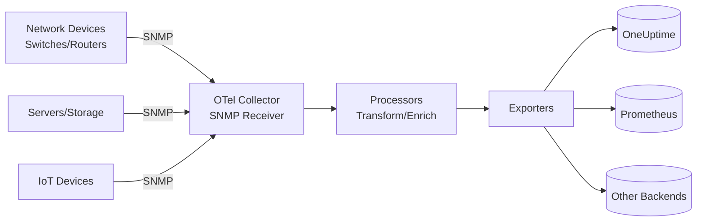

# How to Configure the SNMP Receiver in the OpenTelemetry Collector

Author: [nawazdhandala](https://www.github.com/nawazdhandala)

Tags: OpenTelemetry, Collector, SNMP, Network Monitoring, Observability, Metrics, Infrastructure

Description: Complete guide to configuring the SNMP receiver in OpenTelemetry Collector to monitor network devices and infrastructure with practical YAML examples and OID configuration.

---

Simple Network Management Protocol (SNMP) is the standard for monitoring network devices, servers, printers, and IoT equipment. Routers, switches, firewalls, UPS systems, and storage arrays all expose operational data through SNMP. The OpenTelemetry Collector's SNMP receiver provides standardized access to these metrics, enabling unified observability across network infrastructure and modern cloud applications.

This guide covers SNMP receiver configuration from basic device monitoring through production deployments with authentication, custom OID mappings, and integration with observability backends.

## Understanding the SNMP Receiver

The SNMP receiver polls network devices using SNMP protocol and collects metrics from Management Information Base (MIB) objects identified by Object Identifiers (OIDs). It supports SNMP v1, v2c, and v3 with various authentication and encryption options.

Key metrics collected include:

- Interface traffic and error rates
- CPU and memory utilization
- Temperature and fan speeds
- Power supply status
- Storage capacity and usage
- Network connection states
- Device uptime
- Custom vendor-specific metrics

The receiver translates SNMP data into OpenTelemetry metrics that flow through your Collector pipeline.

## SNMP Versions and Security

**SNMP v1/v2c**: Simple community string authentication
- Easy to configure
- No encryption
- Suitable for isolated networks only

**SNMP v3**: Enhanced security with authentication and encryption
- Username/password authentication
- Encrypted communications
- Required for production environments
- Supports multiple security levels

Choose v3 whenever possible for security. Use v2c only on isolated management networks.

## Data Flow Architecture

The following diagram shows how metrics flow from SNMP devices through the Collector:



The receiver polls devices at configured intervals, queries specified OIDs, and converts responses into metrics.

## Basic Configuration

Here's a minimal configuration to monitor a network switch using SNMP v2c:

```yaml
# receivers: Define how telemetry enters the Collector
receivers:
  # SNMP receiver polls network devices
  snmp:
    # How often to poll devices
    collection_interval: 60s

    # Devices to monitor
    endpoint: udp://192.168.1.1:161

    # SNMP version (1, 2c, or 3)
    version: 2c

    # Community string for v1/v2c
    community: public

    # Metrics to collect using OIDs
    metrics:
      # Interface traffic - incoming bytes
      - oid: 1.3.6.1.2.1.2.2.1.10
        name: if.in.octets
        unit: bytes
        gauge:
          value_type: int

      # Interface traffic - outgoing bytes
      - oid: 1.3.6.1.2.1.2.2.1.16
        name: if.out.octets
        unit: bytes
        gauge:
          value_type: int

      # System uptime
      - oid: 1.3.6.1.2.1.1.3.0
        name: system.uptime
        unit: seconds
        gauge:
          value_type: int

# exporters: Define where telemetry is sent
exporters:
  # Export to OneUptime using OTLP over HTTP
  otlphttp:
    endpoint: https://oneuptime.com/otlp
    headers:
      x-oneuptime-token: ${ONEUPTIME_TOKEN}

# service: Wire receivers and exporters into pipelines
service:
  pipelines:
    # Metrics pipeline for SNMP data
    metrics:
      receivers: [snmp]
      exporters: [otlphttp]
```

This basic setup polls a switch every 60 seconds using SNMP v2c, collects interface traffic and uptime, and exports to OneUptime.

## Production Configuration with SNMP v3

Production environments require secure SNMP v3 with authentication and encryption:

```yaml
receivers:
  # SNMP receiver with full production settings
  snmp:
    # Collection interval - balance freshness vs network load
    # 30-60s for critical devices
    # 120-300s for less critical devices
    collection_interval: 60s

    # Device endpoint
    # Format: udp://host:port or tcp://host:port
    endpoint: udp://core-switch-01.example.com:161

    # SNMP version 3 with security
    version: 3

    # SNMP v3 security configuration
    security_level: authPriv  # Options: noAuthNoPriv, authNoPriv, authPriv

    # Authentication username
    user: monitoring

    # Authentication protocol and passphrase
    auth_type: SHA  # Options: MD5, SHA, SHA224, SHA256, SHA384, SHA512
    auth_password: ${SNMP_AUTH_PASSWORD}

    # Privacy (encryption) protocol and passphrase
    privacy_type: AES  # Options: DES, AES, AES192, AES256, AES192C, AES256C
    privacy_password: ${SNMP_PRIVACY_PASSWORD}

    # Timeout for SNMP requests
    timeout: 10s

    # Number of retries on timeout
    retries: 3

    # Metrics to collect
    metrics:
      # System information
      - oid: 1.3.6.1.2.1.1.1.0
        name: system.description
        unit: none
        gauge:
          value_type: string

      - oid: 1.3.6.1.2.1.1.3.0
        name: system.uptime
        unit: hundredths_of_seconds
        gauge:
          value_type: int

      # CPU utilization
      - oid: 1.3.6.1.4.1.9.9.109.1.1.1.1.7.1
        name: device.cpu.utilization
        unit: percent
        gauge:
          value_type: int

      # Memory utilization
      - oid: 1.3.6.1.4.1.9.9.48.1.1.1.5.1
        name: device.memory.used
        unit: bytes
        gauge:
          value_type: int

      - oid: 1.3.6.1.4.1.9.9.48.1.1.1.6.1
        name: device.memory.free
        unit: bytes
        gauge:
          value_type: int

      # Interface metrics (table walk)
      - oid: 1.3.6.1.2.1.2.2.1.10
        name: if.in.octets
        unit: bytes
        gauge:
          value_type: int
        indexed_value_prefix: interface

      - oid: 1.3.6.1.2.1.2.2.1.16
        name: if.out.octets
        unit: bytes
        gauge:
          value_type: int
        indexed_value_prefix: interface

      - oid: 1.3.6.1.2.1.2.2.1.14
        name: if.in.errors
        unit: errors
        gauge:
          value_type: int
        indexed_value_prefix: interface

      - oid: 1.3.6.1.2.1.2.2.1.20
        name: if.out.errors
        unit: errors
        gauge:
          value_type: int
        indexed_value_prefix: interface

# processors: Transform and enrich metrics
processors:
  # Add resource attributes for context
  resource:
    attributes:
      - key: device.name
        value: core-switch-01
        action: upsert
      - key: device.type
        value: network-switch
        action: upsert
      - key: device.vendor
        value: cisco
        action: upsert
      - key: device.location
        value: datacenter-us-east-1a
        action: upsert
      - key: deployment.environment
        value: production
        action: upsert

  # Batch metrics to reduce network overhead
  batch:
    timeout: 10s
    send_batch_size: 512

  # Prevent collector from exhausting memory
  memory_limiter:
    check_interval: 5s
    limit_mib: 256

exporters:
  # Export to OneUptime with retry and queuing
  otlphttp:
    endpoint: https://oneuptime.com/otlp
    headers:
      x-oneuptime-token: ${ONEUPTIME_TOKEN}
    timeout: 30s

    # Retry configuration for reliability
    retry_on_failure:
      enabled: true
      initial_interval: 5s
      max_interval: 30s
      max_elapsed_time: 300s

    # Queue metrics during backend outages
    sending_queue:
      enabled: true
      num_consumers: 10
      queue_size: 1000

service:
  pipelines:
    metrics:
      receivers: [snmp]
      processors: [memory_limiter, resource, batch]
      exporters: [otlphttp]
```

This production configuration uses SNMP v3 with authentication and encryption, collects comprehensive device metrics, and includes reliable export with retry logic.

## Monitoring Multiple Devices

To monitor multiple network devices, define multiple receiver instances:

```yaml
receivers:
  # Core switch
  snmp/core-switch:
    endpoint: udp://192.168.1.1:161
    collection_interval: 60s
    version: 3
    security_level: authPriv
    user: monitoring
    auth_type: SHA
    auth_password: ${SNMP_AUTH_PASSWORD}
    privacy_type: AES
    privacy_password: ${SNMP_PRIVACY_PASSWORD}
    metrics:
      - oid: 1.3.6.1.2.1.2.2.1.10
        name: if.in.octets
        gauge:
          value_type: int
      - oid: 1.3.6.1.2.1.2.2.1.16
        name: if.out.octets
        gauge:
          value_type: int

  # Edge router
  snmp/edge-router:
    endpoint: udp://192.168.1.254:161
    collection_interval: 60s
    version: 3
    security_level: authPriv
    user: monitoring
    auth_type: SHA
    auth_password: ${SNMP_AUTH_PASSWORD}
    privacy_type: AES
    privacy_password: ${SNMP_PRIVACY_PASSWORD}
    metrics:
      - oid: 1.3.6.1.2.1.2.2.1.10
        name: if.in.octets
        gauge:
          value_type: int
      - oid: 1.3.6.1.2.1.2.2.1.16
        name: if.out.octets
        gauge:
          value_type: int

  # Storage array
  snmp/storage:
    endpoint: udp://storage.example.com:161
    collection_interval: 120s
    version: 3
    security_level: authPriv
    user: monitoring
    auth_type: SHA
    auth_password: ${SNMP_AUTH_PASSWORD}
    privacy_type: AES
    privacy_password: ${SNMP_PRIVACY_PASSWORD}
    metrics:
      - oid: 1.3.6.1.4.1.789.1.5.4.1.14
        name: storage.volume.used
        unit: bytes
        gauge:
          value_type: int
      - oid: 1.3.6.1.4.1.789.1.5.4.1.15
        name: storage.volume.available
        unit: bytes
        gauge:
          value_type: int

  # UPS system
  snmp/ups:
    endpoint: udp://ups.example.com:161
    collection_interval: 30s
    version: 2c
    community: public
    metrics:
      - oid: 1.3.6.1.2.1.33.1.2.4.0
        name: ups.battery.charge
        unit: percent
        gauge:
          value_type: int
      - oid: 1.3.6.1.2.1.33.1.4.1.0
        name: ups.output.voltage
        unit: volts
        gauge:
          value_type: int

processors:
  # Tag core switch
  resource/core-switch:
    attributes:
      - key: device.name
        value: core-switch-01
      - key: device.type
        value: switch

  # Tag edge router
  resource/edge-router:
    attributes:
      - key: device.name
        value: edge-router-01
      - key: device.type
        value: router

  # Tag storage
  resource/storage:
    attributes:
      - key: device.name
        value: storage-array-01
      - key: device.type
        value: storage

  # Tag UPS
  resource/ups:
    attributes:
      - key: device.name
        value: ups-01
      - key: device.type
        value: ups

  batch:
    timeout: 10s

exporters:
  otlphttp:
    endpoint: https://oneuptime.com/otlp
    headers:
      x-oneuptime-token: ${ONEUPTIME_TOKEN}

service:
  pipelines:
    # Separate pipelines for independent processing
    metrics/core-switch:
      receivers: [snmp/core-switch]
      processors: [resource/core-switch, batch]
      exporters: [otlphttp]

    metrics/edge-router:
      receivers: [snmp/edge-router]
      processors: [resource/edge-router, batch]
      exporters: [otlphttp]

    metrics/storage:
      receivers: [snmp/storage]
      processors: [resource/storage, batch]
      exporters: [otlphttp]

    metrics/ups:
      receivers: [snmp/ups]
      processors: [resource/ups, batch]
      exporters: [otlphttp]
```

This configuration monitors diverse devices with different collection intervals and security settings.

## Common OIDs Reference

Here are frequently used OIDs from standard MIBs:

**System Information (RFC 1213)**
- `1.3.6.1.2.1.1.1.0` - System description
- `1.3.6.1.2.1.1.3.0` - System uptime
- `1.3.6.1.2.1.1.5.0` - System name
- `1.3.6.1.2.1.1.6.0` - System location

**Interface Statistics (RFC 1213)**
- `1.3.6.1.2.1.2.2.1.10.X` - Inbound octets on interface X
- `1.3.6.1.2.1.2.2.1.16.X` - Outbound octets on interface X
- `1.3.6.1.2.1.2.2.1.14.X` - Inbound errors on interface X
- `1.3.6.1.2.1.2.2.1.20.X` - Outbound errors on interface X
- `1.3.6.1.2.1.2.2.1.13.X` - Inbound discards on interface X
- `1.3.6.1.2.1.2.2.1.19.X` - Outbound discards on interface X

**Host Resources (RFC 2790)**
- `1.3.6.1.2.1.25.3.3.1.2` - CPU load
- `1.3.6.1.2.1.25.2.3.1.6` - Memory used
- `1.3.6.1.2.1.25.2.3.1.5` - Storage used

**Cisco-Specific OIDs**
- `1.3.6.1.4.1.9.9.109.1.1.1.1.7` - CPU utilization (5 min avg)
- `1.3.6.1.4.1.9.9.48.1.1.1.5` - Memory used
- `1.3.6.1.4.1.9.9.48.1.1.1.6` - Memory free

**UPS OIDs (RFC 1628)**
- `1.3.6.1.2.1.33.1.2.4.0` - Battery charge remaining
- `1.3.6.1.2.1.33.1.2.2.0` - Battery status
- `1.3.6.1.2.1.33.1.4.1.0` - Output voltage
- `1.3.6.1.2.1.33.1.4.4.0` - Output frequency

Use MIB browsers or vendor documentation to find device-specific OIDs.

## Walking SNMP Tables

For devices with multiple interfaces or components, use table walks:

```yaml
receivers:
  snmp:
    endpoint: udp://switch.example.com:161
    version: 2c
    community: public
    collection_interval: 60s

    # Walk interface table
    metrics:
      # All interface metrics use table indexing
      - oid: 1.3.6.1.2.1.2.2.1.10
        name: if.in.octets
        indexed_value_prefix: interface
        gauge:
          value_type: int

      - oid: 1.3.6.1.2.1.2.2.1.16
        name: if.out.octets
        indexed_value_prefix: interface
        gauge:
          value_type: int

      # Get interface names for labeling
      - oid: 1.3.6.1.2.1.2.2.1.2
        name: if.name
        indexed_value_prefix: interface
        gauge:
          value_type: string
```

The `indexed_value_prefix` parameter creates separate metrics for each table row (e.g., interface.1, interface.2).

## Deployment Patterns

### Pattern 1: Centralized Network Monitoring Collector

Deploy one or more collectors dedicated to network device monitoring:

```yaml
# Network monitoring collector
receivers:
  snmp/switch-01:
    endpoint: udp://192.168.1.1:161
    # ... config
  snmp/switch-02:
    endpoint: udp://192.168.1.2:161
    # ... config
  # ... more devices
```

**Pros**: Centralized configuration, dedicated resources
**Cons**: Network dependency, potential bottleneck

### Pattern 2: Regional Collectors

Deploy collectors in each datacenter or region:

```yaml
# US-East collector
receivers:
  snmp/use1-switch-01:
    endpoint: udp://10.1.1.1:161
  snmp/use1-switch-02:
    endpoint: udp://10.1.1.2:161

# US-West collector
receivers:
  snmp/usw1-switch-01:
    endpoint: udp://10.2.1.1:161
```

**Pros**: Reduced latency, regional fault isolation
**Cons**: More infrastructure to manage

### Pattern 3: Kubernetes Deployment

Deploy collector in Kubernetes for cloud-native environments:

```yaml
apiVersion: v1
kind: ConfigMap
metadata:
  name: otel-collector-config
data:
  config.yaml: |
    receivers:
      snmp:
        endpoint: udp://network-device:161
        # ... config
    exporters:
      otlphttp:
        endpoint: https://oneuptime.com/otlp
    service:
      pipelines:
        metrics:
          receivers: [snmp]
          exporters: [otlphttp]
---
apiVersion: apps/v1
kind: Deployment
metadata:
  name: otel-network-monitoring
spec:
  replicas: 1
  selector:
    matchLabels:
      app: otel-collector
  template:
    metadata:
      labels:
        app: otel-collector
    spec:
      containers:
      - name: collector
        image: otel/opentelemetry-collector-contrib:latest
        args: ["--config=/etc/otel/config.yaml"]
        volumeMounts:
        - name: config
          mountPath: /etc/otel
      volumes:
      - name: config
        configMap:
          name: otel-collector-config
```

## Troubleshooting Common Issues

**Timeout Errors**

Increase timeout and retries:

```yaml
receivers:
  snmp:
    timeout: 30s
    retries: 5
```

Verify network connectivity:

```bash
# Test SNMP connectivity
snmpwalk -v2c -c public 192.168.1.1 1.3.6.1.2.1.1.1
```

**Authentication Failures (SNMP v3)**

Verify credentials on device:

```bash
# Cisco example
snmp-server group monitoring v3 auth
snmp-server user monitoring monitoring v3 auth sha AuthPass priv aes 128 PrivPass
```

Test with snmpwalk:

```bash
snmpwalk -v3 -l authPriv -u monitoring -a SHA -A AuthPass -x AES -X PrivPass 192.168.1.1 1.3.6.1.2.1.1.1
```

**No Data Returned**

Verify OID exists on device:

```bash
# Query specific OID
snmpget -v2c -c public 192.168.1.1 1.3.6.1.2.1.1.3.0
```

Check device SNMP configuration:

```bash
# Cisco: Verify SNMP is enabled
show snmp

# Linux: Verify snmpd is running
systemctl status snmpd
```

**Permission Denied**

Verify community string or user has read access:

```bash
# Cisco: Check SNMP access
show snmp community

# Linux: Check snmpd.conf
cat /etc/snmp/snmpd.conf
```

**High Cardinality**

Limit interface monitoring to active interfaces:

```yaml
processors:
  filter/metrics:
    metrics:
      exclude:
        match_type: regexp
        metric_names:
          - "if\\..*\\.interface\\.0"  # Exclude null interface
```

## Vendor-Specific Considerations

**Cisco Devices**

Enable SNMP v3:

```cisco
snmp-server group monitoring v3 auth
snmp-server user monitoring monitoring v3 auth sha AuthPassword priv aes 128 PrivPassword
snmp-server view all iso included
```

**Juniper Devices**

Configure SNMP v3:

```junos
set snmp v3 usm local-engine user monitoring authentication-sha authentication-password AuthPassword
set snmp v3 usm local-engine user monitoring privacy-aes128 privacy-password PrivPassword
```

**Linux Servers**

Configure net-snmp:

```bash
# /etc/snmp/snmpd.conf
rouser monitoring authpriv
createUser monitoring SHA "AuthPassword" AES "PrivPassword"
```

Restart snmpd:

```bash
systemctl restart snmpd
```

## Integration with OneUptime

Once metrics flow to OneUptime, you can:

1. **Create network dashboards** showing interface traffic, error rates, and device health
2. **Set up alerts** for high CPU usage, interface errors, or device outages
3. **Correlate network metrics with application performance** to identify network bottlenecks
4. **Track capacity trends** for network bandwidth planning
5. **Monitor environmental sensors** like temperature and power for proactive maintenance

OpenTelemetry integrates network infrastructure metrics with application traces and logs for comprehensive observability.

## Best Practices

**Use SNMP v3** in production:
```yaml
version: 3
security_level: authPriv
```

**Choose appropriate collection intervals**:
- 30-60s for critical devices
- 120-300s for less critical devices
- Avoid polling faster than device can respond

**Limit OID collection** to relevant metrics:
```yaml
metrics:
  # Only collect metrics you'll actually use
  - oid: 1.3.6.1.2.1.2.2.1.10  # Interface traffic
  - oid: 1.3.6.1.2.1.1.3.0     # Uptime
```

**Use resource attributes** for device context:
```yaml
processors:
  resource:
    attributes:
      - key: device.name
        value: core-switch-01
      - key: device.type
        value: switch
      - key: device.vendor
        value: cisco
```

**Protect credentials**:
```bash
export SNMP_AUTH_PASSWORD="secure-auth-password"
export SNMP_PRIVACY_PASSWORD="secure-privacy-password"
export ONEUPTIME_TOKEN="your-token"
```

**Monitor collector health**:
```yaml
service:
  telemetry:
    metrics:
      readers:
        - periodic:
            exporter:
              otlp:
                endpoint: https://oneuptime.com/otlp
```

**Document custom OIDs**:
```yaml
# Keep comments explaining vendor-specific OIDs
metrics:
  # Cisco CPU utilization (5-minute average)
  # OID from CISCO-PROCESS-MIB
  - oid: 1.3.6.1.4.1.9.9.109.1.1.1.1.7.1
    name: device.cpu.utilization
```

## Related Resources

For more on OpenTelemetry Collector:

- [OpenTelemetry Collector: What It Is, When You Need It, and When You Don't](https://oneuptime.com/blog/post/2025-09-18-what-is-opentelemetry-collector-and-why-use-one/view)
- [How to collect internal metrics from OpenTelemetry Collector](https://oneuptime.com/blog/post/2025-01-22-how-to-collect-opentelemetry-collector-internal-metrics/view)

For monitoring other infrastructure:
- [How to Configure the Elasticsearch Receiver in the OpenTelemetry Collector](https://oneuptime.com/blog/post/elasticsearch-receiver-opentelemetry-collector/view)
- [How to Configure the JMX Receiver in the OpenTelemetry Collector](https://oneuptime.com/blog/post/jmx-receiver-opentelemetry-collector/view)

## Final Thoughts

The SNMP receiver bridges traditional network infrastructure with modern observability practices. Monitor switches, routers, storage, UPS systems, and more using open standards and vendor-neutral backends.

OpenTelemetry unifies network metrics with application traces and logs, providing complete visibility from physical infrastructure through application layers. Configure once, integrate everywhere.

Need a backend for your OpenTelemetry metrics? OneUptime provides native OTLP support with powerful dashboards, alerting, and correlation capabilities without vendor lock-in.
