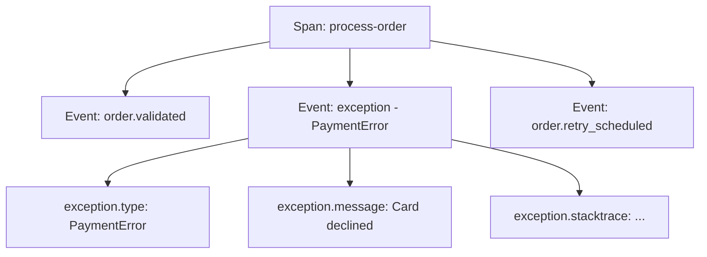

# How to Use Span Events to Record Structured Exceptions and Errors

Author: [nawazdhandala](https://www.github.com/nawazdhandala)

Tags: OpenTelemetry, Tracing, Span Events, Error Handling, Exceptions, Observability, Python, Node.js

Description: Learn how to use OpenTelemetry span events to record structured exception data, error context, and diagnostic information for faster debugging.

---

When a span records an error, you usually get a status code and maybe a brief message. That is enough to know something went wrong, but not enough to understand why. Was it a database timeout? A validation failure? A third-party API returning an unexpected response? Span events let you attach rich, structured error data directly to the span, giving you the full picture without leaving your tracing tool.

This guide covers how to use span events effectively for exception recording, including best practices for structuring the data and real-world patterns across Python and Node.js.

---

## What Are Span Events?

A span event is a timestamped annotation attached to a span. Think of it as a log entry that lives inside the trace rather than in a separate logging system. Each event has a name, a timestamp, and a set of key-value attributes.

The OpenTelemetry specification defines a special event type called an "exception event" with standardized attribute names. When you record an exception as a span event, tracing backends can display it with special formatting, including stack traces, exception types, and messages.



Events are part of the span data, so they get exported alongside the span and are visible in your tracing backend. Unlike logs, they are automatically correlated with the trace, the span, and all the span's attributes.

---

## Recording Exceptions with record_exception

The simplest way to attach an exception to a span is using the built-in `record_exception` method. This creates an exception event with the standard semantic convention attributes.

```python
from opentelemetry import trace

tracer = trace.get_tracer("order-service")

def process_order(order):
    with tracer.start_as_current_span("process-order") as span:
        try:
            validate_order(order)
            result = charge_payment(order)
            fulfill_order(order)
            return result

        except Exception as exc:
            # record_exception creates an event with:
            #   - name: "exception"
            #   - exception.type: the fully qualified class name
            #   - exception.message: str(exc)
            #   - exception.stacktrace: the formatted traceback
            span.record_exception(exc)

            # Set the span status to ERROR so it shows up
            # as a failed span in your tracing backend
            span.set_status(
                trace.Status(trace.StatusCode.ERROR, str(exc))
            )
            raise
```

The `record_exception` method does three things for you: it captures the exception type, the message, and the full stack trace. This follows the OpenTelemetry semantic conventions, so any compliant backend will know how to display it.

There is an important subtlety here. Recording an exception does not automatically set the span status to ERROR. You need to do that separately. The reason is that some exceptions are expected (like a "not found" result) and should not mark the span as failed.

---

## Adding Custom Attributes to Exception Events

The basic exception event is a good start, but you often need more context. What was the HTTP status code from the upstream service? What was the request payload that caused the validation error? You can pass additional attributes to `record_exception`.

```python
import traceback

def call_payment_gateway(order):
    with tracer.start_as_current_span("payment-gateway-call") as span:
        span.set_attribute("order.id", order.id)
        span.set_attribute("payment.amount", order.total)
        span.set_attribute("payment.provider", order.payment_provider)

        try:
            response = gateway_client.charge(
                amount=order.total,
                token=order.payment_token,
            )
            span.set_attribute("payment.transaction_id", response.txn_id)
            return response

        except GatewayTimeoutError as exc:
            # Add custom attributes alongside the standard exception fields
            # These provide the operational context needed for debugging
            span.record_exception(exc, attributes={
                "gateway.endpoint": gateway_client.endpoint,
                "gateway.timeout_ms": gateway_client.timeout_ms,
                "retry.attempt": order.retry_count,
                "order.id": order.id,
            })
            span.set_status(
                trace.Status(trace.StatusCode.ERROR, "Gateway timeout")
            )
            raise

        except PaymentDeclinedError as exc:
            # Payment declines are expected in normal operation
            # Record the event for visibility but do not set ERROR status
            span.record_exception(exc, attributes={
                "decline.code": exc.decline_code,
                "decline.reason": exc.reason,
                "payment.provider": order.payment_provider,
                "order.id": order.id,
            })
            # Note: no set_status(ERROR) here because this is
            # a business-level outcome, not a system error
            raise
```

The custom attributes make the difference between "something timed out" and "the Stripe API at payments.stripe.com timed out after 5000ms on the third retry for order #12345." That level of detail lets you diagnose the issue from the trace alone, without digging through logs.

---

## Using Span Events for Non-Exception Context

Span events are not limited to exceptions. You can use them to record any significant moment during a span's lifetime. This is particularly useful for long-running operations where you want to see what happened at each stage.

```python
def process_bulk_import(file_path):
    with tracer.start_as_current_span("bulk-import") as span:
        span.set_attribute("import.file", file_path)

        # Record the start of file parsing
        records = parse_csv(file_path)
        span.add_event("file.parsed", attributes={
            "record.count": len(records),
            "file.size_bytes": os.path.getsize(file_path),
        })

        # Validate records and track failures
        valid_records, invalid_records = validate_records(records)
        span.add_event("validation.complete", attributes={
            "valid.count": len(valid_records),
            "invalid.count": len(invalid_records),
        })

        # Record validation errors as individual events if there are few
        # For bulk errors, summarize instead of creating thousands of events
        if len(invalid_records) <= 10:
            for record in invalid_records:
                span.add_event("validation.error", attributes={
                    "record.line": record.line_number,
                    "error.field": record.failed_field,
                    "error.reason": record.error_message,
                })

        # Insert valid records in batches
        inserted = 0
        for batch in chunk_list(valid_records, batch_size=500):
            insert_batch(batch)
            inserted += len(batch)
            span.add_event("batch.inserted", attributes={
                "batch.size": len(batch),
                "total.inserted": inserted,
            })

        span.set_attribute("import.total_inserted", inserted)
```

This creates a timeline within the span that shows the progression of the import: parsing took 200ms, validation found 3 errors, and then 4 batches of 500 records were inserted. When something goes wrong at batch 3, you can see exactly where it happened and what the state was at that point.

---

## Node.js: Recording Exceptions and Events

The same patterns work in Node.js with the JavaScript OpenTelemetry SDK:

```javascript
const { trace, SpanStatusCode } = require("@opentelemetry/api");

const tracer = trace.getTracer("user-service");

async function createUser(userData) {
  // start a span for the entire operation
  return tracer.startActiveSpan("create-user", async (span) => {
    try {
      // Validate input and record it as an event
      const validation = validateUserData(userData);
      span.addEvent("input.validated", {
        "validation.fields_checked": validation.fieldsChecked,
        "validation.passed": validation.passed,
      });

      if (!validation.passed) {
        // Create a structured error event for validation failures
        // Include which fields failed and why
        span.addEvent("validation.failed", {
          "failed.fields": JSON.stringify(validation.errors),
          "user.email_domain": userData.email.split("@")[1],
        });
        span.setStatus({
          code: SpanStatusCode.ERROR,
          message: "Validation failed",
        });
        throw new ValidationError(validation.errors);
      }

      const user = await db.users.create(userData);
      span.addEvent("user.created", {
        "user.id": user.id,
      });

      await sendWelcomeEmail(user);
      span.addEvent("welcome_email.sent", {
        "email.provider": "sendgrid",
      });

      return user;

    } catch (error) {
      // recordException captures the error with stack trace
      span.recordException(error);
      span.setStatus({
        code: SpanStatusCode.ERROR,
        message: error.message,
      });
      throw error;

    } finally {
      span.end();
    }
  });
}
```

The `addEvent` and `recordException` methods work identically to their Python counterparts. The event names and attribute keys follow the same semantic conventions, so your tracing backend will handle them consistently regardless of which language generated the span.

---

## Best Practices for Span Events

**Keep event counts reasonable.** Each event adds to the span's payload size. For a typical request span, 5 to 15 events is a good range. If you find yourself adding hundreds of events, consider whether some of that data belongs in logs instead.

**Use consistent event naming.** Adopt a dot-separated naming convention like `payment.charged`, `validation.failed`, or `cache.miss`. This makes it easy to search for specific event types across your traces.

**Do not put sensitive data in event attributes.** Span events are exported to your tracing backend and may be visible to anyone with access to the traces. Avoid recording PII, passwords, API keys, or credit card numbers. If you need to reference sensitive data, use an opaque identifier.

**Use record_exception for actual exceptions, add_event for everything else.** The `record_exception` method follows the semantic conventions for exception events, which lets your backend render stack traces and error details with specialized formatting. For non-error milestones, `add_event` is the right choice.

**Always set span status separately from recording the exception.** Not every exception is a system error. A "user not found" exception in a lookup function is normal behavior. Record the exception for visibility, but only set `StatusCode.ERROR` when the span represents a genuine failure.

---

## Querying Exception Events

Once your spans carry structured exception events, you can query them in your tracing backend. In [OneUptime](https://oneuptime.com), you can filter traces by:

- Spans that contain exception events
- Specific exception types (e.g., `exception.type = "PaymentDeclinedError"`)
- Exception events with particular attributes (e.g., `decline.code = "insufficient_funds"`)

This turns your traces into a queryable error database. Instead of grepping through logs for error messages, you can search for structured error attributes and immediately see the full request context.

---

## Conclusion

Span events transform your traces from a simple timeline of service calls into a detailed narrative of what happened during each operation. By recording structured exceptions with custom attributes, you give your team the context they need to diagnose issues quickly. Combined with non-exception events for tracking milestones and state changes, you get a complete picture of every request flowing through your system. The key is to be intentional about what you record: enough detail to debug real problems, but not so much that the signal gets lost in the noise.
