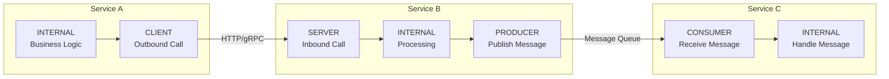

# How to Use Span Kind (Client, Server, Producer, Consumer, Internal) Correctly

Author: [nawazdhandala](https://www.github.com/nawazdhandala)

Tags: OpenTelemetry, Tracing, Span Kind, Distributed Tracing, Instrumentation, Observability

Description: Learn when and how to use each OpenTelemetry span kind correctly to produce accurate service maps, dependency graphs, and latency analysis in your traces.

---

Every span in OpenTelemetry has a `SpanKind` property that tells your observability backend what role the span plays in a distributed interaction. Getting span kinds right matters more than most people realize. Your backend uses span kinds to build service maps, calculate service-to-service latency, detect dependency chains, and identify the boundaries between synchronous and asynchronous communication. If you set span kinds incorrectly, your service maps become inaccurate, your latency calculations break down, and your dependency graphs show phantom connections.

There are five span kinds: `CLIENT`, `SERVER`, `PRODUCER`, `CONSUMER`, and `INTERNAL`. Each serves a specific purpose in the OpenTelemetry data model.

## The Five Span Kinds Explained

Before diving into code, let's understand what each kind represents in the context of a distributed system.



**SERVER** spans represent the handling of an incoming synchronous request. When your service receives an HTTP request or a gRPC call, the span that represents processing that request is a SERVER span. It is always the entry point for synchronous work within a service.

**CLIENT** spans represent the making of an outgoing synchronous request. When your service calls another service via HTTP or gRPC, the span wrapping that outbound call is a CLIENT span. CLIENT and SERVER spans form pairs across service boundaries.

**PRODUCER** spans represent the creation of a message that will be processed asynchronously. When your service publishes a message to Kafka, RabbitMQ, or SQS, the span for that publish operation is a PRODUCER span.

**CONSUMER** spans represent the processing of a message received from an asynchronous source. When your service pulls a message from a queue and processes it, the span for that work is a CONSUMER span. PRODUCER and CONSUMER spans form pairs across asynchronous boundaries.

**INTERNAL** spans represent operations that do not cross a service boundary. Database queries from within your service, local computations, cache lookups, and business logic are all INTERNAL spans. This is the default span kind if you do not specify one.

## CLIENT and SERVER: Synchronous Communication

The CLIENT/SERVER pair is the most common pattern. Every synchronous service-to-service call should produce a CLIENT span on the calling side and a SERVER span on the receiving side.

```python
from opentelemetry import trace
from opentelemetry.trace import SpanKind
import requests

tracer = trace.get_tracer("order-service")

# SERVER span: handling an incoming request
def handle_create_order(request):
    # Framework auto-instrumentation usually creates the SERVER span
    # If you need to create it manually:
    with tracer.start_as_current_span(
        "POST /api/orders",
        kind=SpanKind.SERVER,
        attributes={
            "http.method": "POST",
            "http.route": "/api/orders",
            "http.scheme": "https",
        },
    ) as span:
        order = validate_order(request.body)

        # CLIENT span: making an outbound request
        inventory = check_inventory(order)

        span.set_attribute("http.status_code", 201)
        return {"status": "created", "order_id": order.id}


def check_inventory(order):
    # CLIENT span wraps the outbound HTTP call
    with tracer.start_as_current_span(
        "GET /api/inventory/check",
        kind=SpanKind.CLIENT,
        attributes={
            "http.method": "GET",
            "http.url": "http://inventory-service/api/inventory/check",
            "peer.service": "inventory-service",
        },
    ) as span:
        # The trace context propagates automatically through headers
        response = requests.get(
            "http://inventory-service/api/inventory/check",
            params={"sku": order.sku, "quantity": order.quantity},
        )
        span.set_attribute("http.status_code", response.status_code)
        return response.json()
```

The critical detail is that CLIENT and SERVER spans have a parent-child relationship through context propagation. The CLIENT span's trace context gets injected into the outbound request headers. The receiving service extracts it and creates a SERVER span as a child of that CLIENT span. Your observability backend uses this pair to calculate the network latency between services (the time gap between the CLIENT span end and the SERVER span start, or more precisely, the difference in their durations).

Most HTTP and gRPC auto-instrumentation libraries handle CLIENT and SERVER span creation automatically. You should rely on auto-instrumentation for these whenever possible. Manual creation is needed only when you have custom transport mechanisms.

## PRODUCER and CONSUMER: Asynchronous Communication

When services communicate through message queues, the span kind changes to PRODUCER and CONSUMER. The key difference from CLIENT/SERVER is that the producer does not wait for the consumer to finish.

```python
from opentelemetry import trace, context
from opentelemetry.trace import SpanKind
from opentelemetry.propagate import inject, extract
import json

tracer = trace.get_tracer("order-service")

def publish_order_event(order):
    """Publish an order event to the message queue."""
    # PRODUCER span wraps the act of sending the message
    with tracer.start_as_current_span(
        "order.created publish",
        kind=SpanKind.PRODUCER,
        attributes={
            "messaging.system": "kafka",
            "messaging.destination.name": "order-events",
            "messaging.operation": "publish",
        },
    ) as span:
        # Build the message
        message = {
            "event_type": "order.created",
            "order_id": order.id,
            "customer_id": order.customer_id,
            "total": float(order.total),
        }

        # Inject trace context into message headers
        # This links the CONSUMER span back to this PRODUCER span
        headers = {}
        inject(headers)

        # Publish to Kafka
        kafka_producer.send(
            topic="order-events",
            value=json.dumps(message).encode(),
            headers=[(k, v.encode()) for k, v in headers.items()],
        )

        span.set_attribute("messaging.message.id", order.id)
```

On the consumer side:

```python
tracer = trace.get_tracer("fulfillment-service")

def process_messages():
    """Consume messages from the queue."""
    for message in kafka_consumer:
        # Extract trace context from message headers
        carrier = {k: v.decode() for k, v in message.headers}
        ctx = extract(carrier)

        # CONSUMER span represents processing the received message
        # Use the extracted context as the parent, creating a link
        # back to the PRODUCER span
        with tracer.start_as_current_span(
            "order.created process",
            context=ctx,
            kind=SpanKind.CONSUMER,
            attributes={
                "messaging.system": "kafka",
                "messaging.destination.name": "order-events",
                "messaging.operation": "process",
                "messaging.message.id": message.key,
            },
        ) as span:
            event = json.loads(message.value)
            handle_order_event(event)
```

There is a subtlety with CONSUMER spans and context linking. You have two options for how the CONSUMER span relates to the PRODUCER span:

**Option 1: Parent-child relationship.** The CONSUMER span becomes a child of the PRODUCER span (or the trace context it carries). This means the consumer's work appears as part of the same trace. Use this when the consumer's work is a direct continuation of the producer's workflow.

**Option 2: Span links.** The CONSUMER span starts a new trace but links back to the PRODUCER span. Use this when a single consumer message triggers independent work that should have its own trace.

```python
from opentelemetry.trace import Link

def process_message_with_link(message):
    # Extract the producer's context
    carrier = {k: v.decode() for k, v in message.headers}
    producer_ctx = extract(carrier)

    # Get the span context from the producer's trace
    producer_span_context = trace.get_current_span(producer_ctx).get_span_context()

    # Create a new trace with a link to the producer
    with tracer.start_as_current_span(
        "order.created process",
        kind=SpanKind.CONSUMER,
        links=[Link(producer_span_context)],
        attributes={
            "messaging.system": "kafka",
            "messaging.destination.name": "order-events",
            "messaging.operation": "process",
        },
    ) as span:
        handle_order_event(json.loads(message.value))
```

## INTERNAL: Everything Else

INTERNAL spans represent operations that stay within a single service. This is the default span kind, and most of your application-level spans should be INTERNAL.

```python
tracer = trace.get_tracer("order-service")

def validate_order(order_data):
    # INTERNAL span: no service boundary crossing
    # SpanKind.INTERNAL is the default, so you can omit it
    with tracer.start_as_current_span("validate_order") as span:
        # Business logic validation
        if order_data.total <= 0:
            span.set_status(trace.StatusCode.ERROR, "Invalid order total")
            raise ValueError("Order total must be positive")

        if not order_data.items:
            span.set_status(trace.StatusCode.ERROR, "Empty order")
            raise ValueError("Order must contain at least one item")

        span.set_attribute("order.item_count", len(order_data.items))
        return order_data


def calculate_shipping(order):
    # Another INTERNAL span for local computation
    with tracer.start_as_current_span(
        "calculate_shipping",
        kind=SpanKind.INTERNAL,  # Explicit but not required
    ) as span:
        weight = sum(item.weight for item in order.items)
        cost = calculate_cost(weight, order.destination)

        span.set_attribute("shipping.weight_kg", weight)
        span.set_attribute("shipping.cost", float(cost))

        return cost
```

Database queries are a common source of confusion. When your service queries its own database, the span should be CLIENT kind because the database is a separate service that receives the query.

```python
# Database queries are CLIENT spans because the database is a separate service
with tracer.start_as_current_span(
    "SELECT orders",
    kind=SpanKind.CLIENT,
    attributes={
        "db.system": "postgresql",
        "db.name": "orders_db",
        "db.operation": "SELECT",
        "db.statement": "SELECT * FROM orders WHERE customer_id = ?",
    },
) as span:
    results = db.execute("SELECT * FROM orders WHERE customer_id = ?", [customer_id])
```

Auto-instrumentation libraries for database drivers (like `opentelemetry-instrumentation-psycopg2`) handle this correctly, creating CLIENT spans for every query. If you manually instrument database calls, make sure to use CLIENT kind.

## How Backends Use Span Kinds

Understanding why span kinds matter requires knowing how backends interpret them:

**Service maps.** Your backend builds service dependency graphs by looking for CLIENT/SERVER and PRODUCER/CONSUMER pairs. A CLIENT span from Service A matched with a SERVER span in Service B creates an edge in the service map. Wrong span kinds produce incorrect service maps.

**Latency calculation.** The time between a CLIENT span starting and its corresponding SERVER span starting approximates network latency. If you mark an INTERNAL span as CLIENT, the latency calculation includes processing time and becomes meaningless.

**Throughput metrics.** Backends often count SERVER spans to determine service throughput (requests per second). If your service has INTERNAL spans incorrectly marked as SERVER, your throughput numbers will be inflated.

**Trace visualization.** Many trace viewers use span kinds to determine rendering. SERVER spans might be shown as the root of a service's work. CLIENT spans might be shown with arrows pointing to other services. PRODUCER/CONSUMER spans might have special styling for async boundaries.

## Common Mistakes and How to Fix Them

**Mistake: Using INTERNAL for outbound HTTP calls.**

```python
# Wrong: this creates an orphaned call with no service map edge
with tracer.start_as_current_span("call_payment_service") as span:
    response = requests.post("http://payment-service/charge", json=data)

# Correct: CLIENT kind tells the backend about the service dependency
with tracer.start_as_current_span(
    "POST /charge",
    kind=SpanKind.CLIENT,
) as span:
    response = requests.post("http://payment-service/charge", json=data)
```

**Mistake: Using SERVER for cron jobs or background workers.**

```python
# Wrong: there is no incoming request, so SERVER is misleading
with tracer.start_as_current_span(
    "daily_report_generation",
    kind=SpanKind.SERVER,
) as span:
    generate_report()

# Correct: use INTERNAL for self-initiated work
with tracer.start_as_current_span(
    "daily_report_generation",
    kind=SpanKind.INTERNAL,
) as span:
    generate_report()
```

Unless the cron job is triggered by a message from a queue (in which case use CONSUMER) or by an HTTP webhook (in which case SERVER is correct), background work should be INTERNAL.

**Mistake: Using CLIENT for publishing messages.**

```python
# Wrong: CLIENT implies synchronous request/response
with tracer.start_as_current_span(
    "publish_notification",
    kind=SpanKind.CLIENT,
) as span:
    kafka_producer.send("notifications", message)

# Correct: PRODUCER indicates fire-and-forget messaging
with tracer.start_as_current_span(
    "publish_notification",
    kind=SpanKind.PRODUCER,
) as span:
    kafka_producer.send("notifications", message)
```

The distinction matters because CLIENT/SERVER pairs imply synchronous latency, while PRODUCER/CONSUMER pairs represent decoupled, asynchronous interactions.

## A Complete Example

Here is a realistic trace showing all five span kinds working together:

```python
tracer = trace.get_tracer("order-service")

# SERVER: handling the incoming API request
def handle_api_request(request):
    with tracer.start_as_current_span(
        "POST /api/orders",
        kind=SpanKind.SERVER,
    ) as server_span:

        # INTERNAL: business logic validation
        with tracer.start_as_current_span("validate_order") as validate_span:
            order = validate(request.body)
            validate_span.set_attribute("order.item_count", len(order.items))

        # CLIENT: synchronous call to payment service
        with tracer.start_as_current_span(
            "POST /api/payments/charge",
            kind=SpanKind.CLIENT,
        ) as client_span:
            payment = requests.post(
                "http://payment-service/api/payments/charge",
                json={"amount": order.total},
            )
            client_span.set_attribute("http.status_code", payment.status_code)

        # INTERNAL: save to database (auto-instrumented as CLIENT by DB library)
        save_order(order)

        # PRODUCER: publish event for async processing
        with tracer.start_as_current_span(
            "order.created publish",
            kind=SpanKind.PRODUCER,
            attributes={"messaging.system": "kafka"},
        ) as producer_span:
            publish_event("order-events", {"order_id": order.id})

        server_span.set_attribute("http.status_code", 201)
        return {"order_id": order.id}
```

The resulting trace structure looks like this:

```
[SERVER] POST /api/orders (250ms)
  [INTERNAL] validate_order (5ms)
  [CLIENT] POST /api/payments/charge (180ms)
    [SERVER] charge_payment (175ms)  -- in payment-service
  [CLIENT] INSERT INTO orders (12ms)  -- auto-instrumented DB call
  [PRODUCER] order.created publish (8ms)
    ... later, in fulfillment-service ...
    [CONSUMER] order.created process (95ms)
      [INTERNAL] allocate_inventory (40ms)
      [CLIENT] POST /api/shipping/schedule (50ms)
```

Each span kind communicates a specific semantic meaning that your backend uses to build an accurate picture of your distributed system.

## Quick Reference

| Span Kind | When to Use | Examples |
|-----------|------------|----------|
| SERVER | Handling an incoming synchronous request | HTTP handler, gRPC server method |
| CLIENT | Making an outgoing synchronous request | HTTP client call, gRPC stub call, DB query |
| PRODUCER | Publishing a message for async processing | Kafka publish, SQS send, RabbitMQ publish |
| CONSUMER | Processing a received async message | Kafka poll handler, SQS message processor |
| INTERNAL | Local operations within a service | Validation, computation, cache lookup |

## Conclusion

Span kinds are not cosmetic metadata. They carry semantic meaning that your observability backend relies on for service maps, latency analysis, and dependency detection. Use SERVER for incoming requests, CLIENT for outgoing requests, PRODUCER for publishing messages, CONSUMER for processing messages, and INTERNAL for everything that stays within your service. When in doubt, ask yourself: "Does this operation cross a service boundary?" If yes, determine whether it is synchronous (CLIENT/SERVER) or asynchronous (PRODUCER/CONSUMER). If no, it is INTERNAL. Getting this right from the start saves you from debugging phantom dependencies and incorrect latency calculations later.
