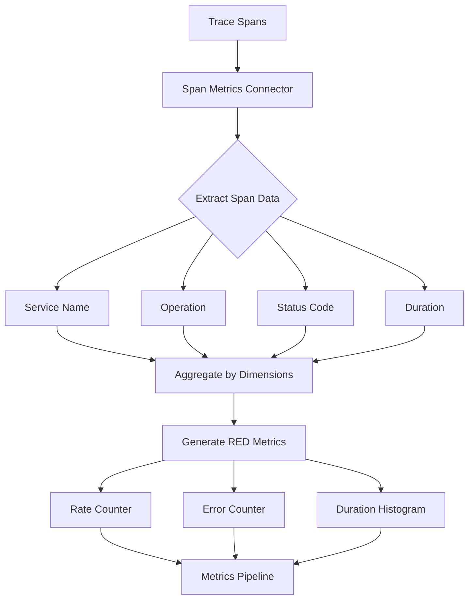

# How to Configure the Span Metrics Connector for RED Metrics

Author: [nawazdhandala](https://www.github.com/nawazdhandala)

Tags: OpenTelemetry, Collector, Connectors, Span Metrics, RED Metrics, SRE, Observability

Description: Learn how to configure the Span Metrics Connector in OpenTelemetry Collector to automatically generate Rate, Error, and Duration (RED) metrics from distributed traces for effective SRE monitoring.

The Span Metrics Connector in the OpenTelemetry Collector automatically generates Rate, Error, and Duration (RED) metrics from trace spans. These metrics are fundamental to Site Reliability Engineering practices, providing immediate visibility into service health without requiring separate metric instrumentation.

## Understanding RED Metrics

RED metrics are a standard set of service-level metrics that capture the essential characteristics of service behavior:

- **Rate**: The number of requests per second a service handles
- **Error**: The number of failed requests per second
- **Duration**: The time taken to serve requests (usually as percentiles)

Tom Wilkie popularized RED metrics as a focused alternative to the more comprehensive USE (Utilization, Saturation, Errors) metrics. RED metrics are particularly well-suited for request-driven services like web APIs, microservices, and backend services.

## Why Generate Metrics from Traces

Generating RED metrics from traces offers several advantages:

- **Single instrumentation**: One SDK instrumentation provides both traces and metrics
- **Perfect correlation**: Metrics and traces share the same context and timing
- **Reduced overhead**: No need for separate metric collection infrastructure
- **Automatic coverage**: Every traced operation automatically generates metrics
- **Consistent labeling**: Metrics inherit dimensions from trace attributes

## How the Span Metrics Connector Works

The connector processes incoming spans and aggregates them into metrics:



The connector generates three primary metrics:
- `calls_total`: Total number of spans (Rate)
- `calls_total` with error status: Failed spans (Error)
- `duration_milliseconds`: Span duration histogram (Duration)

## Basic Configuration

Here's a minimal configuration to generate RED metrics from traces:

```yaml
receivers:
  otlp:
    protocols:
      grpc:
        endpoint: 0.0.0.0:4317

processors:
  batch:
    timeout: 10s

exporters:
  otlp/traces:
    endpoint: traces-backend:4317

  otlp/metrics:
    endpoint: metrics-backend:4317

connectors:
  spanmetrics:
    # Histogram buckets for duration metrics
    latency_histogram_buckets: [2ms, 4ms, 6ms, 8ms, 10ms, 50ms, 100ms, 200ms, 400ms, 800ms, 1s, 1400ms, 2s, 5s, 10s, 15s]

    # Dimensions to include in metrics
    dimensions:
      - name: http.method
      - name: http.status_code

service:
  pipelines:
    # Traces pipeline feeds the span metrics connector
    traces:
      receivers: [otlp]
      processors: [batch]
      exporters: [spanmetrics, otlp/traces]

    # Metrics pipeline receives generated RED metrics
    metrics:
      receivers: [spanmetrics]
      processors: [batch]
      exporters: [otlp/metrics]
```

This generates metrics labeled by service name, span name, HTTP method, and HTTP status code.

## Configuring Latency Buckets

Latency histogram buckets should align with your service level objectives (SLOs):

```yaml
connectors:
  spanmetrics:
    # Fine-grained buckets for low-latency APIs
    latency_histogram_buckets: [
      1ms, 2ms, 5ms, 10ms, 20ms, 50ms, 100ms,
      200ms, 500ms, 1s, 2s, 5s
    ]

    dimensions:
      - name: http.method
      - name: http.status_code
      - name: service.name

receivers:
  otlp:
    protocols:
      grpc:
        endpoint: 0.0.0.0:4317

processors:
  batch:
    timeout: 10s

exporters:
  otlp/traces:
    endpoint: traces-backend:4317
  otlp/metrics:
    endpoint: metrics-backend:4317

service:
  pipelines:
    traces:
      receivers: [otlp]
      processors: [batch]
      exporters: [spanmetrics, otlp/traces]

    metrics:
      receivers: [spanmetrics]
      processors: [batch]
      exporters: [otlp/metrics]
```

For example, if your SLO is 95% of requests under 100ms, include buckets around that threshold (50ms, 75ms, 100ms, 150ms) for accurate percentile calculation.

## Selecting Dimensions

Dimensions determine how metrics are labeled and aggregated. Choose dimensions that provide actionable insights:

```yaml
connectors:
  spanmetrics:
    latency_histogram_buckets: [10ms, 50ms, 100ms, 250ms, 500ms, 1s, 2s, 5s]

    # Rich dimensions for detailed analysis
    dimensions:
      # HTTP-specific attributes
      - name: http.method
      - name: http.status_code
      - name: http.route

      # Service attributes
      - name: service.name
      - name: service.namespace
      - name: service.version

      # Deployment attributes
      - name: deployment.environment
      - name: k8s.cluster.name
      - name: k8s.namespace.name

      # Infrastructure attributes
      - name: cloud.provider
      - name: cloud.region
      - name: host.name

receivers:
  otlp:
    protocols:
      grpc:
        endpoint: 0.0.0.0:4317

processors:
  batch:
    timeout: 10s

exporters:
  otlp/traces:
    endpoint: traces-backend:4317
  otlp/metrics:
    endpoint: metrics-backend:4317

service:
  pipelines:
    traces:
      receivers: [otlp]
      processors: [batch]
      exporters: [spanmetrics, otlp/traces]

    metrics:
      receivers: [spanmetrics]
      processors: [batch]
      exporters: [otlp/metrics]
```

Be cautious with dimension cardinality. Each unique combination of dimension values creates a separate time series, which can lead to storage and performance issues.

## Filtering Spans for Metrics

Generate metrics only for specific span types to reduce cardinality and focus on important operations:

```yaml
processors:
  # Filter to only server spans (entry points)
  filter/server-spans:
    traces:
      span:
        - 'attributes["span.kind"] == "server"'

  # Additional filter for specific services
  filter/critical-services:
    traces:
      span:
        - 'resource.attributes["service.namespace"] == "production"'
        - 'resource.attributes["service.importance"] == "critical"'

connectors:
  spanmetrics:
    latency_histogram_buckets: [10ms, 50ms, 100ms, 250ms, 500ms, 1s, 2s, 5s]

    dimensions:
      - name: http.method
      - name: http.status_code
      - name: service.name

receivers:
  otlp:
    protocols:
      grpc:
        endpoint: 0.0.0.0:4317

processors:
  batch:
    timeout: 10s

exporters:
  otlp/traces:
    endpoint: traces-backend:4317
  otlp/metrics:
    endpoint: metrics-backend:4317

service:
  pipelines:
    # All traces go to storage
    traces/all:
      receivers: [otlp]
      processors: [batch]
      exporters: [otlp/traces]

    # Only filtered traces generate metrics
    traces/metrics:
      receivers: [otlp]
      processors: [filter/server-spans, filter/critical-services, batch]
      exporters: [spanmetrics]

    metrics:
      receivers: [spanmetrics]
      processors: [batch]
      exporters: [otlp/metrics]
```

This approach stores all traces while generating metrics only for critical server-side operations.

## Custom Dimension Mapping

Map span attributes to custom dimension names for cleaner metric labels:

```yaml
connectors:
  spanmetrics:
    latency_histogram_buckets: [10ms, 50ms, 100ms, 250ms, 500ms, 1s, 2s, 5s]

    dimensions:
      # Standard dimensions
      - name: http.method
      - name: http.status_code

      # Custom dimension with default value
      - name: environment
        default: "unknown"

      # Map span attribute to custom dimension name
      - name: endpoint
        # This would need attribute transformation in processors

    # Exclude specific dimensions even if present
    dimensions_cache_size: 1000

    # Metric namespace
    namespace: span.metrics

receivers:
  otlp:
    protocols:
      grpc:
        endpoint: 0.0.0.0:4317

processors:
  # Transform attributes to match dimension names
  transform:
    trace_statements:
      - context: span
        statements:
          # Create environment dimension from deployment.environment
          - set(attributes["environment"], resource.attributes["deployment.environment"])

          # Create endpoint dimension from http.route
          - set(attributes["endpoint"], attributes["http.route"]) where attributes["http.route"] != nil

          # Normalize status codes into classes
          - set(attributes["http.status_class"], Concat([Substring(attributes["http.status_code"], 0, 1), "xx"])) where attributes["http.status_code"] != nil

  batch:
    timeout: 10s

exporters:
  otlp/traces:
    endpoint: traces-backend:4317
  otlp/metrics:
    endpoint: metrics-backend:4317

service:
  pipelines:
    traces:
      receivers: [otlp]
      processors: [transform, batch]
      exporters: [spanmetrics, otlp/traces]

    metrics:
      receivers: [spanmetrics]
      processors: [batch]
      exporters: [otlp/metrics]
```

## Aggregating Multiple Span Types

Generate different metrics for different span kinds (server, client, internal):

```yaml
connectors:
  # Server-side RED metrics
  spanmetrics/server:
    latency_histogram_buckets: [10ms, 50ms, 100ms, 250ms, 500ms, 1s, 2s, 5s]
    dimensions:
      - name: http.method
      - name: http.status_code
      - name: http.route
      - name: service.name
    namespace: server

  # Client-side RED metrics (outgoing calls)
  spanmetrics/client:
    latency_histogram_buckets: [10ms, 50ms, 100ms, 250ms, 500ms, 1s, 2s, 5s]
    dimensions:
      - name: http.method
      - name: http.status_code
      - name: peer.service
      - name: service.name
    namespace: client

  # Database operation metrics
  spanmetrics/database:
    latency_histogram_buckets: [1ms, 5ms, 10ms, 25ms, 50ms, 100ms, 250ms, 500ms, 1s]
    dimensions:
      - name: db.system
      - name: db.operation
      - name: db.name
      - name: service.name
    namespace: database

processors:
  # Route spans by kind
  filter/server:
    traces:
      span:
        - 'attributes["span.kind"] == "server"'

  filter/client:
    traces:
      span:
        - 'attributes["span.kind"] == "client"'

  filter/database:
    traces:
      span:
        - 'attributes["db.system"] != nil'

  batch:
    timeout: 10s

receivers:
  otlp:
    protocols:
      grpc:
        endpoint: 0.0.0.0:4317

exporters:
  otlp/traces:
    endpoint: traces-backend:4317
  otlp/metrics:
    endpoint: metrics-backend:4317

service:
  pipelines:
    # All traces to storage
    traces:
      receivers: [otlp]
      processors: [batch]
      exporters: [otlp/traces]

    # Server spans to server metrics
    traces/server:
      receivers: [otlp]
      processors: [filter/server, batch]
      exporters: [spanmetrics/server]

    # Client spans to client metrics
    traces/client:
      receivers: [otlp]
      processors: [filter/client, batch]
      exporters: [spanmetrics/client]

    # Database spans to database metrics
    traces/database:
      receivers: [otlp]
      processors: [filter/database, batch]
      exporters: [spanmetrics/database]

    # Collect all generated metrics
    metrics:
      receivers: [spanmetrics/server, spanmetrics/client, spanmetrics/database]
      processors: [batch]
      exporters: [otlp/metrics]
```

This configuration generates specialized RED metrics for different operation types, each with appropriate dimensions and latency buckets.

## Exemplars Support

Link metrics to traces using exemplars for deep dive analysis:

```yaml
connectors:
  spanmetrics:
    latency_histogram_buckets: [10ms, 50ms, 100ms, 250ms, 500ms, 1s, 2s, 5s]

    dimensions:
      - name: http.method
      - name: http.status_code
      - name: service.name

    # Enable exemplars to link metrics to traces
    exemplars:
      enabled: true
      # Maximum number of exemplars per histogram bucket
      max_per_data_point: 4

receivers:
  otlp:
    protocols:
      grpc:
        endpoint: 0.0.0.0:4317

processors:
  batch:
    timeout: 10s

exporters:
  otlp/traces:
    endpoint: traces-backend:4317

  # Metrics backend must support exemplars (e.g., Prometheus, Mimir)
  otlp/metrics:
    endpoint: metrics-backend:4317

  prometheus:
    endpoint: 0.0.0.0:9090
    # Prometheus supports exemplars natively

service:
  pipelines:
    traces:
      receivers: [otlp]
      processors: [batch]
      exporters: [spanmetrics, otlp/traces]

    metrics:
      receivers: [spanmetrics]
      processors: [batch]
      exporters: [otlp/metrics, prometheus]
```

Exemplars attach trace IDs to metric data points, allowing you to jump from a metric anomaly directly to example traces.

## Production Configuration

Here's a comprehensive production-ready configuration for RED metrics:

```yaml
receivers:
  otlp:
    protocols:
      grpc:
        endpoint: 0.0.0.0:4317
        max_recv_msg_size_mib: 16
      http:
        endpoint: 0.0.0.0:4318

processors:
  memory_limiter:
    check_interval: 1s
    limit_mib: 2048
    spike_limit_mib: 512

  batch:
    timeout: 10s
    send_batch_size: 1024
    send_batch_max_size: 2048

  resource/enrich:
    attributes:
      - key: deployment.environment
        value: ${ENVIRONMENT}
        action: upsert
      - key: k8s.cluster.name
        value: ${K8S_CLUSTER}
        action: upsert

  # Normalize attributes for consistent metrics
  transform/normalize:
    trace_statements:
      - context: span
        statements:
          # Normalize HTTP status codes into classes for lower cardinality
          - set(attributes["http.status_class"], Concat([Substring(attributes["http.status_code"], 0, 1), "xx"])) where attributes["http.status_code"] != nil

          # Create operation dimension from span name
          - set(attributes["operation"], name)

          # Limit http.route cardinality by removing IDs
          - replace_pattern(attributes["http.route"], "/[0-9]+", "/{id}") where attributes["http.route"] != nil
          - replace_pattern(attributes["http.route"], "/[a-f0-9-]{36}", "/{uuid}") where attributes["http.route"] != nil

  # Filter to server spans only
  filter/server:
    traces:
      span:
        - 'attributes["span.kind"] == "server"'

connectors:
  spanmetrics:
    # Buckets aligned with SLOs
    latency_histogram_buckets: [
      10ms, 25ms, 50ms, 75ms, 100ms,
      200ms, 300ms, 500ms, 750ms, 1s,
      2s, 3s, 5s, 10s
    ]

    # Carefully selected dimensions to balance detail and cardinality
    dimensions:
      # Request characteristics
      - name: http.method
      - name: http.status_class
      - name: http.route

      # Service identification
      - name: service.name
      - name: service.namespace

      # Deployment context
      - name: deployment.environment
      - name: k8s.cluster.name

    # Enable exemplars for trace correlation
    exemplars:
      enabled: true
      max_per_data_point: 4

    # Metric namespace
    namespace: service

    # Cache size for dimension combinations
    dimensions_cache_size: 10000

exporters:
  otlp/traces:
    endpoint: ${TRACES_BACKEND}
    timeout: 10s
    compression: gzip
    retry_on_failure:
      enabled: true
      max_elapsed_time: 300s

  otlp/metrics:
    endpoint: ${METRICS_BACKEND}
    timeout: 10s
    compression: gzip
    retry_on_failure:
      enabled: true
      max_elapsed_time: 300s

  prometheus:
    endpoint: 0.0.0.0:9090
    namespace: otel

service:
  telemetry:
    logs:
      level: ${LOG_LEVEL:-info}
      encoding: json

    metrics:
      level: detailed
      address: 0.0.0.0:8888

  pipelines:
    # All traces to storage
    traces/storage:
      receivers: [otlp]
      processors:
        - memory_limiter
        - resource/enrich
        - batch
      exporters: [otlp/traces]

    # Server spans to RED metrics
    traces/metrics:
      receivers: [otlp]
      processors:
        - memory_limiter
        - resource/enrich
        - transform/normalize
        - filter/server
        - batch
      exporters: [spanmetrics]

    # Generated RED metrics
    metrics:
      receivers: [spanmetrics]
      processors: [batch]
      exporters: [otlp/metrics, prometheus]
```

## Using RED Metrics for Alerting

RED metrics are perfect for SLO-based alerting. Here are example Prometheus queries:

```promql
# Error rate exceeding 1%
sum(rate(service_calls_total{status_code=~"5.."}[5m]))
/
sum(rate(service_calls_total[5m]))
> 0.01

# P95 latency exceeding 500ms
histogram_quantile(0.95,
  sum(rate(service_duration_milliseconds_bucket[5m])) by (le, service_name)
)
> 500

# Request rate drop indicating service unavailability
sum(rate(service_calls_total[5m])) by (service_name)
< 10

# High error rate on specific endpoint
sum(rate(service_calls_total{http_route="/api/payment", status_code=~"5.."}[5m]))
/
sum(rate(service_calls_total{http_route="/api/payment"}[5m]))
> 0.001
```

## Combining with Service Graph

Use Span Metrics alongside the Service Graph Connector for comprehensive observability:

```yaml
connectors:
  # RED metrics per service
  spanmetrics:
    latency_histogram_buckets: [10ms, 50ms, 100ms, 250ms, 500ms, 1s, 2s, 5s]
    dimensions:
      - name: http.method
      - name: http.status_code
      - name: service.name
    namespace: service

  # Service dependency topology
  servicegraph:
    latency_histogram_buckets: [10ms, 50ms, 100ms, 250ms, 500ms, 1s, 2s, 5s]
    dimensions:
      - service.namespace
    store:
      ttl: 2s
      max_items: 10000

receivers:
  otlp:
    protocols:
      grpc:
        endpoint: 0.0.0.0:4317

processors:
  batch:
    timeout: 10s

exporters:
  otlp/traces:
    endpoint: traces-backend:4317
  otlp/metrics:
    endpoint: metrics-backend:4317

service:
  pipelines:
    traces:
      receivers: [otlp]
      processors: [batch]
      # Generate both RED metrics and service graph
      exporters: [spanmetrics, servicegraph, otlp/traces]

    metrics/red:
      receivers: [spanmetrics]
      processors: [batch]
      exporters: [otlp/metrics]

    metrics/servicegraph:
      receivers: [servicegraph]
      processors: [batch]
      exporters: [otlp/metrics]
```

Learn more about service topology at https://oneuptime.com/blog/post/2026-02-06-service-graph-connector-opentelemetry-collector/view.

## Monitoring Span Metrics Performance

Track connector metrics to ensure healthy operation:

```yaml
service:
  telemetry:
    metrics:
      level: detailed
      address: 0.0.0.0:8888

  pipelines:
    traces:
      receivers: [otlp]
      processors: [batch]
      exporters: [spanmetrics, otlp/traces]

    metrics:
      receivers: [spanmetrics]
      processors: [batch]
      exporters: [otlp/metrics]
```

Key metrics to monitor:
- `otelcol_connector_accepted_spans`: Spans processed for metrics generation
- `otelcol_connector_refused_spans`: Spans rejected (may indicate overload)
- `otelcol_processor_batch_batch_send_size`: Metric batch sizes
- Monitor dimensions cardinality through your metrics backend

## Best Practices

1. **Align Buckets with SLOs**: Configure histogram buckets around your service level objectives for accurate percentile calculations.

2. **Control Cardinality**: Limit dimensions to essential attributes. High cardinality can overwhelm storage and query systems.

3. **Normalize High-Cardinality Attributes**: Replace IDs, UUIDs, and other unique values with placeholders to reduce cardinality.

4. **Filter Spans Strategically**: Generate metrics only for meaningful operations, typically server-side spans.

5. **Use Exemplars**: Enable exemplars to link metrics to traces for faster troubleshooting.

6. **Monitor Cardinality**: Regularly review unique dimension combinations to prevent cardinality explosions.

7. **Namespace Your Metrics**: Use metric namespaces to organize RED metrics alongside other metrics.

8. **Test Cardinality Impact**: Test with production-like traffic to understand cardinality before full deployment.

## Conclusion

The Span Metrics Connector automatically generates RED metrics from distributed traces, providing essential service health indicators without additional instrumentation. These metrics form the foundation of effective SRE practices, enabling SLO monitoring, alerting, and performance analysis.

Start with basic RED metrics using minimal dimensions, then progressively add detail as your monitoring maturity grows. The combination of automatic metric generation, perfect trace correlation through exemplars, and flexible dimension configuration makes the Span Metrics Connector essential for modern observability pipelines.
