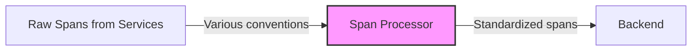

# How to Configure the Span Processor in the OpenTelemetry Collector

Author: [nawazdhandala](https://www.github.com/nawazdhandala)

Tags: OpenTelemetry, Collector, Processors, Span, Traces, Observability, Distributed Tracing

Description: Learn how to configure the Span Processor in OpenTelemetry Collector to transform, enrich, and optimize trace spans for better distributed tracing visibility.

Trace spans carry critical context about distributed operations, but they often need transformation before reaching your backend. The Span Processor enables you to rename spans, modify attributes, set status codes, and restructure span hierarchies without changing application code. This gives you control over how traces appear in your observability platform.

## What Is the Span Processor?

The Span Processor manipulates trace spans as they flow through the Collector. It can rename spans, add or remove attributes, change span status, modify span kinds, and adjust parent-child relationships. These transformations help standardize trace data from diverse sources and optimize traces for analysis and visualization.

This is useful when:

- Span names from instrumentation libraries are too verbose or inconsistent
- You need to add business context to spans based on attributes
- Legacy instrumentation uses outdated naming conventions
- You want to redact sensitive data from span attributes
- Span status codes need normalization across different services

## Architecture Overview

The Span Processor transforms spans as they pass through the pipeline:



Spans arrive with different naming conventions, attributes, and structures. The processor normalizes them into a consistent format for your backend.

## Basic Configuration

Here's a minimal Span Processor configuration that renames spans based on attributes:

```yaml
# Configure receivers to accept traces
receivers:
  otlp:
    protocols:
      grpc:
        endpoint: 0.0.0.0:4317
      http:
        endpoint: 0.0.0.0:4318

# Define the Span Processor
processors:
  # The span processor transforms span properties
  span:
    # Rename spans based on patterns
    # This configuration changes generic span names to more specific ones
    name:
      # Use attribute values to construct new span names
      # fromAttributes takes a list of attribute keys and uses their values
      from_attributes:
        - http.method
        - http.route

      # Separator between attribute values in the new name
      separator: " "

    # Modify span status
    status:
      # Set span status based on attributes
      # This marks spans with HTTP 5xx as errors
      code: ERROR
      # Only apply if http.status_code is 5xx
      if: attributes["http.status_code"] >= 500

  # Batch processor for efficient export
  batch:
    timeout: 10s
    send_batch_size: 1024

# Configure export destination
exporters:
  otlphttp:
    endpoint: https://oneuptime.com/otlp
    headers:
      x-oneuptime-token: ${ONEUPTIME_TOKEN}

# Wire everything together in pipelines
service:
  pipelines:
    traces:
      receivers: [otlp]
      processors: [span, batch]
      exporters: [otlphttp]
```

## Understanding Span Transformations

The Span Processor supports multiple transformation types:

### Span Name Transformations

Rename spans for clarity and consistency:

```yaml
processors:
  span/rename:
    name:
      # Build span names from attributes
      from_attributes:
        - http.method
        - http.route
      separator: " "

      # Result: "GET /api/users/{id}" instead of "HTTP GET"

    # Alternatively, use a to_attributes pattern to extract from name
    to_attributes:
      # Rules to extract attributes from span name
      rules:
        # Extract HTTP method and path from span name
        - pattern: "^(GET|POST|PUT|DELETE) (.+)$"
          attribute_names:
            - http.method
            - http.route

    # Or use simple string replacement
    replace:
      # Find and replace patterns in span names
      - pattern: "Datastore::"
        replacement: ""
      - pattern: "Service::"
        replacement: ""
```

### Span Status Modifications

Control span status based on conditions:

```yaml
processors:
  span/status:
    status:
      # Set status to ERROR for HTTP 5xx
      - code: ERROR
        description: "Server error"
        if: attributes["http.status_code"] >= 500 and attributes["http.status_code"] < 600

      # Set status to OK for successful requests
      - code: OK
        if: attributes["http.status_code"] >= 200 and attributes["http.status_code"] < 300

      # Set status to ERROR for specific error messages
      - code: ERROR
        description: "Database connection failed"
        if: attributes["error.message"] matches ".*connection timeout.*"
```

### Span Kind Adjustments

Change span kind for proper visualization:

```yaml
processors:
  span/kind:
    # Change span kind based on attributes
    kind:
      # Set to CLIENT for outgoing HTTP calls
      - value: CLIENT
        if: attributes["http.url"] != nil and attributes["span.kind"] == "INTERNAL"

      # Set to SERVER for incoming requests
      - value: SERVER
        if: attributes["http.method"] != nil and attributes["span.kind"] == "INTERNAL"

      # Set to INTERNAL for database operations
      - value: INTERNAL
        if: attributes["db.system"] != nil
```

## Advanced Configuration

### Pattern-Based Transformations

Apply complex transformations based on attribute patterns:

```yaml
processors:
  span/advanced:
    # Rename spans with complex patterns
    name:
      from_attributes:
        - db.system
        - db.operation
        - db.name
      separator: "."

      # Template for span name
      template: "{db.system}.{db.operation} {db.name}"

    # Add computed attributes
    attributes:
      actions:
        # Add span type attribute
        - key: span.type
          value: "database"
          action: insert
          if: attributes["db.system"] != nil

        # Add latency bucket
        - key: span.latency_bucket
          value: "fast"
          action: insert
          if: span.duration < 100ms

        - key: span.latency_bucket
          value: "slow"
          action: upsert
          if: span.duration >= 1s

        # Extract transaction ID from span name
        - key: transaction.id
          from_attribute: span.name
          action: extract
          pattern: "txn-([0-9]+)"

    # Conditionally modify status
    status:
      - code: ERROR
        description: "Slow database query"
        if: attributes["db.system"] != nil and span.duration > 5s

      - code: ERROR
        description: "High retry count"
        if: attributes["retry.count"] > 3
```

### Service-Specific Transformations

Apply different transformations based on service name:

```yaml
processors:
  # Transformations for API gateway
  span/api_gateway:
    # Only process spans from API gateway
    if: resource.attributes["service.name"] == "api-gateway"

    name:
      from_attributes:
        - http.method
        - http.route
      separator: " "

    attributes:
      actions:
        - key: span.category
          value: "gateway"
          action: insert

  # Transformations for database service
  span/database:
    if: resource.attributes["service.name"] == "database-service"

    name:
      from_attributes:
        - db.operation
        - db.name
      separator: " on "
      template: "{db.operation} on {db.name}"

    attributes:
      actions:
        - key: span.category
          value: "database"
          action: insert

  # Transformations for payment service
  span/payment:
    if: resource.attributes["service.name"] == "payment-service"

    name:
      from_attributes:
        - payment.operation
        - payment.method
      separator: " via "

    status:
      # Always mark declined payments as errors
      - code: ERROR
        description: "Payment declined"
        if: attributes["payment.status"] == "declined"
```

## Production Configuration Example

Here's a complete production-ready configuration with comprehensive span processing:

```yaml
receivers:
  otlp:
    protocols:
      grpc:
        endpoint: 0.0.0.0:4317
      http:
        endpoint: 0.0.0.0:4318

processors:
  # Memory limiter prevents OOM issues
  memory_limiter:
    check_interval: 1s
    limit_mib: 1024
    spike_limit_mib: 256

  # Standardize HTTP spans
  span/http:
    if: attributes["http.method"] != nil

    name:
      # Create readable span names: "GET /api/users"
      from_attributes:
        - http.method
        - http.route
      separator: " "
      # Fallback to http.target if http.route not available
      fallback_attributes:
        - http.target

    attributes:
      actions:
        # Add span category
        - key: span.category
          value: "http"
          action: insert

        # Normalize HTTP status code attribute
        - key: http.status_code
          from_attribute: http.response.status_code
          action: upsert

        # Add HTTP method group
        - key: http.method.group
          value: "read"
          action: insert
          if: attributes["http.method"] in ["GET", "HEAD", "OPTIONS"]

        - key: http.method.group
          value: "write"
          action: upsert
          if: attributes["http.method"] in ["POST", "PUT", "PATCH", "DELETE"]

    status:
      # Mark 4xx as errors for certain routes
      - code: ERROR
        description: "Client error"
        if: |
          attributes["http.status_code"] >= 400 and
          attributes["http.status_code"] < 500 and
          attributes["http.route"] matches "/api/.*"

      # Always mark 5xx as errors
      - code: ERROR
        description: "Server error"
        if: attributes["http.status_code"] >= 500

  # Standardize database spans
  span/database:
    if: attributes["db.system"] != nil

    name:
      from_attributes:
        - db.operation
        - db.name
      separator: " "
      template: "{db.operation} {db.name}"

    attributes:
      actions:
        - key: span.category
          value: "database"
          action: insert

        # Normalize operation names
        - key: db.operation
          value: "SELECT"
          action: upsert
          if: attributes["db.operation"] in ["select", "query", "find"]

        - key: db.operation
          value: "INSERT"
          action: upsert
          if: attributes["db.operation"] in ["insert", "create"]

        - key: db.operation
          value: "UPDATE"
          action: upsert
          if: attributes["db.operation"] in ["update", "modify"]

        - key: db.operation
          value: "DELETE"
          action: upsert
          if: attributes["db.operation"] in ["delete", "remove"]

    status:
      # Mark slow queries as errors
      - code: ERROR
        description: "Slow database query"
        if: span.duration > 5s

      # Mark queries with high retry count
      - code: ERROR
        description: "Database query retries exceeded"
        if: attributes["db.retry.count"] > 3

  # Standardize RPC spans
  span/rpc:
    if: attributes["rpc.system"] != nil

    name:
      from_attributes:
        - rpc.service
        - rpc.method
      separator: "/"
      template: "{rpc.service}/{rpc.method}"

    attributes:
      actions:
        - key: span.category
          value: "rpc"
          action: insert

    status:
      # Mark RPC errors
      - code: ERROR
        description: "RPC call failed"
        if: attributes["rpc.grpc.status_code"] != 0

  # Standardize messaging spans
  span/messaging:
    if: attributes["messaging.system"] != nil

    name:
      from_attributes:
        - messaging.operation
        - messaging.destination
      separator: " "
      template: "{messaging.operation} {messaging.destination}"

    attributes:
      actions:
        - key: span.category
          value: "messaging"
          action: insert

  # Redact sensitive data
  span/redact:
    attributes:
      actions:
        # Remove sensitive headers
        - key: http.request.header.authorization
          action: delete

        - key: http.request.header.cookie
          action: delete

        # Redact email addresses
        - key: user.email
          value: "[REDACTED]"
          action: upsert
          if: attributes["user.email"] != nil

        # Redact credit card numbers
        - key: payment.card.number
          value: "****"
          action: upsert
          if: attributes["payment.card.number"] != nil

  # Add business context
  span/business:
    attributes:
      actions:
        # Add customer tier
        - key: customer.tier
          from_attribute: http.request.header.x-customer-tier
          action: insert

        # Add request priority
        - key: request.priority
          value: "high"
          action: insert
          if: attributes["http.route"] matches "/api/checkout.*"

        - key: request.priority
          value: "normal"
          action: insert
          if: attributes["request.priority"] == nil

  # Resource processor adds deployment context
  resource:
    attributes:
      - key: deployment.environment
        value: ${DEPLOY_ENV}
        action: upsert

  # Batch processor for efficient export
  batch:
    timeout: 10s
    send_batch_size: 1024
    send_batch_max_size: 2048

exporters:
  # Primary backend
  otlphttp/primary:
    endpoint: https://oneuptime.com/otlp
    headers:
      x-oneuptime-token: ${ONEUPTIME_TOKEN}
    compression: gzip
    retry_on_failure:
      enabled: true
      initial_interval: 5s
      max_interval: 30s
      max_elapsed_time: 300s

  # Debug logging
  logging:
    loglevel: info
    sampling_initial: 5
    sampling_thereafter: 50

service:
  extensions: [health_check, pprof]

  pipelines:
    traces:
      receivers: [otlp]
      processors:
        - memory_limiter
        - span/http
        - span/database
        - span/rpc
        - span/messaging
        - span/redact
        - span/business
        - resource
        - batch
      exporters: [otlphttp/primary, logging]

extensions:
  health_check:
    endpoint: 0.0.0.0:13133
  pprof:
    endpoint: 0.0.0.0:1777
```

## Deployment in Kubernetes

Deploy the Span Processor in Kubernetes for centralized trace transformation:

```yaml
apiVersion: v1
kind: ConfigMap
metadata:
  name: otel-collector-config
  namespace: observability
data:
  collector.yaml: |
    receivers:
      otlp:
        protocols:
          grpc:
            endpoint: 0.0.0.0:4317
          http:
            endpoint: 0.0.0.0:4318

    processors:
      memory_limiter:
        check_interval: 1s
        limit_mib: 2048

      # HTTP span standardization
      span/http:
        if: attributes["http.method"] != nil
        name:
          from_attributes:
            - http.method
            - http.route
          separator: " "
        attributes:
          actions:
            - key: span.category
              value: "http"
              action: insert
        status:
          - code: ERROR
            if: attributes["http.status_code"] >= 500

      # Database span standardization
      span/database:
        if: attributes["db.system"] != nil
        name:
          from_attributes:
            - db.operation
            - db.name
          separator: " "
        attributes:
          actions:
            - key: span.category
              value: "database"
              action: insert
        status:
          - code: ERROR
            if: span.duration > 5s

      # Redact sensitive data
      span/redact:
        attributes:
          actions:
            - key: http.request.header.authorization
              action: delete
            - key: http.request.header.cookie
              action: delete

      batch:
        timeout: 10s
        send_batch_size: 1024

    exporters:
      otlphttp:
        endpoint: https://oneuptime.com/otlp
        headers:
          x-oneuptime-token: ${ONEUPTIME_TOKEN}

    service:
      pipelines:
        traces:
          receivers: [otlp]
          processors: [memory_limiter, span/http, span/database, span/redact, batch]
          exporters: [otlphttp]
---
apiVersion: apps/v1
kind: Deployment
metadata:
  name: otel-collector
  namespace: observability
spec:
  replicas: 3
  selector:
    matchLabels:
      app: otel-collector
  template:
    metadata:
      labels:
        app: otel-collector
    spec:
      containers:
      - name: otel-collector
        image: otel/opentelemetry-collector-contrib:0.93.0
        args:
          - "--config=/conf/collector.yaml"
        env:
        - name: ONEUPTIME_TOKEN
          valueFrom:
            secretKeyRef:
              name: oneuptime-credentials
              key: token
        - name: DEPLOY_ENV
          value: "production"
        volumeMounts:
        - name: config
          mountPath: /conf
        ports:
        - containerPort: 4317
          name: otlp-grpc
        - containerPort: 4318
          name: otlp-http
        resources:
          requests:
            memory: "2Gi"
            cpu: "1000m"
          limits:
            memory: "4Gi"
            cpu: "2000m"
        livenessProbe:
          httpGet:
            path: /
            port: 13133
          initialDelaySeconds: 30
          periodSeconds: 10
      volumes:
      - name: config
        configMap:
          name: otel-collector-config
---
apiVersion: v1
kind: Service
metadata:
  name: otel-collector
  namespace: observability
spec:
  type: ClusterIP
  selector:
    app: otel-collector
  ports:
  - name: otlp-grpc
    port: 4317
    targetPort: 4317
  - name: otlp-http
    port: 4318
    targetPort: 4318
```

## Common Use Cases

### Standardizing Span Names

Different instrumentation libraries use different naming conventions. Standardize them:

```yaml
processors:
  span/standardize:
    name:
      # For HTTP spans
      from_attributes:
        - http.method
        - http.route
      separator: " "

      # Replace patterns
      replace:
        # Remove framework-specific prefixes
        - pattern: "^Express: "
          replacement: ""
        - pattern: "^Rails: "
          replacement: ""
        - pattern: "^Django: "
          replacement: ""

        # Normalize parameter patterns
        - pattern: "\\{[^}]+\\}"
          replacement: "{id}"
```

### Adding Business Context

Enrich spans with business-level information:

```yaml
processors:
  span/business_context:
    attributes:
      actions:
        # Add business domain
        - key: business.domain
          value: "checkout"
          action: insert
          if: attributes["http.route"] matches "/checkout.*"

        # Add criticality
        - key: span.criticality
          value: "critical"
          action: insert
          if: attributes["http.route"] in ["/api/payment", "/api/checkout"]

        # Add customer segment
        - key: customer.segment
          value: "enterprise"
          action: insert
          if: attributes["http.request.header.x-customer-tier"] == "enterprise"
```

### Performance Classification

Classify spans by performance characteristics:

```yaml
processors:
  span/performance:
    attributes:
      actions:
        # Add latency classification
        - key: span.latency.class
          value: "fast"
          action: insert
          if: span.duration < 100ms

        - key: span.latency.class
          value: "normal"
          action: upsert
          if: span.duration >= 100ms and span.duration < 1s

        - key: span.latency.class
          value: "slow"
          action: upsert
          if: span.duration >= 1s and span.duration < 5s

        - key: span.latency.class
          value: "critical"
          action: upsert
          if: span.duration >= 5s

    status:
      # Mark critically slow spans as errors
      - code: ERROR
        description: "Performance SLO violated"
        if: span.duration >= 5s
```

## Validating Span Transformations

To verify that the Span Processor is working correctly:

```yaml
exporters:
  # Add logging exporter to see transformed spans
  logging:
    loglevel: debug
    sampling_initial: 10
    sampling_thereafter: 100

service:
  pipelines:
    traces:
      receivers: [otlp]
      processors: [span/http, span/database, batch]
      # Include logging exporter for validation
      exporters: [otlphttp, logging]
```

Check the Collector logs to verify transformations:

```bash
# View Collector logs
kubectl logs -n observability deployment/otel-collector -f | grep -A 5 "Span"

# Expected output showing transformed spans:
# Original span name: "HTTP GET"
# Transformed span name: "GET /api/users/{id}"
# Added attribute: span.category=http
# Updated status: OK -> ERROR (http.status_code=500)
```

## Performance Considerations

The Span Processor adds minimal overhead:

- Attribute lookups use efficient hash maps
- Pattern matching is optimized with compiled regexes
- Conditional logic short-circuits when possible

For high-throughput environments:

```yaml
processors:
  # Apply transformations selectively
  span/selective:
    # Only transform server spans (highest value)
    if: span.kind == "SERVER"

    name:
      from_attributes:
        - http.method
        - http.route
      separator: " "

  # Skip transformation for health check spans
  filter/skip_health:
    traces:
      span:
        - 'attributes["http.route"] == "/health"'
        - 'attributes["http.route"] == "/metrics"'

service:
  pipelines:
    traces:
      receivers: [otlp]
      processors: [filter/skip_health, span/selective, batch]
      exporters: [otlphttp]
```

## Troubleshooting

### Transformations Not Applied

If spans aren't being transformed:

```yaml
processors:
  span/debug:
    # Enable debug logging
    debug:
      enabled: true
      log_conditions: true

    # Check conditions
    if: attributes["http.method"] != nil

    name:
      from_attributes:
        - http.method
        - http.route
      separator: " "
```

Check logs for condition evaluation:

```bash
kubectl logs -n observability deployment/otel-collector | grep "condition"

# Expected output:
# Condition evaluated: attributes["http.method"] != nil = true
# Applying transformation to span: HTTP GET
```

### Attribute Not Found

If attributes referenced in transformations don't exist:

```yaml
processors:
  span/safe:
    name:
      from_attributes:
        - http.method
        - http.route
      separator: " "

      # Provide fallback attributes
      fallback_attributes:
        - http.target
        - http.url

      # Default name if all fail
      default_name: "UNKNOWN"
```

## Best Practices

1. **Apply transformations early**: Place span processors before expensive operations like tail sampling
2. **Use conditions wisely**: Filter which spans get transformed to minimize overhead
3. **Keep names concise**: Span names should be human-readable but not verbose
4. **Standardize across services**: Use consistent span naming and attribute conventions
5. **Document conventions**: Maintain documentation of span naming and categorization standards

## Related Resources

- [What is OpenTelemetry Collector and Why Use One](https://oneuptime.com/blog/post/2025-09-18-what-is-opentelemetry-collector-and-why-use-one/view)
- [How to Reduce Noise in OpenTelemetry](https://oneuptime.com/blog/post/2025-08-25-how-to-reduce-noise-in-opentelemetry/view)
- [How to Configure the Schema Processor in OpenTelemetry Collector](https://oneuptime.com/blog/post/schema-processor-opentelemetry-collector/view)

## Final Thoughts

The Span Processor is essential for maintaining consistent, readable, and actionable trace data. By standardizing span names, enriching attributes, and normalizing status codes, you create traces that are easier to query, visualize, and debug.

Start with basic span name transformations, gradually add business context, and implement redaction for sensitive data. With the Span Processor, you gain full control over how your traces appear in your observability platform, enabling more effective distributed tracing and faster incident resolution.
