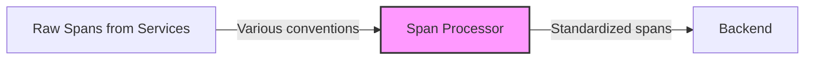

# How to Configure the Span Processor in the OpenTelemetry Collector

Author: [nawazdhandala](https://www.github.com/nawazdhandala)

Tags: OpenTelemetry, Collector, Processor, Span, Trace, Observability, Distributed Tracing

Description: Learn how to configure the Span Processor in OpenTelemetry Collector to transform, enrich, and optimize trace spans for better distributed tracing visibility.

Trace spans carry critical context about distributed operations, but they often need normalization before reaching your backend. The Span Processor can rename spans from existing attributes, extract attributes from span names, and set span status without changing application code. This gives you control over common span cleanup tasks while keeping richer transformations in the Collector pipeline.

## What Is the Span Processor?

The Span Processor modifies trace spans as they flow through the Collector. In the OpenTelemetry Collector, it supports span name changes, extracting attributes from span names, setting span status, and include/exclude matching. For adding or removing attributes, use the Attributes Processor. For conditional logic, span kind changes, or computed values, use the Transform Processor.

This is useful when:

- Span names from instrumentation libraries are too verbose or inconsistent
- You need to build span names from existing attributes
- Legacy instrumentation puts useful route or operation information in the span name
- Span status codes need simple normalization across different services
- You need to scope span changes to services, names, kinds, resources, or attributes

## Architecture Overview

The Span Processor transforms spans as they pass through the pipeline:


```mermaid
graph LR
    A[Raw Spans from Services] -->|Various conventions| B[Span Processor]
    B -->|Standardized spans| C[Backend]

    style B fill:#f9f,stroke:#333,stroke-width:2px
```

Spans arrive with different naming conventions and attributes. The processor can normalize their names or status before export.

## Basic Configuration

Here's a minimal Span Processor configuration that renames spans based on attributes:

```yaml
# Configure receivers to accept traces
receivers:
  otlp:
    protocols:
      grpc:
        endpoint: 0.0.0.0:4317
      http:
        endpoint: 0.0.0.0:4318

# Define the Span Processor
processors:
  # The span processor renames spans from existing attributes
  span:
    name:
      # Use attribute values to construct new span names
      # All listed attributes must exist or the span name is not changed
      from_attributes:
        - http.request.method
        - http.route

      # Separator between attribute values in the new name
      separator: " "

  # Batch processor for efficient export
  batch:
    timeout: 10s
    send_batch_size: 1024

# Configure export destination
exporters:
  otlphttp:
    endpoint: https://oneuptime.com/otlp
    headers:
      x-oneuptime-token: ${ONEUPTIME_TOKEN}

# Wire everything together in pipelines
service:
  pipelines:
    traces:
      receivers: [otlp]
      processors: [span, batch]
      exporters: [otlphttp]
```

## Understanding Span Transformations

The Span Processor supports a small set of span-specific transformation types:

### Span Name Transformations

Rename spans for clarity and consistency:

```yaml
processors:
  span/rename:
    name:
      # Build span names from attributes
      # Result: "GET /api/users/{id}" if both attributes exist
      from_attributes:
        - http.request.method
        - http.route
      separator: " "

  span/extract:
    name:
      # Extract attributes from the span name using named regex captures
      to_attributes:
        rules:
          - "^HTTP (?P<method>[A-Z]+) (?P<route>/.+)$"
        keep_original_name: true
```

The `to_attributes` rule must be a regex string with named capture groups. Each capture name becomes an attribute key, and each matched value becomes the attribute value.

### Span Status Modifications

Set span status directly or scope it with include/exclude matching:

```yaml
processors:
  span/status_error:
    include:
      match_type: strict
      attributes:
        - key: http.response.status_code
          value: 500
    status:
      code: Error
      description: "HTTP 500 response"

  span/status_ok:
    include:
      match_type: strict
      attributes:
        - key: http.response.status_code
          value: 200
    status:
      code: Ok
```

The supported status codes are `Ok`, `Error`, and `Unset`. The Span Processor does not support inline `if` expressions; use `include` and `exclude` matching or the Transform Processor for richer conditions.

### Span Kind Adjustments

The Span Processor does not change span kind. Use the Transform Processor when you need to modify span kind:

```yaml
processors:
  transform/kind:
    error_mode: ignore
    trace_statements:
      - context: span
        statements:
          - 'set(span.kind, SPAN_KIND_CLIENT) where span.kind == SPAN_KIND_INTERNAL and span.attributes["http.url"] != nil'
          - 'set(span.kind, SPAN_KIND_SERVER) where span.kind == SPAN_KIND_INTERNAL and span.attributes["http.request.method"] != nil'
```

## Advanced Configuration

### Pattern-Based Transformations

Use the Span Processor for name extraction, and combine it with other processors when you need attribute edits or conditional transformations:

```yaml
processors:
  span/extract_route:
    name:
      to_attributes:
        rules:
          - "^HTTP (?P<method>[A-Z]+) (?P<route>/.+)$"
        keep_original_name: true

  attributes/database_category:
    include:
      match_type: strict
      attributes:
        - key: db.system
    actions:
      - key: span.category
        value: "database"
        action: insert

  transform/latency_buckets:
    error_mode: ignore
    trace_statements:
      - context: span
        statements:
          - 'set(span.attributes["span.latency_bucket"], "fast") where span.end_time_unix_nano - span.start_time_unix_nano < 100000000'
          - 'set(span.attributes["span.latency_bucket"], "slow") where span.end_time_unix_nano - span.start_time_unix_nano >= 1000000000'
          - 'set(span.status.code, STATUS_CODE_ERROR) where span.attributes["db.system"] != nil and span.end_time_unix_nano - span.start_time_unix_nano > 5000000000'
```

### Service-Specific Transformations

Apply different transformations based on service name with include matching:

```yaml
processors:
  # Transformations for API gateway
  span/api_gateway:
    include:
      match_type: strict
      services: ["api-gateway"]
    name:
      from_attributes:
        - http.request.method
        - http.route
      separator: " "

  # Transformations for database service
  span/database:
    include:
      match_type: strict
      services: ["database-service"]
    name:
      from_attributes:
        - db.operation
        - db.name
      separator: " on "

  # Transformations for payment service
  span/payment_declined:
    include:
      match_type: strict
      services: ["payment-service"]
      attributes:
        - key: payment.status
          value: declined
    status:
      code: Error
      description: "Payment declined"
```

## Production Configuration Example

Here's a complete production-ready configuration with supported span processing and complementary processors:

```yaml
receivers:
  otlp:
    protocols:
      grpc:
        endpoint: 0.0.0.0:4317
      http:
        endpoint: 0.0.0.0:4318

processors:
  # Memory limiter prevents OOM issues
  memory_limiter:
    check_interval: 1s
    limit_mib: 1024
    spike_limit_mib: 256

  # Standardize HTTP span names
  span/http:
    include:
      match_type: strict
      attributes:
        - key: http.request.method
        - key: http.route
    name:
      from_attributes:
        - http.request.method
        - http.route
      separator: " "

  # Standardize database span names
  span/database:
    include:
      match_type: strict
      attributes:
        - key: db.operation
        - key: db.name
    name:
      from_attributes:
        - db.operation
        - db.name
      separator: " "

  # Standardize RPC span names
  span/rpc:
    include:
      match_type: strict
      attributes:
        - key: rpc.service
        - key: rpc.method
    name:
      from_attributes:
        - rpc.service
        - rpc.method
      separator: "/"

  # Standardize messaging span names
  span/messaging:
    include:
      match_type: strict
      attributes:
        - key: messaging.operation.name
        - key: messaging.destination.name
    name:
      from_attributes:
        - messaging.operation.name
        - messaging.destination.name
      separator: " "

  # Mark specific HTTP error responses
  span/http_500:
    include:
      match_type: strict
      attributes:
        - key: http.response.status_code
          value: 500
    status:
      code: Error
      description: "HTTP 500 response"

  # Redact sensitive data with the Attributes Processor
  attributes/redact:
    actions:
      - key: http.request.header.authorization
        action: delete
      - key: http.request.header.cookie
        action: delete
      - key: user.email
        value: "[REDACTED]"
        action: update
      - key: payment.card.number
        value: "****"
        action: update

  # Add business context
  attributes/business:
    actions:
      - key: customer.tier
        from_attribute: http.request.header.x-customer-tier
        action: insert

  transform/business_priority:
    error_mode: ignore
    trace_statements:
      - context: span
        statements:
          - 'set(span.attributes["request.priority"], "high") where IsMatch(span.attributes["http.route"], "^/api/checkout.*")'
          - 'set(span.attributes["request.priority"], "normal") where span.attributes["request.priority"] == nil'
          - 'set(span.status.code, STATUS_CODE_ERROR) where span.attributes["http.response.status_code"] >= 500'

  # Resource processor adds deployment context
  resource:
    attributes:
      - key: deployment.environment
        value: ${DEPLOY_ENV}
        action: upsert

  # Batch processor for efficient export
  batch:
    timeout: 10s
    send_batch_size: 1024
    send_batch_max_size: 2048

exporters:
  # Primary backend
  otlphttp/primary:
    endpoint: https://oneuptime.com/otlp
    headers:
      x-oneuptime-token: ${ONEUPTIME_TOKEN}
    compression: gzip
    retry_on_failure:
      enabled: true
      initial_interval: 5s
      max_interval: 30s
      max_elapsed_time: 300s

  # Debug output for validation
  debug:
    verbosity: normal
    sampling_initial: 5
    sampling_thereafter: 50

service:
  extensions: [health_check, pprof]

  pipelines:
    traces:
      receivers: [otlp]
      processors:
        - memory_limiter
        - span/http
        - span/database
        - span/rpc
        - span/messaging
        - span/http_500
        - attributes/redact
        - attributes/business
        - transform/business_priority
        - resource
        - batch
      exporters: [otlphttp/primary, debug]

extensions:
  health_check:
    endpoint: 0.0.0.0:13133
  pprof:
    endpoint: 0.0.0.0:1777
```

## Deployment in Kubernetes

Deploy the Span Processor in Kubernetes for centralized trace transformation:

```yaml
apiVersion: v1
kind: ConfigMap
metadata:
  name: otel-collector-config
  namespace: observability
data:
  collector.yaml: |
    receivers:
      otlp:
        protocols:
          grpc:
            endpoint: 0.0.0.0:4317
          http:
            endpoint: 0.0.0.0:4318

    processors:
      memory_limiter:
        check_interval: 1s
        limit_mib: 2048

      # HTTP span standardization
      span/http:
        include:
          match_type: strict
          attributes:
            - key: http.request.method
            - key: http.route
        name:
          from_attributes:
            - http.request.method
            - http.route
          separator: " "

      # Database span standardization
      span/database:
        include:
          match_type: strict
          attributes:
            - key: db.operation
            - key: db.name
        name:
          from_attributes:
            - db.operation
            - db.name
          separator: " "

      # Redact sensitive data
      attributes/redact:
        actions:
          - key: http.request.header.authorization
            action: delete
          - key: http.request.header.cookie
            action: delete

      transform/status:
        error_mode: ignore
        trace_statements:
          - context: span
            statements:
              - 'set(span.status.code, STATUS_CODE_ERROR) where span.attributes["http.response.status_code"] >= 500'

      batch:
        timeout: 10s
        send_batch_size: 1024

    exporters:
      otlphttp:
        endpoint: https://oneuptime.com/otlp
        headers:
          x-oneuptime-token: ${ONEUPTIME_TOKEN}

    extensions:
      health_check:
        endpoint: 0.0.0.0:13133

    service:
      extensions: [health_check]
      pipelines:
        traces:
          receivers: [otlp]
          processors: [memory_limiter, span/http, span/database, attributes/redact, transform/status, batch]
          exporters: [otlphttp]
---
apiVersion: apps/v1
kind: Deployment
metadata:
  name: otel-collector
  namespace: observability
spec:
  replicas: 3
  selector:
    matchLabels:
      app: otel-collector
  template:
    metadata:
      labels:
        app: otel-collector
    spec:
      containers:
      - name: otel-collector
        image: otel/opentelemetry-collector-contrib:0.153.0
        args:
          - "--config=/conf/collector.yaml"
        env:
        - name: ONEUPTIME_TOKEN
          valueFrom:
            secretKeyRef:
              name: oneuptime-credentials
              key: token
        volumeMounts:
        - name: config
          mountPath: /conf
        ports:
        - containerPort: 4317
          name: otlp-grpc
        - containerPort: 4318
          name: otlp-http
        - containerPort: 13133
          name: health
        resources:
          requests:
            memory: "2Gi"
            cpu: "1000m"
          limits:
            memory: "4Gi"
            cpu: "2000m"
        livenessProbe:
          httpGet:
            path: /
            port: 13133
          initialDelaySeconds: 30
          periodSeconds: 10
      volumes:
      - name: config
        configMap:
          name: otel-collector-config
---
apiVersion: v1
kind: Service
metadata:
  name: otel-collector
  namespace: observability
spec:
  type: ClusterIP
  selector:
    app: otel-collector
  ports:
  - name: otlp-grpc
    port: 4317
    targetPort: 4317
  - name: otlp-http
    port: 4318
    targetPort: 4318
  - name: health
    port: 13133
    targetPort: 13133
```

## Common Use Cases

### Standardizing Span Names

Different instrumentation libraries use different naming conventions. Standardize them:

```yaml
processors:
  span/standardize_http:
    name:
      from_attributes:
        - http.request.method
        - http.route
      separator: " "

  transform/remove_prefixes:
    error_mode: ignore
    trace_statements:
      - context: span
        statements:
          - 'replace_pattern(span.name, "^Express: ", "")'
          - 'replace_pattern(span.name, "^Rails: ", "")'
          - 'replace_pattern(span.name, "^Django: ", "")'
```

### Adding Business Context

Enrich spans with business-level information by pairing the Span Processor with the Attributes or Transform Processor:

```yaml
processors:
  attributes/business_context:
    actions:
      - key: customer.segment
        from_attribute: http.request.header.x-customer-tier
        action: insert

  transform/business_context:
    error_mode: ignore
    trace_statements:
      - context: span
        statements:
          - 'set(span.attributes["business.domain"], "checkout") where IsMatch(span.attributes["http.route"], "^/checkout.*")'
          - 'set(span.attributes["span.criticality"], "critical") where span.attributes["http.route"] == "/api/payment" or span.attributes["http.route"] == "/api/checkout"'
```

### Performance Classification

Classify spans by performance characteristics with the Transform Processor:

```yaml
processors:
  transform/performance:
    error_mode: ignore
    trace_statements:
      - context: span
        statements:
          - 'set(span.attributes["span.latency.class"], "fast") where span.end_time_unix_nano - span.start_time_unix_nano < 100000000'
          - 'set(span.attributes["span.latency.class"], "normal") where span.end_time_unix_nano - span.start_time_unix_nano >= 100000000 and span.end_time_unix_nano - span.start_time_unix_nano < 1000000000'
          - 'set(span.attributes["span.latency.class"], "slow") where span.end_time_unix_nano - span.start_time_unix_nano >= 1000000000 and span.end_time_unix_nano - span.start_time_unix_nano < 5000000000'
          - 'set(span.attributes["span.latency.class"], "critical") where span.end_time_unix_nano - span.start_time_unix_nano >= 5000000000'
          - 'set(span.status.code, STATUS_CODE_ERROR) where span.end_time_unix_nano - span.start_time_unix_nano >= 5000000000'
```

## Validating Span Transformations

To verify that the Span Processor is working correctly:

```yaml
exporters:
  # Add debug exporter to see transformed spans
  debug:
    verbosity: detailed
    sampling_initial: 10
    sampling_thereafter: 100

service:
  pipelines:
    traces:
      receivers: [otlp]
      processors: [span/http, span/database, batch]
      # Include debug exporter for validation
      exporters: [otlphttp, debug]
```

Check the Collector logs to verify transformations:

```bash
# View Collector logs
kubectl logs -n observability deployment/otel-collector -f | grep -A 10 "Span #"
```

The debug exporter output includes transformed span fields such as span name, attributes, kind, and status.

## Performance Considerations

The Span Processor is a focused processor with modest overhead:

- Attribute lookups are used for `from_attributes` renaming
- Regex matching is used for `to_attributes` extraction
- Include/exclude matching lets you scope work to selected spans

For high-throughput environments:

```yaml
processors:
  # Apply transformations selectively
  span/selective:
    include:
      match_type: strict
      span_kinds: [SPAN_KIND_SERVER]
      attributes:
        - key: http.request.method
        - key: http.route
    name:
      from_attributes:
        - http.request.method
        - http.route
      separator: " "

  # Drop health check spans before renaming
  filter/skip_health:
    error_mode: ignore
    traces:
      span:
        - 'span.attributes["http.route"] == "/health"'
        - 'span.attributes["http.route"] == "/metrics"'

service:
  pipelines:
    traces:
      receivers: [otlp]
      processors: [filter/skip_health, span/selective, batch]
      exporters: [otlphttp]
```

## Troubleshooting

### Transformations Not Applied

If spans aren't being transformed, check that every attribute listed in `from_attributes` exists on the span:

```yaml
processors:
  span/http:
    include:
      match_type: strict
      attributes:
        - key: http.request.method
        - key: http.route
    name:
      from_attributes:
        - http.request.method
        - http.route
      separator: " "

exporters:
  debug:
    verbosity: detailed
```

Check logs for the span name and attributes:

```bash
kubectl logs -n observability deployment/otel-collector | grep -A 10 "Span #"
```

### Attribute Not Found

If attributes referenced in `from_attributes` don't exist, the Span Processor leaves the span name unchanged. Define a second processor for another attribute set, or use the Transform Processor for conditional fallback logic:

```yaml
processors:
  span/route_name:
    name:
      from_attributes:
        - http.request.method
        - http.route
      separator: " "

  span/target_name:
    name:
      from_attributes:
        - http.request.method
        - http.target
      separator: " "
```

## Best Practices

1. **Apply transformations early**: Place span processors before expensive operations like tail sampling when the sampling policy depends on transformed data
2. **Use include/exclude wisely**: Scope which spans get transformed to minimize overhead
3. **Keep names concise**: Span names should be human-readable but not verbose
4. **Standardize across services**: Use consistent span naming and attribute conventions
5. **Use the right processor**: Use Span Processor for span name and status changes, Attributes Processor for attributes, and Transform Processor for OTTL-based conditions

## Related Resources

- [What is OpenTelemetry Collector and Why Use One](https://oneuptime.com/blog/post/2025-09-18-what-is-opentelemetry-collector-and-why-use-one/view)
- [How to Reduce Noise in OpenTelemetry](https://oneuptime.com/blog/post/2025-08-25-how-to-reduce-noise-in-opentelemetry/view)
- [How to Configure the Schema Processor in OpenTelemetry Collector](https://oneuptime.com/blog/post/2026-02-06-schema-processor-opentelemetry-collector/view)

## Final Thoughts

The Span Processor is useful for maintaining consistent, readable trace data when you need to rename spans, extract attributes from names, or set span status. By pairing it with the Attributes Processor and Transform Processor, you can also enrich attributes, redact sensitive values, and apply richer conditional logic.

Start with basic span name transformations, gradually add scoped status changes, and use complementary processors for attribute and OTTL-based transformations. With a correctly configured pipeline, you gain control over how your traces appear in your observability platform, enabling more effective distributed tracing and faster incident resolution.
