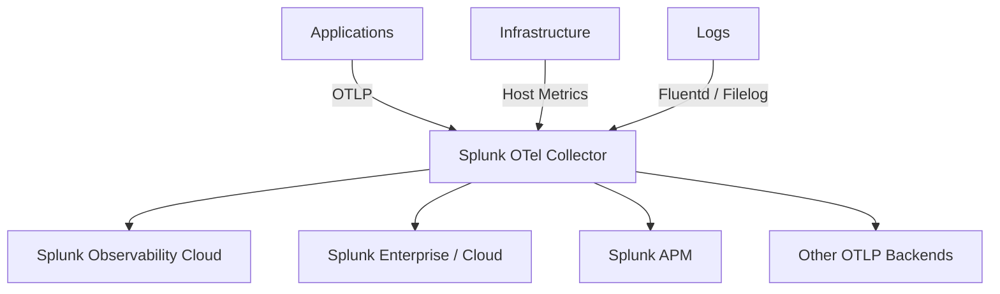
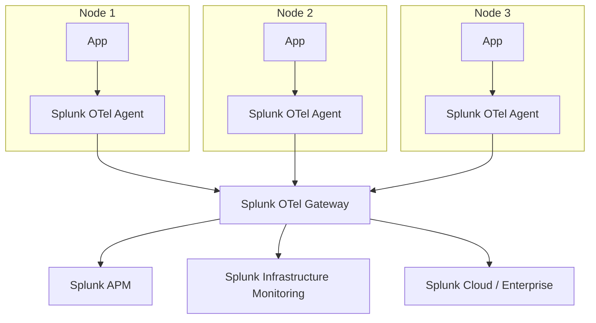

# How to Use Splunk Distribution of OpenTelemetry Collector

Author: [nawazdhandala](https://www.github.com/nawazdhandala)

Tags: OpenTelemetry, Splunk, Observability, Monitoring, APM, Infrastructure

Description: A practical guide to setting up the Splunk Distribution of OpenTelemetry Collector with configuration examples for traces, metrics, and logs.

---

Splunk offers its own distribution of the OpenTelemetry Collector that is tuned to work with Splunk Observability Cloud (formerly SignalFx) and Splunk Enterprise/Cloud for logs. It comes with Splunk-specific exporters, pre-built dashboards, and configuration defaults that make the setup process faster if Splunk is your backend.

This guide covers how to install and configure the Splunk OTel Collector, what makes it different from the upstream collector, and when you might prefer one over the other.

## What the Splunk Distribution Includes

The Splunk distribution bundles the standard OTel Collector components plus several additions:

- **SignalFx Exporter** for metrics to Splunk Observability Cloud
- **Splunk HEC Exporter** for logs to Splunk Enterprise/Cloud
- **Splunk APM Exporter** for traces
- **Smart Agent Receiver** for backward compatibility with the older Splunk Smart Agent
- **Fluentd integration** for log collection
- Pre-configured host metrics collection
- Auto-discovery for common services



## Installing the Splunk OTel Collector

### Linux Installer Script

Splunk provides a one-liner installer that handles everything. It sets up the collector, Fluentd for log collection, and auto-instrumentation:

```bash
# Download and run the Splunk OTel Collector installer
# This configures the collector, sets up systemd services, and starts collection
curl -sSL https://dl.signalfx.com/splunk-otel-collector.sh > /tmp/splunk-otel-collector.sh
sudo sh /tmp/splunk-otel-collector.sh \
  --realm us1 \
  --memory 512 \
  --access-token YOUR_SPLUNK_ACCESS_TOKEN \
  --with-fluentd
```

The `--realm` flag sets your Splunk Observability Cloud realm (us0, us1, eu0, etc.). The `--memory` flag sets the memory limit in MiB.

### Docker

Run the Splunk collector in Docker for testing or containerized deployments:

```bash
# Run the Splunk OTel Collector with environment-based configuration
docker run -d \
  --name splunk-otel-collector \
  -e SPLUNK_ACCESS_TOKEN=YOUR_TOKEN \
  -e SPLUNK_REALM=us1 \
  -e SPLUNK_CONFIG=/etc/otel/collector/gateway_config.yaml \
  -p 4317:4317 \
  -p 4318:4318 \
  -p 13133:13133 \
  -p 9943:9943 \
  quay.io/signalfx/splunk-otel-collector:latest
```

### Kubernetes with Helm

The Helm chart is the recommended approach for Kubernetes:

```bash
# Add the Splunk Helm repository
helm repo add splunk-otel-collector-chart https://signalfx.github.io/splunk-otel-collector-chart
helm repo update

# Install with your Splunk credentials
helm install splunk-otel-collector splunk-otel-collector-chart/splunk-otel-collector \
  --namespace monitoring \
  --create-namespace \
  --set cloudProvider=aws \
  --set distribution=eks \
  --set splunkObservability.accessToken=YOUR_TOKEN \
  --set splunkObservability.realm=us1 \
  --set clusterName=my-cluster \
  --set splunkObservability.logsEnabled=true
```

## Configuration Deep Dive

The Splunk distribution uses the same YAML configuration format as the upstream collector. Here is a full pipeline configuration:

### Agent Mode Configuration

Agent mode runs on each host or as a DaemonSet, collecting local data:

```yaml
# Splunk OTel Collector - Agent mode configuration
# This runs on each host and collects local telemetry

receivers:
  # Receive OTLP from instrumented applications
  otlp:
    protocols:
      grpc:
        endpoint: 0.0.0.0:4317
      http:
        endpoint: 0.0.0.0:4318

  # Collect host-level metrics (CPU, memory, disk, network)
  hostmetrics:
    collection_interval: 10s
    scrapers:
      cpu:
      disk:
      filesystem:
      memory:
      network:
      load:
      paging:
      processes:

  # Smart Agent receiver for backward compatibility with
  # existing SignalFx Smart Agent monitors
  smartagent:
    type: collectd/nginx
    host: localhost
    port: 8080

  # Collect Kubernetes events when running in k8s
  signalfx:
    endpoint: 0.0.0.0:9943

processors:
  # Batch data to reduce export calls
  batch:
    timeout: 5s

  # Add resource attributes for better correlation
  resourcedetection:
    detectors: [system, env, gcp, ecs, ec2, azure]
    override: false

  # Limit memory usage to avoid OOM kills
  memory_limiter:
    check_interval: 2s
    limit_mib: 512
    spike_limit_mib: 128

  # Add Kubernetes metadata to all telemetry
  k8sattributes:
    extract:
      metadata:
        - k8s.pod.name
        - k8s.namespace.name
        - k8s.deployment.name
        - k8s.node.name

exporters:
  # Send traces to Splunk APM
  sapm:
    access_token: "${SPLUNK_ACCESS_TOKEN}"
    endpoint: "https://ingest.${SPLUNK_REALM}.signalfx.com/v2/trace"

  # Send metrics to Splunk Infrastructure Monitoring
  signalfx:
    access_token: "${SPLUNK_ACCESS_TOKEN}"
    realm: "${SPLUNK_REALM}"

  # Send logs to Splunk Cloud or Enterprise via HEC
  splunk_hec:
    token: "${SPLUNK_HEC_TOKEN}"
    endpoint: "https://input-${SPLUNK_REALM}.splunkcloud.com:8088"
    source: "otel"
    sourcetype: "otel"
    index: "main"

service:
  pipelines:
    traces:
      receivers: [otlp]
      processors: [memory_limiter, resourcedetection, k8sattributes, batch]
      exporters: [sapm]
    metrics:
      receivers: [otlp, hostmetrics, signalfx]
      processors: [memory_limiter, resourcedetection, k8sattributes, batch]
      exporters: [signalfx]
    logs:
      receivers: [otlp]
      processors: [memory_limiter, resourcedetection, batch]
      exporters: [splunk_hec]
```

### Gateway Mode Configuration

Gateway mode runs as a centralized collector that receives data from agents:

```yaml
# Splunk OTel Collector - Gateway mode
# Receives data from agents and forwards to Splunk backends

receivers:
  otlp:
    protocols:
      grpc:
        endpoint: 0.0.0.0:4317
      http:
        endpoint: 0.0.0.0:4318

  # Receive SAPM traces from agents
  sapm:
    endpoint: 0.0.0.0:7276

  # Receive SignalFx metrics from agents
  signalfx:
    endpoint: 0.0.0.0:9943

processors:
  batch:
    timeout: 10s
    send_batch_size: 2048

  # Tail-based sampling to reduce trace volume at the gateway
  tail_sampling:
    decision_wait: 10s
    policies:
      # Always keep traces with errors
      - name: errors-policy
        type: status_code
        status_code:
          status_codes: [ERROR]
      # Sample 10% of successful traces
      - name: success-sampling
        type: probabilistic
        probabilistic:
          sampling_percentage: 10

exporters:
  sapm:
    access_token: "${SPLUNK_ACCESS_TOKEN}"
    endpoint: "https://ingest.${SPLUNK_REALM}.signalfx.com/v2/trace"

  signalfx:
    access_token: "${SPLUNK_ACCESS_TOKEN}"
    realm: "${SPLUNK_REALM}"

  splunk_hec:
    token: "${SPLUNK_HEC_TOKEN}"
    endpoint: "https://input-${SPLUNK_REALM}.splunkcloud.com:8088"

service:
  pipelines:
    traces:
      receivers: [otlp, sapm]
      processors: [tail_sampling, batch]
      exporters: [sapm]
    metrics:
      receivers: [otlp, signalfx]
      processors: [batch]
      exporters: [signalfx]
    logs:
      receivers: [otlp]
      processors: [batch]
      exporters: [splunk_hec]
```

## Architecture: Agent Plus Gateway

The typical Splunk OTel Collector deployment uses both modes together:



## Smart Agent Backward Compatibility

If you were previously using the Splunk Smart Agent, the Splunk distribution includes a Smart Agent receiver that runs the old monitors inside the OTel Collector. This helps with migration.

Here is how to use an old Smart Agent monitor inside the OTel Collector:

```yaml
receivers:
  # Run old Smart Agent monitors inside the OTel Collector
  # This helps migrate from Smart Agent without rewriting all configs
  smartagent/mysql:
    type: collectd/mysql
    host: mysql.default.svc.cluster.local
    port: 3306
    databases:
      - name: mydb
    username: monitor
    password: "${MYSQL_PASSWORD}"

  smartagent/redis:
    type: collectd/redis
    host: redis.default.svc.cluster.local
    port: 6379

exporters:
  signalfx:
    access_token: "${SPLUNK_ACCESS_TOKEN}"
    realm: "${SPLUNK_REALM}"

service:
  pipelines:
    metrics:
      receivers: [smartagent/mysql, smartagent/redis]
      processors: [batch]
      exporters: [signalfx]
```

## Sending to Both Splunk and Another Backend

You can export to Splunk and a second OTLP backend at the same time:

```yaml
exporters:
  # Splunk APM for traces
  sapm:
    access_token: "${SPLUNK_ACCESS_TOKEN}"
    endpoint: "https://ingest.${SPLUNK_REALM}.signalfx.com/v2/trace"

  # Also send traces to OneUptime via OTLP
  otlphttp/oneuptime:
    endpoint: "https://otlp.oneuptime.com"
    headers:
      x-oneuptime-token: "${ONEUPTIME_TOKEN}"

service:
  pipelines:
    traces:
      receivers: [otlp]
      processors: [batch]
      # Export to both backends simultaneously
      exporters: [sapm, otlphttp/oneuptime]
```

## Splunk Distribution vs Upstream Collector

| Feature | Splunk Distribution | Upstream Contrib |
|---------|-------------------|-----------------|
| Smart Agent receiver | Yes | No |
| Pre-built Splunk dashboards | Yes | No |
| Fluentd integration | Bundled | Manual setup |
| Auto-discovery | Yes | Limited |
| Installer scripts | Yes (Linux, Windows) | Manual |
| SAPM exporter | Included | In contrib |
| Splunk HEC exporter | Included | In contrib |
| Support | Splunk support | Community |

## When to Use the Splunk Distribution

Pick the Splunk distribution when:

- Splunk Observability Cloud or Splunk Enterprise is your primary backend
- You are migrating from the Splunk Smart Agent
- You want the one-liner installer and pre-built dashboards
- You need Splunk support for the collector itself

If you are not a Splunk customer, the upstream contrib collector gives you the same exporters without the Splunk-specific extras. And if you ever switch backends, the upstream collector makes that transition smoother since it does not carry vendor-specific defaults.
