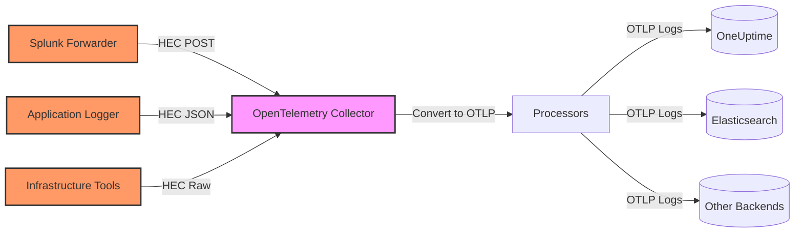
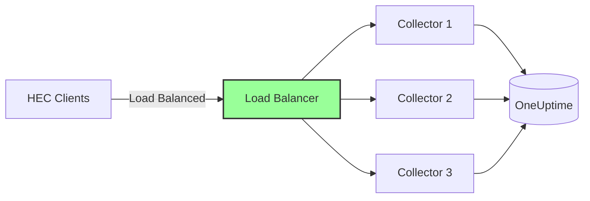

# How to Configure the Splunk HEC Receiver in the OpenTelemetry Collector

Author: [nawazdhandala](https://www.github.com/nawazdhandala)

Tags: OpenTelemetry, Collector, Splunk, HEC, Log, Event, Migration

Description: Comprehensive guide to configuring the Splunk HEC receiver in OpenTelemetry Collector for ingesting logs and events from Splunk forwarders and HTTP clients.

---

The Splunk HEC (HTTP Event Collector) receiver in the OpenTelemetry Collector allows you to accept logs and events in Splunk's HEC format, then process and route them to any OpenTelemetry-compatible backend. This receiver is essential for organizations migrating from Splunk or integrating systems that already send data using the HEC protocol.

By deploying the Splunk HEC receiver, you can maintain compatibility with existing Splunk forwarders, logging libraries, and integrations while gaining the flexibility of OpenTelemetry's vendor-neutral ecosystem and cost-effective storage options.

---

## What is the Splunk HEC Receiver?

The Splunk HEC receiver implements the Splunk HTTP Event Collector API, which is the standard method for sending logs and events to Splunk over HTTP/HTTPS. Originally designed to simplify log ingestion into Splunk, the HEC protocol has been adopted by many logging libraries, monitoring tools, and infrastructure components.

The OpenTelemetry Collector's Splunk HEC receiver accepts HEC-formatted data and converts it into OpenTelemetry log records, enabling you to:

- Migrate from Splunk to open-source or alternative backends without changing log sources
- Consolidate telemetry from Splunk forwarders and OpenTelemetry SDKs in a single pipeline
- Apply OpenTelemetry processors for filtering, sampling, and enrichment
- Route logs to multiple destinations based on content or metadata
- Eliminate per-GB Splunk licensing costs while preserving HEC integrations

**Supported HEC endpoints:**

- `/services/collector/event` - JSON HEC events
- `/services/collector/raw` - Raw text logs
- `/services/collector/health` - Health check endpoint

---

## Architecture Overview

The Splunk HEC receiver sits between your log sources and observability backends, accepting HEC-formatted data and converting it to OpenTelemetry logs:


```mermaid
graph LR
    A[Splunk Forwarder] -->|HEC POST| B[OpenTelemetry Collector]
    C[Application Logger] -->|HEC JSON| B
    D[Infrastructure Tools] -->|HEC Raw| B

    B -->|Convert to OTLP| E[Processors]
    E -->|OTLP Logs| F[(OneUptime)]
    E -->|OTLP Logs| G[(Elasticsearch)]
    E -->|OTLP Logs| H[(Other Backends)]

    style B fill:#f9f,stroke:#333,stroke-width:2px
    style A fill:#f96,stroke:#333,stroke-width:2px
    style C fill:#f96,stroke:#333,stroke-width:2px
    style D fill:#f96,stroke:#333,stroke-width:2px
```

This architecture allows you to maintain Splunk HEC compatibility while routing data to cost-effective backends, applying custom processing, and avoiding vendor lock-in.

---

## Prerequisites

Before configuring the Splunk HEC receiver, ensure you have:

1. **OpenTelemetry Collector Contrib** or a custom Collector build that includes the Splunk HEC receiver component
2. **Log sources configured to send HEC-formatted data** (Splunk forwarders, applications with HEC libraries)
3. **HEC tokens** for authentication (generated from your source configuration or created specifically for the Collector)
4. **Network connectivity** from log sources to the Collector endpoint

---

## Basic Configuration

The Splunk HEC receiver requires configuring an HTTP endpoint. Here's a minimal working configuration:

```yaml
# RECEIVERS: Define how telemetry enters the Collector

receivers:
  # Splunk HEC receiver listens for HTTP Event Collector formatted data
  splunk_hec:
    # HTTP endpoint for receiving HEC data
    endpoint: 0.0.0.0:8088

    # Preserve the incoming HEC token as resource metadata
    access_token_passthrough: true

# EXPORTERS: Define where logs are sent
exporters:
  # Export logs to OneUptime using OTLP
  otlphttp:
    endpoint: https://oneuptime.com/otlp
    headers:
      x-oneuptime-token: ${ONEUPTIME_TOKEN}

# SERVICE: Wire receivers to exporters
service:
  pipelines:
    # Logs pipeline: receive from Splunk HEC, export to OneUptime
    logs:
      receivers: [splunk_hec]
      exporters: [otlphttp]
```

**Configuration breakdown:**

- `endpoint`: The address and port where the receiver listens for HEC requests (Splunk's default HEC port is 8088)
- `access_token_passthrough`: When true, the receiver preserves the incoming `Authorization: Splunk <token>` value as the `com.splunk.hec.access_token` resource attribute. It does not validate tokens.

---

## Production Configuration with Authentication

For production deployments, keep token validation at a reverse proxy, load balancer, or Collector authenticator layer, because the Splunk HEC receiver itself does not maintain a token whitelist:

```yaml
receivers:
  splunk_hec:
    # Listen on all interfaces on port 8088
    endpoint: 0.0.0.0:8088

    # Do not propagate HEC tokens into telemetry attributes
    access_token_passthrough: false

    # Map HEC metadata into OpenTelemetry attributes
    hec_metadata_to_otel_attrs:
      source: "com.splunk.source"
      sourcetype: "com.splunk.sourcetype"
      index: "com.splunk.index"
      host: "host.name"

processors:
  # Protect Collector from memory exhaustion
  memory_limiter:
    limit_mib: 512
    spike_limit_mib: 128
    check_interval: 2s

  # Batch logs to reduce network overhead
  batch:
    send_batch_max_size: 1024
    timeout: 10s

  # Add resource attributes to identify the source
  resource:
    attributes:
      - key: service.name
        value: splunk-hec-logs
        action: upsert
      - key: deployment.environment
        value: production
        action: upsert

  # Enrich logs with additional context
  attributes:
    actions:
      # Normalize Splunk source field to semantic convention
      - key: log.file.path
        action: insert
        from_attribute: com.splunk.source

exporters:
  # Export to OneUptime with retry and timeout configuration
  otlphttp:
    endpoint: https://oneuptime.com/otlp
    headers:
      x-oneuptime-token: ${ONEUPTIME_TOKEN}
    retry_on_failure:
      enabled: true
      initial_interval: 5s
      max_interval: 30s
      max_elapsed_time: 300s
    timeout: 30s
    compression: gzip

service:
  # Enable telemetry for the Collector itself
  telemetry:
    logs:
      level: info
    metrics:
      level: normal
      readers:
        - pull:
            exporter:
              prometheus:
                host: localhost
                port: 8888

  pipelines:
    logs:
      receivers: [splunk_hec]
      processors: [memory_limiter, resource, attributes, batch]
      exporters: [otlphttp]
```

**Key security features:**

1. **Token validation:** Validate tokens before traffic reaches the receiver, such as at a reverse proxy, load balancer, or Collector authenticator layer
2. **Metadata mapping:** Extract Splunk HEC metadata fields (source, sourcetype, index, host) as OpenTelemetry attributes
3. **Resource attributes:** Add identifying information to all logs for better querying and filtering

---

## HEC Token Authentication

The Splunk HEC protocol uses tokens for authentication. Clients include the token in the `Authorization` header:

```text
Authorization: Splunk <token>
```

**Configuring token validation:**

The Splunk HEC receiver does not validate HEC tokens by itself. The `access_token_passthrough` setting only controls whether the token is preserved as telemetry metadata. For production deployments, implement token validation at the reverse proxy, load balancer, or authenticator layer.

**Using a reverse proxy (Nginx example):**

```nginx
server {
    listen 443 ssl;
    server_name hec.example.com;

    ssl_certificate /etc/ssl/certs/hec.crt;
    ssl_certificate_key /etc/ssl/private/hec.key;

    location /services/collector {
        # Validate HEC token
        if ($http_authorization != "Splunk your-secure-token-here") {
            return 401;
        }

        proxy_pass http://otel-collector:8088;
        proxy_set_header Host $host;
        proxy_set_header X-Real-IP $remote_addr;
    }
}
```

This approach provides an additional security layer and centralizes token management.

---

## Configuring Log Sources to Use the Receiver

After configuring the receiver, point your HEC clients to the Collector endpoint.

**Splunk Universal Forwarder (outputs.conf):**

```ini
# outputs.conf
[httpout]
httpEventCollectorToken = your-hec-token-here
uri = https://otel-collector.example.com:8088

[tcpout]
defaultGroup = httpout

[http]
# Increase timeout for large batches
timeout = 30
```

**Python logging with requests:**

```python
import requests
import json
import time

HEC_URL = "https://otel-collector.example.com:8088/services/collector/event"
HEC_TOKEN = "your-hec-token-here"

def send_log_to_hec(message, level="INFO", source="my-app"):
    """Send a log entry to Splunk HEC receiver."""
    headers = {
        "Authorization": f"Splunk {HEC_TOKEN}",
        "Content-Type": "application/json"
    }

    payload = {
        "time": int(time.time()),
        "event": {
            "message": message,
            "level": level
        },
        "source": source,
        "sourcetype": "application-logs",
        "host": "app-server-01"
    }

    response = requests.post(HEC_URL, headers=headers, data=json.dumps(payload))
    return response.status_code == 200

# Send a log
send_log_to_hec("User authentication successful", level="INFO")
```

**Node.js with splunk-logging library:**

```javascript
const SplunkLogger = require('splunk-logging').Logger;

const config = {
    token: 'your-hec-token-here',
    url: 'https://otel-collector.example.com:8088'
};

const logger = new SplunkLogger(config);

// Send a log event
logger.send({
    message: {
        level: 'INFO',
        text: 'Payment processed successfully',
        user_id: 12345,
        amount: 99.99
    },
    metadata: {
        source: 'payment-service',
        sourcetype: 'payment-logs',
        host: 'payment-server-03'
    }
});

logger.flush();
```

**Curl example for testing:**

```bash
# Send an event to the HEC receiver
curl -X POST \
  https://otel-collector.example.com:8088/services/collector/event \
  -H "Authorization: Splunk your-hec-token-here" \
  -H "Content-Type: application/json" \
  -d '{
    "time": 1675270800,
    "event": {
      "message": "Test log entry from curl",
      "severity": "INFO"
    },
    "source": "manual-test",
    "sourcetype": "test-logs",
    "host": "test-host"
  }'
```

---

## Understanding HEC Data Format

The Splunk HEC protocol supports two primary formats: event format and raw format.

**Event format (JSON):**

The event format sends structured JSON with metadata:

```json
{
  "time": 1675270800,
  "event": {
    "message": "User login successful",
    "user_id": "user123",
    "ip_address": "192.0.2.1"
  },
  "source": "auth-service",
  "sourcetype": "auth-logs",
  "host": "auth-server-01",
  "index": "main"
}
```

**Raw format (text):**

The raw format sends plain text logs:

```text
2026-02-06 10:30:45 INFO User login successful user_id=user123 ip=192.0.2.1
```

The receiver accepts JSON HEC events on non-raw paths and treats requests sent to `raw_path` (default `/services/collector/raw`) as raw log data. For raw format, the entire text becomes the log body, and metadata is extracted from URL parameters or headers.

**Field mapping to OpenTelemetry:**

The receiver maps HEC fields to OpenTelemetry log attributes:

- `time` → Log record timestamp
- `event` → Log body (can be string or structured object)
- `source` → `com.splunk.source` attribute
- `sourcetype` → `com.splunk.sourcetype` attribute
- `index` → `com.splunk.index` attribute
- `host` → `host.name` attribute

---

## Advanced Configuration with Routing

You can route logs to different backends based on HEC metadata using the routing connector:

```yaml
receivers:
  splunk_hec:
    endpoint: 0.0.0.0:8088
    access_token_passthrough: false

processors:
  batch:

connectors:
  # Route based on sourcetype
  routing:
    default_pipelines: [logs/default]
    table:
      - context: log
        condition: attributes["com.splunk.sourcetype"] == "security-logs"
        pipelines: [logs/security]
      - context: log
        condition: attributes["com.splunk.sourcetype"] == "application-logs"
        pipelines: [logs/app]
      - context: log
        condition: attributes["com.splunk.sourcetype"] == "infrastructure-logs"
        pipelines: [logs/infra]

exporters:
  # Security logs to SIEM
  otlphttp/security:
    endpoint: https://siem.example.com/otlp
    headers:
      authorization: Bearer ${SIEM_TOKEN}

  # Application logs to OneUptime
  otlphttp/app:
    endpoint: https://oneuptime.com/otlp
    headers:
      x-oneuptime-token: ${ONEUPTIME_TOKEN}

  # Infrastructure logs to cost-effective storage
  otlphttp/infra:
    endpoint: https://s3-compatible-storage.example.com/otlp
    headers:
      authorization: Bearer ${STORAGE_TOKEN}

  # Default destination for unmatched logs
  otlphttp/default:
    endpoint: https://oneuptime.com/otlp
    headers:
      x-oneuptime-token: ${ONEUPTIME_TOKEN}

service:
  pipelines:
    logs/in:
      receivers: [splunk_hec]
      processors: [batch]
      exporters: [routing]
    logs/security:
      receivers: [routing]
      exporters: [otlphttp/security]
    logs/app:
      receivers: [routing]
      exporters: [otlphttp/app]
    logs/infra:
      receivers: [routing]
      exporters: [otlphttp/infra]
    logs/default:
      receivers: [routing]
      exporters: [otlphttp/default]
```

This configuration demonstrates intelligent routing based on log type, enabling cost optimization by sending different log categories to appropriate storage tiers.

---

## Filtering and Sampling

For high-volume environments, apply filtering and sampling to reduce costs and noise:

```yaml
receivers:
  splunk_hec:
    endpoint: 0.0.0.0:8088

processors:
  # Drop debug-level logs, noisy health checks, and errors from the sampled pipeline
  filter/sampled:
    error_mode: ignore
    log_conditions:
      - log.severity_text == "DEBUG"
      - IsMatch(String(log.body), ".*health.*check.*")
      - IsMatch(String(log.body), ".*heartbeat.*")
      - log.severity_text == "ERROR" or log.severity_text == "FATAL" or IsMatch(String(log.body), ".*ERROR.*") or IsMatch(String(log.body), ".*FATAL.*") or IsMatch(String(log.body), ".*exception.*")

  # Sample high-volume log sources (keep 10%)
  probabilistic_sampler:
    sampling_percentage: 10
    hash_seed: 42
    attribute_source: record
    from_attribute: com.splunk.source
    fail_closed: false

  # Always keep error logs regardless of sampling
  filter/errors:
    error_mode: ignore
    log_conditions:
      - not (log.severity_text == "ERROR" or log.severity_text == "FATAL" or IsMatch(String(log.body), ".*ERROR.*") or IsMatch(String(log.body), ".*FATAL.*") or IsMatch(String(log.body), ".*exception.*"))

exporters:
  otlphttp:
    endpoint: https://oneuptime.com/otlp
    headers:
      x-oneuptime-token: ${ONEUPTIME_TOKEN}

service:
  pipelines:
    # Sampled logs pipeline (excludes errors)
    logs/sampled:
      receivers: [splunk_hec]
      processors: [filter/sampled, probabilistic_sampler, batch]
      exporters: [otlphttp]

    # Error logs pipeline (always kept)
    logs/errors:
      receivers: [splunk_hec]
      processors: [filter/errors, batch]
      exporters: [otlphttp]
```

This multi-pipeline approach ensures critical logs are always retained while reducing the volume of routine logs.

---

## Migration from Splunk Enterprise

When migrating from Splunk Enterprise to an OpenTelemetry-based stack, the HEC receiver provides a smooth transition path.

**Migration strategy:**

1. **Deploy the OpenTelemetry Collector** with the Splunk HEC receiver configured
2. **Plan a validation period** by mirroring HEC traffic at a proxy/load balancer layer or dual-writing from application clients that support multiple HEC destinations
3. **Validate data quality** in your new backend
4. **Gradually shift sources** by updating forwarder configurations
5. **Decommission Splunk** once all sources are migrated

**Cutover configuration (outputs.conf):**

```ini
# outputs.conf - Send HTTP output to the OpenTelemetry Collector
[httpout]
httpEventCollectorToken = otel-token
uri = https://otel-collector.example.com:8088
```

Universal Forwarder `httpout` is configured as a single HTTP output. If you need a temporary dual-write period for HEC traffic, use an HTTP proxy or load balancer layer that can mirror requests, or dual-write from the original application clients where they support multiple HEC destinations.

---

## Performance Tuning

The Splunk HEC receiver can handle high throughput with proper configuration.

**High-volume configuration:**

```yaml
receivers:
  splunk_hec:
    endpoint: 0.0.0.0:8088

    # Increase maximum request body size for large batches
    max_request_body_size: 10485760  # 10 MB

    # Enable raw endpoint for text logs
    raw_path: "/services/collector/raw"

    # Health check endpoint
    health_path: "/services/collector/health"

processors:
  # Increase memory limit for high-volume processing
  memory_limiter:
    limit_mib: 2048
    spike_limit_mib: 512
    check_interval: 1s

  # Larger batch sizes for better throughput
  batch:
    send_batch_max_size: 4096
    send_batch_size: 2048
    timeout: 5s

exporters:
  otlphttp:
    endpoint: https://oneuptime.com/otlp
    headers:
      x-oneuptime-token: ${ONEUPTIME_TOKEN}

    # Increase sending queue for burst handling
    sending_queue:
      enabled: true
      num_consumers: 20
      queue_size: 10000

    # Retry configuration for reliability
    retry_on_failure:
      enabled: true
      initial_interval: 1s
      max_interval: 30s
      max_elapsed_time: 300s

service:
  pipelines:
    logs:
      receivers: [splunk_hec]
      processors: [memory_limiter, batch]
      exporters: [otlphttp]
```

**Horizontal scaling:**

For extremely high volumes, deploy multiple Collector instances behind a load balancer:


```mermaid
graph LR
    A[HEC Clients] -->|Load Balanced| B[Load Balancer]
    B --> C[Collector 1]
    B --> D[Collector 2]
    B --> E[Collector 3]

    C --> F[(OneUptime)]
    D --> F
    E --> F

    style B fill:#9f9,stroke:#333,stroke-width:2px
```

Configure your HEC clients to send to the load balancer, which distributes traffic across Collectors for optimal performance.

---

## Monitoring and Observability

Monitor the Splunk HEC receiver to ensure healthy operation and identify issues early.

**Enable Collector metrics:**

```yaml
service:
  telemetry:
    logs:
      level: info
    metrics:
      level: normal
      readers:
        - pull:
            exporter:
              prometheus:
                host: 0.0.0.0
                port: 8888
                without_type_suffix: true
                without_units: true
```

**Key metrics to monitor:**

- `otelcol_receiver_accepted_log_records`: Logs successfully received from HEC clients
- `otelcol_receiver_refused_log_records`: Logs rejected (authentication failures, invalid format)
- `otelcol_exporter_send_failed_log_records`: Logs that failed to export
- `otelcol_processor_batch_batch_send_size`: Size of exported batches (indicates batching efficiency)

**Health check endpoint:**

The receiver exposes a health check endpoint at `/services/collector/health`:

```bash
# Check receiver health
curl http://otel-collector.example.com:8088/services/collector/health

# Expected response: 200 OK with JSON body
{
  "text": "HEC is healthy",
  "code": 17
}
```

Use this endpoint for load balancer health checks and monitoring systems.

---

## Troubleshooting Common Issues

**1. 401 Unauthorized errors:**

Clients receive 401 responses when tokens don't match or are missing at the reverse proxy, load balancer, or authenticator layer.

**Solution:**
- Verify the token in the client configuration matches the proxy, load balancer, or authenticator configuration
- Ensure the `Authorization` header format is correct: `Splunk <token>`
- Check proxy or authenticator logs for authentication errors

**2. Logs not appearing in backend:**

Logs are received but don't appear in the destination backend.

**Solution:**
- Enable debug logging to see raw log data
- Check exporter configuration (endpoint, authentication)
- Verify processors aren't filtering out logs unintentionally

```yaml
service:
  telemetry:
    logs:
      level: debug

exporters:
  debug:
    verbosity: detailed
```

**3. High memory usage:**

The Collector consumes excessive memory under load.

**Solution:**
- Reduce batch sizes to limit in-memory buffering
- Lower memory limiter thresholds
- Increase export frequency to clear buffers faster

```yaml
processors:
  memory_limiter:
    limit_mib: 512
    spike_limit_mib: 128

  batch:
    send_batch_max_size: 1024
    timeout: 5s
```

**4. Slow ingestion / timeouts:**

HEC clients experience timeouts when sending logs.

**Solution:**
- Increase `max_request_body_size` for large batches
- Scale horizontally with multiple Collectors
- Optimize exporter performance (increase concurrency, adjust retry settings)

---

## Security Best Practices

**1. Enable TLS:**

Always use HTTPS in production to encrypt data in transit. Place the receiver behind a reverse proxy or load balancer with TLS termination:

```yaml
# Collector listens on HTTP internally
receivers:
  splunk_hec:
    endpoint: 0.0.0.0:8088
```

The reverse proxy handles TLS and forwards to the Collector over HTTP on the internal network.

**2. Token rotation:**

Regularly rotate HEC tokens to minimize the impact of token compromise:

- Generate new tokens
- Update client configurations gradually
- Deprecate old tokens after a grace period

**3. Network segmentation:**

Restrict access to the HEC endpoint using firewall rules or network policies. Only allow traffic from known log sources.

**4. Rate limiting:**

Implement rate limiting at the reverse proxy or load balancer to prevent abuse:

```nginx
# Nginx rate limiting example
limit_req_zone $binary_remote_addr zone=hec_limit:10m rate=100r/s;

server {
    location /services/collector {
        limit_req zone=hec_limit burst=200 nodelay;
        proxy_pass http://otel-collector:8088;
    }
}
```

---

## Integration with OneUptime

OneUptime provides native support for OpenTelemetry logs, making it an ideal backend for HEC-ingested data:

```yaml
exporters:
  otlphttp:
    endpoint: https://oneuptime.com/otlp
    headers:
      x-oneuptime-token: ${ONEUPTIME_TOKEN}
    compression: gzip

service:
  pipelines:
    logs:
      receivers: [splunk_hec]
      processors: [memory_limiter, resource, batch]
      exporters: [otlphttp]
```

Benefits of using OneUptime as your backend:

- **Cost-effective storage:** No per-GB pricing like Splunk
- **Log correlation:** Correlate logs with traces and metrics from the same services
- **Flexible retention:** Configure retention policies based on your requirements
- **Full-text search:** Query logs using the built-in log explorer
- **Alerting:** Create alerts based on log patterns and anomalies

---

## Related Topics

For more information on OpenTelemetry Collector receivers and log management:

- [OpenTelemetry Collector: What It Is, When You Need It, and When You Don't](https://oneuptime.com/blog/post/2025-09-18-what-is-opentelemetry-collector-and-why-use-one/view)
- [How to Configure the Datadog Receiver in the OpenTelemetry Collector](https://oneuptime.com/blog/post/2026-02-06-datadog-receiver-opentelemetry-collector/view)
- [How to Configure the Loki Receiver in the OpenTelemetry Collector](https://oneuptime.com/blog/post/2026-02-06-loki-receiver-opentelemetry-collector/view)
- [How to Structure Logs Properly in OpenTelemetry](https://oneuptime.com/blog/post/2025-08-28-how-to-structure-logs-properly-in-opentelemetry/view)

---

## Conclusion

The Splunk HEC receiver provides a practical migration path from Splunk to OpenTelemetry-based observability. By accepting HEC-formatted data and converting it to OpenTelemetry logs, it allows you to preserve existing integrations while gaining the benefits of vendor neutrality, cost control, and flexible routing.

Configure the receiver with proper authentication and security, add processors for filtering and enrichment, and export to cost-effective backends like OneUptime. This approach delivers comprehensive log management without the constraints of proprietary formats or per-GB licensing costs.

Whether you're conducting a full migration from Splunk Enterprise or simply integrating HEC-based log sources into your OpenTelemetry stack, the Splunk HEC receiver provides the compatibility and flexibility needed for modern observability.
