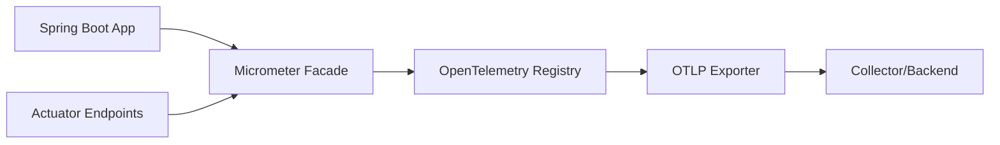

# How to Export Spring Boot Actuator Metrics via OTLP with OpenTelemetry

Author: [nawazdhandala](https://www.github.com/nawazdhandala)

Tags: OpenTelemetry, Spring Boot, Actuator, Metrics, OTLP, Micrometer

Description: Learn how to export Spring Boot Actuator metrics using OpenTelemetry Protocol (OTLP) for unified observability with traces and logs.

Spring Boot Actuator provides production-ready metrics out of the box, but exporting them via OTLP creates a unified observability pipeline. This guide shows you how to bridge Micrometer metrics with OpenTelemetry's standardized export mechanism.

## Understanding the Metrics Stack

Spring Boot uses Micrometer as its metrics facade, similar to how SLF4J works for logging. OpenTelemetry provides a Micrometer registry that converts Micrometer metrics into OpenTelemetry metrics and exports them via OTLP to your backend.



## Dependencies Configuration

Add the OpenTelemetry Micrometer bridge to your `pom.xml`:

```xml
<dependencies>
    <!-- Spring Boot Actuator for metrics -->
    <dependency>
        <groupId>org.springframework.boot</groupId>
        <artifactId>spring-boot-starter-actuator</artifactId>
    </dependency>

    <!-- OpenTelemetry Micrometer bridge -->
    <dependency>
        <groupId>io.opentelemetry</groupId>
        <artifactId>opentelemetry-micrometer-1.5</artifactId>
        <version>1.33.0-alpha</version>
    </dependency>

    <!-- OpenTelemetry SDK for metrics -->
    <dependency>
        <groupId>io.opentelemetry</groupId>
        <artifactId>opentelemetry-sdk</artifactId>
        <version>1.33.0</version>
    </dependency>

    <!-- OTLP exporter -->
    <dependency>
        <groupId>io.opentelemetry</groupId>
        <artifactId>opentelemetry-exporter-otlp</artifactId>
        <version>1.33.0</version>
    </dependency>
</dependencies>
```

## Application Configuration

Configure your `application.yml` to expose metrics and set service information:

```yaml
spring:
  application:
    name: payment-service

management:
  # Expose actuator endpoints
  endpoints:
    web:
      exposure:
        include: health,info,metrics,prometheus

  # Enable all metrics
  metrics:
    enable:
      jvm: true
      process: true
      system: true
      tomcat: true
      hikaricp: true
    export:
      # Disable Prometheus export if using only OTLP
      prometheus:
        enabled: false

    # Add common tags to all metrics
    tags:
      environment: production
      region: us-east-1

# OpenTelemetry configuration
otel:
  service:
    name: ${spring.application.name}
  exporter:
    otlp:
      endpoint: http://localhost:4318
      protocol: http/protobuf
  metrics:
    export:
      interval: 60s
```

## OpenTelemetry Metrics Configuration

Create a configuration class that sets up the OpenTelemetry SDK with OTLP export:

```java
package com.example.config;

import io.micrometer.core.instrument.MeterRegistry;
import io.opentelemetry.api.OpenTelemetry;
import io.opentelemetry.api.common.Attributes;
import io.opentelemetry.exporter.otlp.http.metrics.OtlpHttpMetricExporter;
import io.opentelemetry.exporter.otlp.metrics.OtlpGrpcMetricExporter;
import io.opentelemetry.instrumentation.micrometer.v1_5.OpenTelemetryMeterRegistry;
import io.opentelemetry.sdk.OpenTelemetrySdk;
import io.opentelemetry.sdk.metrics.SdkMeterProvider;
import io.opentelemetry.sdk.metrics.export.PeriodicMetricReader;
import io.opentelemetry.sdk.resources.Resource;
import io.opentelemetry.semconv.ResourceAttributes;
import org.springframework.beans.factory.annotation.Value;
import org.springframework.context.annotation.Bean;
import org.springframework.context.annotation.Configuration;

import java.time.Duration;

@Configuration
public class MetricsConfig {

    @Value("${otel.service.name}")
    private String serviceName;

    @Value("${otel.exporter.otlp.endpoint}")
    private String otlpEndpoint;

    @Value("${otel.exporter.otlp.protocol:http/protobuf}")
    private String protocol;

    /**
     * Creates the OpenTelemetry SDK instance configured for metrics.
     * This SDK will be used to create the Micrometer registry.
     */
    @Bean
    public OpenTelemetry openTelemetry() {
        // Define resource attributes that identify this service
        Resource resource = Resource.getDefault()
            .merge(Resource.create(
                Attributes.builder()
                    .put(ResourceAttributes.SERVICE_NAME, serviceName)
                    .put(ResourceAttributes.SERVICE_VERSION, "1.0.0")
                    .put(ResourceAttributes.DEPLOYMENT_ENVIRONMENT, "production")
                    .build()
            ));

        // Choose exporter based on protocol
        PeriodicMetricReader metricReader;
        if ("grpc".equalsIgnoreCase(protocol)) {
            metricReader = PeriodicMetricReader.builder(
                OtlpGrpcMetricExporter.builder()
                    .setEndpoint(otlpEndpoint)
                    .setTimeout(Duration.ofSeconds(10))
                    .build()
            )
            .setInterval(Duration.ofSeconds(60))
            .build();
        } else {
            // HTTP/protobuf protocol
            metricReader = PeriodicMetricReader.builder(
                OtlpHttpMetricExporter.builder()
                    .setEndpoint(otlpEndpoint + "/v1/metrics")
                    .setTimeout(Duration.ofSeconds(10))
                    .build()
            )
            .setInterval(Duration.ofSeconds(60))
            .build();
        }

        // Build the meter provider with the metric reader
        SdkMeterProvider meterProvider = SdkMeterProvider.builder()
            .setResource(resource)
            .registerMetricReader(metricReader)
            .build();

        // Create and return the OpenTelemetry SDK
        return OpenTelemetrySdk.builder()
            .setMeterProvider(meterProvider)
            .build();
    }

    /**
     * Creates a Micrometer MeterRegistry that bridges to OpenTelemetry.
     * This allows Spring Boot Actuator metrics to be exported via OTLP.
     */
    @Bean
    public MeterRegistry otelMeterRegistry(OpenTelemetry openTelemetry) {
        return OpenTelemetryMeterRegistry.builder(openTelemetry)
            .build();
    }
}
```

## Custom Metrics with Micrometer

You can still use Micrometer's API to create custom metrics, and they'll be exported via OTLP:

```java
package com.example.service;

import io.micrometer.core.annotation.Timed;
import io.micrometer.core.instrument.Counter;
import io.micrometer.core.instrument.MeterRegistry;
import io.micrometer.core.instrument.Timer;
import org.springframework.stereotype.Service;

import java.util.concurrent.TimeUnit;

@Service
public class PaymentService {

    private final Counter paymentCounter;
    private final Counter failedPaymentCounter;
    private final Timer paymentProcessingTimer;
    private final MeterRegistry registry;

    public PaymentService(MeterRegistry registry) {
        this.registry = registry;

        // Counter for successful payments
        this.paymentCounter = Counter.builder("payments.processed")
            .description("Total number of processed payments")
            .tag("type", "success")
            .register(registry);

        // Counter for failed payments
        this.failedPaymentCounter = Counter.builder("payments.processed")
            .description("Total number of processed payments")
            .tag("type", "failed")
            .register(registry);

        // Timer for payment processing duration
        this.paymentProcessingTimer = Timer.builder("payments.processing.time")
            .description("Time taken to process payments")
            .register(registry);
    }

    @Timed(value = "payments.process", description = "Payment processing time")
    public void processPayment(String orderId, double amount) {
        // Record processing time manually
        Timer.Sample sample = Timer.start(registry);

        try {
            // Simulate payment processing
            Thread.sleep((long) (Math.random() * 1000));

            if (Math.random() > 0.1) {
                paymentCounter.increment();

                // Record gauge for payment amount
                registry.gauge("payments.amount", amount);
            } else {
                failedPaymentCounter.increment();
                throw new RuntimeException("Payment failed");
            }
        } catch (InterruptedException e) {
            Thread.currentThread().interrupt();
            failedPaymentCounter.increment();
        } finally {
            sample.stop(paymentProcessingTimer);
        }
    }

    /**
     * Example of distribution summary for tracking payment amounts
     */
    public void recordPaymentAmount(double amount, String currency) {
        registry.summary("payments.amount.distribution",
            "currency", currency,
            "range", getAmountRange(amount))
            .record(amount);
    }

    private String getAmountRange(double amount) {
        if (amount < 10) return "small";
        if (amount < 100) return "medium";
        if (amount < 1000) return "large";
        return "xlarge";
    }
}
```

## Built-in Actuator Metrics Available

Spring Boot Actuator automatically exposes these metric categories that will be exported via OTLP:

**JVM Metrics:**
- `jvm.memory.used` - Memory usage by memory pool
- `jvm.memory.committed` - Committed memory
- `jvm.gc.pause` - Garbage collection pause times
- `jvm.threads.live` - Current thread count

**System Metrics:**
- `system.cpu.usage` - System CPU usage
- `process.cpu.usage` - Process CPU usage
- `system.load.average.1m` - System load average

**Application Metrics:**
- `http.server.requests` - HTTP request metrics
- `hikaricp.connections.active` - Database connection pool metrics
- `tomcat.sessions.active.current` - Active sessions

## Metric Data Type Conversion

Understanding how Micrometer metrics map to OpenTelemetry:

```java
package com.example.demo;

import io.micrometer.core.instrument.*;
import org.springframework.stereotype.Component;

/**
 * Demonstrates different metric types and how they map to OpenTelemetry.
 */
@Component
public class MetricTypesDemo {

    private final MeterRegistry registry;

    public MetricTypesDemo(MeterRegistry registry) {
        this.registry = registry;
        initializeMetrics();
    }

    private void initializeMetrics() {
        // Counter -> OpenTelemetry Sum (monotonic)
        Counter.builder("api.calls.total")
            .description("Total API calls")
            .tag("endpoint", "/api/users")
            .register(registry);

        // Gauge -> OpenTelemetry Gauge
        registry.gauge("queue.size", Tags.of("queue", "payments"),
            this, MetricTypesDemo::getQueueSize);

        // Timer -> OpenTelemetry Histogram
        Timer.builder("db.query.duration")
            .description("Database query execution time")
            .publishPercentiles(0.5, 0.95, 0.99)
            .register(registry);

        // Distribution Summary -> OpenTelemetry Histogram
        DistributionSummary.builder("response.size")
            .description("HTTP response size in bytes")
            .baseUnit("bytes")
            .publishPercentiles(0.5, 0.95)
            .register(registry);

        // LongTaskTimer -> OpenTelemetry Sum (duration) + Gauge (active)
        LongTaskTimer.builder("batch.job.duration")
            .description("Long-running batch job duration")
            .register(registry);
    }

    private double getQueueSize() {
        // Return actual queue size
        return 42.0;
    }
}
```

## Filtering and Customizing Metrics

Control which metrics are exported and add custom transformations:

```java
package com.example.config;

import io.micrometer.core.instrument.Meter;
import io.micrometer.core.instrument.config.MeterFilter;
import io.micrometer.core.instrument.distribution.DistributionStatisticConfig;
import org.springframework.context.annotation.Bean;
import org.springframework.context.annotation.Configuration;

import java.time.Duration;

@Configuration
public class MetricFilterConfig {

    /**
     * Configures filters to control metric export behavior.
     */
    @Bean
    public MeterFilter meterFilter() {
        return MeterFilter.maximumAllowableMetrics(1000);
    }

    /**
     * Denies specific metrics from being exported.
     */
    @Bean
    public MeterFilter denyMetricFilter() {
        return MeterFilter.deny(id ->
            id.getName().startsWith("tomcat.") &&
            id.getName().contains("debug")
        );
    }

    /**
     * Adds common tags to all metrics.
     */
    @Bean
    public MeterFilter commonTagsFilter() {
        return MeterFilter.commonTags("datacenter", "us-east-1");
    }

    /**
     * Configures histogram buckets for specific metrics.
     */
    @Bean
    public MeterFilter histogramConfigFilter() {
        return new MeterFilter() {
            @Override
            public DistributionStatisticConfig configure(
                Meter.Id id,
                DistributionStatisticConfig config
            ) {
                if (id.getName().startsWith("http.server.requests")) {
                    return DistributionStatisticConfig.builder()
                        .percentilesHistogram(true)
                        .percentiles(0.5, 0.95, 0.99)
                        .serviceLevelObjectives(
                            Duration.ofMillis(100).toNanos(),
                            Duration.ofMillis(500).toNanos(),
                            Duration.ofSeconds(1).toNanos(),
                            Duration.ofSeconds(5).toNanos()
                        )
                        .minimumExpectedValue(Duration.ofMillis(1).toNanos())
                        .maximumExpectedValue(Duration.ofSeconds(10).toNanos())
                        .build()
                        .merge(config);
                }
                return config;
            }
        };
    }
}
```

## Viewing Metrics

Query your metrics using the Actuator endpoint during development:

```bash
# List all available metrics
curl http://localhost:8080/actuator/metrics

# View specific metric
curl http://localhost:8080/actuator/metrics/jvm.memory.used

# View metric with tags
curl http://localhost:8080/actuator/metrics/http.server.requests?tag=uri:/api/users
```

## Troubleshooting Export Issues

Enable debug logging to diagnose OTLP export problems:

```yaml
logging:
  level:
    io.opentelemetry: DEBUG
    io.micrometer: DEBUG
    io.opentelemetry.exporter.otlp: TRACE
```

Common issues and solutions:

**Metrics not appearing:** Verify the OTLP endpoint is accessible and the periodic reader interval has elapsed (default 60 seconds).

**High cardinality warnings:** Limit tag values to avoid creating too many unique metric series. Use `MeterFilter.maximumAllowableMetrics()` to set limits.

**Missing Actuator metrics:** Ensure the appropriate management endpoints are enabled and the metrics are not being filtered out.

**Wrong metric types:** Check that your Micrometer metric type maps correctly to OpenTelemetry's data model (Counter to Sum, Gauge to Gauge, Timer to Histogram).

## Performance Considerations

Exporting metrics via OTLP has minimal overhead, but consider these optimizations:

- Set appropriate export intervals (60 seconds is usually sufficient)
- Use histogram buckets wisely to avoid excessive memory usage
- Filter out unused metrics to reduce export payload size
- Enable gzip compression for OTLP HTTP exports
- Use batch processing for high-throughput scenarios

By bridging Spring Boot Actuator metrics with OpenTelemetry's OTLP export, you create a unified observability pipeline that correlates metrics with traces and logs, giving you complete visibility into your application's behavior.
