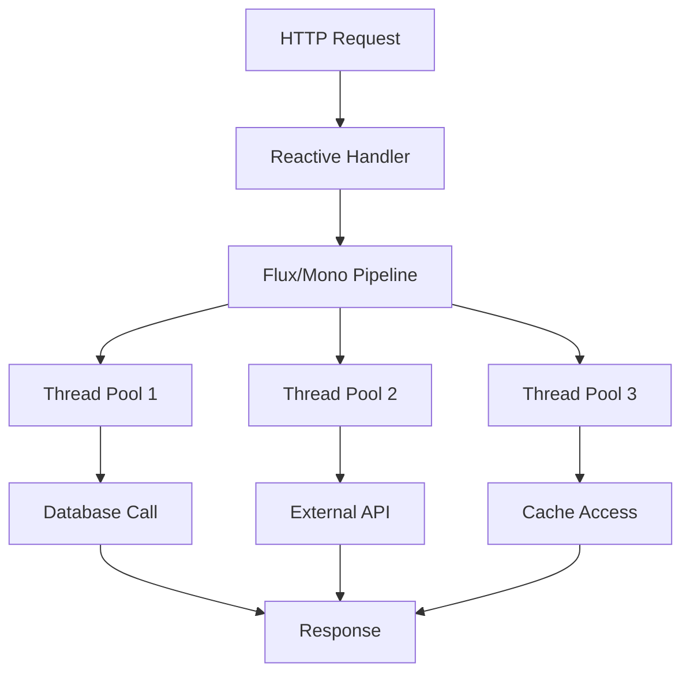

# How to Instrument Spring WebFlux Reactive Applications with OpenTelemetry

Author: [nawazdhandala](https://www.github.com/nawazdhandala)

Tags: OpenTelemetry, Spring WebFlux, Reactive, Java, Tracing, Project Reactor

Description: Learn how to properly instrument reactive Spring WebFlux applications with OpenTelemetry for distributed tracing across asynchronous operations.

Reactive programming with Spring WebFlux introduces unique challenges for distributed tracing. Context propagation across async boundaries requires special handling to maintain trace continuity. This guide shows you how to instrument WebFlux applications correctly.

## The Reactive Context Challenge

Traditional imperative code uses thread-local storage for trace context, but reactive streams execute on multiple threads. OpenTelemetry must bridge this gap.



Context must flow through all operators and thread switches.

## Dependencies Configuration

Add WebFlux and OpenTelemetry dependencies to `pom.xml`:

```xml
<dependencies>
    <!-- Spring WebFlux for reactive web applications -->
    <dependency>
        <groupId>org.springframework.boot</groupId>
        <artifactId>spring-boot-starter-webflux</artifactId>
    </dependency>

    <!-- OpenTelemetry Java agent instrumentation -->
    <dependency>
        <groupId>io.opentelemetry.instrumentation</groupId>
        <artifactId>opentelemetry-spring-webflux-5.3</artifactId>
        <version>1.33.0-alpha</version>
    </dependency>

    <!-- OpenTelemetry API for manual instrumentation -->
    <dependency>
        <groupId>io.opentelemetry</groupId>
        <artifactId>opentelemetry-api</artifactId>
        <version>1.33.0</version>
    </dependency>

    <!-- Reactor context propagation -->
    <dependency>
        <groupId>io.micrometer</groupId>
        <artifactId>context-propagation</artifactId>
        <version>1.1.1</version>
    </dependency>

    <!-- WebClient for reactive HTTP clients -->
    <dependency>
        <groupId>org.springframework.boot</groupId>
        <artifactId>spring-boot-starter-webflux</artifactId>
    </dependency>
</dependencies>
```

## Basic WebFlux Controller with Auto-Instrumentation

WebFlux controllers are automatically instrumented when using the OpenTelemetry Java agent:

```java
package com.example.controller;

import com.example.service.ProductService;
import org.springframework.web.bind.annotation.*;
import reactor.core.publisher.Flux;
import reactor.core.publisher.Mono;

/**
 * Reactive REST controller automatically instrumented by OpenTelemetry.
 * Each incoming request creates a root span.
 */
@RestController
@RequestMapping("/api/products")
public class ProductController {

    private final ProductService productService;

    public ProductController(ProductService productService) {
        this.productService = productService;
    }

    /**
     * Returns a single product as a Mono.
     * The trace context flows through the reactive pipeline.
     */
    @GetMapping("/{id}")
    public Mono<Product> getProduct(@PathVariable String id) {
        return productService.findById(id);
    }

    /**
     * Returns multiple products as a Flux.
     * All emitted items share the same trace context.
     */
    @GetMapping
    public Flux<Product> getAllProducts(
        @RequestParam(defaultValue = "electronics") String category
    ) {
        return productService.findByCategory(category);
    }

    /**
     * Creates a product with reactive request body.
     */
    @PostMapping
    public Mono<Product> createProduct(@RequestBody Mono<Product> productMono) {
        return productMono
            .flatMap(productService::save);
    }

    /**
     * Complex pipeline with multiple transformations.
     */
    @GetMapping("/search")
    public Flux<Product> searchProducts(@RequestParam String query) {
        return productService.search(query)
            .filter(product -> product.getPrice() > 0)
            .map(this::enrichProduct)
            .take(10);
    }

    private Product enrichProduct(Product product) {
        // Enrichment logic
        return product;
    }
}
```

## Manual Instrumentation in Reactive Services

Add custom spans to reactive operations for deeper visibility:

```java
package com.example.service;

import io.opentelemetry.api.OpenTelemetry;
import io.opentelemetry.api.trace.Span;
import io.opentelemetry.api.trace.Tracer;
import io.opentelemetry.context.Context;
import org.springframework.stereotype.Service;
import reactor.core.publisher.Flux;
import reactor.core.publisher.Mono;

/**
 * Reactive service with custom OpenTelemetry instrumentation.
 */
@Service
public class ProductService {

    private final Tracer tracer;
    private final ProductRepository repository;
    private final PricingService pricingService;

    public ProductService(
        OpenTelemetry openTelemetry,
        ProductRepository repository,
        PricingService pricingService
    ) {
        this.tracer = openTelemetry.getTracer("com.example.product", "1.0.0");
        this.repository = repository;
        this.pricingService = pricingService;
    }

    /**
     * Wraps a Mono operation with a custom span.
     * The span is created before subscription and ended on completion.
     */
    public Mono<Product> findById(String id) {
        return Mono.defer(() -> {
            // Capture current context
            Context parentContext = Context.current();

            // Create span
            Span span = tracer.spanBuilder("ProductService.findById")
                .setParent(parentContext)
                .startSpan();

            span.setAttribute("product.id", id);

            return repository.findById(id)
                .doOnSuccess(product -> {
                    if (product != null) {
                        span.setAttribute("product.name", product.getName());
                        span.setAttribute("product.category", product.getCategory());
                    }
                })
                .doOnError(error -> {
                    span.recordException(error);
                    span.setStatus(io.opentelemetry.api.trace.StatusCode.ERROR);
                })
                .doFinally(signalType -> span.end());
        });
    }

    /**
     * Flux operation with span covering the entire stream.
     */
    public Flux<Product> findByCategory(String category) {
        return Flux.defer(() -> {
            Context parentContext = Context.current();

            Span span = tracer.spanBuilder("ProductService.findByCategory")
                .setParent(parentContext)
                .startSpan();

            span.setAttribute("product.category", category);

            return repository.findByCategory(category)
                .doOnNext(product ->
                    span.addEvent("product_fetched",
                        io.opentelemetry.api.common.Attributes.builder()
                            .put("product.id", product.getId())
                            .build()
                    )
                )
                .doOnComplete(() ->
                    span.setStatus(io.opentelemetry.api.trace.StatusCode.OK)
                )
                .doOnError(error -> {
                    span.recordException(error);
                    span.setStatus(io.opentelemetry.api.trace.StatusCode.ERROR);
                })
                .doFinally(signalType -> span.end());
        });
    }

    /**
     * Complex reactive pipeline with multiple spans for different stages.
     */
    public Mono<Product> createProductWithPricing(Product product) {
        return Mono.defer(() -> {
            Context parentContext = Context.current();

            Span mainSpan = tracer.spanBuilder("ProductService.createWithPricing")
                .setParent(parentContext)
                .startSpan();

            mainSpan.setAttribute("product.name", product.getName());

            return Mono.just(product)
                .flatMap(this::validateProduct)
                .flatMap(p -> pricingService.calculatePrice(p)
                    .map(price -> {
                        p.setPrice(price);
                        return p;
                    })
                )
                .flatMap(repository::save)
                .doOnSuccess(saved -> {
                    mainSpan.setAttribute("product.id", saved.getId());
                    mainSpan.addEvent("product_created");
                })
                .doOnError(error -> {
                    mainSpan.recordException(error);
                    mainSpan.setStatus(io.opentelemetry.api.trace.StatusCode.ERROR);
                })
                .doFinally(signalType -> mainSpan.end());
        });
    }

    private Mono<Product> validateProduct(Product product) {
        return Mono.defer(() -> {
            Span span = tracer.spanBuilder("validate_product")
                .startSpan();

            return Mono.fromCallable(() -> {
                // Validation logic
                if (product.getName() == null || product.getName().isEmpty()) {
                    throw new IllegalArgumentException("Product name required");
                }
                span.addEvent("validation_passed");
                return product;
            })
            .doFinally(signalType -> span.end());
        });
    }
}
```

## Reactive WebClient with Context Propagation

WebClient automatically propagates trace context to downstream services:

```java
package com.example.client;

import io.opentelemetry.api.trace.Span;
import org.springframework.stereotype.Component;
import org.springframework.web.reactive.function.client.WebClient;
import reactor.core.publisher.Mono;

/**
 * Reactive HTTP client with automatic trace propagation.
 */
@Component
public class ExternalApiClient {

    private final WebClient webClient;

    /**
     * WebClient is configured to automatically inject trace headers.
     */
    public ExternalApiClient(WebClient.Builder webClientBuilder) {
        this.webClient = webClientBuilder
            .baseUrl("https://api.external-service.com")
            .build();
    }

    /**
     * Makes an external HTTP call with automatic trace propagation.
     * The current trace context is automatically added to request headers.
     */
    public Mono<PriceData> fetchPricing(String productId) {
        return webClient.get()
            .uri("/pricing/{id}", productId)
            .retrieve()
            .bodyToMono(PriceData.class)
            .doOnSubscribe(subscription -> {
                // Access current span to add attributes
                Span currentSpan = Span.current();
                currentSpan.setAttribute("external.service", "pricing-api");
                currentSpan.setAttribute("product.id", productId);
            })
            .doOnSuccess(priceData -> {
                Span currentSpan = Span.current();
                currentSpan.addEvent("pricing_fetched");
                currentSpan.setAttribute("price.amount", priceData.getAmount());
            })
            .doOnError(error -> {
                Span currentSpan = Span.current();
                currentSpan.recordException(error);
            });
    }

    /**
     * POST request with body and trace propagation.
     */
    public Mono<OrderResponse> createOrder(OrderRequest request) {
        return webClient.post()
            .uri("/orders")
            .bodyValue(request)
            .retrieve()
            .bodyToMono(OrderResponse.class)
            .doOnSubscribe(subscription -> {
                Span.current().setAttribute("order.items_count",
                    request.getItems().size());
            });
    }

    /**
     * Parallel calls that maintain trace context.
     */
    public Mono<EnrichedProduct> enrichProduct(String productId) {
        Mono<PriceData> priceMono = fetchPricing(productId);
        Mono<InventoryData> inventoryMono = fetchInventory(productId);
        Mono<ReviewData> reviewMono = fetchReviews(productId);

        // All three calls run in parallel, each with proper trace context
        return Mono.zip(priceMono, inventoryMono, reviewMono)
            .map(tuple -> new EnrichedProduct(
                tuple.getT1(),
                tuple.getT2(),
                tuple.getT3()
            ));
    }

    private Mono<InventoryData> fetchInventory(String productId) {
        return webClient.get()
            .uri("/inventory/{id}", productId)
            .retrieve()
            .bodyToMono(InventoryData.class);
    }

    private Mono<ReviewData> fetchReviews(String productId) {
        return webClient.get()
            .uri("/reviews/{id}", productId)
            .retrieve()
            .bodyToMono(ReviewData.class);
    }
}
```

## Reactive Repository with R2DBC

Database operations in reactive applications also need proper instrumentation:

```java
package com.example.repository;

import io.opentelemetry.api.trace.Span;
import io.opentelemetry.api.trace.Tracer;
import org.springframework.data.r2dbc.core.R2dbcEntityTemplate;
import org.springframework.data.relational.core.query.Query;
import org.springframework.stereotype.Repository;
import reactor.core.publisher.Flux;
import reactor.core.publisher.Mono;

import static org.springframework.data.relational.core.query.Criteria.where;

/**
 * Reactive repository using R2DBC with OpenTelemetry instrumentation.
 */
@Repository
public class ProductRepository {

    private final R2dbcEntityTemplate template;
    private final Tracer tracer;

    public ProductRepository(
        R2dbcEntityTemplate template,
        io.opentelemetry.api.OpenTelemetry openTelemetry
    ) {
        this.template = template;
        this.tracer = openTelemetry.getTracer("com.example.repository", "1.0.0");
    }

    /**
     * Reactive findById with custom span.
     */
    public Mono<Product> findById(String id) {
        return Mono.defer(() -> {
            Span span = tracer.spanBuilder("ProductRepository.findById")
                .setAttribute("db.operation", "select")
                .setAttribute("db.sql.table", "products")
                .startSpan();

            span.setAttribute("product.id", id);

            return template.selectOne(
                Query.query(where("id").is(id)),
                Product.class
            )
            .doOnSuccess(product -> {
                if (product != null) {
                    span.addEvent("product_found");
                } else {
                    span.addEvent("product_not_found");
                }
            })
            .doOnError(error -> {
                span.recordException(error);
                span.setStatus(io.opentelemetry.api.trace.StatusCode.ERROR);
            })
            .doFinally(signalType -> span.end());
        });
    }

    /**
     * Reactive query returning multiple results.
     */
    public Flux<Product> findByCategory(String category) {
        return Flux.defer(() -> {
            Span span = tracer.spanBuilder("ProductRepository.findByCategory")
                .setAttribute("db.operation", "select")
                .setAttribute("db.sql.table", "products")
                .startSpan();

            span.setAttribute("product.category", category);

            return template.select(
                Query.query(where("category").is(category)),
                Product.class
            )
            .doOnComplete(() ->
                span.setStatus(io.opentelemetry.api.trace.StatusCode.OK)
            )
            .doOnError(error -> {
                span.recordException(error);
                span.setStatus(io.opentelemetry.api.trace.StatusCode.ERROR);
            })
            .doFinally(signalType -> span.end());
        });
    }

    /**
     * Reactive insert operation.
     */
    public Mono<Product> save(Product product) {
        return Mono.defer(() -> {
            Span span = tracer.spanBuilder("ProductRepository.save")
                .setAttribute("db.operation", "insert")
                .setAttribute("db.sql.table", "products")
                .startSpan();

            span.setAttribute("product.name", product.getName());

            return template.insert(Product.class)
                .using(product)
                .doOnSuccess(saved -> {
                    span.setAttribute("product.id", saved.getId());
                    span.addEvent("product_saved");
                })
                .doOnError(error -> {
                    span.recordException(error);
                    span.setStatus(io.opentelemetry.api.trace.StatusCode.ERROR);
                })
                .doFinally(signalType -> span.end());
        });
    }
}
```

## Error Handling with Traces

Proper error handling ensures exceptions are captured in traces:

```java
package com.example.handler;

import io.opentelemetry.api.trace.Span;
import io.opentelemetry.api.trace.StatusCode;
import org.springframework.http.HttpStatus;
import org.springframework.web.bind.annotation.ExceptionHandler;
import org.springframework.web.bind.annotation.ResponseStatus;
import org.springframework.web.bind.annotation.RestControllerAdvice;
import reactor.core.publisher.Mono;

/**
 * Global exception handler that records errors in traces.
 */
@RestControllerAdvice
public class GlobalExceptionHandler {

    @ExceptionHandler(ProductNotFoundException.class)
    @ResponseStatus(HttpStatus.NOT_FOUND)
    public Mono<ErrorResponse> handleProductNotFound(
        ProductNotFoundException ex
    ) {
        return Mono.fromCallable(() -> {
            Span currentSpan = Span.current();
            currentSpan.setStatus(StatusCode.ERROR, "Product not found");
            currentSpan.recordException(ex);
            currentSpan.setAttribute("error.type", "not_found");

            return new ErrorResponse("Product not found", ex.getMessage());
        });
    }

    @ExceptionHandler(InvalidProductException.class)
    @ResponseStatus(HttpStatus.BAD_REQUEST)
    public Mono<ErrorResponse> handleInvalidProduct(
        InvalidProductException ex
    ) {
        return Mono.fromCallable(() -> {
            Span currentSpan = Span.current();
            currentSpan.setStatus(StatusCode.ERROR, "Invalid product data");
            currentSpan.recordException(ex);
            currentSpan.setAttribute("error.type", "validation");

            return new ErrorResponse("Invalid product", ex.getMessage());
        });
    }

    @ExceptionHandler(Exception.class)
    @ResponseStatus(HttpStatus.INTERNAL_SERVER_ERROR)
    public Mono<ErrorResponse> handleGenericError(Exception ex) {
        return Mono.fromCallable(() -> {
            Span currentSpan = Span.current();
            currentSpan.setStatus(StatusCode.ERROR, "Internal server error");
            currentSpan.recordException(ex);

            return new ErrorResponse("Internal error",
                "An unexpected error occurred");
        });
    }
}
```

## Testing Reactive Instrumentation

Verify trace propagation in tests:

```java
package com.example;

import io.opentelemetry.api.trace.Span;
import io.opentelemetry.api.trace.SpanContext;
import io.opentelemetry.sdk.testing.junit5.OpenTelemetryExtension;
import org.junit.jupiter.api.Test;
import org.junit.jupiter.api.extension.RegisterExtension;
import org.springframework.beans.factory.annotation.Autowired;
import org.springframework.boot.test.context.SpringBootTest;
import org.springframework.test.web.reactive.server.WebTestClient;
import reactor.core.publisher.Mono;

import static org.assertj.core.api.Assertions.assertThat;

@SpringBootTest(webEnvironment = SpringBootTest.WebEnvironment.RANDOM_PORT)
class ReactiveTracingTest {

    @RegisterExtension
    static OpenTelemetryExtension otelTesting = OpenTelemetryExtension.create();

    @Autowired
    private WebTestClient webTestClient;

    @Test
    void shouldPropagateTraceContext() {
        webTestClient.get()
            .uri("/api/products/123")
            .exchange()
            .expectStatus().isOk()
            .expectBody()
            .consumeWith(response -> {
                // Verify spans were created
                var spans = otelTesting.getSpans();
                assertThat(spans).isNotEmpty();

                // Verify span attributes
                var rootSpan = spans.stream()
                    .filter(span -> span.getParentSpanContext()
                        .equals(SpanContext.getInvalid()))
                    .findFirst()
                    .orElseThrow();

                assertThat(rootSpan.getName()).contains("GET");
                assertThat(rootSpan.getAttributes().asMap())
                    .containsEntry(
                        io.opentelemetry.semconv.SemanticAttributes.HTTP_ROUTE,
                        "/api/products/{id}"
                    );
            });
    }
}
```

## Performance Considerations

Reactive instrumentation has minimal overhead, but follow these practices:

**Span Placement:** Create spans at service boundaries and for significant operations, not for every operator in a reactive pipeline.

**Defer Execution:** Always use `Mono.defer()` or `Flux.defer()` to ensure spans are created at subscription time, not at pipeline assembly time.

**Context Propagation:** The OpenTelemetry Java agent handles context propagation automatically across reactive operators. Manual context handling is rarely needed.

**Backpressure:** Tracing respects reactive backpressure and does not interfere with flow control.

Instrumenting Spring WebFlux applications correctly ensures trace context flows through your entire reactive pipeline, giving you complete visibility into asynchronous operations across thread boundaries.
