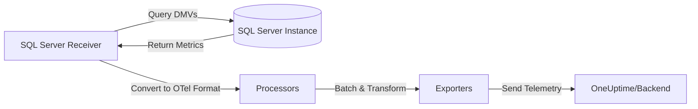

# How to Configure the SQL Server Receiver in the OpenTelemetry Collector

Author: [nawazdhandala](https://www.github.com/nawazdhandala)

Tags: OpenTelemetry, Collector, SQL Server, Microsoft, Database Monitoring, Metric, Performance

Description: Configure the SQL Server receiver in OpenTelemetry Collector to monitor Microsoft SQL Server performance, collect database metrics, track query performance.

Microsoft SQL Server is one of the most widely used relational database management systems in enterprise environments. Monitoring SQL Server performance is critical for maintaining application health, preventing outages, and optimizing query performance. The SQL Server receiver in the OpenTelemetry Collector provides native integration to collect comprehensive metrics from SQL Server instances without requiring custom queries or third-party agents.

## What is the SQL Server Receiver?

The SQL Server receiver is a specialized component of the OpenTelemetry Collector that connects to Microsoft SQL Server instances and automatically collects performance metrics. Unlike the generic SQL Query receiver that requires you to write custom SQL queries, the SQL Server receiver has built-in knowledge of SQL Server's Dynamic Management Views (DMVs) and system tables, automatically collecting dozens of relevant metrics out of the box.

The receiver monitors critical aspects of SQL Server including:

- Database counts and database status
- User connection counts
- Lock waits, lock timeouts, and deadlocks
- Buffer cache hit ratios
- Page life expectancy
- Transaction log usage and growth metrics
- Query sample and top query events
- Resource usage such as CPU, memory, and I/O metrics

## How the SQL Server Receiver Works

When configured for direct collection, the receiver connects to SQL Server using standard database protocols and periodically queries system DMVs to collect metrics. On Windows, it can also use Windows Performance Counters. These metrics are then converted to OpenTelemetry format and sent through the Collector pipeline:


```mermaid
graph LR
    A[SQL Server Receiver] -->|Query DMVs| B[(SQL Server Instance)]
    B -->|Return Metrics| A
    A -->|Convert to OTel Format| C[Processors]
    C -->|Batch & Transform| D[Exporters]
    D -->|Send Telemetry| E[OneUptime/Backend]
```

The receiver handles authentication, metric parsing, and error handling automatically. You simply configure the connection details and which metrics to collect.

## Basic Configuration

Here's a minimal configuration to start monitoring a SQL Server instance:

```yaml
# Receivers section - defines how telemetry enters the Collector

receivers:
  # SQL Server receiver for Microsoft SQL Server monitoring
  sqlserver:
    # SQL Server instance connection details
    server: "localhost"
    port: 1433

    # Authentication credentials
    username: "monitor"
    password: ${env:SQLSERVER_PASSWORD}

    # Collection interval - how often to scrape metrics
    collection_interval: 30s

    # Metrics to collect - start with default set
    # The receiver knows which DMVs to query for each metric
    metrics:
      sqlserver.database.count:
        enabled: true
      sqlserver.page.buffer_cache.hit_ratio:
        enabled: true

# Processors - transform collected metrics
processors:
  # Batch metrics to reduce network calls
  batch:
    timeout: 10s
    send_batch_size: 100

# Exporters - define where metrics are sent
exporters:
  # Export to OneUptime via OTLP HTTP
  otlphttp:
    endpoint: https://oneuptime.com/otlp
    headers:
      x-oneuptime-token: ${env:ONEUPTIME_TOKEN}

# Service section - wire components into pipelines
service:
  pipelines:
    # Metrics pipeline for SQL Server data
    metrics:
      receivers: [sqlserver]
      processors: [batch]
      exporters: [otlphttp]
```

This basic configuration connects to a local SQL Server instance and begins collecting database count and buffer cache hit ratio metrics. For production use, you'll want to enable more metrics and add resilience features.

## Connection Options

The receiver supports direct SQL Server connections and Windows Performance Counter based collection. Choose based on your environment:

### SQL Server Authentication

Standard username and password authentication:

```yaml
receivers:
  sqlserver:
    server: "sqlserver.example.com"
    port: 1433
    # SQL Server login credentials
    username: "monitor_user"
    password: ${env:SQLSERVER_PASSWORD}
```

For finer control over connection options, use a `datasource` connection string instead of `username`, `password`, `server`, and `port`:

```yaml
receivers:
  sqlserver:
    datasource: "sqlserver://monitor_user:${env:SQLSERVER_PASSWORD}@sqlserver.example.com:1433?database=master"
```

### Windows Performance Counters

For Windows Performance Counter based collection, run the Collector on Windows as a user with access to the counters:

```yaml
receivers:
  sqlserver:
    collection_interval: 30s
    computer_name: "sqlserver.internal.corp"
    instance_name: "MSSQLSERVER"
```

### Named Instances

SQL Server supports multiple instances on the same host. For Windows named instances, specify the computer and instance names:

```yaml
receivers:
  sqlserver:
    computer_name: "sqlserver.example.com"
    instance_name: "PRODUCTION"
    resource_attributes:
      sqlserver.computer.name:
        enabled: true
      sqlserver.instance.name:
        enabled: true
```

## Comprehensive Metrics Configuration

The SQL Server receiver can collect extensive metrics. Here's a production-ready configuration with the most important metrics enabled:

```yaml
receivers:
  sqlserver:
    server: "prod-sql.internal"
    port: 1433
    username: "monitor"
    password: ${env:SQLSERVER_PASSWORD}
    collection_interval: 30s

    # Enable comprehensive metric collection
    metrics:
      # Database-level metrics
      sqlserver.database.count:
        enabled: true

      sqlserver.database.io:
        enabled: true

      sqlserver.database.latency:
        enabled: true

      sqlserver.database.operations:
        enabled: true

      # Connection and session metrics
      sqlserver.user.connection.count:
        enabled: true

      # Lock and blocking metrics
      sqlserver.lock.wait.rate:
        enabled: true

      sqlserver.lock.wait.count:
        enabled: true

      # Buffer cache and memory metrics
      sqlserver.page.buffer_cache.hit_ratio:
        enabled: true

      sqlserver.page.life_expectancy:
        enabled: true

      sqlserver.memory.usage:
        enabled: true

      sqlserver.memory.grants.pending.count:
        enabled: true

      # Transaction log metrics
      sqlserver.transaction_log.usage:
        enabled: true

      sqlserver.transaction_log.growth.count:
        enabled: true

      # Performance counters
      sqlserver.batch.request.rate:
        enabled: true

      sqlserver.batch.sql_compilation.rate:
        enabled: true

      sqlserver.batch.sql_recompilation.rate:
        enabled: true

      # Resource usage
      sqlserver.cpu.count:
        enabled: true

      sqlserver.resource_pool.disk.operations:
        enabled: true

      sqlserver.os.wait.duration:
        enabled: true

    events:
      db.server.query_sample:
        enabled: true
      db.server.top_query:
        enabled: true

    top_query_collection:
      lookback_time: 60s
      max_query_sample_count: 1000
      top_query_count: 250
      collection_interval: 60s

    query_sample_collection:
      max_rows_per_query: 100
```

This configuration provides visibility into critical aspects of SQL Server performance. Some metrics are collected through Windows Performance Counters, while direct-connection metrics require the receiver to connect to SQL Server. The query sample and top query events are emitted as logs, so add the `sqlserver` receiver to a logs pipeline when you enable them.

## Multi-Instance Monitoring

Many production environments run multiple SQL Server instances. Monitor them all from a single Collector by defining multiple receiver instances:

```yaml
receivers:
  # Production SQL Server instance
  sqlserver/production:
    server: "prod-sql.internal"
    port: 1433
    username: "monitor"
    password: ${env:SQLSERVER_PROD_PASSWORD}
    collection_interval: 30s
    metrics:
      sqlserver.database.count:
        enabled: true
      sqlserver.database.io:
        enabled: true
      sqlserver.page.buffer_cache.hit_ratio:
        enabled: true
      sqlserver.user.connection.count:
        enabled: true

  # Staging SQL Server instance
  sqlserver/staging:
    server: "staging-sql.internal"
    port: 1433
    username: "monitor"
    password: ${env:SQLSERVER_STAGING_PASSWORD}
    collection_interval: 60s
    metrics:
      sqlserver.database.count:
        enabled: true
      sqlserver.page.buffer_cache.hit_ratio:
        enabled: true

  # Reporting SQL Server instance
  sqlserver/reporting:
    server: "reports-sql.internal"
    port: 1433
    username: "monitor"
    password: ${env:SQLSERVER_REPORTING_PASSWORD}
    collection_interval: 120s
    metrics:
      sqlserver.database.count:
        enabled: true
      sqlserver.user.connection.count:
        enabled: true

# Add attributes to distinguish between instances
processors:
  # Add instance-specific labels to production metrics
  attributes/production:
    actions:
      - key: environment
        value: production
        action: insert
      - key: sql_instance
        value: prod-sql
        action: insert

  attributes/staging:
    actions:
      - key: environment
        value: staging
        action: insert
      - key: sql_instance
        value: staging-sql
        action: insert

  attributes/reporting:
    actions:
      - key: environment
        value: reporting
        action: insert
      - key: sql_instance
        value: reports-sql
        action: insert

  batch:
    timeout: 10s

exporters:
  otlphttp:
    endpoint: https://oneuptime.com/otlp
    headers:
      x-oneuptime-token: ${env:ONEUPTIME_TOKEN}

service:
  pipelines:
    # Separate pipelines with instance-specific attributes
    metrics/production:
      receivers: [sqlserver/production]
      processors: [attributes/production, batch]
      exporters: [otlphttp]

    metrics/staging:
      receivers: [sqlserver/staging]
      processors: [attributes/staging, batch]
      exporters: [otlphttp]

    metrics/reporting:
      receivers: [sqlserver/reporting]
      processors: [attributes/reporting, batch]
      exporters: [otlphttp]
```

This pattern allows you to monitor multiple instances with different collection intervals and attributes, making it easy to filter and query metrics by environment or instance in your observability backend.

## Performance Tuning and Optimization

In high-load SQL Server environments, optimize the receiver configuration to minimize overhead:

```yaml
receivers:
  sqlserver:
    server: "high-load-sql.internal"
    port: 1433
    username: "monitor"
    password: ${env:SQLSERVER_PASSWORD}

    # Increase interval to reduce query load on busy servers
    collection_interval: 60s

    # Enable only essential metrics for high-load systems
    metrics:
      # Critical performance indicators only
      sqlserver.page.buffer_cache.hit_ratio:
        enabled: true
      sqlserver.database.count:
        enabled: true
      sqlserver.user.connection.count:
        enabled: true
      sqlserver.lock.wait.rate:
        enabled: true
      sqlserver.cpu.count:
        enabled: true

processors:
  # Add resource detection for automatic host tagging
  resourcedetection:
    detectors: [env, system]
    timeout: 5s

  # Filter out noisy metrics if needed
  filter/drop_low_value:
    metrics:
      # Example: drop a nonessential metric
      exclude:
        match_type: strict
        metric_names:
          - sqlserver.database.execution.errors

  batch:
    timeout: 30s
    send_batch_size: 1000

exporters:
  otlphttp:
    endpoint: https://oneuptime.com/otlp
    headers:
      x-oneuptime-token: ${env:ONEUPTIME_TOKEN}
    compression: gzip
    retry_on_failure:
      enabled: true
      initial_interval: 5s
      max_interval: 30s

service:
  pipelines:
    metrics:
      receivers: [sqlserver]
      processors: [resourcedetection, filter/drop_low_value, batch]
      exporters: [otlphttp]
```

## Monitoring Availability Groups

For SQL Server Always On Availability Groups, the receiver can collect replica throughput and the normal SQL Server metrics from the instance. Dedicated replica role, synchronization health, synchronization state, and synchronization lag metrics are not exposed by the SQL Server receiver.

```yaml
receivers:
  sqlserver:
    server: "ag-primary.internal"
    port: 1433
    username: "monitor"
    password: ${env:SQLSERVER_PASSWORD}
    collection_interval: 30s

    metrics:
      # Standard database metrics
      sqlserver.database.count:
        enabled: true
      sqlserver.page.buffer_cache.hit_ratio:
        enabled: true

      # Replica throughput metric
      sqlserver.replica.data.rate:
        enabled: true
```

## Security Best Practices

Secure your SQL Server monitoring setup:

### Create a Dedicated Monitoring User

Never use sa or admin accounts. Create a dedicated monitoring user with minimal permissions:

```sql
-- Connect to SQL Server as admin and run these commands

-- Create login for monitoring
CREATE LOGIN monitor WITH PASSWORD = 'StrongPassword123!';

-- Create user in each database you want to monitor
USE master;
CREATE USER monitor FOR LOGIN monitor;

-- Allow the login to see databases
GRANT VIEW ANY DATABASE TO monitor;

-- Grant server-state permission for DMV access on SQL Server 2019 and earlier
GRANT VIEW SERVER STATE TO monitor;

-- On SQL Server 2022 and later, use this instead of VIEW SERVER STATE
-- GRANT VIEW SERVER PERFORMANCE STATE TO monitor;
```

### Use Environment Variables for Credentials

Never hardcode passwords in configuration files:

```yaml
receivers:
  sqlserver:
    server: "prod-sql.internal"
    port: 1433
    # Reference environment variables for credentials
    username: ${env:SQL_MONITOR_USER}
    password: ${env:SQL_MONITOR_PASSWORD}
```

Set these in your deployment environment:

```bash
export SQL_MONITOR_USER="monitor"
export SQL_MONITOR_PASSWORD="StrongPassword123!"
```

### Enable Encrypted Connections

Always use TLS encryption for SQL Server connections:

```yaml
receivers:
  sqlserver:
    datasource: "sqlserver://monitor:${env:SQLSERVER_PASSWORD}@prod-sql.internal:1433?encrypt=true&TrustServerCertificate=false"
```

## Alerting on Critical Metrics

Configure alerts in OneUptime for critical SQL Server conditions:

**Buffer Cache Hit Ratio Below Threshold**: Alert when cache hit ratio drops below 90%, indicating potential memory pressure or inefficient queries.

**Page Life Expectancy Too Low**: Alert when PLE drops below 300 seconds, suggesting memory pressure and potential performance degradation.

**Transaction Log Growth**: Alert on rapid log growth that could fill disk space.

**High Lock Wait Times**: Alert when lock contention exceeds acceptable thresholds.

**Failed Connections**: Alert on authentication failures or connection errors.

The SQL Server receiver exports these metrics in a format compatible with alerting rules in modern observability platforms.

## Troubleshooting

### Connection Issues

If the receiver can't connect to SQL Server:

1. Verify SQL Server is running and accepting TCP/IP connections
2. Check Windows Firewall allows port 1433 (or your custom port)
3. Enable SQL Server Authentication if using SQL auth
4. Verify user credentials and permissions
5. Test connectivity with SQL Server Management Studio first

Enable debug logging to see connection errors:

```yaml
service:
  telemetry:
    logs:
      level: debug
```

### Missing Metrics

If some metrics aren't appearing:

1. Verify the monitoring user has VIEW SERVER STATE permission on SQL Server 2019 and earlier, or VIEW SERVER PERFORMANCE STATE on SQL Server 2022 and later
2. Check SQL Server version supports the requested metrics
3. Some metrics only appear when relevant or when the receiver is running in the required collection mode
4. Review Collector logs for permission errors

### High Overhead

If monitoring causes performance impact:

1. Increase collection_interval to reduce query frequency
2. Disable non-essential metrics
3. Ensure monitoring user has appropriate permissions (no table scans)
4. Review DMV query performance in SQL Server
5. Disable optional events such as query samples if they add too much overhead

## Monitoring the Receiver Itself

Monitor the SQL Server receiver to ensure reliable telemetry:

```yaml
service:
  telemetry:
    metrics:
      level: detailed
      readers:
        - periodic:
            exporter:
              otlp:
                protocol: http/protobuf
                endpoint: https://oneuptime.com/otlp
                headers:
                  x-oneuptime-token: ${env:ONEUPTIME_TOKEN}
```

Watch these internal metrics:

- `otelcol_receiver_accepted_metric_points`: Successful metric collection
- `otelcol_receiver_refused_metric_points`: Collection failures
- `otelcol_scraper_errored_metric_points`: Scraper errors
- `otelcol_scraper_scraped_metric_points`: Total scraped metrics

## Related Topics

For comprehensive SQL Server and database monitoring:

- [How to Configure the SQL Query Receiver in OpenTelemetry Collector](https://oneuptime.com/blog/post/2026-02-06-sql-query-receiver-opentelemetry-collector/view)
- [How to Configure the Oracle DB Receiver in OpenTelemetry Collector](https://oneuptime.com/blog/post/2026-02-06-oracle-db-receiver-opentelemetry-collector/view)
- [OpenTelemetry Collector: What It Is and When You Need It](https://oneuptime.com/blog/post/2025-09-18-what-is-opentelemetry-collector-and-why-use-one/view)
- [How to collect internal metrics from OpenTelemetry Collector](https://oneuptime.com/blog/post/2025-01-22-how-to-collect-opentelemetry-collector-internal-metrics/view)

## Summary

The SQL Server receiver provides comprehensive, out-of-the-box monitoring for Microsoft SQL Server instances. By leveraging SQL Server's rich set of Dynamic Management Views, the receiver automatically collects dozens of critical performance metrics without requiring custom query development.

Configure the receiver with appropriate authentication, enable relevant metrics for your environment, and export data to OneUptime for powerful visualization and alerting. Follow security best practices by creating dedicated monitoring users with minimal permissions and using encrypted connections.

Whether you're monitoring a single instance or a complex multi-instance environment with Availability Groups, the SQL Server receiver scales to meet your observability needs. Start with essential metrics and expand coverage as your monitoring practice matures.

Need a powerful backend for your SQL Server metrics? OneUptime provides native OpenTelemetry support with advanced analytics, alerting, and visualization capabilities for database observability.
