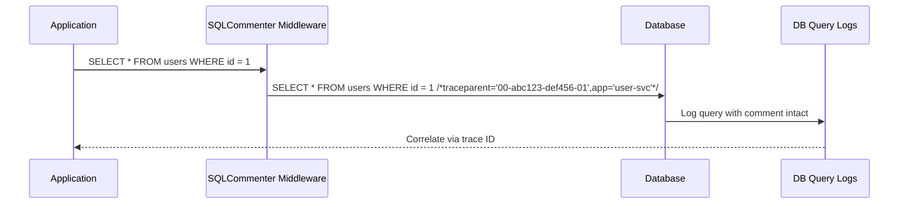
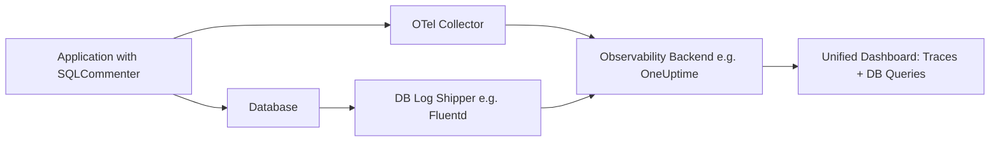

# How to Use SQLCommenter to Correlate Application Traces with Database Query Logs

Author: [nawazdhandala](https://www.github.com/nawazdhandala)

Tags: OpenTelemetry, SQLCommenter, Database, Tracing, Observability, SQL

Description: Learn how to use SQLCommenter with OpenTelemetry to correlate application traces with database query logs for full-stack observability.

---

When you are debugging a slow API endpoint, you can usually trace the request through your application code using OpenTelemetry. But what happens when the bottleneck is a database query? You see a slow span, but on the database side, the DBA sees a slow query with no idea which application or endpoint triggered it. This is the gap that SQLCommenter fills.

SQLCommenter is an open-source library (originally created by Google) that injects trace context and application metadata directly into SQL query comments. The database sees these comments in its query logs, and suddenly you can correlate application-level traces with database-level query plans and slow query logs. No more guessing which service fired that expensive full-table scan.

## How SQLCommenter Works

The concept is simple. Before your ORM or database driver sends a query to the database, SQLCommenter appends a comment at the end of the SQL statement. This comment contains serialized key-value pairs with trace IDs, span IDs, the originating service name, and other useful metadata.



The database engine treats everything after `/*` as a comment and ignores it during query execution. But the query log preserves the full text, including the comment. That means you can search your database logs by trace ID and find exactly which queries belong to a given request.

## Setting Up SQLCommenter with Python and Django

Django is one of the best-supported frameworks for SQLCommenter. The setup involves installing the package and adding middleware.

First, install the required packages.

```bash
# Install SQLCommenter for Django and the OpenTelemetry integration
pip install opentelemetry-sqlcommenter django
```

Next, add the SQLCommenter middleware to your Django settings.

```python
# settings.py

MIDDLEWARE = [
    # SQLCommenter middleware should be placed early in the middleware stack
    # so it can intercept all database queries made during request processing
    'google.cloud.sqlcommenter.django.middleware.SqlCommenter',
    'django.middleware.security.SecurityMiddleware',
    'django.contrib.sessions.middleware.SessionMiddleware',
    'django.middleware.common.CommonMiddleware',
    # ... other middleware
]

# Configure which metadata to include in SQL comments
SQLCOMMENTER_WITH_OPENTELEMETRY = True   # Include trace context (traceparent)
SQLCOMMENTER_WITH_DJANGO = True          # Include Django route and app info
SQLCOMMENTER_WITH_CONTROLLER = True      # Include the view/controller name
SQLCOMMENTER_WITH_FRAMEWORK = True       # Include framework version info
```

With this configuration, every SQL query that Django executes will carry trace context. A query that used to look like this in your database logs:

```sql
SELECT "auth_user"."id", "auth_user"."username" FROM "auth_user" WHERE "auth_user"."id" = 42;
```

Now looks like this:

```sql
/* traceparent='00-5bd66ef5095369c7b0d1f8f4bd33716a-c532cb4098ac3dd2-01',
   controller='views.user_detail',
   framework='django%3A4.2.0',
   application='user-service' */
SELECT "auth_user"."id", "auth_user"."username" FROM "auth_user" WHERE "auth_user"."id" = 42;
```

## Setting Up SQLCommenter with Node.js and Sequelize

If you are working with Node.js, SQLCommenter supports Sequelize and Knex. Here is how to configure it with Sequelize.

```javascript
// db.js
const { Sequelize } = require('sequelize');
const {
  wrapSequelizeAsMiddleware
} = require('@google-cloud/sqlcommenter-sequelize');

// Create your Sequelize instance as usual
const sequelize = new Sequelize('database', 'user', 'password', {
  host: 'localhost',
  dialect: 'postgres',
});

// Wrap Sequelize with SQLCommenter to inject trace context into queries
wrapSequelizeAsMiddleware(sequelize, {
  traceparent: true,   // Include W3C traceparent header
  tracestate: true,    // Include W3C tracestate header
  application: true,   // Include application name
  dbDriver: true,      // Include the database driver info
});

module.exports = sequelize;
```

For the OpenTelemetry side, make sure your application is instrumented and that you have an active trace context when queries run.

```javascript
// tracing.js
const { NodeTracerProvider } = require('@opentelemetry/sdk-trace-node');
const { registerInstrumentations } = require('@opentelemetry/instrumentation');
const { PgInstrumentation } = require('@opentelemetry/instrumentation-pg');
const { OTLPTraceExporter } = require('@opentelemetry/exporter-trace-otlp-http');
const { SimpleSpanProcessor } = require('@opentelemetry/sdk-trace-base');
const { Resource } = require('@opentelemetry/resources');

// Set up the tracer provider with service name
const provider = new NodeTracerProvider({
  resource: new Resource({
    'service.name': 'user-service',
  }),
});

// Export traces to your OpenTelemetry collector
const exporter = new OTLPTraceExporter({
  url: 'http://localhost:4318/v1/traces',
});

provider.addSpanProcessor(new SimpleSpanProcessor(exporter));
provider.register();

// Instrument the PostgreSQL driver so queries create child spans
registerInstrumentations({
  instrumentations: [new PgInstrumentation()],
});
```

## Setting Up SQLCommenter with Java and Hibernate

For Java applications using Hibernate, SQLCommenter integrates through a Hibernate StatementInspector.

```java
// HibernateConfig.java
import com.google.cloud.sqlcommenter.interceptors.hibernate.SCHibernate6StatementInspector;
import org.hibernate.cfg.Configuration;

public class HibernateConfig {
    public static Configuration getConfiguration() {
        Configuration configuration = new Configuration();

        // Register the SQLCommenter statement inspector
        // This inspector appends trace metadata to every SQL statement
        // before it reaches the database
        configuration.setProperty(
            "hibernate.session_factory.statement_inspector",
            SCHibernate6StatementInspector.class.getName()
        );

        return configuration;
    }
}
```

If you are using Spring Boot with JPA, you can register the inspector via application properties.

```yaml
# application.yml
spring:
  jpa:
    properties:
      # Register SQLCommenter as the statement inspector for all Hibernate queries
      hibernate.session_factory.statement_inspector: com.google.cloud.sqlcommenter.interceptors.hibernate.SCHibernate6StatementInspector
```

## Querying Database Logs by Trace ID

Once SQLCommenter is injecting metadata, you can search your database logs to find queries belonging to a specific trace. The exact method depends on your database.

For PostgreSQL, enable the `log_min_duration_statement` setting and then search the log file.

```sql
-- In postgresql.conf, log queries that take longer than 100ms
-- ALTER SYSTEM SET log_min_duration_statement = 100;

-- Then in your log files you can grep for a specific trace ID:
-- grep '5bd66ef5095369c7b0d1f8f4bd33716a' /var/log/postgresql/postgresql.log
```

For MySQL, you can query the slow query log or the performance schema.

```sql
-- Search for queries with a specific trace ID in the MySQL slow log table
SELECT sql_text, timer_wait/1000000000 AS duration_ms
FROM performance_schema.events_statements_history_long
WHERE sql_text LIKE '%5bd66ef5095369c7b0d1f8f4bd33716a%';
```

## Building a Correlation Pipeline

For production use, you probably want an automated pipeline that connects your trace data and database logs in one place. Here is a practical architecture.



The idea is to ship your database logs to the same observability backend that receives your traces. Since both contain the same trace ID, you can join them. Many observability platforms, including OneUptime, support this kind of correlation natively.

## Performance Considerations

SQLCommenter adds a small string to every query. In practice, this overhead is negligible. The comment is typically 200-400 bytes, which is tiny compared to the query itself. Database engines completely skip comments during parsing and planning, so there is zero impact on query execution time.

However, keep in mind that the comments do increase the size of your query logs. If you are logging every query (not just slow ones), the log volume will grow. A good practice is to log only queries above a duration threshold and rely on sampling for the rest.

## Tips for Getting the Most Out of SQLCommenter

1. Always include `traceparent` - this is the key field that connects application traces to database logs.
2. Include the controller or route name so DBAs can quickly identify which endpoint generates a specific query pattern.
3. Use consistent service names between your OpenTelemetry configuration and SQLCommenter so the metadata matches up cleanly.
4. Combine SQLCommenter with database instrumentation (like `opentelemetry-instrumentation-pg`) so you get both the application-side span timing and the database-side query log with trace context.
5. Set up alerts on slow queries that include the originating service name, so the right team gets notified automatically.

SQLCommenter bridges the gap between application observability and database observability. It takes about 15 minutes to set up and pays for itself the first time you need to track down a slow query in production.
