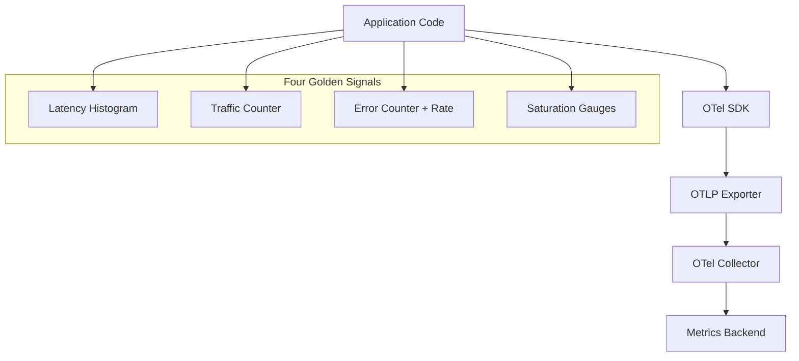

# How to Implement SRE Golden Signals (Latency, Traffic, Errors, Saturation) with OpenTelemetry

Author: [nawazdhandala](https://www.github.com/nawazdhandala)

Tags: OpenTelemetry, Golden Signals, SRE, Monitoring

Description: A practical guide to implementing all four SRE golden signals using OpenTelemetry metrics instrumentation with working code examples.

The four golden signals - latency, traffic, errors, and saturation - come from Google's SRE handbook and represent the minimum set of metrics you need to understand a service's health. They are simple to describe but require thought to implement well. OpenTelemetry's metrics API maps cleanly onto these signals, giving you a vendor-neutral implementation that works across any backend.

This post provides a complete implementation of all four signals using OpenTelemetry, with attention to the details that make them useful in practice.

## Architecture Overview



## Setting Up the Meter

All four signals share a common setup. Initialize the meter provider once at application startup.

```python
# golden_signals.py - OpenTelemetry golden signals implementation
from opentelemetry import metrics
from opentelemetry.sdk.metrics import MeterProvider
from opentelemetry.sdk.metrics.export import PeriodicExportingMetricReader
from opentelemetry.sdk.resources import Resource
from opentelemetry.exporter.otlp.proto.grpc.metric_exporter import OTLPMetricExporter

# Identify this service in all emitted metrics
resource = Resource.create({
    "service.name": "order-service",
    "service.version": "2.4.1",
    "deployment.environment": "production",
})

exporter = OTLPMetricExporter(endpoint="http://otel-collector:4317", insecure=True)
reader = PeriodicExportingMetricReader(exporter, export_interval_millis=15000)
provider = MeterProvider(resource=resource, metric_readers=[reader])
metrics.set_meter_provider(provider)

meter = metrics.get_meter("golden.signals", version="1.0.0")
```

## Signal 1: Latency

Latency measures how long it takes to serve a request. The important distinction is separating successful request latency from error request latency, because errors are often fast (an immediate 500 response) and would skew the overall latency distribution downward.

```python
# Latency signal - use a histogram to capture the full distribution
# Bucket boundaries chosen for typical web service response times
request_duration = meter.create_histogram(
    name="http.server.request.duration",
    description="Duration of HTTP server requests",
    unit="ms",
)

def record_latency(method: str, route: str, status_code: int, duration_ms: float):
    """Record request latency, separating success from error latency."""
    request_duration.record(duration_ms, attributes={
        "http.request.method": method,
        "http.route": route,
        "http.response.status_code": status_code,
        # This attribute lets you filter success vs error latency
        "request.success": 200 <= status_code < 400,
    })
```

For latency, always use histograms rather than averages. The p50, p95, and p99 percentiles derived from histogram data reveal tail latency issues that averages hide. A service with a 50ms average might have a p99 of 2 seconds, and those slow requests are what users complain about.

## Signal 2: Traffic

Traffic measures demand on the system. For HTTP services, this is requests per second. For a message queue consumer, it might be messages processed per second. For a database, queries per second.

```python
# Traffic signal - a simple counter that you rate() over in your dashboard
request_counter = meter.create_counter(
    name="http.server.requests.total",
    description="Total HTTP requests received",
    unit="1",
)

# For non-HTTP services, track the relevant work unit
messages_processed = meter.create_counter(
    name="messaging.consumer.messages.total",
    description="Total messages processed from queue",
    unit="1",
)

def record_traffic(method: str, route: str, status_code: int):
    """Record a request for traffic measurement."""
    request_counter.add(1, attributes={
        "http.request.method": method,
        "http.route": route,
        "http.response.status_code": status_code,
    })
```

Keep the cardinality manageable. Using the route template (`/users/{id}`) rather than the actual path (`/users/12345`) prevents metric explosion. OpenTelemetry semantic conventions recommend `http.route` for exactly this reason.

## Signal 3: Errors

Errors measure the rate of failed requests. Track both explicit errors (5xx responses) and implicit errors (requests that succeed in HTTP terms but violate a business rule or latency SLO).

```python
# Error signal - count errors with classification attributes
error_counter = meter.create_counter(
    name="http.server.errors.total",
    description="Total HTTP server errors",
    unit="1",
)

def record_error(method: str, route: str, status_code: int,
                 error_type: str, exception_class: str = None):
    """Record an error with classification for debugging."""
    error_counter.add(1, attributes={
        "http.request.method": method,
        "http.route": route,
        "http.response.status_code": status_code,
        "error.type": error_type,  # e.g., "timeout", "validation", "internal"
        "exception.type": exception_class or "none",
    })
```

## Signal 4: Saturation

Saturation measures how full your service is - how close it is to resource limits. This is the hardest signal to instrument because it varies by service type. Common saturation metrics include CPU utilization, memory usage, thread pool occupancy, connection pool usage, and disk I/O.

```python
import psutil
import threading

# Saturation signal - use observable gauges for resource utilization
def cpu_callback(options):
    """Report CPU utilization as a percentage."""
    yield metrics.Observation(
        value=psutil.cpu_percent(interval=None),
        attributes={"resource": "cpu"},
    )

def memory_callback(options):
    """Report memory utilization as a percentage."""
    mem = psutil.virtual_memory()
    yield metrics.Observation(
        value=mem.percent,
        attributes={"resource": "memory"},
    )

def thread_pool_callback(options):
    """Report thread pool saturation."""
    active = threading.active_count()
    # Assume a max of 200 threads for the pool
    max_threads = 200
    yield metrics.Observation(
        value=(active / max_threads) * 100,
        attributes={"resource": "thread_pool"},
    )

# Register observable gauges for each resource type
cpu_gauge = meter.create_observable_gauge(
    name="system.cpu.utilization",
    description="CPU utilization percentage",
    unit="%",
    callbacks=[cpu_callback],
)

memory_gauge = meter.create_observable_gauge(
    name="system.memory.utilization",
    description="Memory utilization percentage",
    unit="%",
    callbacks=[memory_callback],
)

thread_gauge = meter.create_observable_gauge(
    name="service.thread_pool.utilization",
    description="Thread pool utilization percentage",
    unit="%",
    callbacks=[thread_pool_callback],
)
```

## Putting It All Together: Middleware Example

A middleware component can capture latency, traffic, and errors in one place. Here is a Flask example.

```python
import time
from flask import Flask, request, g

app = Flask(__name__)

@app.before_request
def start_timer():
    g.start_time = time.time()

@app.after_request
def record_golden_signals(response):
    duration_ms = (time.time() - g.start_time) * 1000
    method = request.method
    route = request.url_rule.rule if request.url_rule else "unknown"
    status = response.status_code

    # Traffic
    record_traffic(method, route, status)

    # Latency
    record_latency(method, route, status, duration_ms)

    # Errors (5xx only - 4xx are client errors)
    if status >= 500:
        record_error(method, route, status, error_type="server_error")

    return response
```

## Collector Configuration

A straightforward collector config that receives the golden signal metrics and exports them.

```yaml
# otel-collector-config.yaml
receivers:
  otlp:
    protocols:
      grpc:
        endpoint: 0.0.0.0:4317

processors:
  batch:
    send_batch_size: 500
    timeout: 10s

  # Drop high-cardinality attributes that slip through
  filter/drop_high_cardinality:
    metrics:
      exclude:
        match_type: regexp
        metric_names:
          - ".*_temp_.*"

exporters:
  otlp/backend:
    endpoint: "https://otel.oneuptime.com:4317"

service:
  pipelines:
    metrics:
      receivers: [otlp]
      processors: [filter/drop_high_cardinality, batch]
      exporters: [otlp/backend]
```

## Dashboard Queries to Build

With these four signals instrumented, create dashboard panels for:

- **Latency**: p50, p95, p99 of `http.server.request.duration` filtered by `request.success=true`
- **Traffic**: rate of `http.server.requests.total` broken down by route
- **Errors**: rate of `http.server.errors.total` divided by rate of `http.server.requests.total`
- **Saturation**: all three utilization gauges on a single panel with threshold lines at 80% and 95%

These four panels give any on-call engineer an immediate read on service health without needing deep service knowledge. That is the power of standardized golden signals.
