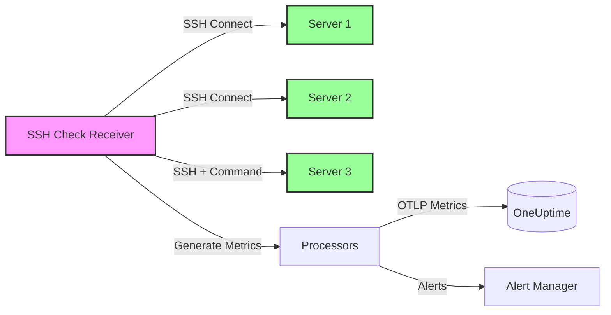

# How to Configure the SSH Check Receiver in the OpenTelemetry Collector

Author: [nawazdhandala](https://www.github.com/nawazdhandala)

Tags: OpenTelemetry, Collector, SSH Check, Synthetic Monitoring, Infrastructure Monitoring, Remote Execution

Description: Comprehensive guide to configuring the SSH Check receiver in OpenTelemetry Collector for monitoring SSH connectivity, executing remote commands, and generating infrastructure health metrics.

---

The SSH Check receiver in the OpenTelemetry Collector enables you to perform synthetic monitoring of SSH endpoints by establishing SSH connections and optionally executing remote commands. This receiver is essential for monitoring server accessibility, verifying SSH service availability, and running health checks on remote systems without deploying agents.

By deploying the SSH Check receiver, you can monitor SSH connectivity to critical infrastructure, execute remote diagnostic commands, track connection latency, and generate metrics for uptime monitoring, all within your OpenTelemetry observability pipeline.

---

## What is the SSH Check Receiver?

The SSH Check receiver is an OpenTelemetry Collector component that acts as an SSH client, periodically connecting to configured SSH servers and generating metrics based on connection success, latency, and command execution results. Unlike passive receivers that accept incoming telemetry, the SSH Check receiver actively probes SSH endpoints to assess their availability and health.

The receiver generates several key metrics:
- **Connection status** - Whether SSH connection succeeded or failed
- **Connection time** - Time taken to establish SSH connection
- **Authentication status** - Whether authentication succeeded
- **Command execution result** - Exit code and execution time of remote commands
- **Command output validation** - Pattern matching against command output

**Primary use cases:**

- SSH service availability monitoring
- Remote server health checks without agents
- Infrastructure access verification
- Connection latency tracking
- Remote command execution for diagnostics
- SSH key rotation validation

---

## Architecture Overview

The SSH Check receiver runs within the Collector and actively establishes SSH connections to configured servers, generating metrics that flow through your observability pipeline:



This architecture allows you to monitor SSH accessibility from within your infrastructure, ensuring you have visibility into server connectivity and basic health.

---

## Prerequisites

Before configuring the SSH Check receiver, ensure you have:

1. **OpenTelemetry Collector** version 0.80.0 or later with the SSH Check receiver component (requires `otelcol-contrib` distribution)
2. **SSH access credentials** for target servers (SSH keys or passwords)
3. **Network connectivity** from the Collector to all monitored SSH endpoints
4. **SSH keys or passwords** securely stored (preferably using environment variables or secrets management)
5. **Understanding of expected command outputs** for validation

---

## Basic Configuration

The SSH Check receiver requires configuring target endpoints, authentication credentials, and check intervals. Here's a minimal working configuration:

```yaml
# RECEIVERS: Define how telemetry enters the Collector
receivers:
  # SSH Check receiver performs synthetic monitoring of SSH endpoints
  sshcheck:
    # Targets to monitor
    targets:
      # Monitor SSH connectivity to a server
      - endpoint: server1.example.com:22
        username: monitoring
        # Use SSH key for authentication
        key_file: /etc/ssh/keys/monitoring_key

      # Monitor another server with password authentication
      - endpoint: server2.example.com:22
        username: monitoring
        password: ${SSH_PASSWORD}

    # How often to perform checks (in seconds)
    collection_interval: 60s

# EXPORTERS: Define where metrics are sent
exporters:
  # Export metrics to OneUptime using OTLP
  otlphttp:
    endpoint: https://oneuptime.com/otlp
    headers:
      x-oneuptime-token: ${ONEUPTIME_TOKEN}

# SERVICE: Wire receivers to exporters
service:
  pipelines:
    # Metrics pipeline: receive from SSH Check, export to OneUptime
    metrics:
      receivers: [sshcheck]
      exporters: [otlphttp]
```

**Configuration breakdown:**

- `targets`: List of SSH endpoints to monitor with authentication details
- `endpoint`: Server address and port (default SSH port is 22)
- `username`: SSH username for authentication
- `key_file` or `password`: Authentication method (key-based is recommended)
- `collection_interval`: How often to perform SSH checks (default: 60s)

---

## Production Configuration with Remote Command Execution

For production deployments, configure remote command execution, output validation, and proper secret management:

```yaml
receivers:
  sshcheck:
    # List of SSH endpoints to monitor
    targets:
      # Basic connectivity check with command execution
      - endpoint: web-server-01.internal:22
        username: monitoring
        key_file: /etc/ssh/keys/monitoring_key

        # Execute a remote command to verify health
        command: "systemctl is-active nginx"

        # Expected output pattern (regex)
        expected_output: "active"

        # Connection and command timeout
        timeout: 10s

      # Database server health check
      - endpoint: db-server-01.internal:22
        username: monitoring
        key_file: /etc/ssh/keys/monitoring_key

        # Check if PostgreSQL is responding
        command: "pg_isready -h localhost"

        # Expected output for healthy database
        expected_output: "accepting connections"

        timeout: 15s

      # Application server with multi-line check
      - endpoint: app-server-01.internal:22
        username: monitoring
        key_file: /etc/ssh/keys/monitoring_key

        # Check application process and memory usage
        command: "ps aux | grep -c '[j]ava.*myapp' && free -m | grep Mem | awk '{print $3/$2 * 100.0}'"

        # Validate process is running and memory usage is reasonable
        expected_output: "^1"

        timeout: 10s

      # External server with password auth (stored in environment)
      - endpoint: external-server.example.com:2222
        username: monitoring
        password: ${SSH_PASSWORD_EXTERNAL}

        # Simple connectivity check (no command)
        timeout: 20s

      # Server with custom SSH port
      - endpoint: server-custom-port.internal:2200
        username: monitoring
        key_file: /etc/ssh/keys/monitoring_key

        # Verify disk space
        command: "df -h / | tail -1 | awk '{print $5}' | sed 's/%//'"

        # Alert if disk usage above 90%
        expected_output: "^[0-8][0-9]$|^90$"

        timeout: 10s

    # Check interval for all targets
    collection_interval: 60s

    # SSH client configuration
    ssh_client_config:
      # Timeout for SSH connection establishment
      connection_timeout: 10s

      # Known hosts file for host key verification
      known_hosts_file: /etc/ssh/known_hosts

      # Skip host key verification (not recommended for production)
      insecure_ignore_host_key: false

processors:
  # Protect Collector from memory exhaustion
  memory_limiter:
    limit_mib: 256
    spike_limit_mib: 64
    check_interval: 2s

  # Add resource attributes to identify the check source
  resource:
    attributes:
      - key: monitoring.type
        value: synthetic-ssh
        action: upsert
      - key: monitoring.location
        value: datacenter-us-east
        action: upsert

  # Transform metrics for better organization
  metricstransform:
    transforms:
      # Rename metrics to follow naming conventions
      - include: sshcheck.duration
        action: update
        new_name: ssh.check.duration_ms

      - include: sshcheck.status
        action: update
        new_name: ssh.check.success

      - include: sshcheck.command_exit_code
        action: update
        new_name: ssh.check.command.exit_code

exporters:
  # Export to OneUptime with retry configuration
  otlphttp:
    endpoint: https://oneuptime.com/otlp
    headers:
      x-oneuptime-token: ${ONEUPTIME_TOKEN}
    retry_on_failure:
      enabled: true
      initial_interval: 5s
      max_interval: 30s
      max_elapsed_time: 300s
    timeout: 30s
    compression: gzip

service:
  # Enable telemetry for the Collector itself
  telemetry:
    logs:
      level: info
    metrics:
      address: localhost:8888

  pipelines:
    metrics:
      receivers: [sshcheck]
      processors: [memory_limiter, resource, metricstransform]
      exporters: [otlphttp]
```

**Advanced features:**

1. **Remote command execution:** Run commands to verify application and system health
2. **Output validation:** Use regex patterns to validate command output
3. **Custom timeouts:** Configure different timeouts for different servers
4. **Host key verification:** Verify SSH host keys for security
5. **Multiple authentication methods:** Support both key-based and password authentication

---

## Generated Metrics

The SSH Check receiver generates several metrics for each target:

**Core metrics:**

| Metric Name | Type | Description |
|-------------|------|-------------|
| `sshcheck.duration` | Gauge | Time taken to establish SSH connection (milliseconds) |
| `sshcheck.status` | Gauge | 1 if connection succeeded, 0 if failed |
| `sshcheck.auth_status` | Gauge | 1 if authentication succeeded, 0 if failed |
| `sshcheck.command_duration` | Gauge | Time taken to execute command (milliseconds) |
| `sshcheck.command_exit_code` | Gauge | Exit code of executed command |
| `sshcheck.command_success` | Gauge | 1 if command output matches expected pattern, 0 otherwise |

**Metric labels:**

Each metric includes labels for filtering and aggregation:
- `endpoint`: The SSH server being checked
- `username`: SSH username used for connection
- `command`: Command executed (if any)

**Example metric output:**

```
sshcheck.duration{endpoint="server1.example.com:22",username="monitoring"} 245.7
sshcheck.status{endpoint="server1.example.com:22",username="monitoring"} 1
sshcheck.auth_status{endpoint="server1.example.com:22",username="monitoring"} 1
sshcheck.command_duration{endpoint="server1.example.com:22",username="monitoring",command="systemctl is-active nginx"} 89.3
sshcheck.command_exit_code{endpoint="server1.example.com:22",username="monitoring",command="systemctl is-active nginx"} 0
sshcheck.command_success{endpoint="server1.example.com:22",username="monitoring",command="systemctl is-active nginx"} 1
```

---

## Authentication Best Practices

**Use SSH keys instead of passwords:**

SSH key authentication is more secure and eliminates the need to store passwords in configuration files.

```bash
# Generate an SSH key pair for monitoring
ssh-keygen -t ed25519 -C "monitoring@otel-collector" -f /etc/ssh/keys/monitoring_key

# Copy public key to target servers
ssh-copy-id -i /etc/ssh/keys/monitoring_key.pub monitoring@server1.example.com

# Set proper permissions
chmod 600 /etc/ssh/keys/monitoring_key
chmod 644 /etc/ssh/keys/monitoring_key.pub
```

**Configuration using SSH keys:**

```yaml
receivers:
  sshcheck:
    targets:
      - endpoint: server1.example.com:22
        username: monitoring
        key_file: /etc/ssh/keys/monitoring_key
```

**Secure password storage (if SSH keys aren't possible):**

Use environment variables and secrets management:

```yaml
receivers:
  sshcheck:
    targets:
      - endpoint: server1.example.com:22
        username: monitoring
        # Password from environment variable
        password: ${SSH_PASSWORD}
```

```bash
# Set password as environment variable
export SSH_PASSWORD='secure-password-here'

# Or use a secrets manager
export SSH_PASSWORD=$(aws secretsmanager get-secret-value --secret-id ssh-monitoring-password --query SecretString --output text)
```

**Dedicated monitoring user:**

Create a dedicated user with minimal privileges for SSH checks:

```bash
# On target servers, create monitoring user
sudo useradd -m -s /bin/bash monitoring

# Add public key
sudo mkdir -p /home/monitoring/.ssh
sudo cat monitoring_key.pub | sudo tee /home/monitoring/.ssh/authorized_keys
sudo chmod 700 /home/monitoring/.ssh
sudo chmod 600 /home/monitoring/.ssh/authorized_keys
sudo chown -R monitoring:monitoring /home/monitoring/.ssh

# Grant only necessary permissions (e.g., read-only commands via sudoers)
sudo visudo
# Add: monitoring ALL=(ALL) NOPASSWD: /usr/bin/systemctl is-active *, /usr/bin/pg_isready
```

---

## Health Check Command Examples

**Web server health checks:**

```yaml
receivers:
  sshcheck:
    targets:
      # Check Nginx is running
      - endpoint: web-server-01:22
        username: monitoring
        key_file: /etc/ssh/keys/monitoring_key
        command: "systemctl is-active nginx"
        expected_output: "active"

      # Check Apache is running and responding
      - endpoint: web-server-02:22
        username: monitoring
        key_file: /etc/ssh/keys/monitoring_key
        command: "curl -s -o /dev/null -w '%{http_code}' http://localhost:80"
        expected_output: "200"

      # Check HAProxy backend servers
      - endpoint: lb-server-01:22
        username: monitoring
        key_file: /etc/ssh/keys/monitoring_key
        command: "echo 'show stat' | socat stdio /var/run/haproxy/admin.sock | grep -c 'UP'"
        expected_output: "[2-9]"  # At least 2 backends UP
```

**Database health checks:**

```yaml
receivers:
  sshcheck:
    targets:
      # PostgreSQL health
      - endpoint: db-server-01:22
        username: monitoring
        key_file: /etc/ssh/keys/monitoring_key
        command: "pg_isready -h localhost -U postgres"
        expected_output: "accepting connections"

      # MySQL health
      - endpoint: db-server-02:22
        username: monitoring
        key_file: /etc/ssh/keys/monitoring_key
        command: "mysqladmin ping -h localhost"
        expected_output: "mysqld is alive"

      # Redis health
      - endpoint: cache-server-01:22
        username: monitoring
        key_file: /etc/ssh/keys/monitoring_key
        command: "redis-cli ping"
        expected_output: "PONG"

      # MongoDB health
      - endpoint: mongo-server-01:22
        username: monitoring
        key_file: /etc/ssh/keys/monitoring_key
        command: "mongo --quiet --eval 'db.runCommand({ ping: 1 }).ok'"
        expected_output: "1"
```

**Application health checks:**

```yaml
receivers:
  sshcheck:
    targets:
      # Check Java application is running
      - endpoint: app-server-01:22
        username: monitoring
        key_file: /etc/ssh/keys/monitoring_key
        command: "ps aux | grep -c '[j]ava.*myapp.jar'"
        expected_output: "^1$"

      # Check Node.js application
      - endpoint: app-server-02:22
        username: monitoring
        key_file: /etc/ssh/keys/monitoring_key
        command: "pm2 list | grep -c 'online'"
        expected_output: "[1-9]"

      # Check Docker container
      - endpoint: docker-host-01:22
        username: monitoring
        key_file: /etc/ssh/keys/monitoring_key
        command: "docker ps --filter 'name=myapp' --filter 'status=running' --format '{{.Names}}'"
        expected_output: "myapp"
```

**System health checks:**

```yaml
receivers:
  sshcheck:
    targets:
      # Check disk space
      - endpoint: server-01:22
        username: monitoring
        key_file: /etc/ssh/keys/monitoring_key
        command: "df -h / | tail -1 | awk '{print $5}' | sed 's/%//'"
        expected_output: "^[0-8][0-9]$"  # Less than 90%

      # Check memory usage
      - endpoint: server-02:22
        username: monitoring
        key_file: /etc/ssh/keys/monitoring_key
        command: "free -m | grep Mem | awk '{printf \"%.0f\", $3/$2 * 100}'"
        expected_output: "^[0-8][0-9]$"  # Less than 90%

      # Check load average
      - endpoint: server-03:22
        username: monitoring
        key_file: /etc/ssh/keys/monitoring_key
        command: "uptime | awk -F'load average:' '{print $2}' | awk -F',' '{print $1}' | xargs"
        expected_output: "^[0-4]\\."  # Load < 5.0

      # Check critical process count
      - endpoint: server-04:22
        username: monitoring
        key_file: /etc/ssh/keys/monitoring_key
        command: "ps aux | grep -c '[c]ritical-daemon'"
        expected_output: "^[1-9]"  # At least 1 running
```

---

## Multi-Server Fleet Monitoring

Monitor large server fleets by configuring multiple targets with labels:

```yaml
receivers:
  sshcheck:
    targets:
      # Web servers
      - endpoint: web-01.internal:22
        username: monitoring
        key_file: /etc/ssh/keys/monitoring_key
        command: "systemctl is-active nginx"
        expected_output: "active"
        labels:
          server_role: web
          environment: production
          region: us-east

      - endpoint: web-02.internal:22
        username: monitoring
        key_file: /etc/ssh/keys/monitoring_key
        command: "systemctl is-active nginx"
        expected_output: "active"
        labels:
          server_role: web
          environment: production
          region: us-east

      # Database servers
      - endpoint: db-01.internal:22
        username: monitoring
        key_file: /etc/ssh/keys/monitoring_key
        command: "pg_isready -h localhost"
        expected_output: "accepting connections"
        labels:
          server_role: database
          environment: production
          region: us-east

      - endpoint: db-02.internal:22
        username: monitoring
        key_file: /etc/ssh/keys/monitoring_key
        command: "pg_isready -h localhost"
        expected_output: "accepting connections"
        labels:
          server_role: database
          environment: production
          region: us-east

    collection_interval: 60s

processors:
  resource:
    attributes:
      - key: monitoring.type
        value: ssh-fleet
        action: upsert

exporters:
  otlphttp:
    endpoint: https://oneuptime.com/otlp
    headers:
      x-oneuptime-token: ${ONEUPTIME_TOKEN}

service:
  pipelines:
    metrics:
      receivers: [sshcheck]
      processors: [resource]
      exporters: [otlphttp]
```

Labels enable aggregation and filtering in your observability backend (e.g., "show me all failed web servers in us-east").

---

## Alerting on SSH Check Failures

Configure your observability backend to alert when SSH checks fail or commands return unexpected results.

**Example alert conditions:**

1. **SSH connection failed:** `sshcheck.status == 0`
2. **Authentication failed:** `sshcheck.auth_status == 0`
3. **Command failed:** `sshcheck.command_exit_code != 0`
4. **Output validation failed:** `sshcheck.command_success == 0`
5. **Slow SSH connection:** `sshcheck.duration > 5000` (5 seconds)

**OneUptime alert configuration example:**

```yaml
# Alert when SSH connection fails
- alert: SSHConnectionFailed
  expr: sshcheck.status == 0
  for: 2m
  labels:
    severity: critical
  annotations:
    summary: "SSH connection to {{ $labels.endpoint }} failed"
    description: "Unable to establish SSH connection to {{ $labels.endpoint }} for 2 minutes"

# Alert when authentication fails
- alert: SSHAuthenticationFailed
  expr: sshcheck.auth_status == 0
  for: 5m
  labels:
    severity: warning
  annotations:
    summary: "SSH authentication to {{ $labels.endpoint }} failed"
    description: "SSH authentication failed for {{ $labels.username }}@{{ $labels.endpoint }}"

# Alert when health check command fails
- alert: SSHHealthCheckFailed
  expr: sshcheck.command_success == 0
  for: 2m
  labels:
    severity: critical
  annotations:
    summary: "Health check failed on {{ $labels.endpoint }}"
    description: "Command '{{ $labels.command }}' failed or produced unexpected output on {{ $labels.endpoint }}"

# Alert when SSH connection is slow
- alert: SSHConnectionSlow
  expr: sshcheck.duration > 5000
  for: 10m
  labels:
    severity: warning
  annotations:
    summary: "Slow SSH connection to {{ $labels.endpoint }}"
    description: "SSH connection to {{ $labels.endpoint }} taking {{ $value }}ms (threshold: 5000ms)"
```

---

## Security Considerations

**1. Principle of least privilege:**

The monitoring user should have minimal permissions:

```bash
# Create monitoring user with restricted shell
sudo useradd -m -s /bin/rbash monitoring

# Limit allowed commands using sudoers
sudo visudo
# Add specific commands only
monitoring ALL=(ALL) NOPASSWD: /usr/bin/systemctl is-active *, /usr/bin/pg_isready
```

**2. SSH key security:**

Protect SSH keys used by the Collector:

```bash
# Set strict permissions
chmod 600 /etc/ssh/keys/monitoring_key
chown otel-collector:otel-collector /etc/ssh/keys/monitoring_key

# Use key rotation
# Regularly generate new keys and update target servers
```

**3. Network segmentation:**

Run the Collector in a secure network segment with firewall rules limiting outbound SSH access to only monitored servers.

**4. Host key verification:**

Enable host key verification to prevent man-in-the-middle attacks:

```yaml
receivers:
  sshcheck:
    ssh_client_config:
      known_hosts_file: /etc/ssh/known_hosts
      insecure_ignore_host_key: false
```

**5. Audit logging:**

Enable SSH session logging on target servers:

```bash
# /etc/ssh/sshd_config
LogLevel VERBOSE

# Monitor /var/log/auth.log for monitoring user activity
```

---

## Performance Considerations

**Check interval tuning:**

Balance between monitoring granularity and resource usage:

- **Critical servers:** 30-60 seconds
- **Standard servers:** 120 seconds
- **Non-critical servers:** 300 seconds (5 minutes)

**Resource usage:**

Each SSH check consumes:
- Network bandwidth for SSH handshake and command execution
- CPU for encryption/decryption
- Memory for connection state

For high-volume monitoring (50+ servers), consider:
- Running multiple Collector instances with server sharding
- Increasing `collection_interval` for non-critical checks
- Using connection pooling (if supported by future receiver versions)

**Example configuration for large fleets:**

```yaml
receivers:
  sshcheck:
    targets:
      # ... many servers ...
    collection_interval: 120s

processors:
  memory_limiter:
    limit_mib: 512
    spike_limit_mib: 128

service:
  pipelines:
    metrics:
      receivers: [sshcheck]
      processors: [memory_limiter]
      exporters: [otlphttp]
```

---

## Combining with Other Monitoring

SSH Check works well alongside other monitoring methods:

```yaml
receivers:
  # SSH connectivity and command checks
  sshcheck:
    targets:
      - endpoint: server1.internal:22
        username: monitoring
        key_file: /etc/ssh/keys/monitoring_key
        command: "systemctl is-active myapp"
        expected_output: "active"
    collection_interval: 60s

  # HTTP endpoint checks
  httpcheck:
    targets:
      - endpoint: https://server1.internal:8080/health
        method: GET
    collection_interval: 60s

  # Host metrics from OpenTelemetry agents on servers
  otlp:
    protocols:
      grpc:
      http:

processors:
  batch:

exporters:
  otlphttp:
    endpoint: https://oneuptime.com/otlp
    headers:
      x-oneuptime-token: ${ONEUPTIME_TOKEN}

service:
  pipelines:
    # SSH synthetic checks
    metrics/ssh:
      receivers: [sshcheck]
      processors: [batch]
      exporters: [otlphttp]

    # HTTP synthetic checks
    metrics/http:
      receivers: [httpcheck]
      processors: [batch]
      exporters: [otlphttp]

    # Agent-reported metrics
    metrics/agent:
      receivers: [otlp]
      processors: [batch]
      exporters: [otlphttp]
```

This configuration provides comprehensive monitoring: SSH connectivity, HTTP availability, and detailed host metrics.

---

## Troubleshooting Common Issues

**1. Authentication failures:**

SSH checks consistently fail with authentication errors.

**Solution:**
- Verify SSH key permissions (should be 600)
- Ensure public key is in target server's `~/.ssh/authorized_keys`
- Check username is correct
- Test manually: `ssh -i /etc/ssh/keys/monitoring_key monitoring@server1.example.com`

**2. Connection timeouts:**

SSH checks timeout without establishing connection.

**Solution:**
- Verify network connectivity from Collector host
- Check firewall rules allowing outbound SSH (port 22 or custom)
- Increase `timeout` in configuration
- Test manually: `nc -zv server1.example.com 22`

**3. Host key verification failures:**

Checks fail with "host key verification failed" errors.

**Solution:**
- Add host keys to known_hosts file
- Or temporarily set `insecure_ignore_host_key: true` (not recommended for production)

```bash
# Add host key to known_hosts
ssh-keyscan -H server1.example.com >> /etc/ssh/known_hosts
```

**4. Command execution failures:**

Commands execute but return unexpected results.

**Solution:**
- Test command manually via SSH
- Check that monitoring user has necessary permissions
- Verify expected output regex pattern is correct
- Use debug logging to see actual command output

```yaml
service:
  telemetry:
    logs:
      level: debug
```

**5. High CPU usage:**

Collector consumes excessive CPU when running SSH checks.

**Solution:**
- Increase `collection_interval` to reduce check frequency
- Reduce number of targets per Collector instance
- Avoid running commands that produce large output
- Split checks across multiple Collector instances

---

## Integration with OneUptime

OneUptime provides native support for OpenTelemetry metrics, making it ideal for SSH check monitoring:

```yaml
exporters:
  otlphttp:
    endpoint: https://oneuptime.com/otlp
    headers:
      x-oneuptime-token: ${ONEUPTIME_TOKEN}
    compression: gzip

service:
  pipelines:
    metrics:
      receivers: [sshcheck]
      processors: [resource, batch]
      exporters: [otlphttp]
```

Once metrics flow into OneUptime, you can:
- Create dashboards showing SSH connectivity status across your fleet
- Configure alerts for connection failures or health check failures
- Track SSH connection latency trends
- Correlate SSH checks with application metrics and logs
- Identify patterns in server accessibility issues

---

## Related Topics

For more information on OpenTelemetry Collector receivers and infrastructure monitoring:

- [OpenTelemetry Collector: What It Is, When You Need It, and When You Don't](https://oneuptime.com/blog/post/what-is-opentelemetry-collector-and-why-use-one/view)
- [How to Configure the HTTP Check Receiver in the OpenTelemetry Collector](https://oneuptime.com/blog/post/http-check-receiver-opentelemetry-collector/view)
- [How to Monitor Service Ports with OneUptime](https://oneuptime.com/blog/post/2025-10-27-monitor-service-ports-with-oneuptime/view)
- [How to Monitor IP Addresses with OneUptime](https://oneuptime.com/blog/post/2025-10-27-monitor-ip-addresses-with-oneuptime/view)

---

## Conclusion

The SSH Check receiver transforms the OpenTelemetry Collector into an SSH connectivity monitor and remote command executor, enabling proactive infrastructure monitoring without deploying agents on every server. By periodically establishing SSH connections and executing health check commands, it provides early warning of connectivity issues and service failures.

Configure checks with appropriate intervals and timeouts, use SSH keys for authentication, execute meaningful health check commands, and export metrics to backends like OneUptime for visualization and alerting. This approach delivers comprehensive infrastructure monitoring within your existing OpenTelemetry pipeline.

Whether you're monitoring server accessibility, verifying service health through remote commands, or tracking SSH connection performance across your fleet, the SSH Check receiver provides the flexibility and control needed for modern infrastructure observability.
