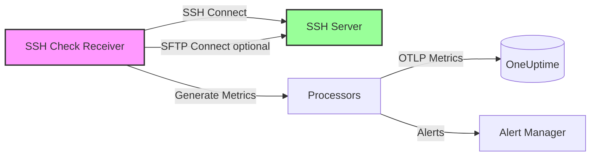

# How to Configure the SSH Check Receiver in the OpenTelemetry Collector

Author: [nawazdhandala](https://www.github.com/nawazdhandala)

Tags: OpenTelemetry, Collector, SSH Check, Synthetic Monitoring, Infrastructure Monitoring, Remote Execution

Description: Comprehensive guide to configuring the SSH Check receiver in OpenTelemetry Collector for monitoring SSH and SFTP connectivity, tracking connection latency, and generating infrastructure health metrics

---

The SSH Check receiver in the OpenTelemetry Collector enables you to perform synthetic monitoring of SSH endpoints by periodically establishing SSH connections and generating metrics based on connection success, latency, and errors. This receiver is essential for monitoring server accessibility and verifying SSH service availability within your OpenTelemetry observability pipeline.

By deploying the SSH Check receiver, you can monitor SSH connectivity to critical infrastructure, track connection latency, optionally verify SFTP availability, and generate metrics for uptime monitoring - all within your existing OpenTelemetry pipeline.

> **Important note:** The SSH Check receiver monitors **SSH and SFTP connectivity only**. It does **not** support remote command execution or output validation. If you need to run commands on remote servers, consider using the OpenTelemetry Collector's script-based processors or deploying OpenTelemetry agents directly on target hosts.

---

## What is the SSH Check Receiver?

The SSH Check receiver is an OpenTelemetry Collector component that acts as an SSH client, periodically connecting to a configured SSH server and generating metrics based on connection success, latency, and errors. Unlike passive receivers that accept incoming telemetry, the SSH Check receiver actively probes an SSH endpoint to assess its availability.

The receiver generates several key metrics:
- **Connection status** - Whether the SSH connection succeeded or failed
- **Connection duration** - Time taken to establish the SSH connection
- **Connection errors** - Error details when connections fail
- **SFTP status** - Whether an SFTP connection succeeded (optional)
- **SFTP duration** - Time taken to establish the SFTP connection (optional)
- **SFTP errors** - Error details when SFTP connections fail (optional)

**Primary use cases:**

- SSH service availability monitoring
- Infrastructure access verification
- Connection latency tracking
- SFTP service availability monitoring
- SSH key rotation validation

---

## Architecture Overview

The SSH Check receiver runs within the Collector and actively establishes SSH connections to a configured server, generating metrics that flow through your observability pipeline:


```mermaid
graph LR
    A[SSH Check Receiver] -->|SSH Connect| B[SSH Server]
    A -->|SFTP Connect optional| B

    A -->|Generate Metrics| E[Processors]
    E -->|OTLP Metrics| F[(OneUptime)]
    E -->|Alerts| G[Alert Manager]

    style A fill:#f9f,stroke:#333,stroke-width:2px
    style B fill:#9f9,stroke:#333,stroke-width:2px
```

This architecture allows you to monitor SSH accessibility from within your infrastructure, ensuring you have visibility into server connectivity.

> **Note:** Each `sshcheck` receiver instance monitors a **single endpoint**. To monitor multiple servers, define multiple named receiver instances (e.g., `sshcheck/server1`, `sshcheck/server2`).

---

## Prerequisites

Before configuring the SSH Check receiver, ensure you have:

1. **OpenTelemetry Collector Contrib** (`otelcol-contrib`) distribution - the SSH Check receiver is not included in the core distribution
2. **SSH access credentials** for the target server (SSH key or password)
3. **Network connectivity** from the Collector to the monitored SSH endpoint
4. **SSH keys or passwords** securely stored (preferably using environment variables or secrets management)
5. **Known hosts file** configured (unless `ignore_host_key` is explicitly set to true)

---

## Configuration Reference

The SSH Check receiver supports the following configuration options:

**Required settings:**

| Setting | Description |
|---------|-------------|
| `endpoint` | SSH server address in `host:port` format |
| `username` | SSH username for authentication |
| `password` or `key_file` | Authentication credential (at least one required) |

> If both `password` and `key_file` are set, the password is treated as the **passphrase** for an encrypted key file.

**Optional settings:**

| Setting | Default | Description |
|---------|---------|-------------|
| `collection_interval` | `60s` | How often to perform SSH checks |
| `timeout` | `10s` | Connection timeout duration |
| `known_hosts` | SSH defaults | Path to known_hosts file for host key verification |
| `ignore_host_key` | `false` | Skip host key verification (not recommended for production) |
| `check_sftp` | `false` | Also check SFTP connectivity after SSH connection |
| `metrics` | (all SSH enabled) | Enable or disable individual metrics |

---

## Basic Configuration

Here is a minimal working configuration for monitoring a single SSH endpoint:

```yaml
# RECEIVERS: Define how telemetry enters the Collector
receivers:
  # SSH Check receiver performs synthetic monitoring of an SSH endpoint
  sshcheck:
    # SSH server to monitor (host:port format)
    endpoint: server1.example.com:22

    # SSH authentication
    username: monitoring

    # Use SSH key for authentication (recommended)
    key_file: /etc/ssh/keys/monitoring_key

    # How often to perform checks
    collection_interval: 60s

# EXPORTERS: Define where metrics are sent
exporters:
  # Export metrics to OneUptime using OTLP
  otlphttp:
    endpoint: https://oneuptime.com/otlp
    headers:
      x-oneuptime-token: ${ONEUPTIME_TOKEN}

# SERVICE: Wire receivers to exporters
service:
  pipelines:
    # Metrics pipeline: receive from SSH Check, export to OneUptime
    metrics:
      receivers: [sshcheck]
      exporters: [otlphttp]
```

**Configuration breakdown:**

- `endpoint`: SSH server address and port (default SSH port is 22)
- `username`: SSH username for authentication
- `key_file` or `password`: Authentication method (key-based is recommended)
- `collection_interval`: How often to perform SSH checks (default: 60s)

---

## Monitoring Multiple SSH Servers

Since each `sshcheck` receiver instance monitors a single endpoint, use **named receiver instances** to monitor multiple servers:

```yaml
receivers:
  # Monitor web server SSH connectivity
  sshcheck/web-server:
    endpoint: web-server-01.internal:22
    username: monitoring
    key_file: /etc/ssh/keys/monitoring_key
    collection_interval: 60s

  # Monitor database server SSH connectivity
  sshcheck/db-server:
    endpoint: db-server-01.internal:22
    username: monitoring
    key_file: /etc/ssh/keys/monitoring_key
    collection_interval: 60s

  # Monitor external server with password auth
  sshcheck/external-server:
    endpoint: external-server.example.com:2222
    username: monitoring
    password: ${SSH_PASSWORD_EXTERNAL}
    collection_interval: 120s
    timeout: 20s

  # Monitor SFTP server (with SFTP check enabled)
  sshcheck/sftp-server:
    endpoint: sftp.example.com:22
    username: monitoring
    key_file: /etc/ssh/keys/monitoring_key
    check_sftp: true
    collection_interval: 60s

exporters:
  otlphttp:
    endpoint: https://oneuptime.com/otlp
    headers:
      x-oneuptime-token: ${ONEUPTIME_TOKEN}

service:
  pipelines:
    metrics:
      receivers:
        - sshcheck/web-server
        - sshcheck/db-server
        - sshcheck/external-server
        - sshcheck/sftp-server
      exporters: [otlphttp]
```

Each named instance (`sshcheck/web-server`, `sshcheck/db-server`, etc.) independently monitors its configured endpoint and reports metrics separately.

---

## Production Configuration

For production deployments, add proper secret management, SFTP checks, processors, and retry logic:

```yaml
receivers:
  # Production web server monitoring
  sshcheck/web-prod:
    endpoint: web-server-01.internal:22
    username: monitoring
    key_file: /etc/otel/ssh_monitoring_key
    collection_interval: 30s
    timeout: 5s
    known_hosts: /etc/otel/known_hosts

  # Production database server monitoring
  sshcheck/db-prod:
    endpoint: db-server-01.internal:22
    username: monitoring
    key_file: /etc/otel/ssh_monitoring_key
    collection_interval: 30s
    timeout: 10s
    known_hosts: /etc/otel/known_hosts

  # SFTP server monitoring with SFTP checks
  sshcheck/sftp-prod:
    endpoint: sftp.internal:22
    username: monitoring
    key_file: /etc/otel/ssh_monitoring_key
    check_sftp: true
    collection_interval: 60s
    timeout: 15s
    known_hosts: /etc/otel/known_hosts

processors:
  # Protect Collector from memory exhaustion
  memory_limiter:
    limit_mib: 256
    spike_limit_mib: 64
    check_interval: 2s

  # Add resource attributes to identify the check source
  resource:
    attributes:
      - key: monitoring.type
        value: synthetic-ssh
        action: upsert
      - key: monitoring.location
        value: datacenter-us-east
        action: upsert

  # Batch metrics for efficient export
  batch:
    timeout: 10s
    send_batch_size: 100

exporters:
  # Export to OneUptime with retry configuration
  otlphttp:
    endpoint: https://oneuptime.com/otlp
    headers:
      x-oneuptime-token: ${ONEUPTIME_TOKEN}
    retry_on_failure:
      enabled: true
      initial_interval: 5s
      max_interval: 30s
      max_elapsed_time: 300s
    timeout: 30s
    compression: gzip

service:
  # Enable telemetry for the Collector itself
  telemetry:
    logs:
      level: info
    metrics:
      address: localhost:8888

  pipelines:
    metrics:
      receivers:
        - sshcheck/web-prod
        - sshcheck/db-prod
        - sshcheck/sftp-prod
      processors: [memory_limiter, resource, batch]
      exporters: [otlphttp]
```

**Key production considerations:**

1. **Host key verification:** Always use `known_hosts` in production - never set `ignore_host_key: true`
2. **SSH key authentication:** Prefer `key_file` over `password` for stronger security
3. **Appropriate timeouts:** Set `timeout` to match expected network conditions
4. **Memory limiting:** Use `memory_limiter` processor to protect the Collector from resource exhaustion
5. **Retry logic:** Configure `retry_on_failure` on your exporter for resilience

---

## SFTP Check Configuration

The SSH Check receiver can optionally verify SFTP connectivity in addition to SSH. SFTP checks can be enabled in two ways:

**Option 1: Using the `check_sftp` flag:**

```yaml
receivers:
  sshcheck:
    endpoint: sftp.example.com:22
    username: monitoring
    key_file: /path/to/private_key
    check_sftp: true
    collection_interval: 60s
```

**Option 2: Enabling SFTP metrics individually:**

```yaml
receivers:
  sshcheck:
    endpoint: sftp.example.com:22
    username: monitoring
    key_file: /path/to/private_key
    collection_interval: 60s
    metrics:
      sshcheck.sftp_duration:
        enabled: true
      sshcheck.sftp_status:
        enabled: true
      sshcheck.sftp_error:
        enabled: true
```

When SFTP checks are enabled, the receiver establishes an SFTP connection after a successful SSH connection. Note that SFTP checks require a successful SSH connection first - if the SSH connection fails, SFTP metrics will not be generated.

---

## Metric Enable/Disable Configuration

Individual metrics can be enabled or disabled using the `metrics` section. By default, all SSH metrics are enabled and all SFTP metrics are disabled:

```yaml
receivers:
  sshcheck:
    endpoint: server.example.com:22
    username: monitoring
    key_file: /path/to/key
    metrics:
      # SSH metrics (enabled by default)
      sshcheck.duration:
        enabled: true    # Default: true
      sshcheck.status:
        enabled: true    # Default: true
      sshcheck.error:
        enabled: true    # Default: true

      # SFTP metrics (disabled by default)
      sshcheck.sftp_duration:
        enabled: false   # Default: false
      sshcheck.sftp_status:
        enabled: false   # Default: false
      sshcheck.sftp_error:
        enabled: false   # Default: false
```

---

## Generated Metrics

The SSH Check receiver produces the following metrics:

| Metric Name | Type | Description | Unit | Default |
|-------------|------|-------------|------|---------|
| `sshcheck.duration` | Gauge | Time taken to establish SSH connection | ms | Enabled |
| `sshcheck.status` | Sum | 1 if SSH connection succeeded, 0 if failed | 1 | Enabled |
| `sshcheck.error` | Sum | Records errors occurring during SSH check | {error} | Enabled |
| `sshcheck.sftp_duration` | Gauge | Time taken to establish SFTP connection | ms | Disabled |
| `sshcheck.sftp_status` | Sum | 1 if SFTP connection succeeded, 0 if failed | 1 | Disabled |
| `sshcheck.sftp_error` | Sum | Records errors occurring during SFTP check | {error} | Disabled |

**Example metric output:**

```
sshcheck_duration{} 245.7
sshcheck_status{} 1
sshcheck_error{} 0
```

With SFTP checks enabled:

```
sshcheck_duration{} 245.7
sshcheck_status{} 1
sshcheck_error{} 0
sshcheck_sftp_duration{} 312.4
sshcheck_sftp_status{} 1
sshcheck_sftp_error{} 0
```

---

## Authentication Best Practices

**Use SSH keys instead of passwords:**

SSH key authentication is more secure and eliminates the need to store passwords in configuration files.

```bash
# Generate an SSH key pair for monitoring
ssh-keygen -t ed25519 -C "monitoring@otel-collector" -f /etc/ssh/keys/monitoring_key

# Copy public key to target servers
ssh-copy-id -i /etc/ssh/keys/monitoring_key.pub monitoring@server1.example.com

# Set proper permissions
chmod 600 /etc/ssh/keys/monitoring_key
chmod 644 /etc/ssh/keys/monitoring_key.pub
```

**Configuration using SSH keys:**

```yaml
receivers:
  sshcheck:
    endpoint: server1.example.com:22
    username: monitoring
    key_file: /etc/ssh/keys/monitoring_key
```

**Using an encrypted key file with a passphrase:**

When both `password` and `key_file` are set, the password is treated as the passphrase for the encrypted key:

```yaml
receivers:
  sshcheck:
    endpoint: server1.example.com:22
    username: monitoring
    key_file: /etc/ssh/keys/monitoring_key_encrypted
    password: ${SSH_KEY_PASSPHRASE}
```

**Secure password storage (if SSH keys are not possible):**

Use environment variables and secrets management:

```yaml
receivers:
  sshcheck:
    endpoint: server1.example.com:22
    username: monitoring
    # Password from environment variable
    password: ${SSH_PASSWORD}
```

```bash
# Set password as environment variable
export SSH_PASSWORD='secure-password-here'

# Or use a secrets manager
export SSH_PASSWORD=$(aws secretsmanager get-secret-value --secret-id ssh-monitoring-password --query SecretString --output text)
```

**Dedicated monitoring user:**

Create a dedicated user with minimal privileges for SSH connectivity checks:

```bash
# On target servers, create monitoring user
sudo useradd -m -s /bin/bash monitoring

# Add public key
sudo mkdir -p /home/monitoring/.ssh
sudo cat monitoring_key.pub | sudo tee /home/monitoring/.ssh/authorized_keys
sudo chmod 700 /home/monitoring/.ssh
sudo chmod 600 /home/monitoring/.ssh/authorized_keys
sudo chown -R monitoring:monitoring /home/monitoring/.ssh
```

---

## Alerting on SSH Check Failures

Configure your observability backend to alert when SSH checks fail.

**Example alert conditions:**

1. **SSH connection failed:** `sshcheck_status == 0`
2. **SFTP connection failed:** `sshcheck_sftp_status == 0`
3. **Slow SSH connection:** `sshcheck_duration > 5000` (5 seconds)
4. **Slow SFTP connection:** `sshcheck_sftp_duration > 10000` (10 seconds)

**OneUptime alert configuration example:**

```yaml
# Alert when SSH connection fails
- alert: SSHConnectionFailed
  expr: sshcheck_status == 0
  for: 2m
  labels:
    severity: critical
  annotations:
    summary: "SSH connection failed"
    description: "Unable to establish SSH connection for 2 minutes"

# Alert when SFTP connection fails
- alert: SFTPConnectionFailed
  expr: sshcheck_sftp_status == 0
  for: 2m
  labels:
    severity: critical
  annotations:
    summary: "SFTP connection failed"
    description: "Unable to establish SFTP connection for 2 minutes"

# Alert when SSH connection is slow
- alert: SSHConnectionSlow
  expr: sshcheck_duration > 5000
  for: 10m
  labels:
    severity: warning
  annotations:
    summary: "Slow SSH connection"
    description: "SSH connection taking {{ $value }}ms (threshold: 5000ms)"
```

---

## Security Considerations

**1. Principle of least privilege:**

The monitoring user only needs to establish an SSH connection - it does not need to execute any commands:

```bash
# Create monitoring user with a restricted shell
sudo useradd -m -s /usr/sbin/nologin monitoring

# If you need the user to also support SFTP checks, use:
sudo useradd -m -s /bin/false monitoring
# And configure the SSH server to allow SFTP-only access
```

**2. SSH key security:**

Protect SSH keys used by the Collector:

```bash
# Set strict permissions
chmod 600 /etc/ssh/keys/monitoring_key
chown otel-collector:otel-collector /etc/ssh/keys/monitoring_key

# Regularly rotate keys and update target servers
```

**3. Network segmentation:**

Run the Collector in a secure network segment with firewall rules limiting outbound SSH access to only monitored servers.

**4. Host key verification:**

Always enable host key verification in production to prevent man-in-the-middle attacks:

```yaml
receivers:
  sshcheck:
    endpoint: server.example.com:22
    username: monitoring
    key_file: /etc/ssh/keys/monitoring_key
    known_hosts: /etc/otel/known_hosts
    ignore_host_key: false  # This is the default; never set to true in production
```

```bash
# Add host keys to known_hosts
ssh-keyscan -H server.example.com >> /etc/otel/known_hosts
```

**5. Audit logging:**

Enable SSH session logging on target servers:

```bash
# /etc/ssh/sshd_config
LogLevel VERBOSE

# Monitor /var/log/auth.log for monitoring user activity
```

---

## Performance Considerations

**Check interval tuning:**

Balance between monitoring granularity and resource usage:

- **Critical servers:** 30–60 seconds
- **Standard servers:** 60–120 seconds
- **Non-critical servers:** 300 seconds (5 minutes)

**Resource usage:**

Each SSH check creates a new SSH connection. Consider:
- Network bandwidth for the SSH handshake
- CPU for encryption/decryption
- Memory for connection state

For monitoring many servers, distribute checks across multiple Collector instances to avoid overloading a single Collector.

**Example configuration with memory limits:**

```yaml
receivers:
  sshcheck/server1:
    endpoint: server1.internal:22
    username: monitoring
    key_file: /etc/otel/ssh_key
    collection_interval: 120s

  sshcheck/server2:
    endpoint: server2.internal:22
    username: monitoring
    key_file: /etc/otel/ssh_key
    collection_interval: 120s

processors:
  memory_limiter:
    limit_mib: 512
    spike_limit_mib: 128

service:
  pipelines:
    metrics:
      receivers: [sshcheck/server1, sshcheck/server2]
      processors: [memory_limiter]
      exporters: [otlphttp]
```

---

## Combining with Other Monitoring

The SSH Check receiver works well alongside other receivers for comprehensive monitoring:

```yaml
receivers:
  # SSH connectivity checks
  sshcheck/web:
    endpoint: server1.internal:22
    username: monitoring
    key_file: /etc/ssh/keys/monitoring_key
    collection_interval: 60s

  # HTTP endpoint checks
  httpcheck:
    targets:
      - endpoint: https://server1.internal:8080/health
        method: GET
    collection_interval: 60s

  # Host metrics from OpenTelemetry agents on servers
  otlp:
    protocols:
      grpc:
      http:

processors:
  batch:

exporters:
  otlphttp:
    endpoint: https://oneuptime.com/otlp
    headers:
      x-oneuptime-token: ${ONEUPTIME_TOKEN}

service:
  pipelines:
    # SSH synthetic checks
    metrics/ssh:
      receivers: [sshcheck/web]
      processors: [batch]
      exporters: [otlphttp]

    # HTTP synthetic checks
    metrics/http:
      receivers: [httpcheck]
      processors: [batch]
      exporters: [otlphttp]

    # Agent-reported metrics
    metrics/agent:
      receivers: [otlp]
      processors: [batch]
      exporters: [otlphttp]
```

This configuration provides comprehensive monitoring: SSH connectivity, HTTP availability, and detailed host metrics. By combining the SSH Check receiver with HTTP checks, you can detect whether a server is reachable at the network level (SSH) even if the application layer (HTTP) is failing.

---

## Troubleshooting Common Issues

**1. Authentication failures:**

SSH checks consistently fail with authentication errors.

**Solution:**
- Verify SSH key permissions (should be 600)
- Ensure the public key is in the target server's `~/.ssh/authorized_keys`
- Check that the username is correct
- Test manually: `ssh -i /etc/ssh/keys/monitoring_key monitoring@server1.example.com`

**2. Connection timeouts:**

SSH checks timeout without establishing a connection.

**Solution:**
- Verify network connectivity from the Collector host
- Check firewall rules allowing outbound SSH (port 22 or custom)
- Increase `timeout` in configuration
- Test manually: `nc -zv server1.example.com 22`

**3. Host key verification failures:**

Checks fail with "host key verification failed" errors.

**Solution:**
- Add host keys to the known_hosts file:

```bash
# Add host key to known_hosts
ssh-keyscan -H server1.example.com >> /etc/otel/known_hosts
```

- Or temporarily set `ignore_host_key: true` for testing (not recommended for production)

**4. SFTP check failures when SSH succeeds:**

SSH connection succeeds but SFTP check fails.

**Solution:**
- Verify the SSH server has SFTP subsystem enabled
- Check that the monitoring user has SFTP access
- Test manually: `sftp monitoring@server1.example.com`

**5. High resource usage:**

Collector consumes excessive resources when running many SSH checks.

**Solution:**
- Increase `collection_interval` to reduce check frequency
- Distribute checks across multiple Collector instances
- Use `memory_limiter` processor to cap resource usage

```yaml
service:
  telemetry:
    logs:
      level: debug
```

Enable debug logging to see detailed information about connection attempts and errors.

---

## Integration with OneUptime

OneUptime provides native support for OpenTelemetry metrics, making it ideal for SSH check monitoring:

```yaml
exporters:
  otlphttp:
    endpoint: https://oneuptime.com/otlp
    headers:
      x-oneuptime-token: ${ONEUPTIME_TOKEN}
    compression: gzip

service:
  pipelines:
    metrics:
      receivers: [sshcheck/web, sshcheck/db]
      processors: [resource, batch]
      exporters: [otlphttp]
```

Once metrics flow into OneUptime, you can:
- Create dashboards showing SSH connectivity status across your fleet
- Configure alerts for connection failures
- Track SSH connection latency trends over time
- Correlate SSH checks with application metrics and logs
- Identify patterns in server accessibility issues

---

## Related Topics

For more information on OpenTelemetry Collector receivers and infrastructure monitoring:

- [OpenTelemetry Collector: What It Is, When You Need It, and When You Don't](https://oneuptime.com/blog/post/2025-09-18-what-is-opentelemetry-collector-and-why-use-one/view)
- [How to Configure the HTTP Check Receiver in the OpenTelemetry Collector](https://oneuptime.com/blog/post/2026-02-06-http-check-receiver-opentelemetry-collector/view)
- [How to Monitor Service Ports with OneUptime](https://oneuptime.com/blog/post/2025-10-27-monitor-service-ports-with-oneuptime/view)
- [How to Monitor IP Addresses with OneUptime](https://oneuptime.com/blog/post/2025-10-27-monitor-ip-addresses-with-oneuptime/view)

---

## Conclusion

The SSH Check receiver transforms the OpenTelemetry Collector into an SSH connectivity monitor, enabling proactive infrastructure monitoring without deploying agents on every server. By periodically establishing SSH connections, it provides early warning of connectivity issues, authentication failures, and network problems.

Configure checks with appropriate intervals and timeouts, use SSH keys for authentication, enable SFTP checks where needed, and export metrics to backends like OneUptime for visualization and alerting. For monitoring multiple servers, use named receiver instances (`sshcheck/server1`, `sshcheck/server2`, etc.) to check each endpoint independently.

Whether you are monitoring server accessibility, verifying SFTP service availability, or tracking SSH connection performance, the SSH Check receiver provides a lightweight and reliable approach to infrastructure observability within your existing OpenTelemetry pipeline.
