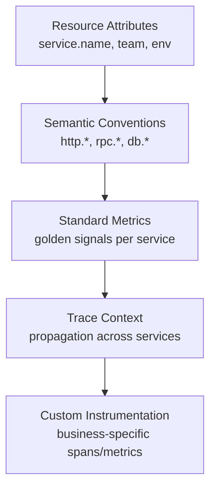

# How to Standardize Telemetry Instrumentation Across 50+ Microservices with OpenTelemetry

Author: [nawazdhandala](https://www.github.com/nawazdhandala)

Tags: OpenTelemetry, Microservices, Standardization, Instrumentation

Description: A practical strategy for rolling out consistent OpenTelemetry instrumentation across a large fleet of microservices in multiple languages.

When you have a handful of services, inconsistent instrumentation is annoying. When you have 50 or more, it becomes a real problem. Different metric names, missing trace context propagation, inconsistent attribute naming, and varying SDK versions make it nearly impossible to build reliable dashboards, alerts, or cross-service trace analysis. The data is there, but it does not connect.

OpenTelemetry provides the standards, but adopting them across a large fleet requires a deliberate rollout strategy. This post covers the practical steps: defining your instrumentation standard, building shared libraries, automating compliance checks, and handling the long tail of services that resist standardization.

## The Standardization Pyramid



Start from the bottom. Resource attributes are the foundation - without consistent `service.name` and `deployment.environment`, you cannot correlate anything. Semantic conventions come next. Standard metrics and trace propagation build on top. Custom instrumentation is the last layer and the most flexible.

## Defining the Instrumentation Standard

Document what "instrumented" means in your organization. Be specific enough that compliance can be checked automatically.

```yaml
# instrumentation-standard.yaml
# The organization's telemetry instrumentation standard.
# Services must meet these requirements to be considered "instrumented."
version: "1.0"

resource_attributes:
  required:
    - service.name        # Must match the service catalog entry
    - service.version     # Semantic version from build metadata
    - deployment.environment  # staging, production
    - team                # Owning team name
  optional:
    - service.namespace   # Logical grouping
    - cloud.region        # Deployment region

metrics:
  required:
    # Every HTTP service must emit these
    - name: http.server.request.duration
      type: histogram
      unit: ms
      attributes: [http.request.method, http.route, http.response.status_code]
    - name: http.server.active_requests
      type: up_down_counter
      unit: "1"
  recommended:
    - name: db.client.query.duration
      type: histogram
      unit: ms
      condition: "service uses a database"

traces:
  required:
    # W3C trace context propagation
    propagators: [tracecontext, baggage]
    # Minimum span attributes
    span_attributes:
      http_server:
        - http.request.method
        - http.route
        - http.response.status_code
        - server.address
      http_client:
        - http.request.method
        - url.full
        - http.response.status_code
      database:
        - db.system
        - db.statement  # sanitized, no PII

sdk_versions:
  # Minimum SDK versions to ensure compatibility
  python: ">=1.22.0"
  nodejs: ">=1.20.0"
  java: ">=1.34.0"
  go: ">=1.24.0"
```

## Shared Instrumentation Libraries

For each language in your stack, build a thin wrapper library that initializes OpenTelemetry with the correct configuration. Teams install the library instead of configuring the SDK from scratch.

Python shared library:

```python
# org_otel/init.py - Organization-standard OTel initialization for Python
import os
import logging
from opentelemetry import trace, metrics
from opentelemetry.sdk.trace import TracerProvider
from opentelemetry.sdk.trace.export import BatchSpanProcessor
from opentelemetry.sdk.metrics import MeterProvider
from opentelemetry.sdk.metrics.export import PeriodicExportingMetricReader
from opentelemetry.exporter.otlp.proto.grpc.trace_exporter import OTLPSpanExporter
from opentelemetry.exporter.otlp.proto.grpc.metric_exporter import OTLPMetricExporter
from opentelemetry.sdk.resources import Resource

logger = logging.getLogger("org_otel")

# Standard resource attributes, read from environment
_REQUIRED_ENV_VARS = ["OTEL_SERVICE_NAME", "DEPLOYMENT_ENV", "TEAM_NAME"]

def init(service_version: str = "unknown") -> tuple:
    """Initialize OpenTelemetry with organization-standard settings.

    Required environment variables:
        OTEL_SERVICE_NAME: service name matching the catalog
        DEPLOYMENT_ENV: staging or production
        TEAM_NAME: owning team
        OTEL_EXPORTER_OTLP_ENDPOINT: collector endpoint (default localhost:4317)
    """
    # Validate required env vars are set
    missing = [v for v in _REQUIRED_ENV_VARS if not os.environ.get(v)]
    if missing:
        raise EnvironmentError(
            f"Missing required environment variables: {', '.join(missing)}. "
            f"Set these before initializing telemetry."
        )

    resource = Resource.create({
        "service.name": os.environ["OTEL_SERVICE_NAME"],
        "service.version": service_version,
        "deployment.environment": os.environ["DEPLOYMENT_ENV"],
        "team": os.environ["TEAM_NAME"],
    })

    endpoint = os.environ.get("OTEL_EXPORTER_OTLP_ENDPOINT", "http://localhost:4317")

    # Traces
    tracer_provider = TracerProvider(resource=resource)
    tracer_provider.add_span_processor(
        BatchSpanProcessor(OTLPSpanExporter(endpoint=endpoint, insecure=True))
    )
    trace.set_tracer_provider(tracer_provider)

    # Metrics
    reader = PeriodicExportingMetricReader(
        OTLPMetricExporter(endpoint=endpoint, insecure=True),
        export_interval_millis=30000,
    )
    meter_provider = MeterProvider(resource=resource, metric_readers=[reader])
    metrics.set_meter_provider(meter_provider)

    logger.info(f"OTel initialized: {os.environ['OTEL_SERVICE_NAME']} -> {endpoint}")
    return tracer_provider, meter_provider
```

Teams use it with two lines:

```python
# In the service's main.py
from org_otel import init
init(service_version="2.1.0")
```

## Automated Compliance Checking

Build a checker that queries your metrics and trace backends to verify each service meets the standard.

```python
# compliance_checker.py - Verify services meet the instrumentation standard
import yaml
from dataclasses import dataclass
from typing import List

@dataclass
class ComplianceResult:
    service_name: str
    team: str
    overall_status: str  # "compliant", "partial", "non-compliant"
    checks: List[dict]
    score: float  # 0.0 to 1.0

class ComplianceChecker:
    def __init__(self, standard_path: str, metrics_backend, trace_backend):
        with open(standard_path) as f:
            self.standard = yaml.safe_load(f)
        self.metrics = metrics_backend
        self.traces = trace_backend

    def check_service(self, service_name: str) -> ComplianceResult:
        """Run all compliance checks for a service."""
        checks = []

        # Check resource attributes
        for attr in self.standard["resource_attributes"]["required"]:
            present = self.traces.has_resource_attribute(service_name, attr)
            checks.append({
                "check": f"resource.{attr}",
                "status": "pass" if present else "fail",
                "category": "resource_attributes",
            })

        # Check required metrics
        for metric_def in self.standard["metrics"]["required"]:
            exists = self.metrics.metric_exists(
                metric_def["name"], service_name
            )
            # Check required attributes on the metric
            has_attrs = True
            if exists:
                for attr in metric_def.get("attributes", []):
                    if not self.metrics.metric_has_attribute(
                        metric_def["name"], service_name, attr
                    ):
                        has_attrs = False

            checks.append({
                "check": f"metric.{metric_def['name']}",
                "status": "pass" if (exists and has_attrs) else "fail",
                "category": "metrics",
            })

        # Check trace propagation
        propagation_ok = self.traces.has_w3c_context(service_name)
        checks.append({
            "check": "trace.propagation.w3c",
            "status": "pass" if propagation_ok else "fail",
            "category": "traces",
        })

        # Calculate score
        passed = sum(1 for c in checks if c["status"] == "pass")
        score = passed / len(checks) if checks else 0

        if score == 1.0:
            status = "compliant"
        elif score >= 0.6:
            status = "partial"
        else:
            status = "non-compliant"

        return ComplianceResult(
            service_name=service_name,
            team=self._get_team(service_name),
            overall_status=status,
            checks=checks,
            score=round(score, 2),
        )

    def check_all_services(self) -> List[ComplianceResult]:
        """Run compliance checks across all registered services."""
        services = self.metrics.list_services()
        return [self.check_service(s) for s in services]
```

## Compliance Dashboard

Publish the compliance results as OpenTelemetry metrics so they appear on a dashboard alongside your other observability data.

```python
# compliance_metrics.py - Emit compliance scores as OTel metrics
from opentelemetry import metrics

meter = metrics.get_meter("instrumentation.compliance", version="1.0.0")

compliance_score = meter.create_gauge(
    name="instrumentation.compliance.score",
    description="Instrumentation compliance score (0.0 to 1.0)",
    unit="1",
)

def publish_compliance_results(results: list):
    """Publish compliance scores for all services."""
    for result in results:
        compliance_score.set(result.score, attributes={
            "service.name": result.service_name,
            "team": result.team,
            "compliance.status": result.overall_status,
        })
```

## Rollout Strategy for 50+ Services

Do not try to instrument everything at once. Use a phased approach.

**Phase 1 (Week 1-2)**: Instrument 3-5 services owned by the platform team. Validate the shared library works and the compliance checker produces accurate results.

**Phase 2 (Week 3-4)**: Onboard 5-10 volunteer teams. These are early adopters who provide feedback and help refine the shared libraries.

**Phase 3 (Week 5-8)**: Roll out to all tier-1 (critical path) services. Require compliance as a deployment gate for these services.

**Phase 4 (Week 9-12)**: Extend to tier-2 and tier-3 services. Publish a compliance leaderboard by team.

**Phase 5 (Ongoing)**: Address the long tail. Some services will resist standardization due to unusual tech stacks, legacy code, or team bandwidth. Track these explicitly and schedule dedicated support sprints.

## Handling Multi-Language Environments

Most organizations with 50+ services use multiple languages. Maintain a shared library for each major language. Keep the libraries in a monorepo so changes can be coordinated.

```
org-otel-libs/
  python/
    org_otel/__init__.py
    setup.py
  nodejs/
    src/index.ts
    package.json
  java/
    src/main/java/com/org/otel/OtelInit.java
    pom.xml
  go/
    orgotel/init.go
    go.mod
```

Publish each library to the corresponding package registry (PyPI, npm, Maven, Go modules). Pin the OpenTelemetry SDK version in each library so teams do not accidentally use incompatible versions.

## Measuring Progress

Track two numbers weekly: the percentage of services that are compliant, and the average compliance score across all services. These numbers should trend upward. If they plateau, investigate which services are stuck and why.

The goal is not 100% compliance on day one. It is consistent, measurable progress toward a state where any engineer can look at any service's telemetry and know exactly what to expect. That predictability is what makes observability useful at scale.
