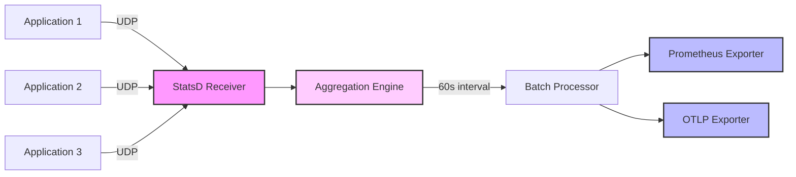

# How to Configure the StatsD Receiver in the OpenTelemetry Collector

Author: [nawazdhandala](https://www.github.com/nawazdhandala)

Tags: OpenTelemetry, Collector, StatsD, Metrics, Monitoring, Observability

Description: Complete guide to configuring the StatsD receiver in OpenTelemetry Collector. Learn protocol support, aggregation settings, and how to migrate from traditional StatsD servers.

StatsD is a widely adopted protocol for sending metrics from applications to monitoring systems. Originally developed by Etsy, StatsD has become a de facto standard for application metrics collection. The StatsD receiver in the OpenTelemetry Collector allows you to receive metrics in StatsD format and process them through the collector's pipeline, enabling migration from traditional StatsD servers to OpenTelemetry.

## Understanding the StatsD Receiver

The StatsD receiver implements the StatsD protocol, accepting metrics over UDP or TCP. It supports all standard StatsD metric types including counters, gauges, timers, histograms, and sets. The receiver aggregates incoming metrics according to configurable rules and converts them to OpenTelemetry's metric format.

StatsD's simple text-based protocol makes it easy to instrument applications without heavy dependencies. Applications send metrics as UDP datagrams, which provides fire-and-forget semantics with minimal performance impact.

## Basic Configuration

Here's a minimal configuration to start receiving StatsD metrics:

```yaml
receivers:
  statsd:
    # UDP endpoint for StatsD metrics
    endpoint: 0.0.0.0:8125

    # Aggregation interval
    aggregation_interval: 60s

processors:
  batch:
    timeout: 10s

exporters:
  logging:
    verbosity: detailed

service:
  pipelines:
    metrics:
      receivers: [statsd]
      processors: [batch]
      exporters: [logging]
```

This configuration sets up the StatsD receiver on the standard port 8125, aggregates metrics every 60 seconds, and forwards them through a batch processor to a logging exporter.

## StatsD Metric Types

The receiver supports all standard StatsD metric types:

### Counters

Counters track the number of times an event occurs:

```
page.views:1|c
api.requests:1|c
errors:1|c|@0.1
```

Configuration for counter metrics:

```yaml
receivers:
  statsd:
    endpoint: 0.0.0.0:8125
    aggregation_interval: 60s

    # Counter-specific settings
    enable_metric_type: true
    is_monotonic_counter: true
```

### Gauges

Gauges represent a value that can increase or decrease:

```
cpu.usage:45.2|g
memory.available:2048|g
queue.size:+10|g
queue.size:-5|g
```

### Timers

Timers measure durations in milliseconds:

```
response.time:250|ms
database.query:125.5|ms
api.latency:50|ms
```

The receiver can aggregate timers into histograms or summary metrics.

### Histograms

Similar to timers but can accept any numeric value:

```
request.size:1024|h
payload.bytes:512|h
```

### Sets

Sets count unique occurrences:

```
users.unique:user123|s
ip.addresses:192.168.1.1|s
sessions:session456|s
```

## Protocol Configuration

### UDP Configuration

UDP is the standard transport for StatsD metrics:

```yaml
receivers:
  statsd:
    # UDP endpoint
    endpoint: 0.0.0.0:8125

    # Protocol (udp or tcp)
    transport: udp

    # Aggregation interval
    aggregation_interval: 60s

    # Enable metric type metadata
    enable_metric_type: true

    # Timer histogram mapping
    timer_histogram_mapping:
      - statsd_type: "timing"
        observer_type: "histogram"
      - statsd_type: "histogram"
        observer_type: "histogram"
```

### TCP Configuration

For reliable delivery, use TCP:

```yaml
receivers:
  statsd:
    # TCP endpoint
    endpoint: 0.0.0.0:8125

    # Use TCP transport
    transport: tcp

    aggregation_interval: 60s
```

TCP provides guaranteed delivery but adds overhead. Use it when metrics are critical and loss is unacceptable.

## Aggregation Configuration

The StatsD receiver aggregates metrics before forwarding them. Configure aggregation behavior based on your requirements:

```yaml
receivers:
  statsd:
    endpoint: 0.0.0.0:8125

    # How often to aggregate and forward metrics
    aggregation_interval: 60s

    # Enable metric type in the metric name
    enable_metric_type: false

    # Treat counters as monotonic
    is_monotonic_counter: true

    # Timer histogram configuration
    timer_histogram_mapping:
      - statsd_type: "timing"
        observer_type: "histogram"
        histogram:
          max_size: 100

      - statsd_type: "histogram"
        observer_type: "summary"
```

## Advanced Configuration Options

### Metric Parsing Configuration

Control how the receiver parses metric names and tags:

```yaml
receivers:
  statsd:
    endpoint: 0.0.0.0:8125
    aggregation_interval: 60s

    # Parse DogStatsD tags
    # Format: metric.name:value|type|@sample_rate|#tag1:value1,tag2:value2
    enable_dogstatsd_extensions: true

    # Parse metric name patterns
    # Example: api.requests.GET.200
    enable_metric_name_prefix: false
```

### DogStatsD Extensions

Enable Datadog's StatsD extensions for tags and additional features:

```yaml
receivers:
  statsd:
    endpoint: 0.0.0.0:8125
    aggregation_interval: 60s

    # Enable DogStatsD tag format
    enable_dogstatsd_extensions: true
```

With DogStatsD extensions enabled, you can send tagged metrics:

```
api.requests:1|c|#endpoint:/users,method:GET,status:200
response.time:250|ms|#service:frontend,region:us-east
```

### Timer Configuration

Configure how timer metrics are aggregated:

```yaml
receivers:
  statsd:
    endpoint: 0.0.0.0:8125
    aggregation_interval: 60s

    # Timer histogram mapping
    timer_histogram_mapping:
      # Map timing metrics to histogram
      - statsd_type: "timing"
        observer_type: "histogram"
        histogram:
          max_size: 100

      # Calculate percentiles
      - statsd_type: "timing"
        observer_type: "summary"
        summary:
          quantiles:
            - quantile: 0.5
              error: 0.05
            - quantile: 0.9
              error: 0.01
            - quantile: 0.99
              error: 0.001
```

## Data Flow Architecture



## Complete Production Configuration

Here's a comprehensive production-ready configuration:

```yaml
receivers:
  statsd:
    # Listen on all interfaces
    endpoint: 0.0.0.0:8125

    # Use UDP for performance
    transport: udp

    # Aggregate every 60 seconds
    aggregation_interval: 60s

    # Enable DogStatsD tag support
    enable_dogstatsd_extensions: true

    # Treat counters as monotonic
    is_monotonic_counter: true

    # Timer histogram configuration
    timer_histogram_mapping:
      - statsd_type: "timing"
        observer_type: "histogram"
        histogram:
          max_size: 200

      - statsd_type: "histogram"
        observer_type: "histogram"
        histogram:
          max_size: 200

processors:
  # Protect against memory overload
  memory_limiter:
    check_interval: 1s
    limit_mib: 2000
    spike_limit_mib: 400

  # Batch metrics for efficiency
  batch:
    timeout: 10s
    send_batch_size: 1000
    send_batch_max_size: 2000

  # Add resource attributes
  resource:
    attributes:
      - key: collector.name
        value: statsd-collector-01
        action: insert
      - key: deployment.environment
        value: production
        action: insert

  # Transform metric names if needed
  metricstransform:
    transforms:
      # Rename metrics
      - include: "^api\\.(.*)$"
        match_type: regexp
        action: update
        new_name: "application.api.$1"

      # Add dimensions
      - include: ".*"
        match_type: regexp
        action: update
        operations:
          - action: add_label
            new_label: source
            new_value: statsd

exporters:
  # Export to Prometheus
  prometheus:
    endpoint: 0.0.0.0:9090
    namespace: app_metrics
    const_labels:
      environment: production

  # Export to OTLP backend
  otlp:
    endpoint: backend.example.com:4317
    tls:
      insecure: false
      cert_file: /etc/otel/certs/client.crt
      key_file: /etc/otel/certs/client.key
    compression: gzip
    timeout: 10s

service:
  pipelines:
    metrics:
      receivers: [statsd]
      processors:
        - memory_limiter
        - batch
        - resource
        - metricstransform
      exporters: [prometheus, otlp]

  telemetry:
    logs:
      level: info
      encoding: json
    metrics:
      address: 0.0.0.0:8888
```

## Client Configuration Examples

### Python with statsd-python

```python
import statsd

# Create StatsD client
client = statsd.StatsClient(
    host='otel-collector',
    port=8125,
    prefix='myapp'
)

# Send counter
client.incr('page.views')
client.incr('api.requests', rate=0.5)

# Send gauge
client.gauge('cpu.usage', 45.2)
client.gauge('queue.size', 100)

# Send timer
with client.timer('api.response_time'):
    # Your code here
    pass

# Manual timing
client.timing('db.query', 125.5)

# Unique values (set)
client.set('users.unique', 'user123')
```

### Python with datadog (DogStatsD)

```python
from datadog import initialize, statsd

# Initialize DogStatsD client
options = {
    'statsd_host': 'otel-collector',
    'statsd_port': 8125,
}
initialize(**options)

# Send metrics with tags
statsd.increment('api.requests', tags=['endpoint:/users', 'method:GET'])
statsd.gauge('memory.usage', 2048, tags=['host:web-01'])
statsd.histogram('request.size', 1024, tags=['service:frontend'])
statsd.timing('query.duration', 125.5, tags=['database:postgres'])
```

### Node.js with node-statsd

```javascript
const StatsD = require('node-statsd');

// Create client
const client = new StatsD({
  host: 'otel-collector',
  port: 8125,
  prefix: 'myapp.',
  cacheDns: true
});

// Send metrics
client.increment('page.views');
client.gauge('cpu.usage', 45.2);
client.timing('api.response_time', 250);
client.histogram('request.size', 1024);
client.set('users.unique', 'user123');

// Close client when done
client.close();
```

### Go with go-statsd-client

```go
package main

import (
    "github.com/cactus/go-statsd-client/v5/statsd"
    "time"
)

func main() {
    // Create client
    client, err := statsd.NewClient("otel-collector:8125", "myapp")
    if err != nil {
        panic(err)
    }
    defer client.Close()

    // Send metrics
    client.Inc("page.views", 1, 1.0)
    client.Gauge("cpu.usage", 45, 1.0)
    client.Timing("api.response_time", 250*time.Millisecond, 1.0)
    client.SetInt("users.unique", 12345, 1.0)
}
```

### Java with java-dogstatsd-client

```java
import com.timgroup.statsd.NonBlockingStatsDClient;
import com.timgroup.statsd.StatsDClient;

public class MetricsExample {
    public static void main(String[] args) {
        // Create client
        StatsDClient client = new NonBlockingStatsDClientBuilder()
            .hostname("otel-collector")
            .port(8125)
            .prefix("myapp")
            .build();

        // Send metrics with tags
        client.incrementCounter("page.views", "endpoint:/users");
        client.recordGaugeValue("cpu.usage", 45.2, "host:app-01");
        client.recordExecutionTime("api.response_time", 250, "method:GET");

        // Close client
        client.close();
    }
}
```

## Performance Optimization

### UDP Buffer Sizing

For high metric volumes, increase UDP buffer sizes:

```bash
# Increase UDP receive buffer
sudo sysctl -w net.core.rmem_max=26214400
sudo sysctl -w net.core.rmem_default=26214400
```

### Aggregation Interval Tuning

Balance between metric freshness and overhead:

```yaml
receivers:
  statsd:
    endpoint: 0.0.0.0:8125

    # Shorter interval for real-time metrics (higher overhead)
    aggregation_interval: 10s

    # Longer interval for reduced overhead
    # aggregation_interval: 300s
```

### Sampling

Use sampling to reduce metric volume:

```python
# Send only 10% of metrics
client.incr('high.frequency.counter', rate=0.1)
```

The receiver automatically adjusts counter values based on the sampling rate.

## Monitoring and Troubleshooting

### Monitor Receiver Metrics

Track receiver performance:

```yaml
service:
  telemetry:
    metrics:
      address: 0.0.0.0:8888
      level: detailed
```

Key metrics:
- `otelcol_receiver_accepted_metric_points`: Metrics accepted
- `otelcol_receiver_refused_metric_points`: Metrics refused
- `statsd_aggregation_operations`: Aggregation operations

### Debug Logging

Enable debug logging to troubleshoot issues:

```yaml
service:
  telemetry:
    logs:
      level: debug
      development: true
      encoding: console
```

### Check UDP Packet Loss

Monitor for dropped packets:

```bash
# Check UDP statistics
netstat -s | grep -i udp

# Watch for errors
watch -n 1 'netstat -s | grep -i "packet receive errors"'
```

### Test Connectivity

Verify the receiver is working:

```bash
# Send test metric using netcat
echo "test.metric:1|c" | nc -u -w1 localhost 8125

# Send test metric using Python
python3 -c "import socket; sock = socket.socket(socket.AF_INET, socket.SOCK_DGRAM); sock.sendto(b'test.metric:1|c', ('localhost', 8125))"
```

## Migration from Traditional StatsD

### From StatsD Daemon

Replace statsd daemon with the OpenTelemetry Collector:

```yaml
receivers:
  statsd:
    endpoint: 0.0.0.0:8125
    aggregation_interval: 10s  # Match statsd flushInterval
    enable_metric_type: false

exporters:
  # Export to Graphite (if used previously)
  carbon:
    endpoint: graphite.example.com:2003
    timeout: 5s

  # Also export to modern backend
  otlp:
    endpoint: backend.example.com:4317

service:
  pipelines:
    metrics:
      receivers: [statsd]
      processors: [batch]
      exporters: [carbon, otlp]
```

### Metric Name Compatibility

Ensure metric names remain compatible:

```yaml
processors:
  metricstransform:
    transforms:
      # Preserve original metric names
      - include: ".*"
        match_type: regexp
        action: update
        operations:
          - action: update_label
            label: metric.name
            value_actions:
              - value: ".*"
                new_value: "{{value}}"
```

## Integration with OneUptime

Export StatsD metrics to OneUptime for monitoring and alerting:

```yaml
exporters:
  otlp:
    endpoint: otlp.oneuptime.com:4317
    headers:
      x-oneuptime-token: "your-token-here"

service:
  pipelines:
    metrics:
      receivers: [statsd]
      processors: [batch, resource]
      exporters: [otlp]
```

## Best Practices

### Metric Naming Conventions

Use consistent naming patterns:

```
# Good: hierarchical, descriptive
api.requests.count
api.response.time.ms
database.connections.active

# Avoid: inconsistent, unclear
reqCount
resp_time
dbConn
```

### Tagging Strategy

Use tags (DogStatsD) for dimensions:

```python
# Instead of many metrics
client.incr('api.requests.users.GET')
client.incr('api.requests.users.POST')
client.incr('api.requests.orders.GET')

# Use tags
client.increment('api.requests', tags=['endpoint:users', 'method:GET'])
client.increment('api.requests', tags=['endpoint:users', 'method:POST'])
client.increment('api.requests', tags=['endpoint:orders', 'method:GET'])
```

### Sampling for High-Volume Metrics

Sample high-frequency metrics:

```python
# High-frequency counter with 10% sampling
client.incr('high.frequency.event', rate=0.1)
```

## Related Resources

Learn about other OpenTelemetry Collector receivers:

- https://oneuptime.com/blog/post/kafka-receiver-opentelemetry-collector/view
- https://oneuptime.com/blog/post/syslog-receiver-opentelemetry-collector/view
- https://oneuptime.com/blog/post/tcp-log-receiver-opentelemetry-collector/view

## Conclusion

The StatsD receiver provides seamless integration with the widely-used StatsD protocol, enabling you to collect application metrics without modifying existing instrumentation. Its support for all standard StatsD metric types, DogStatsD extensions, and flexible aggregation makes it suitable for various use cases.

Start with basic UDP configuration and progressively add features like DogStatsD tags, custom aggregation intervals, and metric transformations. Monitor receiver performance and adjust buffer sizes for high-volume scenarios.

With proper configuration, the StatsD receiver can handle production workloads while providing a migration path from traditional StatsD servers to modern OpenTelemetry-based observability infrastructure.
