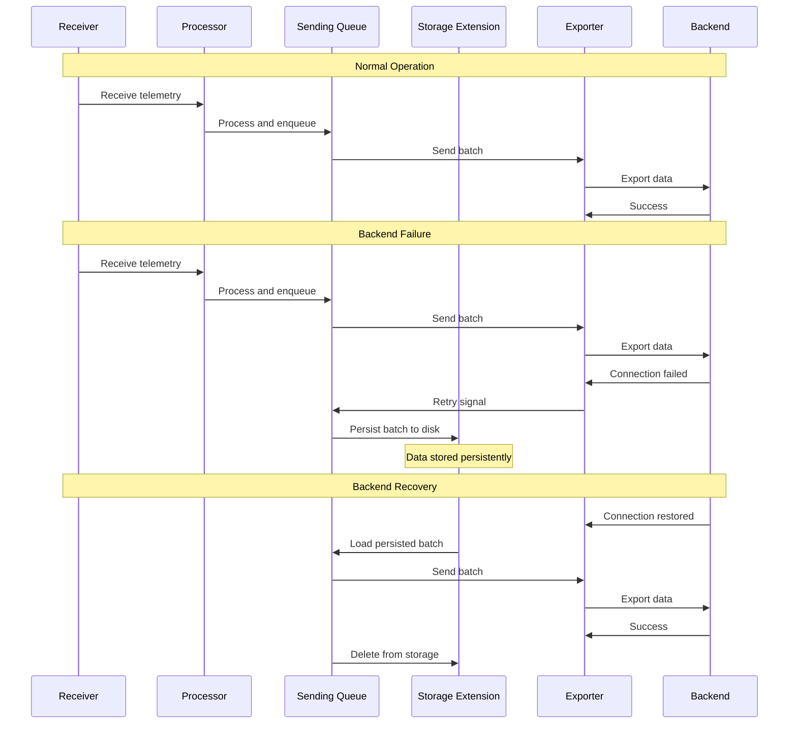
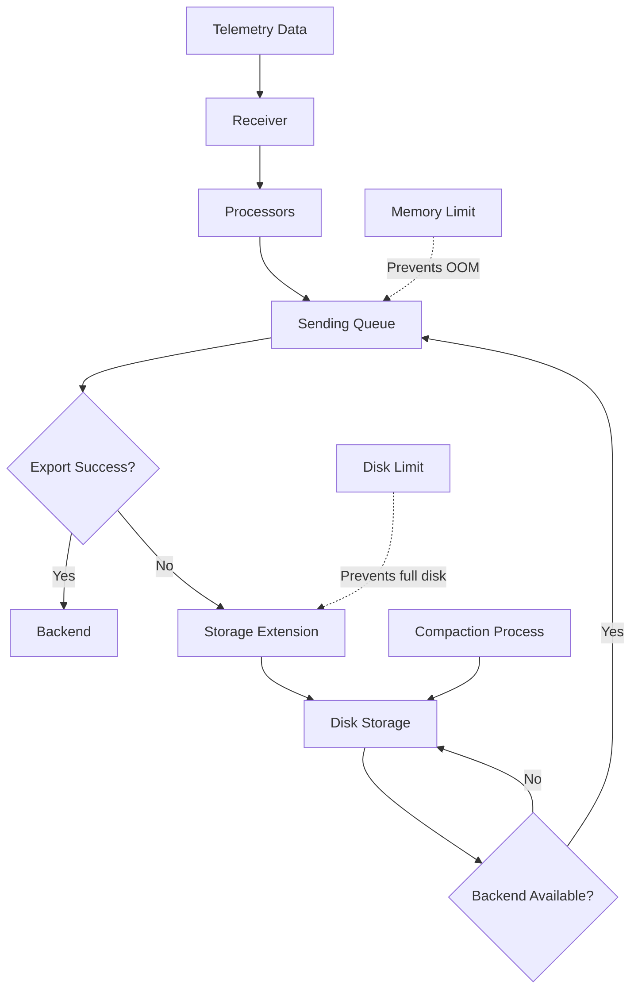

# How to Configure the Storage Extension in the OpenTelemetry Collector

Author: [nawazdhandala](https://www.github.com/nawazdhandala)

Tags: OpenTelemetry, Collector, Extensions, Storage, Persistence, Reliability, Data Loss Prevention

Description: Master the Storage extension configuration in OpenTelemetry Collector to implement persistent queuing, prevent data loss, and ensure reliable telemetry delivery during network outages.

The Storage extension in the OpenTelemetry Collector provides persistent storage capabilities that prevent telemetry data loss during temporary network outages, backend unavailability, or collector restarts. By buffering data to disk, the extension enables collectors to continue accepting telemetry even when exporters cannot deliver data to their destinations.

## Understanding the Storage Extension

The Storage extension implements a persistent queue that stores telemetry data on disk when exporters encounter delivery failures. This capability is critical for production deployments where data loss is unacceptable and network reliability cannot be guaranteed.

Unlike in-memory queuing which loses data during collector restarts or crashes, persistent storage ensures data survives these events. When the collector restarts or backends become available again, buffered data is automatically replayed from storage.

## Why Use Persistent Storage?

Modern observability systems must handle various failure scenarios gracefully. The Storage extension addresses several critical reliability challenges:

**Network outages**: When connections to backend systems fail, telemetry data accumulates in persistent storage rather than being dropped.

**Backend unavailability**: During maintenance windows or outages of backend systems, collectors continue accepting data without overwhelming memory.

**Collector restarts**: Planned restarts or crashes don't result in data loss as buffered data is preserved on disk.

**Traffic spikes**: Temporary spikes that exceed backend capacity are absorbed by the storage layer and delivered when capacity is available.

**Cost optimization**: By buffering data during high-cost periods, you can implement strategies to send data during lower-cost time windows.

## Basic Configuration

Here's a simple configuration enabling the Storage extension with the file storage backend:

```yaml
# collector-config.yaml
extensions:
  # Configure file storage extension
  file_storage:
    # Directory where data will be stored
    directory: /var/lib/otelcol/storage

    # Optional: timeout for storage operations
    timeout: 10s

    # Optional: compaction configuration
    compaction:
      # Enable compaction to reclaim space
      enabled: true
      # Directory for temporary files during compaction
      directory: /var/lib/otelcol/compaction
      # Trigger compaction when this much space can be reclaimed
      on_rebound: true
      # Maximum time for compaction operation
      rebound_needed_threshold_mib: 5
      rebound_trigger_threshold_mib: 10

receivers:
  otlp:
    protocols:
      grpc:
        endpoint: 0.0.0.0:4317
      http:
        endpoint: 0.0.0.0:4318

processors:
  batch:
    timeout: 10s
    send_batch_size: 1024

exporters:
  otlp:
    endpoint: "backend:4317"
    # Configure sending queue to use persistent storage
    sending_queue:
      enabled: true
      # Number of consumers processing the queue
      num_consumers: 10
      # Queue size (number of batches)
      queue_size: 5000
      # Reference the storage extension
      storage: file_storage

service:
  extensions: [file_storage]
  pipelines:
    traces:
      receivers: [otlp]
      processors: [batch]
      exporters: [otlp]
    metrics:
      receivers: [otlp]
      processors: [batch]
      exporters: [otlp]
    logs:
      receivers: [otlp]
      processors: [batch]
      exporters: [otlp]
```

This configuration creates a persistent queue in the specified directory. When the exporter cannot send data, batches are written to disk and replayed when the backend becomes available.

## Storage Extension Configuration Options

The file storage extension supports several configuration parameters for tuning performance and reliability:

```yaml
extensions:
  file_storage:
    # Primary storage directory
    directory: /var/lib/otelcol/storage

    # Timeout for storage operations (write, read, delete)
    timeout: 10s

    # Compaction reduces disk space by removing deleted entries
    compaction:
      enabled: true
      directory: /var/lib/otelcol/compaction

      # Compaction triggers based on reclaimable space
      rebound_needed_threshold_mib: 5
      rebound_trigger_threshold_mib: 10

      # Compaction frequency
      check_interval: 5m

      # Maximum concurrent compaction operations
      max_transaction_size: 65536

receivers:
  otlp:
    protocols:
      grpc:
        endpoint: 0.0.0.0:4317

processors:
  batch:
    timeout: 10s

exporters:
  otlp:
    endpoint: "backend:4317"
    sending_queue:
      enabled: true
      num_consumers: 10
      queue_size: 5000
      storage: file_storage

service:
  extensions: [file_storage]
  pipelines:
    traces:
      receivers: [otlp]
      processors: [batch]
      exporters: [otlp]
```

The timeout parameter prevents storage operations from blocking indefinitely. Compaction settings control how aggressively the extension reclaims disk space from deleted entries.

## Multiple Storage Instances

Configure separate storage instances for different pipelines or priorities:

```yaml
extensions:
  # High-priority storage with larger capacity
  file_storage/high_priority:
    directory: /var/lib/otelcol/storage/high-priority
    timeout: 10s
    compaction:
      enabled: true
      directory: /var/lib/otelcol/compaction/high-priority

  # Standard priority storage
  file_storage/standard:
    directory: /var/lib/otelcol/storage/standard
    timeout: 10s
    compaction:
      enabled: true
      directory: /var/lib/otelcol/compaction/standard

  # Low-priority storage with aggressive limits
  file_storage/low_priority:
    directory: /var/lib/otelcol/storage/low-priority
    timeout: 5s
    compaction:
      enabled: true
      directory: /var/lib/otelcol/compaction/low-priority

receivers:
  otlp:
    protocols:
      grpc:
        endpoint: 0.0.0.0:4317

processors:
  batch:
    timeout: 10s

  # Route by attributes to different priorities
  routing:
    from_attribute: "priority"
    default_exporters: [otlp/standard]
    table:
      - value: "high"
        exporters: [otlp/high_priority]
      - value: "low"
        exporters: [otlp/low_priority]

exporters:
  # High priority exporter
  otlp/high_priority:
    endpoint: "backend:4317"
    sending_queue:
      enabled: true
      num_consumers: 20
      queue_size: 10000
      storage: file_storage/high_priority

  # Standard priority exporter
  otlp/standard:
    endpoint: "backend:4317"
    sending_queue:
      enabled: true
      num_consumers: 10
      queue_size: 5000
      storage: file_storage/standard

  # Low priority exporter
  otlp/low_priority:
    endpoint: "backend:4317"
    sending_queue:
      enabled: true
      num_consumers: 5
      queue_size: 2000
      storage: file_storage/low_priority

service:
  extensions: [file_storage/high_priority, file_storage/standard, file_storage/low_priority]
  pipelines:
    traces:
      receivers: [otlp]
      processors: [routing, batch]
      exporters: [otlp/high_priority, otlp/standard, otlp/low_priority]
```

This configuration implements priority-based storage and delivery, ensuring critical telemetry is preserved and delivered first during resource constraints.

## Storage Flow Visualization

Here's how data flows through the storage extension during normal and failure scenarios:



## Disk Space Management

Configure limits to prevent unbounded disk usage:

```yaml
extensions:
  file_storage:
    directory: /var/lib/otelcol/storage
    timeout: 10s

    # Maximum storage size
    max_size_mib: 10240  # 10 GB

    # Compaction configuration
    compaction:
      enabled: true
      directory: /var/lib/otelcol/compaction
      rebound_needed_threshold_mib: 100
      rebound_trigger_threshold_mib: 200
      check_interval: 5m

receivers:
  otlp:
    protocols:
      grpc:
        endpoint: 0.0.0.0:4317

processors:
  batch:
    timeout: 10s

exporters:
  otlp:
    endpoint: "backend:4317"
    sending_queue:
      enabled: true
      num_consumers: 10
      queue_size: 5000
      storage: file_storage

      # Configure retry behavior
      retry_on_failure:
        enabled: true
        initial_interval: 5s
        max_interval: 30s
        max_elapsed_time: 5m

service:
  extensions: [file_storage]
  pipelines:
    traces:
      receivers: [otlp]
      processors: [batch]
      exporters: [otlp]
```

The max_size_mib parameter prevents storage from consuming all available disk space. When this limit is reached, the oldest data is dropped to make room for new data.

## Performance Tuning

Optimize storage performance for high-throughput scenarios:

```yaml
extensions:
  file_storage:
    directory: /var/lib/otelcol/storage
    timeout: 10s

    # Use fast storage (SSD recommended)
    # Configure on a dedicated volume for predictable performance

    compaction:
      enabled: true
      directory: /var/lib/otelcol/compaction

      # More aggressive compaction for high throughput
      rebound_needed_threshold_mib: 50
      rebound_trigger_threshold_mib: 100
      check_interval: 2m

      # Larger transaction size for better throughput
      max_transaction_size: 131072

receivers:
  otlp:
    protocols:
      grpc:
        endpoint: 0.0.0.0:4317
        max_recv_msg_size_mib: 32

processors:
  batch:
    # Larger batches reduce storage operations
    timeout: 10s
    send_batch_size: 2048
    send_batch_max_size: 4096

  # Memory limiter to prevent OOM
  memory_limiter:
    check_interval: 1s
    limit_mib: 2048
    spike_limit_mib: 512

exporters:
  otlp:
    endpoint: "backend:4317"
    sending_queue:
      enabled: true
      # More consumers for parallel processing
      num_consumers: 20
      # Larger queue for better buffering
      queue_size: 10000
      storage: file_storage

service:
  extensions: [file_storage]
  pipelines:
    traces:
      receivers: [otlp]
      processors: [memory_limiter, batch]
      exporters: [otlp]
```

Key performance factors include batch size, number of queue consumers, storage device speed, and compaction frequency.

## Integration with Retry Logic

Combine storage with exporter retry configuration for maximum reliability:

```yaml
extensions:
  file_storage:
    directory: /var/lib/otelcol/storage
    timeout: 10s
    compaction:
      enabled: true
      directory: /var/lib/otelcol/compaction

receivers:
  otlp:
    protocols:
      grpc:
        endpoint: 0.0.0.0:4317

processors:
  batch:
    timeout: 10s

exporters:
  otlp:
    endpoint: "backend:4317"

    # Sending queue with persistent storage
    sending_queue:
      enabled: true
      num_consumers: 10
      queue_size: 5000
      storage: file_storage

    # Retry configuration for transient failures
    retry_on_failure:
      enabled: true
      # Initial retry delay
      initial_interval: 5s
      # Maximum retry delay (exponential backoff)
      max_interval: 30s
      # Maximum time to retry before giving up
      max_elapsed_time: 10m
      # Multiplier for exponential backoff
      multiplier: 2

    # Timeout for export operations
    timeout: 30s

service:
  extensions: [file_storage]
  pipelines:
    traces:
      receivers: [otlp]
      processors: [batch]
      exporters: [otlp]
```

This configuration implements exponential backoff retry with persistent storage, providing robust handling of both transient and prolonged failures.

## Storage Architecture

The following diagram illustrates the storage extension architecture:



## Monitoring Storage Health

Track storage metrics to ensure healthy operation:

```yaml
extensions:
  file_storage:
    directory: /var/lib/otelcol/storage
    timeout: 10s
    compaction:
      enabled: true
      directory: /var/lib/otelcol/compaction

receivers:
  otlp:
    protocols:
      grpc:
        endpoint: 0.0.0.0:4317

  # Prometheus receiver for collector metrics
  prometheus:
    config:
      scrape_configs:
        - job_name: "otel-collector"
          static_configs:
            - targets: ["localhost:8888"]

processors:
  batch:
    timeout: 10s

exporters:
  otlp:
    endpoint: "backend:4317"
    sending_queue:
      enabled: true
      num_consumers: 10
      queue_size: 5000
      storage: file_storage

  # Export collector metrics
  prometheusremotewrite:
    endpoint: "http://prometheus:9090/api/v1/write"

service:
  extensions: [file_storage]

  # Expose internal metrics
  telemetry:
    metrics:
      address: ":8888"
      level: detailed

  pipelines:
    traces:
      receivers: [otlp]
      processors: [batch]
      exporters: [otlp]

    # Pipeline for collector metrics
    metrics:
      receivers: [prometheus]
      processors: [batch]
      exporters: [prometheusremotewrite]
```

Monitor these key metrics:

- `otelcol_exporter_queue_size`: Current queue size
- `otelcol_exporter_queue_capacity`: Maximum queue capacity
- `otelcol_exporter_send_failed_spans`: Failed export attempts
- Storage directory disk usage (via system metrics)

## Kubernetes Deployment

Deploy storage-enabled collectors in Kubernetes with persistent volumes:

```yaml
apiVersion: v1
kind: PersistentVolumeClaim
metadata:
  name: otel-collector-storage
  namespace: monitoring
spec:
  accessModes:
    - ReadWriteOnce
  resources:
    requests:
      storage: 20Gi
  storageClassName: fast-ssd
---
apiVersion: v1
kind: ConfigMap
metadata:
  name: otel-collector-config
  namespace: monitoring
data:
  config.yaml: |
    extensions:
      file_storage:
        directory: /var/lib/otelcol/storage
        timeout: 10s
        max_size_mib: 15360  # 15 GB (leave space for overhead)
        compaction:
          enabled: true
          directory: /var/lib/otelcol/compaction

    receivers:
      otlp:
        protocols:
          grpc:
            endpoint: 0.0.0.0:4317

    processors:
      batch:
        timeout: 10s

    exporters:
      otlp:
        endpoint: "backend:4317"
        sending_queue:
          enabled: true
          num_consumers: 10
          queue_size: 5000
          storage: file_storage

    service:
      extensions: [file_storage]
      pipelines:
        traces:
          receivers: [otlp]
          processors: [batch]
          exporters: [otlp]
---
apiVersion: apps/v1
kind: StatefulSet
metadata:
  name: otel-collector
  namespace: monitoring
spec:
  serviceName: otel-collector
  replicas: 3
  selector:
    matchLabels:
      app: otel-collector
  template:
    metadata:
      labels:
        app: otel-collector
    spec:
      containers:
      - name: otel-collector
        image: otel/opentelemetry-collector-contrib:latest
        volumeMounts:
        - name: config
          mountPath: /etc/otel
        - name: storage
          mountPath: /var/lib/otelcol
        resources:
          requests:
            memory: "512Mi"
            cpu: "250m"
          limits:
            memory: "2Gi"
            cpu: "1000m"
      volumes:
      - name: config
        configMap:
          name: otel-collector-config
      - name: storage
        persistentVolumeClaim:
          claimName: otel-collector-storage
```

Using StatefulSet with PersistentVolumeClaims ensures each collector instance has dedicated persistent storage that survives pod restarts.

## Storage Migration

When migrating collectors, preserve buffered data by copying storage directories:

```bash
#!/bin/bash
# migrate-storage.sh

OLD_COLLECTOR_POD="otel-collector-old-0"
NEW_COLLECTOR_POD="otel-collector-new-0"
NAMESPACE="monitoring"
STORAGE_PATH="/var/lib/otelcol/storage"

# Stop old collector
kubectl scale statefulset otel-collector-old -n $NAMESPACE --replicas=0

# Copy storage data
kubectl exec -n $NAMESPACE $OLD_COLLECTOR_POD -- tar czf /tmp/storage.tar.gz -C $STORAGE_PATH .
kubectl cp $NAMESPACE/$OLD_COLLECTOR_POD:/tmp/storage.tar.gz ./storage.tar.gz
kubectl cp ./storage.tar.gz $NAMESPACE/$NEW_COLLECTOR_POD:/tmp/storage.tar.gz
kubectl exec -n $NAMESPACE $NEW_COLLECTOR_POD -- tar xzf /tmp/storage.tar.gz -C $STORAGE_PATH

# Start new collector
kubectl scale statefulset otel-collector-new -n $NAMESPACE --replicas=3

echo "Storage migration completed"
```

## Best Practices

**Use fast storage**: Deploy storage directories on SSD volumes for optimal performance. Avoid network-attached storage which adds latency.

**Set appropriate limits**: Configure max_size_mib to prevent disk exhaustion while allowing sufficient buffering for expected outage durations.

**Monitor disk usage**: Alert on high disk usage to detect prolonged backend outages or configuration issues before storage fills.

**Enable compaction**: Regular compaction prevents disk space waste from deleted entries.

**Separate storage instances**: Use separate storage for different priorities or pipelines to prevent one from consuming all space.

**Size queue appropriately**: Balance queue_size with available memory. Larger queues buffer more data but consume more RAM.

**Test failure scenarios**: Regularly test collector behavior during backend outages to verify storage operates as expected.

**Use persistent volumes in Kubernetes**: Always use PersistentVolumeClaims in Kubernetes to ensure storage survives pod restarts.

## Troubleshooting

**Disk full errors**: Increase max_size_mib or enable more aggressive compaction. Consider adding disk space or adjusting retention.

**High latency**: Slow storage devices cause increased latency. Use SSD storage and verify disk I/O performance.

**Compaction errors**: Check directory permissions and available disk space. Ensure compaction directory is on the same filesystem as storage.

**Data loss after restart**: Verify storage directory is properly mounted and persisted. Check PVC configuration in Kubernetes.

**Queue filling up**: Backend cannot keep up with incoming data rate. Increase num_consumers or scale out collectors.

**Storage not used**: Verify sending_queue references the correct storage extension name. Check extension is loaded in service section.

## Conclusion

The Storage extension is essential for reliable OpenTelemetry Collector deployments where data loss is unacceptable. By implementing persistent queuing with disk storage, you can ensure telemetry data survives network outages, backend unavailability, and collector restarts.

For related topics on collector reliability, explore guides on [OpAMP Extension](https://oneuptime.com/blog/post/opamp-extension-remote-collector-management/view) and [HTTP Forwarder configuration](https://oneuptime.com/blog/post/http-forwarder-extension-opentelemetry-collector/view).
