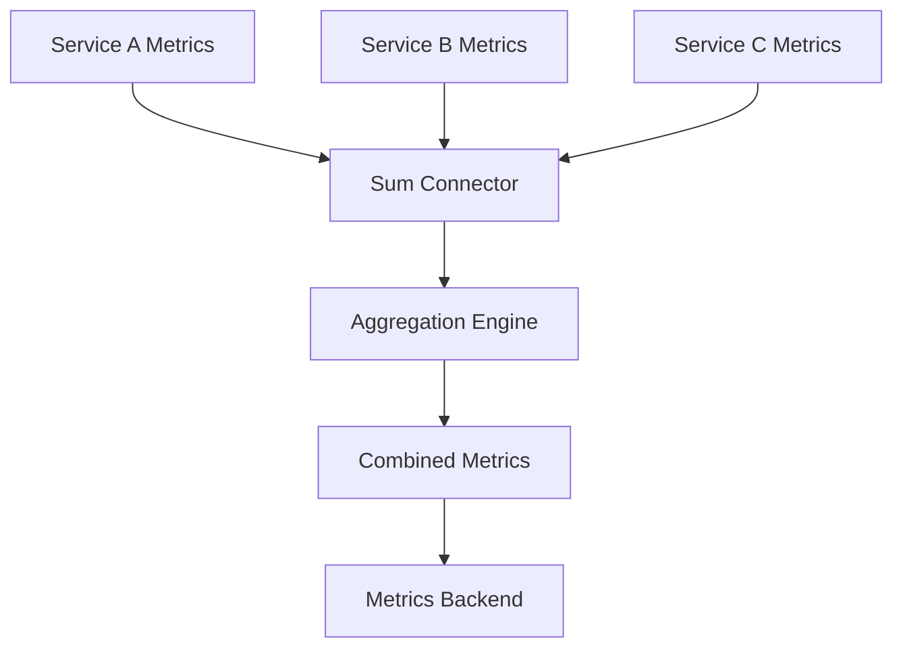

# How to Configure the Sum Connector in the OpenTelemetry Collector

Author: [nawazdhandala](https://www.github.com/nawazdhandala)

Tags: OpenTelemetry, Collector, Connectors, Sum Connector, Metrics Aggregation, Data Pipeline

Description: Learn how to use the Sum connector in OpenTelemetry Collector to aggregate metrics from multiple pipelines and create unified views of your telemetry data.

The Sum connector in the OpenTelemetry Collector provides a powerful mechanism for aggregating metrics from multiple sources or pipelines into combined metrics. This connector is essential when you need to merge metric streams, create rollup metrics across different services, or consolidate telemetry data from distributed collection points.

## Understanding the Sum Connector

The Sum connector takes metric data from multiple input pipelines and aggregates them by summing values for metrics with matching names and dimensions. Unlike the Round Robin connector that distributes data, or the Signal to Metrics connector that transforms signals, the Sum connector performs mathematical aggregation across metric streams.

This aggregation happens within the Collector itself, before metrics are exported to backends. The result is a unified metric stream that represents the combined state of your monitored systems, reducing cardinality and providing clearer insights into aggregate behavior.

## Key Use Cases

The Sum connector excels in several scenarios:

**Multi-Instance Aggregation**: When running multiple instances of an application, aggregate their individual metrics into fleet-wide metrics that show total throughput, combined error counts, or aggregate resource usage.

**Cross-Service Totals**: Combine metrics from different microservices to create organization-level or team-level aggregates, useful for capacity planning and cost allocation.

**Geo-Distributed Aggregation**: Aggregate metrics from different regions or data centers to see global totals while maintaining regional metrics for detailed analysis.

**Cost Optimization**: Reduce the number of unique metric series sent to your backend by aggregating similar metrics, lowering storage costs and improving query performance.

## Basic Configuration Structure

The Sum connector follows the standard OpenTelemetry Collector connector pattern:

```yaml
connectors:
  # Define the Sum connector
  sum:
    # Specify which metrics to aggregate
    metrics:
      # Metrics matching these patterns will be summed
      - name: http.server.request.count
      - name: http.server.error.count

service:
  pipelines:
    # Multiple input pipelines
    metrics/service-a:
      receivers: [prometheus/service-a]
      exporters: [sum]

    metrics/service-b:
      receivers: [prometheus/service-b]
      exporters: [sum]

    metrics/service-c:
      receivers: [prometheus/service-c]
      exporters: [sum]

    # Output pipeline receives aggregated metrics
    metrics/aggregated:
      receivers: [sum]
      exporters: [prometheusremotewrite]
```

In this configuration, metrics from three services are collected separately and then aggregated by the Sum connector before export to the backend.

## Pipeline Flow Architecture

Understanding the data flow helps clarify how aggregation works:



The connector receives metrics from multiple pipelines, aggregates matching metrics, and outputs a single unified stream.

## Aggregating Metrics from Multiple Services

Here's a practical example aggregating HTTP metrics from multiple microservices:

```yaml
receivers:
  # Separate receivers for each service
  otlp/frontend:
    protocols:
      grpc:
        endpoint: 0.0.0.0:4317

  otlp/api:
    protocols:
      grpc:
        endpoint: 0.0.0.0:4318

  otlp/backend:
    protocols:
      grpc:
        endpoint: 0.0.0.0:4319

processors:
  # Add identifying attributes before aggregation
  resource/frontend:
    attributes:
      - key: service.tier
        value: "frontend"
        action: insert

  resource/api:
    attributes:
      - key: service.tier
        value: "api"
        action: insert

  resource/backend:
    attributes:
      - key: service.tier
        value: "backend"
        action: insert

connectors:
  sum/tier-aggregation:
    # Configure which metrics to aggregate
    metrics:
      - name: http.server.request.count
        description: Total HTTP requests across tier
      - name: http.server.request.duration
        description: HTTP request duration
      - name: http.server.error.count
        description: Total HTTP errors across tier

    # Define aggregation behavior
    aggregation:
      # Sum metrics with matching dimensions
      group_by:
        - service.tier
        - http.method
        - http.status_code

exporters:
  prometheusremotewrite:
    endpoint: http://prometheus:9090/api/v1/write

service:
  pipelines:
    # Individual service pipelines
    metrics/frontend:
      receivers: [otlp/frontend]
      processors: [resource/frontend]
      exporters: [sum/tier-aggregation]

    metrics/api:
      receivers: [otlp/api]
      processors: [resource/api]
      exporters: [sum/tier-aggregation]

    metrics/backend:
      receivers: [otlp/backend]
      processors: [resource/backend]
      exporters: [sum/tier-aggregation]

    # Aggregated output
    metrics/aggregated:
      receivers: [sum/tier-aggregation]
      processors: [batch]
      exporters: [prometheusremotewrite]
```

This configuration collects metrics from three service tiers and aggregates them by tier, method, and status code, creating fleet-wide visibility while preserving important dimensions.

## Dimension-Based Aggregation

The Sum connector aggregates metrics based on their dimensions. Understanding how dimensions affect aggregation is critical:

```yaml
connectors:
  sum/dimension-example:
    metrics:
      - name: request.count

    # Metrics are summed when these dimensions match
    aggregation:
      group_by:
        - service.name
        - environment
        - region
        # Any other dimensions are dropped during aggregation
```

If you have these metrics:

```
request.count{service.name="api", environment="prod", region="us-east", instance="i-123"} = 100
request.count{service.name="api", environment="prod", region="us-east", instance="i-456"} = 150
```

The Sum connector produces:

```
request.count{service.name="api", environment="prod", region="us-east"} = 250
```

The instance dimension is dropped because it's not in the group_by list, and the values are summed.

## Aggregating Metrics Across Regions

A common use case is aggregating metrics from geographically distributed collectors:

```yaml
receivers:
  otlp/us-east:
    protocols:
      grpc:
        endpoint: 0.0.0.0:4317

  otlp/us-west:
    protocols:
      grpc:
        endpoint: 0.0.0.0:4318

  otlp/eu-west:
    protocols:
      grpc:
        endpoint: 0.0.0.0:4319

processors:
  # Tag metrics with region information
  attributes/us-east:
    actions:
      - key: region
        value: "us-east-1"
        action: upsert

  attributes/us-west:
    actions:
      - key: region
        value: "us-west-2"
        action: upsert

  attributes/eu-west:
    actions:
      - key: region
        value: "eu-west-1"
        action: upsert

connectors:
  # Aggregate regional metrics
  sum/regional:
    metrics:
      - name: service.request.count
      - name: service.cpu.usage
      - name: service.memory.usage
      - name: service.disk.io

    aggregation:
      group_by:
        - service.name
        - region

  # Further aggregate to global totals
  sum/global:
    metrics:
      - name: service.request.count
      - name: service.cpu.usage
      - name: service.memory.usage
      - name: service.disk.io

    aggregation:
      group_by:
        - service.name
        # Region dimension removed for global totals

exporters:
  prometheusremotewrite/regional:
    endpoint: http://prometheus:9090/api/v1/write
    headers:
      X-Scope: regional

  prometheusremotewrite/global:
    endpoint: http://prometheus:9090/api/v1/write
    headers:
      X-Scope: global

service:
  pipelines:
    # Regional collection pipelines
    metrics/us-east:
      receivers: [otlp/us-east]
      processors: [attributes/us-east]
      exporters: [sum/regional]

    metrics/us-west:
      receivers: [otlp/us-west]
      processors: [attributes/us-west]
      exporters: [sum/regional]

    metrics/eu-west:
      receivers: [otlp/eu-west]
      processors: [attributes/eu-west]
      exporters: [sum/regional]

    # Regional aggregation
    metrics/regional-aggregated:
      receivers: [sum/regional]
      exporters: [prometheusremotewrite/regional, sum/global]

    # Global aggregation
    metrics/global-aggregated:
      receivers: [sum/global]
      processors: [batch]
      exporters: [prometheusremotewrite/global]
```

This multi-tier aggregation creates both regional and global views of your metrics, supporting both detailed analysis and high-level dashboards.

## Handling Different Metric Types

The Sum connector handles different metric types appropriately:

**Counters and Sums**: Values are added together, which is the natural behavior for cumulative metrics.

**Gauges**: The last reported value is used. Summing gauges usually doesn't make sense, so consider carefully whether to aggregate gauge metrics.

**Histograms**: Bucket counts are summed, and count/sum fields are aggregated, preserving the distribution characteristics.

```yaml
connectors:
  sum/typed-metrics:
    metrics:
      # Counters - sum naturally
      - name: http.server.request.count
        type: sum
        aggregation_temporality: cumulative

      # Gauges - use last value
      - name: system.memory.usage
        type: gauge

      # Histograms - sum buckets
      - name: http.server.duration
        type: histogram
        aggregation:
          histogram_aggregation: explicit_bucket_histogram

    aggregation:
      group_by:
        - service.name
```

## Selective Aggregation with Filtering

You can selectively aggregate metrics based on attribute values:

```yaml
processors:
  # Filter for production metrics only
  filter/production:
    metrics:
      include:
        match_type: strict
        resource_attributes:
          - key: deployment.environment
            value: "production"

  # Filter for critical services
  filter/critical:
    metrics:
      include:
        match_type: regexp
        resource_attributes:
          - key: service.name
            value: "(payment|auth|checkout).*"

connectors:
  sum/filtered:
    metrics:
      - name: critical.service.errors
      - name: critical.service.latency

    aggregation:
      group_by:
        - service.category

exporters:
  prometheusremotewrite:
    endpoint: http://prometheus:9090/api/v1/write

service:
  pipelines:
    metrics/input:
      receivers: [otlp]
      processors: [filter/production, filter/critical]
      exporters: [sum/filtered]

    metrics/critical-aggregate:
      receivers: [sum/filtered]
      exporters: [prometheusremotewrite]
```

This ensures only relevant metrics are aggregated, reducing processing overhead and metric volume.

## Preserving Original Metrics Alongside Aggregates

Sometimes you want both the original per-instance metrics and the aggregated totals:

```yaml
connectors:
  sum/aggregates:
    metrics:
      - name: application.request.count
      - name: application.error.count

    aggregation:
      group_by:
        - service.name
        - environment

exporters:
  prometheusremotewrite/detailed:
    endpoint: http://prometheus:9090/api/v1/write
    headers:
      X-Detail-Level: instance

  prometheusremotewrite/aggregated:
    endpoint: http://prometheus:9090/api/v1/write
    headers:
      X-Detail-Level: service

service:
  pipelines:
    metrics/input:
      receivers: [otlp]
      # Export to both aggregator and detailed storage
      exporters: [sum/aggregates, prometheusremotewrite/detailed]

    metrics/aggregated:
      receivers: [sum/aggregates]
      exporters: [prometheusremotewrite/aggregated]
```

This configuration maintains granular instance-level metrics while also creating service-level aggregates.

## Temporal Aggregation Behavior

The Sum connector aggregates metrics as they arrive. Understanding the temporal behavior is important:

```yaml
connectors:
  sum/temporal:
    # Configure aggregation timing
    aggregation:
      # How often to emit aggregated metrics
      interval: 60s

      # Maximum time to wait for metrics before aggregating
      timeout: 30s

    metrics:
      - name: throughput.bytes
      - name: request.count
```

If metrics from different sources arrive at different times, the connector waits up to the timeout period before emitting aggregated values. This ensures metrics are properly aligned temporally.

## Real-World Example: Multi-Cluster Kubernetes Monitoring

Here's a complete example aggregating metrics from multiple Kubernetes clusters:

```yaml
receivers:
  # Receivers for each Kubernetes cluster
  prometheus/k8s-prod-us:
    config:
      scrape_configs:
        - job_name: 'kubernetes-pods'
          kubernetes_sd_configs:
            - role: pod
              kubeconfig_file: /etc/k8s/prod-us-kubeconfig

  prometheus/k8s-prod-eu:
    config:
      scrape_configs:
        - job_name: 'kubernetes-pods'
          kubernetes_sd_configs:
            - role: pod
              kubeconfig_file: /etc/k8s/prod-eu-kubeconfig

  prometheus/k8s-staging:
    config:
      scrape_configs:
        - job_name: 'kubernetes-pods'
          kubernetes_sd_configs:
            - role: pod
              kubeconfig_file: /etc/k8s/staging-kubeconfig

processors:
  # Add cluster identifiers
  resource/prod-us:
    attributes:
      - key: cluster
        value: "prod-us"
        action: insert
      - key: environment
        value: "production"
        action: insert

  resource/prod-eu:
    attributes:
      - key: cluster
        value: "prod-eu"
        action: insert
      - key: environment
        value: "production"
        action: insert

  resource/staging:
    attributes:
      - key: cluster
        value: "staging"
        action: insert
      - key: environment
        value: "staging"
        action: insert

  batch:
    timeout: 10s
    send_batch_size: 1024

connectors:
  # Aggregate by cluster
  sum/by-cluster:
    metrics:
      - name: container_cpu_usage_seconds_total
      - name: container_memory_working_set_bytes
      - name: container_network_receive_bytes_total
      - name: container_network_transmit_bytes_total

    aggregation:
      group_by:
        - cluster
        - namespace
        - pod

  # Aggregate to environment level
  sum/by-environment:
    metrics:
      - name: container_cpu_usage_seconds_total
      - name: container_memory_working_set_bytes
      - name: container_network_receive_bytes_total
      - name: container_network_transmit_bytes_total

    aggregation:
      group_by:
        - environment
        - namespace

  # Global aggregates
  sum/global:
    metrics:
      - name: container_cpu_usage_seconds_total
      - name: container_memory_working_set_bytes
      - name: container_network_receive_bytes_total
      - name: container_network_transmit_bytes_total

    aggregation:
      group_by:
        - namespace

exporters:
  prometheusremotewrite/cluster:
    endpoint: http://prometheus:9090/api/v1/write
    headers:
      X-Scope: cluster

  prometheusremotewrite/environment:
    endpoint: http://prometheus:9090/api/v1/write
    headers:
      X-Scope: environment

  prometheusremotewrite/global:
    endpoint: http://prometheus:9090/api/v1/write
    headers:
      X-Scope: global

service:
  pipelines:
    # Cluster collection pipelines
    metrics/prod-us:
      receivers: [prometheus/k8s-prod-us]
      processors: [resource/prod-us]
      exporters: [sum/by-cluster]

    metrics/prod-eu:
      receivers: [prometheus/k8s-prod-eu]
      processors: [resource/prod-eu]
      exporters: [sum/by-cluster]

    metrics/staging:
      receivers: [prometheus/k8s-staging]
      processors: [resource/staging]
      exporters: [sum/by-cluster]

    # Cluster-level aggregation
    metrics/cluster-aggregated:
      receivers: [sum/by-cluster]
      processors: [batch]
      exporters: [prometheusremotewrite/cluster, sum/by-environment]

    # Environment-level aggregation
    metrics/environment-aggregated:
      receivers: [sum/by-environment]
      processors: [batch]
      exporters: [prometheusremotewrite/environment, sum/global]

    # Global aggregation
    metrics/global-aggregated:
      receivers: [sum/global]
      processors: [batch]
      exporters: [prometheusremotewrite/global]
```

This configuration creates a three-tier aggregation hierarchy: cluster-level, environment-level, and global metrics, enabling both detailed troubleshooting and high-level capacity planning.

## Performance Considerations

The Sum connector maintains state for aggregation, which has memory implications:

**Memory Usage**: The connector stores partial aggregations in memory. More unique dimension combinations mean higher memory usage.

**Aggregation Interval**: Shorter intervals reduce memory but increase processing frequency.

**Cardinality Control**: Limit the dimensions in group_by to control the number of unique aggregated metrics.

```yaml
processors:
  # Reduce cardinality before aggregation
  transform/reduce-cardinality:
    metric_statements:
      - context: datapoint
        statements:
          # Remove high-cardinality dimensions
          - delete_key(attributes, "instance_id")
          - delete_key(attributes, "pod_name")
          - delete_key(attributes, "container_id")

service:
  pipelines:
    metrics/input:
      receivers: [otlp]
      processors: [transform/reduce-cardinality]
      exporters: [sum/aggregates]
```

## Monitoring Aggregation Health

Monitor the Sum connector's operation to ensure correct behavior:

```yaml
service:
  telemetry:
    logs:
      level: info
    metrics:
      level: detailed
      address: 0.0.0.0:8888
```

Key internal metrics to watch:

- `otelcol_connector_sum_metrics_processed`: Number of metrics processed
- `otelcol_connector_sum_metrics_emitted`: Number of aggregated metrics emitted
- `otelcol_connector_sum_aggregation_groups`: Number of unique aggregation groups

If `aggregation_groups` grows unbounded, you have a cardinality problem and need to adjust your group_by configuration.

## Troubleshooting Common Issues

**Unexpected Metric Values**: Verify that all input pipelines are sending metrics with consistent dimensions. Inconsistent dimension names prevent proper aggregation.

**Memory Growth**: Check cardinality by monitoring aggregation groups. Reduce dimensions in group_by or filter metrics before aggregation.

**Missing Metrics**: Ensure metric names match exactly in the connector configuration. The Sum connector only aggregates explicitly configured metrics.

**Timing Issues**: If metrics from different sources arrive at very different times, increase the timeout to ensure they're aggregated together.

## Related Resources

For more information about OpenTelemetry connectors and metrics processing:

- [How to Use Connectors to Link Traces and Metrics Pipelines](https://oneuptime.com/blog/post/connectors-link-traces-metrics-pipelines-opentelemetry/view)
- [How to Configure the Round Robin Connector in the OpenTelemetry Collector](https://oneuptime.com/blog/post/round-robin-connector-opentelemetry-collector/view)
- [How to Configure the Signal to Metrics Connector in the OpenTelemetry Collector](https://oneuptime.com/blog/post/signal-to-metrics-connector-opentelemetry-collector/view)

The Sum connector provides powerful aggregation capabilities that reduce metric cardinality, create meaningful rollups, and provide multiple views of your telemetry data at different granularities.
