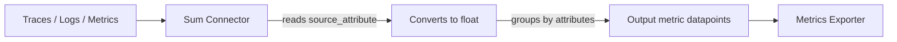

# How to Configure the Sum Connector in the OpenTelemetry Collector

Author: [nawazdhandala](https://www.github.com/nawazdhandala)

Tags: OpenTelemetry, Collector, Connector, Sum Connector, Metrics Aggregation, Data Pipeline

Description: Learn how to use the Sum connector in OpenTelemetry Collector to aggregate metrics from multiple pipelines and create unified views of your telemetry data.

The Sum connector in the OpenTelemetry Collector sums numeric values found inside telemetry attributes and emits them as a metric time series. It bridges pipeline types: it consumes spans, span events, metric data points, or logs, and produces metrics. It is not a cross-pipeline "totaliser" that merges multiple metric streams - its job is to read a numeric attribute off each telemetry item, add those values up, and expose the running total as a metric.

## What the Sum Connector Actually Does

Given a source pipeline (traces, metrics, or logs), the connector looks at every span, data point, or log record passing through it, reads a single named attribute, converts the value to a float, and adds it to a metric of your choosing. Values that cannot be parsed as numbers are dropped silently. Optional attribute grouping lets you split the total into separate data points keyed by other attributes (for example, one datapoint per `payment.processor`).

Supported pipeline pairings are fixed by the connector:

| Input pipeline | Output pipeline |
| --- | --- |
| traces | metrics |
| metrics | metrics |
| logs | metrics |

## Configuration Shape

The configuration is nested: `sum` → telemetry type → output metric name → settings.

```yaml
connectors:
  sum:
    # Pick one or more of: spans, spanevents, datapoints, logs
    <telemetry-type>:
      <output-metric-name>:
        source_attribute: <attribute-to-sum>
        conditions:
          - <OTTL condition>
        attributes:
          - key: <attribute-to-group-by>
            default_value: <fallback>
```

The three required pieces are the telemetry type, the output metric name, and `source_attribute`. Everything under `conditions` and `attributes` is optional.

Note that to sum values from **metrics**, you use `datapoints:` (not `metrics:`). To sum values from **traces**, use `spans:` or `spanevents:`.

## Basic Example: Summing a Span Attribute

This configuration sums the numeric value of `attribute.with.numerical.value` on every incoming span and emits a metric named `my.example.metric.name`.

```yaml
receivers:
  otlp:
    protocols:
      grpc:
        endpoint: 0.0.0.0:4317

connectors:
  sum:
    spans:
      my.example.metric.name:
        source_attribute: attribute.with.numerical.value

exporters:
  prometheusremotewrite:
    endpoint: http://prometheus:9090/api/v1/write

service:
  pipelines:
    traces:
      receivers: [otlp]
      exporters: [sum]

    metrics/sum:
      receivers: [sum]
      exporters: [prometheusremotewrite]
```

The traces pipeline feeds spans to the connector; the metrics pipeline receives the resulting metric and exports it.

## Pipeline Flow


```mermaid
graph LR
    A[Traces / Logs / Metrics] --> B[Sum Connector]
    B -- reads source_attribute --> C[Converts to float]
    C -- groups by attributes --> D[Output metric datapoints]
    D --> E[Metrics Exporter]
```

## Summing Values from Logs

A common use is turning numeric fields in logs into metrics. Here, the connector reads `total.payment` off each log record and emits a `checkout.total` metric, split by `payment.processor`:

```yaml
receivers:
  otlp:
    protocols:
      grpc:
        endpoint: 0.0.0.0:4317

connectors:
  sum:
    logs:
      checkout.total:
        source_attribute: total.payment
        conditions:
          - attributes["total.payment"] != "NULL"
        attributes:
          - key: payment.processor
            default_value: unspecified_processor

exporters:
  prometheusremotewrite:
    endpoint: http://prometheus:9090/api/v1/write

service:
  pipelines:
    logs:
      receivers: [otlp]
      exporters: [sum]

    metrics/sum:
      receivers: [sum]
      exporters: [prometheusremotewrite]
```

Each distinct value of `payment.processor` becomes its own datapoint on the `checkout.total` time series. Log records missing that attribute fall into an `unspecified_processor` bucket.

### Parsing JSON Log Bodies First

If the numeric value lives inside a JSON body rather than an attribute, use the transform processor to lift it into attributes before the connector sees it:

```yaml
processors:
  transform/logs:
    log_statements:
      - context: log
        statements:
          - merge_maps(attributes, ParseJSON(body), "upsert")

service:
  pipelines:
    logs:
      receivers: [otlp]
      processors: [transform/logs]
      exporters: [sum]
```

## Summing Values from Metric Data Points

To sum a numeric attribute across existing metric data points, use `datapoints:`:

```yaml
connectors:
  sum:
    datapoints:
      request.bytes.total:
        source_attribute: http.request.body.size
        attributes:
          - key: http.route
          - key: http.method
```

This reads `http.request.body.size` off every data point flowing through the connector and emits `request.bytes.total`, with one series per `(http.route, http.method)` pair.

## Required Settings

- **Telemetry type** - one of `spans`, `spanevents`, `datapoints`, or `logs`. Use `datapoints` for metric inputs and `spans` / `spanevents` for trace inputs.
- **Output metric name** - the name of the metric the connector will emit.
- **`source_attribute`** - the attribute whose numeric value is summed. Values are coerced to float; non-numeric strings are dropped.

## Optional Settings

- **`conditions`** - a list of [OTTL](https://github.com/open-telemetry/opentelemetry-collector-contrib/blob/main/pkg/ottl/LANGUAGE.md) expressions. Conditions are ORed: if any one matches, the item's value is included in the sum. Use this to filter out items you don't want counted.
- **`attributes`** - a list of attributes to group by. Each unique combination of values produces its own data point on the output metric.
  - `key` (required) - attribute name to read off the input item.
  - `default_value` (optional) - string, int, or float fallback when the attribute is missing.

## Multiple Output Metrics From One Connector

One connector instance can define several output metrics, even across telemetry types:

```yaml
connectors:
  sum:
    logs:
      checkout.total:
        source_attribute: total.payment
        attributes:
          - key: payment.processor
      refund.total:
        source_attribute: refund.amount
        conditions:
          - attributes["event.name"] == "refund_processed"
    spans:
      db.rows.affected.total:
        source_attribute: db.rows_affected
        attributes:
          - key: db.system
          - key: db.operation
```

Both pipelines (logs and traces) feed the same `sum` connector, and the resulting metrics are emitted on its metrics output.

## Verifying What the Connector Emits

Pair the connector with the `debug` exporter while you are wiring things up:

```yaml
exporters:
  debug:
    verbosity: detailed

service:
  pipelines:
    metrics/sum:
      receivers: [sum]
      exporters: [debug, prometheusremotewrite]
```

You will see each summed datapoint printed with its attribute set, which makes it obvious when `source_attribute` is misspelled or when values are silently being dropped because they aren't numeric.

## Troubleshooting

**No metric appears.** Check that the output pipeline (`metrics/sum` in the examples) has the `sum` connector listed as its receiver, and that the input pipeline lists `sum` as an exporter. Both halves are required.

**Metric exists but is always zero or missing data points.** The `source_attribute` is probably not present on the items reaching the connector, or its value is a non-numeric string. Non-numeric values are dropped, not coerced to zero. Use the `debug` exporter on the input pipeline to confirm the attribute is actually there.

**Too many time series.** Every unique combination of values under `attributes:` becomes a separate series. Remove high-cardinality keys (request IDs, user IDs, instance IDs) from that list, or filter them out upstream with the `transform` processor.

**Conditions don't filter as expected.** Remember that `conditions` are ORed, not ANDed. If you need AND semantics, combine predicates inside a single OTTL expression with `and`.

## Related Resources

- [How to Use Connectors to Link Traces and Metrics Pipelines](https://oneuptime.com/blog/post/2026-02-06-connectors-link-traces-metrics-pipelines-opentelemetry/view)
- [How to Configure the Round Robin Connector in the OpenTelemetry Collector](https://oneuptime.com/blog/post/2026-02-06-round-robin-connector-opentelemetry-collector/view)
- [How to Configure the Signal to Metrics Connector in the OpenTelemetry Collector](https://oneuptime.com/blog/post/2026-02-06-signal-to-metrics-connector-opentelemetry-collector/view)
- [Sum connector source on GitHub](https://github.com/open-telemetry/opentelemetry-collector-contrib/tree/main/connector/sumconnector)

The Sum connector is a focused tool: it turns a numeric attribute on your telemetry into a metric time series, optionally split by other attributes. Keep the configuration shape (`<telemetry-type>` → `<metric-name>` → `source_attribute`) in mind and it is straightforward to wire up.
