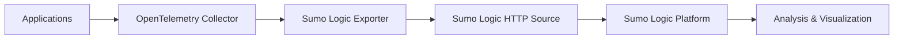

# How to Configure the Sumo Logic Exporter in the OpenTelemetry Collector

Author: [nawazdhandala](https://www.github.com/nawazdhandala)

Tags: OpenTelemetry, Collector, Exporters, Sumo Logic, Observability, Monitoring, Logs, Metrics, Traces

Description: Learn how to configure the Sumo Logic exporter in OpenTelemetry Collector to send telemetry data to Sumo Logic's cloud-native observability platform with practical YAML examples.

The Sumo Logic exporter is a crucial component in the OpenTelemetry Collector ecosystem that enables seamless integration with Sumo Logic's cloud-native machine data analytics platform. This exporter allows you to send traces, metrics, and logs from your applications to Sumo Logic for comprehensive observability and analysis.

## Understanding the Sumo Logic Exporter

The Sumo Logic exporter is part of the OpenTelemetry Collector's contrib distribution and supports sending data in multiple formats. It leverages Sumo Logic's HTTP Source endpoints to ingest telemetry data, making it straightforward to integrate with existing Sumo Logic deployments.

The exporter supports three types of telemetry data:

- **Metrics**: Send application and infrastructure metrics
- **Logs**: Forward application and system logs
- **Traces**: Export distributed tracing data

## Architecture Overview

Here's how the Sumo Logic exporter fits into your observability pipeline:



## Prerequisites

Before configuring the Sumo Logic exporter, ensure you have:

1. A Sumo Logic account with appropriate permissions
2. An HTTP Source created in Sumo Logic (either Metrics or Logs)
3. The HTTP Source URL endpoint
4. OpenTelemetry Collector (contrib distribution) installed

## Basic Configuration

Here's a basic configuration for the Sumo Logic exporter that sends metrics data:

```yaml
# Basic Sumo Logic exporter configuration
exporters:
  sumologic:
    # The HTTP Source endpoint URL from your Sumo Logic account
    # This endpoint is unique to your Sumo Logic HTTP Source
    endpoint: https://collectors.sumologic.com/receiver/v1/http/YOUR_UNIQUE_ID

    # Compression type for data transmission (gzip, deflate, or none)
    # Using compression reduces bandwidth usage
    compress_encoding: gzip

    # Maximum number of metrics to send in a single request
    # Adjust based on your network capacity and Sumo Logic limits
    max_request_body_size: 1048576

# Configure receivers to collect data
receivers:
  otlp:
    protocols:
      grpc:
        endpoint: 0.0.0.0:4317
      http:
        endpoint: 0.0.0.0:4318

# Configure processors for data transformation
processors:
  batch:
    # Batch multiple telemetry items together for efficiency
    timeout: 10s
    send_batch_size: 1024

# Define the pipeline
service:
  pipelines:
    metrics:
      receivers: [otlp]
      processors: [batch]
      exporters: [sumologic]
```

## Advanced Metrics Configuration

For production environments, you'll want more control over how metrics are formatted and sent:

```yaml
exporters:
  sumologic:
    endpoint: https://collectors.sumologic.com/receiver/v1/http/YOUR_METRICS_ID

    # Compression settings
    compress_encoding: gzip

    # Set the maximum request body size (in bytes)
    # Default is 1MB, increase for high-volume scenarios
    max_request_body_size: 2097152

    # Format for metrics data
    # Options: carbon2, graphite, prometheus
    metric_format: prometheus

    # Add custom metadata to all metrics
    metadata_attributes:
      - environment
      - service.name
      - deployment.environment

    # Client configuration for HTTP requests
    timeout: 30s

    # Retry configuration for failed requests
    retry_on_failure:
      enabled: true
      initial_interval: 5s
      max_interval: 30s
      max_elapsed_time: 300s

    # Queue settings for handling backpressure
    sending_queue:
      enabled: true
      num_consumers: 10
      queue_size: 5000

receivers:
  otlp:
    protocols:
      grpc:
        endpoint: 0.0.0.0:4317

  # Example: collect host metrics
  hostmetrics:
    collection_interval: 30s
    scrapers:
      cpu:
      memory:
      disk:
      network:

processors:
  batch:
    timeout: 10s
    send_batch_size: 1024

  # Add resource attributes
  resource:
    attributes:
      - key: environment
        value: production
        action: upsert
      - key: deployment.environment
        value: k8s-prod-cluster
        action: upsert

service:
  pipelines:
    metrics:
      receivers: [otlp, hostmetrics]
      processors: [resource, batch]
      exporters: [sumologic]
```

## Configuring Logs Export

Sumo Logic excels at log analysis. Here's how to configure the exporter for logs:

```yaml
exporters:
  sumologic/logs:
    endpoint: https://collectors.sumologic.com/receiver/v1/http/YOUR_LOGS_ID

    # Log format configuration
    log_format: json

    # Compression for log data
    compress_encoding: gzip

    # Add source metadata to logs
    metadata_attributes:
      - service.name
      - host.name
      - deployment.environment

    # HTTP client configuration
    timeout: 30s

    # Retry configuration
    retry_on_failure:
      enabled: true
      initial_interval: 5s
      max_interval: 60s
      max_elapsed_time: 600s

    # Sending queue configuration
    sending_queue:
      enabled: true
      num_consumers: 5
      queue_size: 10000

receivers:
  otlp:
    protocols:
      grpc:
        endpoint: 0.0.0.0:4317

  # Example: collect file logs
  filelog:
    include:
      - /var/log/app/*.log
    operators:
      - type: json_parser
        timestamp:
          parse_from: attributes.time
          layout: '%Y-%m-%d %H:%M:%S'

processors:
  batch:
    timeout: 5s
    send_batch_size: 512

  # Add resource information to logs
  resource:
    attributes:
      - key: service.name
        value: my-application
        action: upsert

service:
  pipelines:
    logs:
      receivers: [otlp, filelog]
      processors: [resource, batch]
      exporters: [sumologic/logs]
```

## Configuring Traces Export

For distributed tracing, configure the exporter to send trace data to Sumo Logic:

```yaml
exporters:
  sumologic/traces:
    endpoint: https://collectors.sumologic.com/receiver/v1/http/YOUR_TRACES_ID

    # Compression for trace data
    compress_encoding: gzip

    # Maximum request body size for traces
    max_request_body_size: 5242880

    # HTTP client configuration
    timeout: 45s

    # Retry configuration for traces
    retry_on_failure:
      enabled: true
      initial_interval: 5s
      max_interval: 30s
      max_elapsed_time: 300s

    # Queue configuration
    sending_queue:
      enabled: true
      num_consumers: 10
      queue_size: 5000

receivers:
  otlp:
    protocols:
      grpc:
        endpoint: 0.0.0.0:4317
      http:
        endpoint: 0.0.0.0:4318

processors:
  batch:
    timeout: 10s
    send_batch_size: 256

  # Sample traces to reduce volume
  probabilistic_sampler:
    sampling_percentage: 10

service:
  pipelines:
    traces:
      receivers: [otlp]
      processors: [probabilistic_sampler, batch]
      exporters: [sumologic/traces]
```

## Complete Multi-Signal Configuration

Here's a complete configuration that handles metrics, logs, and traces:

```yaml
receivers:
  otlp:
    protocols:
      grpc:
        endpoint: 0.0.0.0:4317
      http:
        endpoint: 0.0.0.0:4318

  hostmetrics:
    collection_interval: 30s
    scrapers:
      cpu:
      memory:
      disk:
      network:

processors:
  batch/metrics:
    timeout: 10s
    send_batch_size: 1024

  batch/logs:
    timeout: 5s
    send_batch_size: 512

  batch/traces:
    timeout: 10s
    send_batch_size: 256

  resource:
    attributes:
      - key: environment
        value: production
        action: upsert
      - key: service.namespace
        value: ecommerce
        action: upsert

exporters:
  sumologic/metrics:
    endpoint: https://collectors.sumologic.com/receiver/v1/http/YOUR_METRICS_ID
    compress_encoding: gzip
    metric_format: prometheus
    timeout: 30s
    retry_on_failure:
      enabled: true
      initial_interval: 5s
      max_interval: 30s
    sending_queue:
      enabled: true
      num_consumers: 10
      queue_size: 5000

  sumologic/logs:
    endpoint: https://collectors.sumologic.com/receiver/v1/http/YOUR_LOGS_ID
    compress_encoding: gzip
    log_format: json
    timeout: 30s
    retry_on_failure:
      enabled: true
      initial_interval: 5s
      max_interval: 60s
    sending_queue:
      enabled: true
      num_consumers: 5
      queue_size: 10000

  sumologic/traces:
    endpoint: https://collectors.sumologic.com/receiver/v1/http/YOUR_TRACES_ID
    compress_encoding: gzip
    timeout: 45s
    retry_on_failure:
      enabled: true
      initial_interval: 5s
      max_interval: 30s
    sending_queue:
      enabled: true
      num_consumers: 10
      queue_size: 5000

service:
  pipelines:
    metrics:
      receivers: [otlp, hostmetrics]
      processors: [resource, batch/metrics]
      exporters: [sumologic/metrics]

    logs:
      receivers: [otlp]
      processors: [resource, batch/logs]
      exporters: [sumologic/logs]

    traces:
      receivers: [otlp]
      processors: [resource, batch/traces]
      exporters: [sumologic/traces]
```

## Security Considerations

When deploying the Sumo Logic exporter in production, keep these security practices in mind:

1. **Protect HTTP Source URLs**: Treat your Sumo Logic HTTP Source URLs as sensitive credentials. Store them in environment variables or secrets management systems.

2. **Use HTTPS**: Always use HTTPS endpoints to ensure data is encrypted in transit.

3. **Enable Compression**: Use gzip compression to reduce bandwidth and improve performance.

4. **Implement Retry Logic**: Configure retry mechanisms to handle transient network issues.

## Troubleshooting

Common issues and their solutions:

**Connection Errors**: Verify your HTTP Source URL is correct and the Sumo Logic endpoint is accessible from your network.

**Data Not Appearing**: Check that the correct data type (metrics, logs, or traces) matches your HTTP Source type in Sumo Logic.

**Performance Issues**: Adjust batch sizes, queue sizes, and the number of consumers based on your data volume.

**Memory Issues**: If the collector consumes too much memory, reduce queue sizes and batch sizes.

## Best Practices

1. **Use Separate HTTP Sources**: Create separate HTTP Sources in Sumo Logic for metrics, logs, and traces for better organization and access control.

2. **Configure Batching**: Always use batch processors to improve efficiency and reduce the number of HTTP requests.

3. **Set Appropriate Timeouts**: Configure timeouts based on your network latency and data volume.

4. **Monitor the Collector**: Use the health check extension and metrics pipeline to monitor the collector itself.

5. **Implement Resource Detection**: Use the resource detection processor to automatically add environment metadata.

## Related Resources

For more information on configuring OpenTelemetry Collector exporters, check out these related articles:

- [Understanding OpenTelemetry Collector Architecture](https://oneuptime.com/blog/post/opentelemetry-collector-architecture/view)
- [Best Practices for OpenTelemetry Collector Deployment](https://oneuptime.com/blog/post/opentelemetry-collector-best-practices/view)

## Conclusion

The Sumo Logic exporter provides a robust way to integrate OpenTelemetry data with Sumo Logic's powerful analytics platform. By following the configurations and best practices outlined in this guide, you can build a reliable observability pipeline that sends metrics, logs, and traces to Sumo Logic for comprehensive monitoring and analysis. Start with the basic configuration and gradually add features as your monitoring needs evolve.
