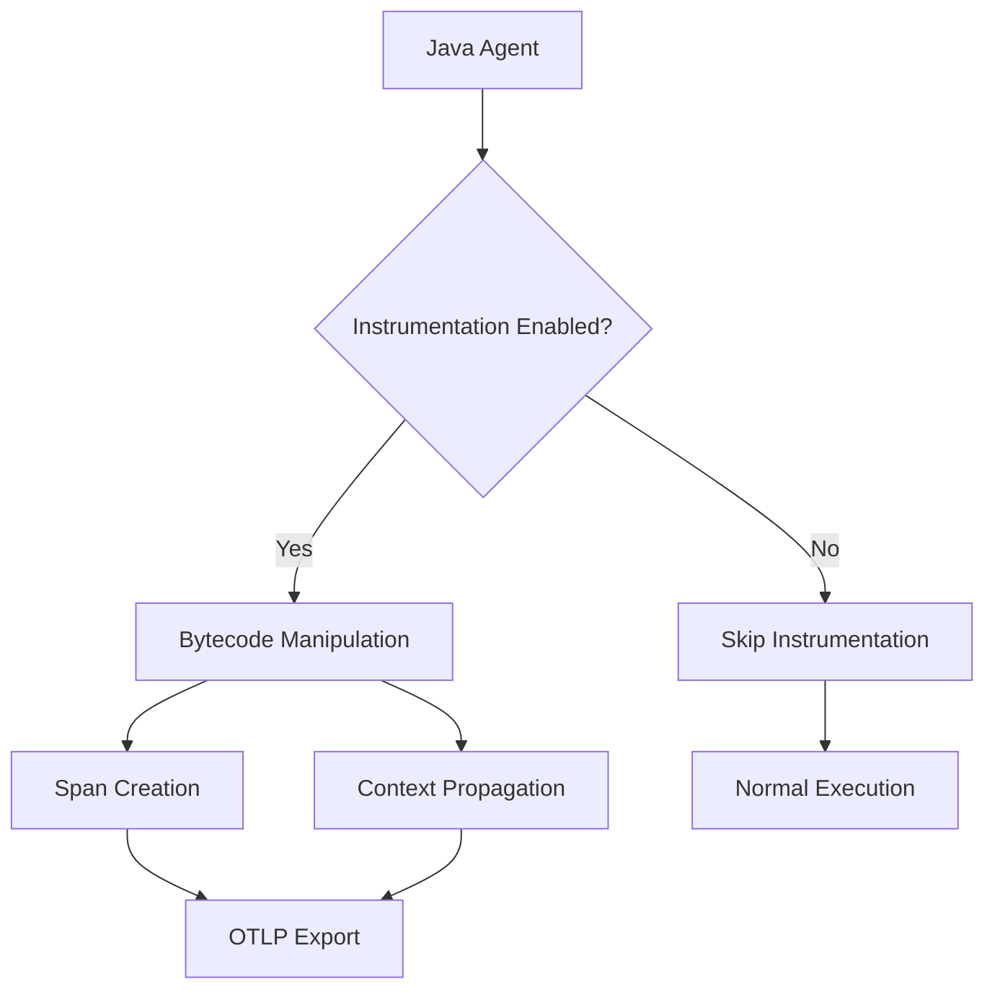

# How to Suppress Specific Instrumentations in the OpenTelemetry Java Agent

Author: [nawazdhandala](https://www.github.com/nawazdhandala)

Tags: OpenTelemetry, Java Agent, Suppression, Configuration, Performance

Description: Detailed guide to selectively disabling instrumentations in the OpenTelemetry Java agent to optimize performance, reduce noise, and avoid conflicts in production Java applications.

The OpenTelemetry Java agent automatically instruments hundreds of libraries and frameworks. While this comprehensive coverage is powerful, there are scenarios where you need to disable specific instrumentations. This might be to improve performance, reduce trace volume, avoid instrumentation conflicts, or eliminate noise from internal services.

## Why Suppress Instrumentations

Understanding when and why to suppress instrumentations helps you make informed decisions about your observability strategy.

### Performance Optimization

Each instrumentation adds overhead through bytecode manipulation and span creation. High-throughput applications processing thousands of requests per second may benefit from disabling instrumentation for internal components that don't provide meaningful observability data.

### Reducing Trace Noise

Some libraries generate excessive spans that clutter your traces without adding value. For example, internal caching operations or health check endpoints might create spans you don't need.

### Avoiding Conflicts

Certain instrumentations may conflict with custom tracing code or other agents. Suppressing problematic instrumentations prevents these conflicts while maintaining observability for other components.

### Compliance and Security

Some instrumentations might capture sensitive data in span attributes. Disabling these instrumentations ensures compliance with data protection requirements.



## Understanding Instrumentation Names

The OpenTelemetry Java agent organizes instrumentations by library name. Each instrumentation has a specific name that you use when suppressing it. Common instrumentation names include:

- `jdbc` - JDBC database instrumentation
- `servlet` - Servlet container instrumentation
- `jaxrs` - JAX-RS REST framework
- `spring-webmvc` - Spring Web MVC
- `hibernate` - Hibernate ORM
- `kafka` - Apache Kafka clients
- `redis` - Redis client instrumentation
- `mongo` - MongoDB client instrumentation
- `httpclient` - HTTP client libraries
- `netty` - Netty networking framework
- `logback` - Logback logging instrumentation
- `log4j` - Log4j logging instrumentation

## Basic Suppression Configuration

Suppress instrumentations using system properties or environment variables when starting your application server.

### Using System Properties

Configure suppression via JVM arguments in your application server startup scripts:

```bash
# Suppress a single instrumentation
-Dotel.instrumentation.jdbc.enabled=false

# Suppress multiple instrumentations
-Dotel.instrumentation.jdbc.enabled=false
-Dotel.instrumentation.hibernate.enabled=false
-Dotel.instrumentation.kafka.enabled=false

# Disable all instrumentations and enable specific ones (allowlist approach)
-Dotel.instrumentation.common.default-enabled=false
-Dotel.instrumentation.servlet.enabled=true
-Dotel.instrumentation.jaxrs.enabled=true
```

### Using Environment Variables

Set environment variables for containerized deployments:

```bash
# Environment variable format: OTEL_INSTRUMENTATION_[NAME]_ENABLED
export OTEL_INSTRUMENTATION_JDBC_ENABLED=false
export OTEL_INSTRUMENTATION_HIBERNATE_ENABLED=false
export OTEL_INSTRUMENTATION_KAFKA_ENABLED=false
```

## Application Server Configuration

Configure suppression for different application servers.

### Apache Tomcat Configuration

Edit `setenv.sh` (Linux/macOS) or `setenv.bat` (Windows):

```bash
#!/bin/bash
# setenv.sh

# Basic agent configuration
OTEL_AGENT_PATH="/opt/opentelemetry/opentelemetry-javaagent.jar"
CATALINA_OPTS="$CATALINA_OPTS -javaagent:$OTEL_AGENT_PATH"
CATALINA_OPTS="$CATALINA_OPTS -Dotel.service.name=tomcat-app"
CATALINA_OPTS="$CATALINA_OPTS -Dotel.exporter.otlp.endpoint=http://localhost:4317"

# Suppress specific instrumentations
CATALINA_OPTS="$CATALINA_OPTS -Dotel.instrumentation.jdbc.enabled=false"
CATALINA_OPTS="$CATALINA_OPTS -Dotel.instrumentation.hibernate.enabled=false"

# Suppress internal Tomcat components
CATALINA_OPTS="$CATALINA_OPTS -Dotel.instrumentation.tomcat.enabled=false"
CATALINA_OPTS="$CATALINA_OPTS -Dotel.instrumentation.servlet.enabled=true"

# Suppress noisy logging instrumentation
CATALINA_OPTS="$CATALINA_OPTS -Dotel.instrumentation.logback.enabled=false"
CATALINA_OPTS="$CATALINA_OPTS -Dotel.instrumentation.log4j.enabled=false"

export CATALINA_OPTS
```

### WildFly Configuration

Modify `standalone.conf` or `domain.conf`:

```bash
#!/bin/bash
# standalone.conf

OTEL_AGENT_PATH="/opt/opentelemetry/opentelemetry-javaagent.jar"
JAVA_OPTS="$JAVA_OPTS -javaagent:$OTEL_AGENT_PATH"
JAVA_OPTS="$JAVA_OPTS -Dotel.service.name=wildfly-app"

# Suppress instrumentations that conflict with WildFly
JAVA_OPTS="$JAVA_OPTS -Dotel.instrumentation.jboss-logging.enabled=false"
JAVA_OPTS="$JAVA_OPTS -Dotel.instrumentation.undertow.enabled=false"

# Keep essential instrumentations
JAVA_OPTS="$JAVA_OPTS -Dotel.instrumentation.jaxrs.enabled=true"
JAVA_OPTS="$JAVA_OPTS -Dotel.instrumentation.jdbc.enabled=true"

# Suppress messaging if not used
JAVA_OPTS="$JAVA_OPTS -Dotel.instrumentation.jms.enabled=false"

export JAVA_OPTS
```

### Open Liberty Configuration

Add suppression settings to `jvm.options`:

```properties
# jvm.options

# Agent configuration
-javaagent:/opt/opentelemetry/opentelemetry-javaagent.jar
-Dotel.service.name=liberty-app
-Dotel.exporter.otlp.endpoint=http://localhost:4317

# Suppress Liberty-specific instrumentations
-Dotel.instrumentation.liberty.enabled=false

# Suppress database instrumentation (using MicroProfile instead)
-Dotel.instrumentation.jdbc.enabled=false

# Keep JAX-RS and servlet instrumentation
-Dotel.instrumentation.jaxrs.enabled=true
-Dotel.instrumentation.servlet.enabled=true

# Suppress client libraries
-Dotel.instrumentation.httpclient.enabled=false
-Dotel.instrumentation.okhttp.enabled=false
```

## Suppressing by Library Version

Some instrumentations support version-specific suppression when you need to disable instrumentation only for certain library versions:

```bash
# Suppress specific library versions
-Dotel.instrumentation.jdbc.enabled=false
-Dotel.instrumentation.jdbc.postgresql.enabled=true

# Suppress old versions but keep new ones
-Dotel.instrumentation.spring-webmvc-3.1.enabled=false
-Dotel.instrumentation.spring-webmvc-5.3.enabled=true
```

## Configuration File Approach

For complex configurations, use a properties file instead of command-line arguments. Create `otel-suppression.properties`:

```properties
# otel-suppression.properties

# Service identification
otel.service.name=production-app
otel.exporter.otlp.endpoint=http://localhost:4317

# Disable all by default (allowlist approach)
otel.instrumentation.common.default-enabled=false

# Enable only required instrumentations
otel.instrumentation.servlet.enabled=true
otel.instrumentation.jaxrs.enabled=true
otel.instrumentation.jdbc.enabled=true
otel.instrumentation.jaxrs-client.enabled=true

# Explicitly disable noisy instrumentations
otel.instrumentation.logback.enabled=false
otel.instrumentation.log4j.enabled=false
otel.instrumentation.slf4j.enabled=false

# Disable internal framework instrumentations
otel.instrumentation.spring-scheduling.enabled=false
otel.instrumentation.executor.enabled=false
otel.instrumentation.thread.enabled=false

# Disable health check endpoints
otel.instrumentation.actuator.enabled=false

# Performance optimization: disable caching instrumentation
otel.instrumentation.caffeine.enabled=false
otel.instrumentation.guava.enabled=false
```

Load the properties file when starting your application:

```bash
JAVA_OPTS="$JAVA_OPTS -javaagent:opentelemetry-javaagent.jar"
JAVA_OPTS="$JAVA_OPTS -Dotel.javaagent.configuration-file=/etc/otel-suppression.properties"
```

## Suppressing HTTP Endpoints

Suppress instrumentation for specific HTTP endpoints like health checks or internal APIs:

```bash
# Suppress instrumentation for specific URL patterns
-Dotel.instrumentation.servlet.enabled=true
-Dotel.instrumentation.http-url-connection.enabled=true

# Use span suppression for specific paths
-Dotel.instrumentation.servlet.suppress-spans-for-paths=/health,/metrics,/actuator/*

# Alternative: Use sampling to drop health check traces
-Dotel.traces.sampler=parentbased_traceidratio
-Dotel.traces.sampler.arg=1.0
```

## Performance-Focused Suppression Strategy

For high-performance applications, suppress instrumentations that don't provide critical value:

```bash
#!/bin/bash
# high-performance-config.sh

# Enable agent
JAVA_OPTS="$JAVA_OPTS -javaagent:opentelemetry-javaagent.jar"
JAVA_OPTS="$JAVA_OPTS -Dotel.service.name=high-perf-app"

# Keep only entry point instrumentation
JAVA_OPTS="$JAVA_OPTS -Dotel.instrumentation.servlet.enabled=true"
JAVA_OPTS="$JAVA_OPTS -Dotel.instrumentation.jaxrs.enabled=true"

# Suppress internal operations that create noise
JAVA_OPTS="$JAVA_OPTS -Dotel.instrumentation.executor.enabled=false"
JAVA_OPTS="$JAVA_OPTS -Dotel.instrumentation.thread.enabled=false"
JAVA_OPTS="$JAVA_OPTS -Dotel.instrumentation.jdbc.enabled=false"

# Suppress caching operations
JAVA_OPTS="$JAVA_OPTS -Dotel.instrumentation.caffeine.enabled=false"
JAVA_OPTS="$JAVA_OPTS -Dotel.instrumentation.guava.enabled=false"
JAVA_OPTS="$JAVA_OPTS -Dotel.instrumentation.redis.enabled=false"

# Suppress logging instrumentation (high overhead)
JAVA_OPTS="$JAVA_OPTS -Dotel.instrumentation.logback.enabled=false"
JAVA_OPTS="$JAVA_OPTS -Dotel.instrumentation.log4j.enabled=false"

# Optimize batch processing
JAVA_OPTS="$JAVA_OPTS -Dotel.bsp.schedule.delay=10000"
JAVA_OPTS="$JAVA_OPTS -Dotel.bsp.max.queue.size=1024"
```

## Database-Specific Suppression

Control database instrumentation granularly:

```bash
# Disable all database instrumentation
-Dotel.instrumentation.jdbc.enabled=false
-Dotel.instrumentation.hibernate.enabled=false
-Dotel.instrumentation.r2dbc.enabled=false

# Or keep JDBC but disable ORM
-Dotel.instrumentation.jdbc.enabled=true
-Dotel.instrumentation.hibernate.enabled=false
-Dotel.instrumentation.jpa.enabled=false

# Disable specific database drivers
-Dotel.instrumentation.jdbc.enabled=true
-Dotel.instrumentation.postgresql.enabled=true
-Dotel.instrumentation.mysql.enabled=false
-Dotel.instrumentation.oracle.enabled=false
```

## Messaging System Suppression

Control instrumentation for messaging systems:

```bash
# Disable all messaging instrumentation
-Dotel.instrumentation.jms.enabled=false
-Dotel.instrumentation.kafka.enabled=false
-Dotel.instrumentation.rabbitmq.enabled=false
-Dotel.instrumentation.aws-sqs.enabled=false

# Or enable only what you use
-Dotel.instrumentation.common.default-enabled=false
-Dotel.instrumentation.kafka.enabled=true
-Dotel.instrumentation.kafka-clients.enabled=true
-Dotel.instrumentation.kafka-streams.enabled=false
```

## Client Library Suppression

Manage HTTP client instrumentation:

```bash
# Disable all HTTP client instrumentation
-Dotel.instrumentation.httpclient.enabled=false
-Dotel.instrumentation.okhttp.enabled=false
-Dotel.instrumentation.apache-httpclient.enabled=false
-Dotel.instrumentation.google-http-client.enabled=false

# Keep specific client instrumentation
-Dotel.instrumentation.jaxrs-client.enabled=true
-Dotel.instrumentation.resttemplate.enabled=true
```

## Docker and Kubernetes Configuration

Configure suppression in containerized environments:

```dockerfile
FROM openjdk:17-slim

# Copy application and agent
COPY target/app.jar /app/app.jar
COPY opentelemetry-javaagent.jar /app/opentelemetry-javaagent.jar

# Set environment variables for suppression
ENV JAVA_TOOL_OPTIONS="-javaagent:/app/opentelemetry-javaagent.jar"
ENV OTEL_SERVICE_NAME="containerized-app"
ENV OTEL_EXPORTER_OTLP_ENDPOINT="http://otel-collector:4317"

# Suppress instrumentations via environment variables
ENV OTEL_INSTRUMENTATION_JDBC_ENABLED="false"
ENV OTEL_INSTRUMENTATION_HIBERNATE_ENABLED="false"
ENV OTEL_INSTRUMENTATION_LOGBACK_ENABLED="false"

# Enable only required instrumentations
ENV OTEL_INSTRUMENTATION_SERVLET_ENABLED="true"
ENV OTEL_INSTRUMENTATION_JAXRS_ENABLED="true"

ENTRYPOINT ["java", "-jar", "/app/app.jar"]
```

Kubernetes ConfigMap for suppression settings:

```yaml
apiVersion: v1
kind: ConfigMap
metadata:
  name: otel-config
  namespace: production
data:
  otel.properties: |
    otel.service.name=k8s-app
    otel.exporter.otlp.endpoint=http://otel-collector:4317

    # Disable noisy instrumentations
    otel.instrumentation.logback.enabled=false
    otel.instrumentation.executor.enabled=false
    otel.instrumentation.thread.enabled=false

    # Enable essential instrumentations
    otel.instrumentation.servlet.enabled=true
    otel.instrumentation.jaxrs.enabled=true
    otel.instrumentation.jdbc.enabled=true
---
apiVersion: v1
kind: Pod
metadata:
  name: app-pod
spec:
  containers:
  - name: app
    image: myapp:latest
    env:
    - name: JAVA_TOOL_OPTIONS
      value: "-javaagent:/otel/opentelemetry-javaagent.jar -Dotel.javaagent.configuration-file=/config/otel.properties"
    volumeMounts:
    - name: config-volume
      mountPath: /config
    - name: otel-volume
      mountPath: /otel
  volumes:
  - name: config-volume
    configMap:
      name: otel-config
  - name: otel-volume
    emptyDir: {}
```

## Verifying Suppression

Confirm your suppression configuration is working:

```bash
# Enable debug logging to see which instrumentations are loaded
-Dotel.javaagent.debug=true

# Check the agent startup logs
grep "Instrumentation" /var/log/app/startup.log

# List enabled instrumentations
-Dotel.javaagent.debug=true -Dotel.javaagent.logging=application
```

Example debug output:

```
[otel.javaagent 2026-02-06 10:15:30:123] Instrumentation [servlet] enabled: true
[otel.javaagent 2026-02-06 10:15:30:124] Instrumentation [jaxrs] enabled: true
[otel.javaagent 2026-02-06 10:15:30:125] Instrumentation [jdbc] enabled: false
[otel.javaagent 2026-02-06 10:15:30:126] Instrumentation [hibernate] enabled: false
```

## Programmatic Suppression Check

Verify at runtime which instrumentations are active:

```java
package com.example.telemetry;

import io.opentelemetry.api.GlobalOpenTelemetry;
import io.opentelemetry.api.OpenTelemetry;
import io.opentelemetry.api.trace.Tracer;

import jakarta.annotation.PostConstruct;
import jakarta.enterprise.context.ApplicationScoped;
import java.util.logging.Logger;

@ApplicationScoped
public class TelemetryVerifier {

    private static final Logger logger = Logger.getLogger(TelemetryVerifier.class.getName());

    @PostConstruct
    public void verifyConfiguration() {
        OpenTelemetry openTelemetry = GlobalOpenTelemetry.get();
        Tracer tracer = openTelemetry.getTracer("verification");

        // Log telemetry configuration
        logger.info("OpenTelemetry initialized: " +
            (openTelemetry != OpenTelemetry.noop()));

        // Check if instrumentation is active by creating a test span
        var span = tracer.spanBuilder("test-span").startSpan();
        boolean isRecording = span.isRecording();
        span.end();

        logger.info("Span recording active: " + isRecording);

        // Log environment variables
        System.getenv().entrySet().stream()
            .filter(e -> e.getKey().startsWith("OTEL_INSTRUMENTATION_"))
            .forEach(e -> logger.info(e.getKey() + "=" + e.getValue()));
    }
}
```

## Common Suppression Patterns

Real-world suppression configurations for different scenarios:

### Microservices Pattern

```bash
# Focus on service boundaries, suppress internal details
-Dotel.instrumentation.common.default-enabled=false
-Dotel.instrumentation.servlet.enabled=true
-Dotel.instrumentation.jaxrs.enabled=true
-Dotel.instrumentation.jaxrs-client.enabled=true
-Dotel.instrumentation.grpc.enabled=true
```

### Batch Processing Pattern

```bash
# Minimal instrumentation for batch jobs
-Dotel.instrumentation.common.default-enabled=false
-Dotel.instrumentation.jdbc.enabled=true
-Dotel.instrumentation.kafka.enabled=true
```

### High-Security Pattern

```bash
# Disable instrumentations that might capture sensitive data
-Dotel.instrumentation.jdbc.enabled=false
-Dotel.instrumentation.hibernate.enabled=false
-Dotel.instrumentation.mongo.enabled=false
-Dotel.instrumentation.redis.enabled=false
-Dotel.instrumentation.logging.enabled=false
```

## Measuring Impact

Test the performance impact of suppression:

```bash
# Baseline: no suppression
time curl http://localhost:8080/api/benchmark

# With suppression
time curl http://localhost:8080/api/benchmark

# Monitor memory usage
jstat -gc <pid> 1000

# Monitor CPU usage
top -p <pid>
```

## Troubleshooting Suppression Issues

### Suppression Not Taking Effect

If suppression isn't working, verify the configuration:

```bash
# Check system properties are set correctly
jps -v | grep otel.instrumentation

# Verify environment variables
env | grep OTEL_INSTRUMENTATION

# Enable debug logging
-Dotel.javaagent.debug=true
-Dotel.javaagent.logging=application
```

### Conflicts with Manual Instrumentation

When manual and automatic instrumentation conflict:

```bash
# Disable automatic instrumentation for manually instrumented components
-Dotel.instrumentation.jaxrs.enabled=false
-Dotel.instrumentation.servlet.enabled=false

# Keep context propagation
-Dotel.context.propagation=true
```

## Best Practices

Follow these guidelines for effective suppression:

1. **Start with defaults**: Only suppress when you have a specific reason
2. **Use allowlist for security**: In high-security environments, disable all and enable selectively
3. **Document decisions**: Comment why each instrumentation is suppressed
4. **Test thoroughly**: Verify traces still provide necessary visibility
5. **Monitor impact**: Measure performance improvements from suppression
6. **Regular review**: Revisit suppression as application evolves

Selective suppression of OpenTelemetry instrumentations gives you precise control over observability overhead and data collection. By understanding which instrumentations to suppress and when, you can optimize your application's performance while maintaining critical visibility into system behavior.
