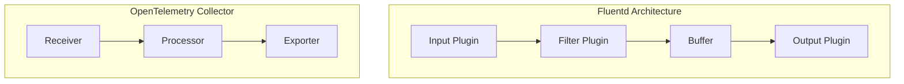
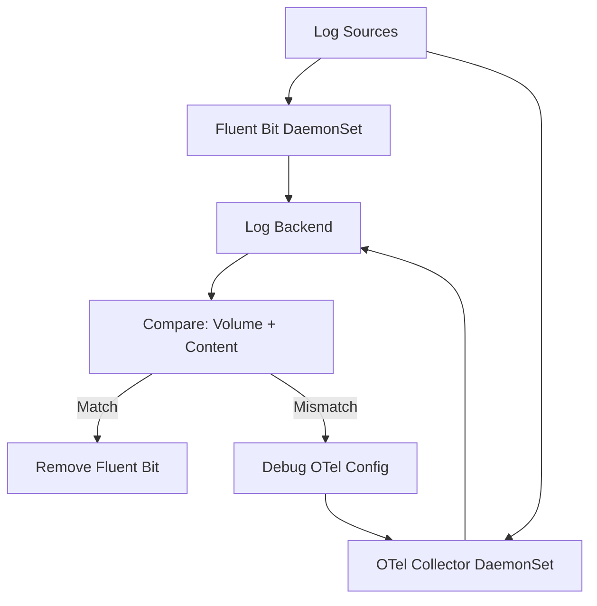

# How to Switch from Fluentd/Fluent Bit to OpenTelemetry Log Collection

Author: [nawazdhandala](https://www.github.com/nawazdhandala)

Tags: OpenTelemetry, Fluentd, Fluent Bit, Logs, Migration, Observability, Collector

Description: Learn how to migrate your log collection pipeline from Fluentd or Fluent Bit to the OpenTelemetry Collector with practical configuration examples and a phased rollout plan.

---

Fluentd and Fluent Bit have been workhorses of the log collection world for a long time. They are battle-tested, widely deployed, and do their job well. So why consider moving to the OpenTelemetry Collector for log collection? The answer comes down to convergence. If you are already using OpenTelemetry for traces and metrics, running a separate log pipeline through Fluentd adds operational complexity that you can eliminate. A single collector handling all three signals means fewer components to deploy, configure, monitor, and debug.

This guide walks through the migration process, covering Kubernetes log collection, file-based log tailing, and log processing pipelines.

## Mapping Fluentd Concepts to OpenTelemetry

Before diving into configuration changes, it helps to understand how Fluentd and OpenTelemetry Collector concepts map to each other.

| Fluentd/Fluent Bit | OpenTelemetry Collector | Notes |
|---------------------|-------------------------|-------|
| Input plugins | Receivers | Both define where data comes from |
| Filter plugins | Processors | Both transform data in the pipeline |
| Output plugins | Exporters | Both define where data goes |
| Buffer | Exporter queue + batch processor | Buffering and batching are handled differently |
| Tag/label routing | Pipelines + connectors | OTel uses named pipelines instead of tag-based routing |
| Parser plugins | Receiver-level parsing or transform processor | Parsing is typically done at the receiver level |



## Step 1: Replace Kubernetes Log Collection

If you are running Fluentd or Fluent Bit as a DaemonSet for Kubernetes log collection, this is likely your biggest migration target. The OpenTelemetry Collector has a filelog receiver that can tail container log files in the same way Fluent Bit does.

Here is a typical Fluent Bit configuration for Kubernetes:

```ini
# Typical Fluent Bit Kubernetes configuration
[INPUT]
    Name              tail
    Tag               kube.*
    Path              /var/log/containers/*.log
    Parser            docker
    DB                /var/log/flb_kube.db
    Mem_Buf_Limit     5MB
    Skip_Long_Lines   On

[FILTER]
    Name                kubernetes
    Match               kube.*
    Kube_URL            https://kubernetes.default.svc:443
    Kube_CA_File        /var/run/secrets/kubernetes.io/serviceaccount/ca.crt
    Kube_Token_File     /var/run/secrets/kubernetes.io/serviceaccount/token
    Merge_Log           On

[OUTPUT]
    Name  es
    Match *
    Host  elasticsearch.logging.svc
    Port  9200
    Index fluent-bit
```

The equivalent OpenTelemetry Collector configuration:

```yaml
# OpenTelemetry Collector configuration for Kubernetes log collection
receivers:
  filelog:
    # Tail all container log files, same path as Fluent Bit
    include:
      - /var/log/containers/*.log
    # Exclude collector's own logs to prevent feedback loops
    exclude:
      - /var/log/containers/*otel-collector*.log
    # Start reading from the end of existing files on first run
    start_at: end
    # Checkpoint file for tracking read positions across restarts
    storage: file_storage
    # Parse the container runtime log format (containerd or CRI-O)
    operators:
      # First operator parses the container runtime log wrapper
      - type: container
        id: container-parser
      # Move Kubernetes metadata from filename into resource attributes
      - type: regex_parser
        id: filename-parser
        regex: '^/var/log/containers/(?P<pod_name>[^_]+)_(?P<namespace>[^_]+)_(?P<container_name>[^-]+)-.*\.log$'
        parse_from: attributes["log.file.name"]
        parse_to: resource

  # Use the k8s_attributes processor instead for richer metadata enrichment

processors:
  # Enrich logs with Kubernetes metadata from the API server
  # This replaces Fluent Bit's kubernetes filter
  k8sattributes:
    auth_type: "serviceAccount"
    extract:
      metadata:
        - k8s.pod.name
        - k8s.namespace.name
        - k8s.deployment.name
        - k8s.node.name
        - k8s.container.name
      labels:
        - tag_name: app
          key: app
          from: pod
    pod_association:
      - sources:
          - from: resource_attribute
            name: k8s.pod.name

  batch:
    timeout: 5s
    send_batch_size: 500

exporters:
  # Export to Elasticsearch, matching the Fluent Bit output
  elasticsearch:
    endpoints: ["http://elasticsearch.logging.svc:9200"]
    logs_index: "otel-logs"

extensions:
  # File storage extension tracks checkpoint positions
  # This replaces Fluent Bit's DB file for offset tracking
  file_storage:
    directory: /var/otel/storage

service:
  extensions: [file_storage]
  pipelines:
    logs:
      receivers: [filelog]
      processors: [k8sattributes, batch]
      exporters: [elasticsearch]
```

The `k8sattributes` processor is the key replacement for Fluent Bit's Kubernetes filter. It queries the Kubernetes API server to enrich log records with pod labels, deployment names, and other metadata. You need to grant the collector's service account appropriate RBAC permissions to read pod metadata.

## Step 2: Migrate File-Based Log Collection

For non-Kubernetes environments where you tail log files directly, the filelog receiver handles this well. Here is how a Fluentd file tail input translates:

Fluentd configuration:

```xml
<!-- Fluentd configuration for tailing application logs -->
<source>
  @type tail
  path /var/log/app/application.log
  pos_file /var/log/td-agent/application.pos
  tag app.logs
  <parse>
    @type json
  </parse>
</source>

<filter app.logs>
  @type record_transformer
  <record>
    environment production
    service_name my-application
  </record>
</filter>
```

OpenTelemetry Collector equivalent:

```yaml
# OpenTelemetry filelog receiver for application log files
receivers:
  filelog/app:
    include:
      - /var/log/app/application.log
    # Checkpoint tracking for reliable delivery across restarts
    storage: file_storage
    operators:
      # Parse JSON-formatted log lines
      - type: json_parser
        id: json-parser
        # Parse the entire log line body as JSON
        parse_from: body
        # Preserve the original log line in case parsing fails
        on_error: send

processors:
  # Add static resource attributes (replaces Fluentd record_transformer)
  resource:
    attributes:
      - key: deployment.environment
        value: production
        action: upsert
      - key: service.name
        value: my-application
        action: upsert

  # Transform processor for more complex field manipulation
  transform:
    log_statements:
      - context: log
        statements:
          # Move the parsed severity field to the log record's severity
          - set(severity_text, attributes["level"]) where attributes["level"] != nil
```

The `resource` processor adds static metadata to every log record, similar to Fluentd's record_transformer. For more complex transformations, the `transform` processor uses the OpenTelemetry Transformation Language (OTTL), which gives you SQL-like expressions for modifying log records.

## Step 3: Handle Log Parsing and Multiline Logs

One area where Fluentd shines is its rich library of parser plugins. The OpenTelemetry filelog receiver uses a different approach based on composable operators. Here is how to handle multiline logs like Java stack traces:

```yaml
# Multiline log parsing for Java stack traces
receivers:
  filelog/java:
    include:
      - /var/log/app/java-app.log
    # Multiline configuration combines continuation lines with the initial line
    multiline:
      # The first line of a log entry starts with a timestamp
      line_start_pattern: '^\d{4}-\d{2}-\d{2}T\d{2}:\d{2}:\d{2}'
    operators:
      # Parse the structured fields from each complete log entry
      - type: regex_parser
        id: main-parser
        regex: '^(?P<timestamp>\d{4}-\d{2}-\d{2}T\d{2}:\d{2}:\d{2}\.\d{3})\s+(?P<level>\w+)\s+\[(?P<thread>[^\]]+)\]\s+(?P<logger>[^\s]+)\s+-\s+(?P<message>.*)'
        parse_from: body
        timestamp:
          parse_from: attributes.timestamp
          layout: '%Y-%m-%dT%H:%M:%S.%L'
        severity:
          parse_from: attributes.level
```

This configuration first combines multiline entries (like stack traces that span multiple lines) into single log records, then parses the structured fields out of each combined entry.

## Step 4: Migrate Tag-Based Routing

Fluentd uses tags extensively for routing logs to different outputs. In OpenTelemetry Collector, you achieve this through multiple pipelines and the routing processor.

Fluentd routing:

```xml
<!-- Fluentd routes logs to different outputs based on tags -->
<match app.access.**>
  @type elasticsearch
  host es-access.example.com
</match>

<match app.error.**>
  @type elasticsearch
  host es-errors.example.com
</match>
```

OpenTelemetry Collector routing:

```yaml
# Route logs to different exporters based on attributes
processors:
  routing:
    # Route based on a resource attribute value
    from_attribute: log_type
    attribute_source: resource
    # Default route for logs that do not match any specific table
    default_exporters:
      - elasticsearch/default
    table:
      - value: access
        exporters:
          - elasticsearch/access
      - value: error
        exporters:
          - elasticsearch/errors

exporters:
  elasticsearch/access:
    endpoints: ["http://es-access.example.com:9200"]
    logs_index: "access-logs"
  elasticsearch/errors:
    endpoints: ["http://es-errors.example.com:9200"]
    logs_index: "error-logs"
  elasticsearch/default:
    endpoints: ["http://es-default.example.com:9200"]
    logs_index: "default-logs"

service:
  pipelines:
    logs:
      receivers: [filelog]
      processors: [routing]
      exporters: [elasticsearch/access, elasticsearch/errors, elasticsearch/default]
```

## Step 5: Deploy with a Parallel Run Strategy

Do not cut over all at once. Run both Fluentd/Fluent Bit and the OpenTelemetry Collector side by side, sending logs to the same backend from both.



During the parallel run, compare log volumes between the two pipelines. Check that the OpenTelemetry pipeline captures the same number of log entries and that the parsed fields match. Pay special attention to multiline logs and any custom parsers you had in Fluentd.

## Key Differences to Be Aware Of

**Buffering.** Fluentd has sophisticated buffering with file-based buffers, retry logic, and overflow handling. The OpenTelemetry Collector handles this through the exporter's sending queue and the batch processor. For high-volume log pipelines, configure the sending queue size and enable persistent queue storage.

**Plugin ecosystem.** Fluentd has hundreds of community plugins. The OpenTelemetry Collector has fewer receivers and exporters, but the list grows rapidly. Check that receivers and exporters exist for your specific sources and destinations before starting the migration.

**Memory usage.** Fluent Bit is known for its tiny memory footprint. The OpenTelemetry Collector uses more memory by default, especially with the k8sattributes processor. Set appropriate memory limits and configure the memory_limiter processor to prevent OOM kills.

## Wrapping Up

Moving from Fluentd or Fluent Bit to OpenTelemetry log collection consolidates your observability pipeline into a single agent. Start with the filelog receiver for basic log tailing, add the k8sattributes processor for Kubernetes metadata, and use the routing processor to replicate tag-based routing. Run both systems in parallel until you are confident the OpenTelemetry pipeline captures everything your Fluentd setup did, then retire the old system.
