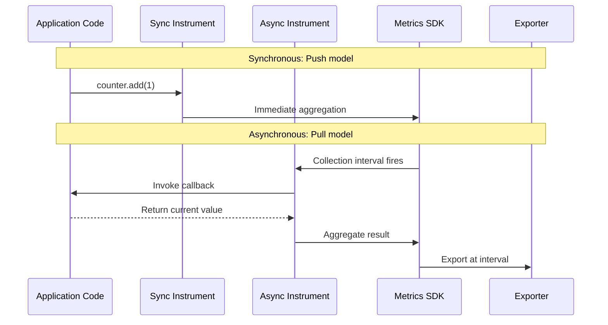
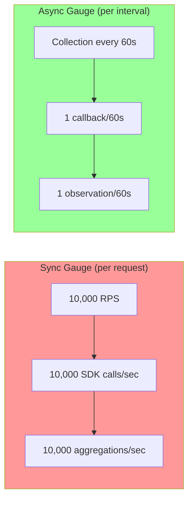

# How to Choose Between Sync and Async Metric Instruments for Performance

Author: [nawazdhandala](https://www.github.com/nawazdhandala)

Tags: OpenTelemetry, Metrics, Performance, SDK, Instrumentation

Description: A practical guide to choosing between synchronous and asynchronous metric instruments in OpenTelemetry for optimal application performance.

---

OpenTelemetry gives you two fundamentally different ways to record metrics: synchronous instruments and asynchronous instruments. Picking the wrong one does not just affect code style. It has real performance implications for your application, including how much memory you use, how much CPU time you spend on metric collection, and whether your hot paths get slowed down.

Most developers default to synchronous instruments because they feel familiar. You call a method, the value gets recorded. Simple. But asynchronous instruments exist for good reasons, and in many cases they are the better choice. This post breaks down when to use each one and why.

## The Two Models, Explained

Synchronous instruments record measurements at the moment something happens. You call `counter.add(1)` right when a request arrives or `histogram.record(latency)` right after you measure it. The SDK receives the measurement immediately and aggregates it internally.

Asynchronous instruments (also called observable instruments) work differently. You register a callback function, and the SDK calls that function once per collection interval to get the current value. The measurement is pulled rather than pushed.



This difference in timing is everything. Let us look at the practical consequences.

## Synchronous Instruments: When to Use Them

Synchronous instruments are the right choice when you are recording events or measurements that happen at discrete points in time. Things like:

- Counting incoming requests
- Recording request latency
- Tracking the number of items processed
- Measuring the size of messages or payloads

These are all event-driven measurements. Something happens, you record it, you move on.

Here is a typical example with a Counter and Histogram:

```python
# Python - Synchronous instruments for request tracking
from opentelemetry import metrics

meter = metrics.get_meter("my-service")

# Counter: incremented each time a request is handled
# Good fit for sync because we want to count each individual event
request_counter = meter.create_counter(
    name="http.server.request.count",
    description="Total number of HTTP requests",
    unit="1",
)

# Histogram: records a measurement for each request's latency
# Good fit for sync because latency is measured per-request
request_duration = meter.create_histogram(
    name="http.server.request.duration",
    description="HTTP request duration",
    unit="ms",
)

def handle_request(request):
    start = time.monotonic()

    # Process the request
    response = process(request)

    # Record metrics at the exact moment the event occurs
    duration_ms = (time.monotonic() - start) * 1000
    request_counter.add(1, {"http.method": request.method, "http.status_code": response.status})
    request_duration.record(duration_ms, {"http.method": request.method})

    return response
```

The performance characteristics of synchronous instruments:

- **CPU cost per call**: Very low. The SDK aggregates in-place using atomic operations. A counter increment is roughly the cost of an atomic add.
- **Memory**: Proportional to the number of unique attribute combinations (cardinality). Each unique combination of labels maintains its own aggregation bucket.
- **Latency impact**: Minimal on the hot path, usually under 1 microsecond per recording.

## Asynchronous Instruments: When to Use Them

Asynchronous instruments are the right choice when you are observing a current state rather than recording events. Things like:

- Current CPU usage
- Memory utilization
- Number of active connections in a pool
- Queue depth
- Temperature readings from hardware sensors

These are not events. There is no discrete moment when "CPU utilization happens." It is a continuous state that you sample periodically.

```python
# Python - Asynchronous instruments for system state observation
from opentelemetry import metrics
import psutil

meter = metrics.get_meter("my-service")

def observe_cpu(options):
    """Callback invoked by the SDK at each collection interval.
    Returns the current CPU utilization percentage."""
    # psutil.cpu_percent() is only called once per collection interval
    # instead of being called on every request
    usage = psutil.cpu_percent(interval=None)
    options.observe(usage, {"cpu.state": "user"})

def observe_memory(options):
    """Callback for current memory usage in bytes."""
    mem = psutil.virtual_memory()
    options.observe(mem.used, {"memory.type": "used"})
    options.observe(mem.available, {"memory.type": "available"})

def observe_connections(options):
    """Callback for current connection pool state."""
    pool = get_connection_pool()
    options.observe(pool.active_count, {"pool.state": "active"})
    options.observe(pool.idle_count, {"pool.state": "idle"})

# Register the observable gauges with their callbacks
# The SDK will call these functions at each collection interval (default 60s)
cpu_gauge = meter.create_observable_gauge(
    name="system.cpu.utilization",
    callbacks=[observe_cpu],
    description="Current CPU utilization",
    unit="%",
)

memory_gauge = meter.create_observable_gauge(
    name="system.memory.usage",
    callbacks=[observe_memory],
    description="Current memory usage",
    unit="By",
)

connection_gauge = meter.create_observable_gauge(
    name="db.client.connections",
    callbacks=[observe_connections],
    description="Current database connection pool state",
    unit="1",
)
```

The performance advantages of async instruments for state observation are significant:

- **Zero cost on the hot path**: The callback is only invoked at collection time (once per export interval), not on every request.
- **Controlled frequency**: If your export interval is 60 seconds, the callback runs once per minute regardless of traffic volume.
- **No aggregation overhead**: The SDK does not need to aggregate multiple values because there is only one observation per interval.

## The Performance Difference in Practice

Let us put concrete numbers on this. Consider a service running at 10,000 requests per second that needs to track the size of a connection pool.

**Using a synchronous gauge (wrong approach):**

```python
# BAD: Checking pool size on every single request
# At 10,000 RPS, this calls pool.active_count 10,000 times per second
gauge = meter.create_gauge("db.connections.active")

def handle_request(request):
    # This runs on the hot path for every request
    gauge.set(pool.active_count, {"pool.name": "primary"})
    return process(request)
```

This calls `pool.active_count` 10,000 times per second and makes 10,000 SDK calls per second. The SDK then has to process all of these, even though the connection pool size changes maybe a few times per second at most.

**Using an asynchronous gauge (correct approach):**

```python
# GOOD: Pool size is observed only at collection time
# At a 60-second collection interval, this runs once per minute
def observe_pool(options):
    options.observe(pool.active_count, {"pool.name": "primary"})

observable_gauge = meter.create_observable_gauge(
    "db.connections.active",
    callbacks=[observe_pool],
)
```

This makes exactly one call per collection interval. If your interval is 60 seconds, you go from 10,000 calls per second to one call per 60 seconds. That is a 600,000x reduction in overhead.



## The Decision Framework

Here is a practical framework for choosing between sync and async instruments:

**Use synchronous instruments when:**
- You are counting discrete events (requests, errors, items processed)
- You are recording measurements of individual operations (latency, payload size)
- The value comes from something that happens at a specific moment in time
- You need delta temporality for downstream consumers

**Use asynchronous instruments when:**
- You are observing the current state of something (pool size, queue depth, resource utilization)
- The underlying value is expensive to compute and should not be computed on every request
- The value exists independently of your application's request handling (system metrics, hardware sensors)
- You want the value sampled at a fixed interval regardless of traffic

There is also a special case worth mentioning. The `ObservableCounter` is useful for wrapping existing counters that you do not control. If a third-party library exposes a `getRequestCount()` method that returns a monotonically increasing value, you can wrap it in an observable counter rather than trying to hook into every place the library increments its internal counter.

```python
# Wrapping an existing cumulative counter from a third-party library
# The callback reads the current total, and the SDK computes the delta
def observe_library_requests(options):
    # third_party_lib already tracks this internally
    # We just read its value at collection time
    options.observe(third_party_lib.get_total_requests(), {})

meter.create_observable_counter(
    "third_party.requests.total",
    callbacks=[observe_library_requests],
    description="Total requests handled by third-party library",
)
```

## Watch Out for Callback Performance

One thing to be careful about with async instruments: your callback function runs on the SDK's collection thread. If the callback is slow (it makes a network call, queries a database, or does heavy computation), it blocks metric collection for all instruments.

Keep callbacks fast. If you need to fetch data from a slow source, do it in a background thread and have the callback read a cached value:

```python
import threading

# Cache expensive values in a background thread
_cached_pool_stats = {"active": 0, "idle": 0}

def update_pool_stats_background():
    """Runs in a background thread, updates cache every 10 seconds.
    This keeps the async callback fast by avoiding slow operations."""
    while True:
        # This might be an expensive operation (e.g., querying a remote pool manager)
        stats = expensive_pool_stats_query()
        _cached_pool_stats["active"] = stats.active
        _cached_pool_stats["idle"] = stats.idle
        time.sleep(10)

# Start background updater
threading.Thread(target=update_pool_stats_background, daemon=True).start()

def observe_pool(options):
    # Fast: just reads from the cache dictionary
    options.observe(_cached_pool_stats["active"], {"state": "active"})
    options.observe(_cached_pool_stats["idle"], {"state": "idle"})
```

## Wrapping Up

The choice between sync and async instruments is not just a style preference. It directly affects how much CPU time your application spends on metrics collection, how much memory the SDK uses, and whether your hot paths are impacted. Default to synchronous instruments for event-driven measurements and asynchronous instruments for state observations. When in doubt, ask yourself: "Am I recording something that just happened, or am I observing something that currently exists?" The answer to that question will point you to the right instrument type every time.
