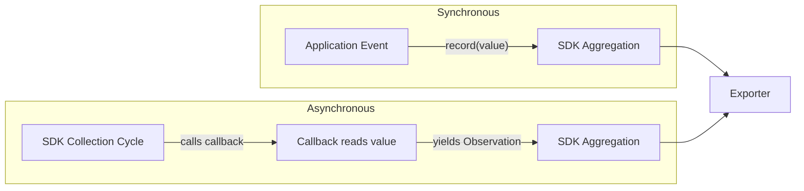
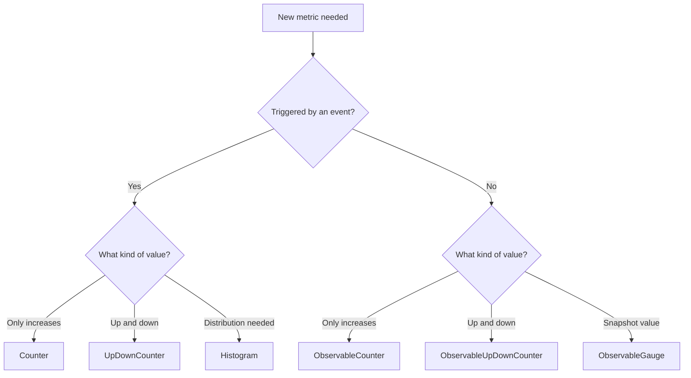

# How to Choose Between Synchronous and Asynchronous Metric Instruments

Author: [nawazdhandala](https://www.github.com/nawazdhandala)

Tags: OpenTelemetry, Metrics, Synchronous Instruments, Asynchronous Instruments, Observability, Python, Performance

Description: Understand the differences between synchronous and asynchronous metric instruments in OpenTelemetry and learn when to use each type with practical examples.

---

OpenTelemetry offers two flavors of every metric instrument: synchronous and asynchronous. Choosing the wrong one does not break anything, but it can lead to unnecessary complexity, wasted resources, or metrics that do not capture what you actually need. The distinction is simple once you understand it, but the documentation can make it feel more complicated than it is.

This guide explains the difference clearly, shows you when to use each type, and walks through practical examples that cover the most common scenarios.

---

## The Core Difference

Synchronous instruments are called explicitly in your application code. You record a measurement at the exact moment something happens. When a request finishes, you record the latency. When an order is placed, you increment a counter. Your code drives when values are recorded.

Asynchronous instruments (also called observable instruments) work differently. You register a callback function, and the SDK calls that function at each collection interval to read the current value. Your code does not push values. Instead, the SDK pulls them on a schedule.



The mental model is push vs. pull. Synchronous instruments push data into the SDK when events happen. Asynchronous instruments let the SDK pull data when it is ready to export.

---

## Synchronous Instruments

There are three synchronous instrument types:

| Instrument | Method | Use Case |
|---|---|---|
| Counter | `add(value)` | Counting events (requests, errors, bytes) |
| UpDownCounter | `add(value)` | Values that increase and decrease (active sessions) |
| Histogram | `record(value)` | Distributions (latencies, sizes) |

### When to Use Synchronous Instruments

Use synchronous instruments when the measurement is tied to an event in your code. If something happens and you want to record it right then, synchronous is the right choice.

```python
from opentelemetry import metrics

meter = metrics.get_meter("payment-service")

# Counter: records each payment as it happens
payments_processed = meter.create_counter(
    name="payments.processed",
    description="Number of payments processed",
    unit="payments",
)

# Histogram: records latency when each payment completes
payment_duration = meter.create_histogram(
    name="payments.duration",
    description="Time taken to process a payment",
    unit="ms",
)

# UpDownCounter: tracks a value that goes both up and down
active_transactions = meter.create_up_down_counter(
    name="payments.active_transactions",
    description="Number of currently in-flight payment transactions",
    unit="transactions",
)

import time

def process_payment(payment):
    """Process a payment and record metrics at each step."""
    # Increment active transactions when processing begins
    active_transactions.add(1, {"payment.provider": payment.provider})

    start = time.monotonic()
    try:
        result = gateway.charge(payment)

        # Record the successful payment count
        payments_processed.add(1, {
            "payment.provider": payment.provider,
            "payment.status": "success",
        })
        return result

    except PaymentError:
        payments_processed.add(1, {
            "payment.provider": payment.provider,
            "payment.status": "failed",
        })
        raise

    finally:
        # Always record duration and decrement active count
        duration_ms = (time.monotonic() - start) * 1000
        payment_duration.record(duration_ms, {
            "payment.provider": payment.provider,
        })
        active_transactions.add(-1, {"payment.provider": payment.provider})
```

Notice how each metric recording is tied to a specific point in the application flow. The counter increments when a payment finishes. The histogram records duration when processing completes. The up-down counter changes when a transaction starts and ends. These are all event-driven measurements.

---

## Asynchronous Instruments

The asynchronous instrument types mirror the synchronous ones:

| Instrument | Callback Returns | Use Case |
|---|---|---|
| ObservableCounter | Cumulative total | Reading a monotonic value from an external source |
| ObservableUpDownCounter | Current value that can go up/down | Pool sizes, connection counts from external systems |
| ObservableGauge | Current snapshot value | Temperature, queue depth, memory usage |

### When to Use Asynchronous Instruments

Use asynchronous instruments when the value exists independently of your application events. The measurement is not triggered by something your code does. Instead, it reflects the state of something external that you want to sample periodically.

```python
import psutil
from opentelemetry import metrics

meter = metrics.get_meter("system-monitor")

# Callback functions are called by the SDK at each collection interval.
# They yield one or more Observation objects.

def read_cpu_usage(options):
    """Reports per-CPU usage percentage.
    This value exists regardless of what the application is doing,
    so an observable gauge is the right instrument type."""
    for i, percent in enumerate(psutil.cpu_percent(percpu=True)):
        yield metrics.Observation(
            value=percent,
            attributes={"cpu.core": str(i)},
        )

cpu_gauge = meter.create_observable_gauge(
    name="system.cpu.usage",
    description="CPU usage percentage per core",
    unit="%",
    callbacks=[read_cpu_usage],
)


def read_disk_io(options):
    """Reports cumulative disk I/O bytes.
    Since disk I/O counters only increase, this is an observable counter.
    The SDK computes the rate of change between collections."""
    counters = psutil.disk_io_counters()
    yield metrics.Observation(
        value=counters.read_bytes,
        attributes={"direction": "read"},
    )
    yield metrics.Observation(
        value=counters.write_bytes,
        attributes={"direction": "write"},
    )

disk_io = meter.create_observable_counter(
    name="system.disk.io",
    description="Cumulative disk I/O in bytes",
    unit="bytes",
    callbacks=[read_disk_io],
)


def read_connection_pool(options):
    """Reports the number of connections in a database pool.
    The pool size goes up and down as connections are acquired
    and released, making this an observable up-down counter."""
    pool_stats = db_pool.get_stats()
    yield metrics.Observation(
        value=pool_stats.active,
        attributes={"pool.state": "active"},
    )
    yield metrics.Observation(
        value=pool_stats.idle,
        attributes={"pool.state": "idle"},
    )

pool_counter = meter.create_observable_up_down_counter(
    name="db.pool.connections",
    description="Number of database pool connections by state",
    unit="connections",
    callbacks=[read_connection_pool],
)
```

The key insight is that none of these measurements are triggered by an application event. CPU usage, disk I/O, and connection pool state all exist independently. The SDK reads them on a schedule, which is exactly what asynchronous instruments are designed for.

---

## Decision Framework

When you are deciding which instrument type to use, ask yourself two questions:

**Question 1: Is this measurement triggered by an event in my code?**

If yes, use a synchronous instrument. If the value exists independently and you just want to sample it periodically, use an asynchronous instrument.

**Question 2: What kind of value is it?**

- If it only goes up, use a Counter (sync) or ObservableCounter (async).
- If it goes up and down, use an UpDownCounter (sync) or ObservableUpDownCounter (async).
- If you need the distribution of values, use a Histogram (sync only, there is no async histogram).
- If it is a point-in-time snapshot, use an ObservableGauge (async).



---

## Common Mistakes

**Using a synchronous gauge instead of a callback-based one.** If you find yourself updating a gauge in a background loop, you probably want an observable gauge with a callback instead. Let the SDK drive the collection schedule.

```python
# Avoid this pattern: manually polling in a background thread
import threading

def _poll_queue_depth():
    while True:
        depth = get_queue_depth()
        queue_gauge.set(depth)  # Called thousands of times between exports
        time.sleep(1)

threading.Thread(target=_poll_queue_depth, daemon=True).start()

# Prefer this: let the SDK call your callback at collection time
def read_queue_depth(options):
    yield metrics.Observation(value=get_queue_depth())

meter.create_observable_gauge(
    "queue.depth", callbacks=[read_queue_depth], unit="messages"
)
```

**Using an ObservableCounter when you have events.** If you are incrementing a variable in your code and then exposing it through a callback, you are adding indirection for no benefit. Just use a synchronous counter and call `add()` directly.

```python
# Avoid: manually tracking a counter and exposing via callback
_error_count = 0

def on_error():
    global _error_count
    _error_count += 1  # Thread safety issues too

def read_errors(options):
    yield metrics.Observation(value=_error_count)

# Prefer: use a synchronous counter directly
error_counter = meter.create_counter("errors.total")

def on_error():
    error_counter.add(1, {"error.source": "payment"})
```

**Forgetting that there is no async histogram.** Histograms are always synchronous in OpenTelemetry. If you need distribution data, you must record each value as it happens. This is by design: a histogram needs every individual value to compute percentiles, so sampling at intervals would lose data.

---

## Performance Implications

Synchronous instruments have a small overhead on each call. The SDK performs aggregation (summing, bucketing) in memory and only exports at the configured interval. For most applications, this overhead is negligible, but if you are recording millions of measurements per second, consider reducing attribute cardinality to lower the aggregation cost.

Asynchronous instruments have zero overhead between collection intervals. The callback only runs when the SDK needs to export, so there is no ongoing cost. This makes them ideal for metrics that would otherwise require constant polling.

In practice, most applications use a mix of both types. Synchronous instruments for request-level metrics (latency, error counts, throughput) and asynchronous instruments for system-level metrics (CPU, memory, pool sizes, queue depths).

---

## Conclusion

The choice between synchronous and asynchronous instruments comes down to who drives the measurement. If your code generates the data point at a specific moment, use synchronous. If the value exists independently and you want to sample it, use asynchronous. Getting this right leads to cleaner code and more accurate metrics. Combined with a backend like [OneUptime](https://oneuptime.com) that understands all OpenTelemetry metric types, you get full visibility into both your application behavior and the systems it depends on.
