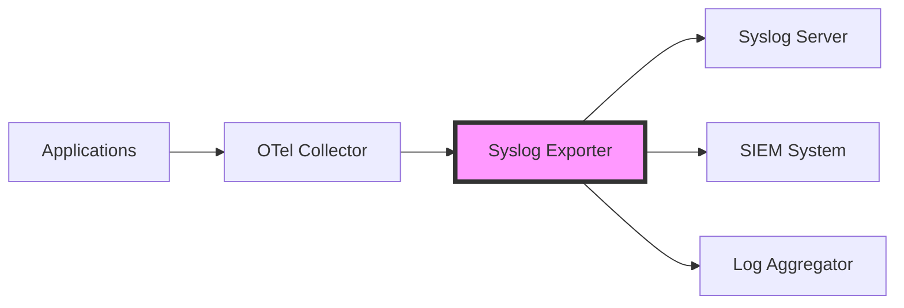

# How to Configure the Syslog Exporter in the OpenTelemetry Collector

Author: [nawazdhandala](https://www.github.com/nawazdhandala)

Tags: OpenTelemetry, Collector, Exporters, Syslog, Logging, SIEM

Description: Learn how to configure the syslog exporter in the OpenTelemetry Collector to send log data to syslog servers and SIEM systems using RFC 5424 and RFC 3164 formats.

The syslog exporter enables the OpenTelemetry Collector to send log data to syslog servers using standard syslog protocols. This is particularly valuable for organizations that have invested in syslog-based log management infrastructure, SIEM systems, or need to comply with regulations requiring centralized syslog collection.

## Understanding the Syslog Exporter

Syslog is one of the oldest and most widely supported logging protocols. Many security information and event management (SIEM) systems, log aggregators, and compliance tools expect logs in syslog format. The OpenTelemetry Collector's syslog exporter bridges modern observability pipelines with traditional syslog infrastructure.

The exporter supports both RFC 3164 (the older BSD syslog format) and RFC 5424 (the newer structured syslog format). It can transmit logs over TCP, UDP, or TLS, providing flexibility for different network requirements and security policies.



## Syslog Protocol Basics

Before configuring the exporter, understanding syslog fundamentals helps you make informed configuration decisions.

**Severity Levels**: Syslog defines severity levels from 0 (Emergency) to 7 (Debug). The exporter maps OpenTelemetry log severity to appropriate syslog levels.

**Facilities**: Syslog uses facilities to categorize the source of messages (user, mail, daemon, local0-local7, etc.). You can configure which facility the exporter uses.

**Message Formats**: RFC 3164 uses a simple plaintext format, while RFC 5424 provides structured data fields that preserve more information from OpenTelemetry logs.

## Basic Configuration

Here is a basic configuration for sending logs to a syslog server over UDP using RFC 5424 format:

```yaml
receivers:
  # Receive logs via OTLP protocol
  otlp:
    protocols:
      grpc:
        endpoint: 0.0.0.0:4317
      http:
        endpoint: 0.0.0.0:4318

processors:
  # Batch logs before sending to reduce overhead
  batch:
    timeout: 10s
    send_batch_size: 512

exporters:
  # Configure syslog exporter
  syslog:
    # Network protocol: tcp, udp, or tcp+tls
    network: udp
    # Syslog server endpoint
    endpoint: syslog.example.com:514
    # Syslog protocol format
    protocol: rfc5424
    # Port for syslog (514 is standard)
    port: 514
    # Syslog facility code (16 = local0)
    facility: 16
    # TLS is not used for UDP
    tls:
      insecure: true

service:
  pipelines:
    logs:
      receivers: [otlp]
      processors: [batch]
      exporters: [syslog]
```

This configuration receives logs via OTLP, batches them for efficiency, and sends them to a syslog server using UDP on the standard port 514. The RFC 5424 format preserves structured data from OpenTelemetry logs.

## TCP Transport Configuration

For more reliable delivery, use TCP instead of UDP. TCP ensures that logs are delivered in order and provides acknowledgment of receipt:

```yaml
receivers:
  otlp:
    protocols:
      grpc:
        endpoint: 0.0.0.0:4317

processors:
  batch:
    timeout: 10s
    send_batch_size: 512

exporters:
  syslog:
    # Use TCP for reliable delivery
    network: tcp
    endpoint: syslog.example.com:514
    protocol: rfc5424
    # Timeout for TCP connections
    timeout: 30s
    # Enable TCP keepalive
    tcp:
      max_connections: 10
      keepalive:
        enabled: true
        time: 30s
        interval: 10s
    facility: 16

service:
  pipelines:
    logs:
      receivers: [otlp]
      processors: [batch]
      exporters: [syslog]
```

TCP transport provides better reliability than UDP, especially for critical logs. The keepalive settings ensure that connections remain active and the collector can detect broken connections quickly.

## Secure TLS Configuration

For production environments, especially when sending logs over the internet or untrusted networks, use TLS encryption:

```yaml
receivers:
  otlp:
    protocols:
      grpc:
        endpoint: 0.0.0.0:4317

processors:
  batch:
    timeout: 10s
    send_batch_size: 512

exporters:
  syslog:
    # Use TCP with TLS encryption
    network: tcp
    endpoint: secure-syslog.example.com:6514
    protocol: rfc5424
    facility: 16
    # TLS configuration for secure transport
    tls:
      # Do not skip certificate verification in production
      insecure: false
      # Path to CA certificate bundle
      ca_file: /etc/ssl/certs/ca-bundle.crt
      # Client certificate for mutual TLS (optional)
      cert_file: /etc/ssl/certs/client.crt
      key_file: /etc/ssl/private/client.key
      # Server name for certificate verification
      server_name_override: secure-syslog.example.com
      # Minimum TLS version
      min_version: "1.2"

service:
  pipelines:
    logs:
      receivers: [otlp]
      processors: [batch]
      exporters: [syslog]
```

TLS encryption protects log data in transit from eavesdropping and tampering. Note that secure syslog typically uses port 6514 instead of the standard 514. The certificate verification ensures you are connecting to the legitimate syslog server and not an imposter.

## RFC 3164 Format Configuration

Some legacy systems require the older RFC 3164 format. Here is how to configure it:

```yaml
receivers:
  otlp:
    protocols:
      grpc:
        endpoint: 0.0.0.0:4317

processors:
  batch:
    timeout: 10s

exporters:
  syslog:
    network: udp
    endpoint: legacy-syslog.example.com:514
    # Use RFC 3164 format for legacy compatibility
    protocol: rfc3164
    facility: 16
    # Configure hostname that appears in syslog messages
    hostname: otel-collector-prod
    # Application name that appears in messages
    app_name: otel-collector

service:
  pipelines:
    logs:
      receivers: [otlp]
      processors: [batch]
      exporters: [syslog]
```

RFC 3164 format is simpler and more widely supported by legacy systems, but it provides less structure and metadata than RFC 5424. The format includes timestamp, hostname, application name, process ID, and message content.

## Facility and Severity Mapping

You can configure how OpenTelemetry log severities map to syslog severity levels and which facility code to use:

```yaml
receivers:
  otlp:
    protocols:
      grpc:
        endpoint: 0.0.0.0:4317

processors:
  batch:
    timeout: 10s

exporters:
  syslog:
    network: tcp
    endpoint: syslog.example.com:514
    protocol: rfc5424
    # Facility codes:
    # 0-15: System facilities (kern, user, mail, daemon, etc.)
    # 16-23: Local use facilities (local0 - local7)
    facility: 16  # local0
    # Configure severity mapping
    severity_mapping:
      # Map OTel TRACE/DEBUG to syslog Debug (7)
      trace: 7
      debug: 7
      # Map OTel INFO to syslog Informational (6)
      info: 6
      # Map OTel WARN to syslog Warning (4)
      warn: 4
      # Map OTel ERROR to syslog Error (3)
      error: 3
      # Map OTel FATAL to syslog Critical (2)
      fatal: 2

service:
  pipelines:
    logs:
      receivers: [otlp]
      processors: [batch]
      exporters: [syslog]
```

Facility codes help syslog servers categorize and route logs. Local facilities (local0 through local7) are typically used for custom applications and services. The severity mapping ensures that log levels are correctly interpreted by downstream systems.

## Filtering and Processing Logs

You can use processors to filter and transform logs before sending them to syslog:

```yaml
receivers:
  otlp:
    protocols:
      grpc:
        endpoint: 0.0.0.0:4317

processors:
  # Filter logs to only send ERROR and above
  filter:
    logs:
      include:
        match_type: regexp
        severity_texts:
          - "ERROR.*"
          - "FATAL.*"
          - "CRITICAL.*"

  # Add resource attributes as structured data
  resource:
    attributes:
      - key: environment
        value: production
        action: upsert
      - key: cluster
        value: us-east-1
        action: upsert

  # Transform log format
  transform:
    log_statements:
      - context: log
        statements:
          # Add syslog-specific attributes
          - set(attributes["syslog.facility"], "local0")
          - set(attributes["syslog.severity"], "error")

  batch:
    timeout: 10s

exporters:
  syslog:
    network: tcp
    endpoint: syslog.example.com:514
    protocol: rfc5424
    facility: 16

service:
  pipelines:
    logs:
      receivers: [otlp]
      processors: [filter, resource, transform, batch]
      exporters: [syslog]
```

This configuration filters logs to only send errors and above, adds environment metadata, and transforms attributes for better syslog compatibility. Filtering reduces the volume of logs sent to syslog servers, which can be important for cost management with commercial SIEM systems.

## Multiple Syslog Destinations

You can configure multiple syslog exporters to send logs to different destinations based on log characteristics:

```yaml
receivers:
  otlp:
    protocols:
      grpc:
        endpoint: 0.0.0.0:4317

processors:
  batch:
    timeout: 10s

exporters:
  # Primary syslog server for all logs
  syslog/primary:
    network: tcp
    endpoint: syslog-primary.example.com:514
    protocol: rfc5424
    facility: 16
    tls:
      insecure: false
      ca_file: /etc/ssl/certs/ca.crt

  # Security SIEM for security-related logs
  syslog/security:
    network: tcp
    endpoint: siem.example.com:6514
    protocol: rfc5424
    facility: 13  # security/authorization facility
    tls:
      insecure: false
      ca_file: /etc/ssl/certs/ca.crt

  # Compliance log storage
  syslog/compliance:
    network: tcp
    endpoint: compliance-logs.example.com:514
    protocol: rfc5424
    facility: 16

service:
  pipelines:
    # All logs to primary syslog
    logs/primary:
      receivers: [otlp]
      processors: [batch]
      exporters: [syslog/primary]

    # Security logs to SIEM
    logs/security:
      receivers: [otlp]
      processors: [batch]
      exporters: [syslog/security]

    # Compliance logs to dedicated storage
    logs/compliance:
      receivers: [otlp]
      processors: [batch]
      exporters: [syslog/compliance]
```

Multiple pipelines with different syslog exporters allow you to route logs to specialized systems based on organizational requirements. You might send security logs to a SIEM, compliance logs to long-term storage, and operational logs to a standard log aggregator.

## Integration with SIEM Systems

When integrating with SIEM systems like Splunk, QRadar, or ArcSight, follow these guidelines:

```yaml
receivers:
  otlp:
    protocols:
      grpc:
        endpoint: 0.0.0.0:4317

processors:
  # Add common event format (CEF) compatible attributes
  attributes:
    actions:
      - key: cef.version
        value: "0"
        action: insert
      - key: cef.device_vendor
        value: "OpenTelemetry"
        action: insert
      - key: cef.device_product
        value: "Collector"
        action: insert

  batch:
    timeout: 10s
    send_batch_size: 100

exporters:
  syslog:
    network: tcp
    endpoint: siem.example.com:514
    protocol: rfc5424
    facility: 13  # security facility
    # Configure for SIEM compatibility
    timeout: 60s
    tls:
      insecure: false
      ca_file: /etc/ssl/certs/siem-ca.crt

service:
  pipelines:
    logs:
      receivers: [otlp]
      processors: [attributes, batch]
      exporters: [syslog]
```

SIEM systems often have specific requirements for log format and metadata. Using the security facility (code 13) helps SIEM systems identify security-relevant logs. Some SIEM systems support Common Event Format (CEF) within syslog messages for standardized security event representation.

## Performance Tuning

For high-volume log environments, optimize the syslog exporter configuration:

```yaml
receivers:
  otlp:
    protocols:
      grpc:
        endpoint: 0.0.0.0:4317
        # Increase max message size for large log batches
        max_recv_msg_size_mib: 64

processors:
  # Batch more aggressively to reduce network overhead
  batch:
    timeout: 30s
    send_batch_size: 2048
    send_batch_max_size: 4096

exporters:
  syslog:
    network: tcp
    endpoint: syslog.example.com:514
    protocol: rfc5424
    facility: 16
    # Increase timeout for large batches
    timeout: 60s
    # Configure TCP connection pooling
    tcp:
      max_connections: 20
      keepalive:
        enabled: true
        time: 60s

service:
  pipelines:
    logs:
      receivers: [otlp]
      processors: [batch]
      exporters: [syslog]
```

Larger batch sizes reduce network overhead and improve throughput, but they increase latency and memory usage. Find the right balance for your environment by monitoring collector performance metrics.

## Monitoring and Troubleshooting

Monitor the syslog exporter to ensure reliable log delivery:

```yaml
receivers:
  otlp:
    protocols:
      grpc:
        endpoint: 0.0.0.0:4317

processors:
  batch:
    timeout: 10s

exporters:
  syslog:
    network: tcp
    endpoint: syslog.example.com:514
    protocol: rfc5424
    facility: 16

  # Export collector metrics
  prometheus:
    endpoint: "0.0.0.0:8888"

service:
  pipelines:
    logs:
      receivers: [otlp]
      processors: [batch]
      exporters: [syslog]

  # Enable telemetry for monitoring
  telemetry:
    logs:
      level: info
    metrics:
      level: detailed
      address: ":8888"
```

Key metrics to monitor include:

- Logs sent and failed counts
- Connection errors and retries
- Buffer overflow and dropped logs
- Export latency

For more information on monitoring the OpenTelemetry Collector, see our guide on [OpenTelemetry Collector observability](https://oneuptime.com/blog/post/monitoring-opentelemetry-collector/view).

## Best Practices

Follow these best practices when configuring the syslog exporter:

**Use TCP for Reliability**: UDP is faster but does not guarantee delivery. Use TCP when log delivery is critical.

**Enable TLS in Production**: Protect log data in transit, especially when logs may contain sensitive information.

**Configure Appropriate Batching**: Balance latency, throughput, and memory usage based on your log volume.

**Set Correct Facility Codes**: Use appropriate facility codes to help downstream systems categorize and route logs.

**Monitor Export Metrics**: Track success rates, errors, and latency to ensure reliable log delivery.

**Test Failover Behavior**: Verify that the collector handles syslog server failures gracefully and resumes sending logs when the server recovers.

## Conclusion

The syslog exporter bridges modern OpenTelemetry observability pipelines with traditional syslog infrastructure. Whether you need to integrate with legacy systems, comply with regulatory requirements, or send logs to SIEM platforms, the syslog exporter provides flexible configuration options for protocol format, transport security, and reliability.

Configure the exporter according to your environment's requirements, choosing appropriate protocols, security settings, and performance tuning options. With proper configuration and monitoring, the syslog exporter enables reliable log delivery to your syslog-based infrastructure while maintaining the benefits of OpenTelemetry's unified observability approach.
