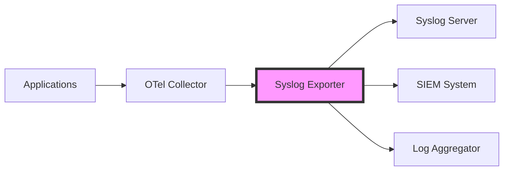

# How to Configure the Syslog Exporter in the OpenTelemetry Collector

Author: [nawazdhandala](https://www.github.com/nawazdhandala)

Tags: OpenTelemetry, Collector, Exporter, Syslog, Logging, SIEM

Description: Learn how to configure the syslog exporter in the OpenTelemetry Collector to send log data to syslog servers and SIEM systems using RFC 5424 and RFC 3164 formats.

The syslog exporter enables the OpenTelemetry Collector to send log data to syslog servers using standard syslog protocols. This is particularly valuable for organizations that have invested in syslog-based log management infrastructure, SIEM systems, or need to comply with regulations requiring centralized syslog collection.

## Understanding the Syslog Exporter

Syslog is one of the oldest and most widely supported logging protocols. Many security information and event management (SIEM) systems, log aggregators, and compliance tools expect logs in syslog format. The OpenTelemetry Collector's syslog exporter bridges modern observability pipelines with traditional syslog infrastructure.

The exporter supports both RFC 3164 (the older BSD syslog format) and RFC 5424 (the newer structured syslog format). It can transmit logs over TCP, UDP, TLS over TCP, or Unix sockets, providing flexibility for different network requirements and security policies.


```mermaid
graph LR
    A[Applications] --> B[OTel Collector]
    B --> C[Syslog Exporter]
    C --> D[Syslog Server]
    C --> E[SIEM System]
    C --> F[Log Aggregator]
    style C fill:#f9f,stroke:#333,stroke-width:4px
```

## Syslog Protocol Basics

Before configuring the exporter, understanding syslog fundamentals helps you make informed configuration decisions.

**Severity Levels**: Syslog defines severity levels from 0 (Emergency) to 7 (Debug). The exporter uses the log record's `priority` attribute, which combines facility and severity as `facility * 8 + severity`.

**Facilities**: Syslog uses facilities to categorize the source of messages (user, mail, daemon, local0-local7, etc.). Configure facility by setting the `priority` attribute before export.

**Message Formats**: RFC 3164 uses a simple plaintext format, while RFC 5424 provides structured data fields. The syslog exporter reads RFC fields from log record attributes such as `hostname`, `appname`, `message`, `priority`, and `structured_data`.

## Basic Configuration

Here is a basic configuration for sending logs to a syslog server over UDP using RFC 5424 format:

```yaml
receivers:
  # Receive logs via OTLP protocol
  otlp:
    protocols:
      grpc:
        endpoint: 0.0.0.0:4317
      http:
        endpoint: 0.0.0.0:4318

processors:
  # Populate syslog fields from the OpenTelemetry log record
  transform/syslog:
    error_mode: ignore
    log_statements:
      - set(log.attributes["message"], log.body)
      # local0 facility (16) + informational severity (6) = 134
      - set(log.attributes["priority"], 134)

  # Batch logs before sending to reduce overhead
  batch:
    timeout: 10s
    send_batch_size: 512

exporters:
  # Configure syslog exporter
  syslog:
    # Network protocol: tcp, udp, or unix
    network: udp
    # Syslog server endpoint
    endpoint: syslog.example.com
    # Syslog protocol format
    protocol: rfc5424
    # Port for syslog (514 is standard)
    port: 514

service:
  pipelines:
    logs:
      receivers: [otlp]
      processors: [transform/syslog, batch]
      exporters: [syslog]
```

This configuration receives logs via OTLP, sets syslog message and priority attributes, batches logs for efficiency, and sends them to a syslog server using UDP on the standard port 514. The RFC 5424 format can carry structured data when the log record includes a `structured_data` attribute.

## TCP Transport Configuration

For more reliable transport, use TCP instead of UDP. TCP provides ordered byte-stream delivery and connection-level error detection:

```yaml
receivers:
  otlp:
    protocols:
      grpc:
        endpoint: 0.0.0.0:4317

processors:
  transform/syslog:
    error_mode: ignore
    log_statements:
      - set(log.attributes["message"], log.body)
      - set(log.attributes["priority"], 134)

  batch:
    timeout: 10s
    send_batch_size: 512

exporters:
  syslog:
    # Use TCP for reliable delivery
    network: tcp
    endpoint: syslog.example.com
    port: 514
    protocol: rfc5424
    # Timeout for TCP connections
    timeout: 30s
    # Disable TLS for cleartext syslog over TCP
    tls:
      insecure: true

service:
  pipelines:
    logs:
      receivers: [otlp]
      processors: [transform/syslog, batch]
      exporters: [syslog]
```

TCP transport provides better reliability than UDP, especially for critical logs. The exporter also supports retry and sending queue settings for handling transient failures.

## Secure TLS Configuration

For production environments, especially when sending logs over the internet or untrusted networks, use TLS encryption:

```yaml
receivers:
  otlp:
    protocols:
      grpc:
        endpoint: 0.0.0.0:4317

processors:
  transform/syslog:
    error_mode: ignore
    log_statements:
      - set(log.attributes["message"], log.body)
      - set(log.attributes["priority"], 134)

  batch:
    timeout: 10s
    send_batch_size: 512

exporters:
  syslog:
    # Use TCP with TLS encryption
    network: tcp
    endpoint: secure-syslog.example.com
    port: 6514
    protocol: rfc5424
    # TLS configuration for secure transport
    tls:
      # Do not skip certificate verification in production
      insecure: false
      # Server name for certificate verification
      server_name_override: secure-syslog.example.com
      # Minimum TLS version
      min_version: "1.2"

service:
  pipelines:
    logs:
      receivers: [otlp]
      processors: [transform/syslog, batch]
      exporters: [syslog]
```

TLS encryption protects log data in transit from eavesdropping and tampering. Note that secure syslog typically uses port 6514 instead of the standard 514. The certificate verification ensures you are connecting to the legitimate syslog server and not an imposter. If your syslog server uses a private CA or requires mutual TLS, add `ca_file`, `cert_file`, and `key_file` paths that exist on the collector host.

## RFC 3164 Format Configuration

Some legacy systems require the older RFC 3164 format. Here is how to configure it:

```yaml
receivers:
  otlp:
    protocols:
      grpc:
        endpoint: 0.0.0.0:4317

processors:
  transform/syslog:
    error_mode: ignore
    log_statements:
      - set(log.attributes["message"], log.body)
      - set(log.attributes["hostname"], "otel-collector-prod")
      - set(log.attributes["appname"], "otel-collector")
      - set(log.attributes["priority"], 134)

  batch:
    timeout: 10s

exporters:
  syslog:
    network: udp
    endpoint: legacy-syslog.example.com
    port: 514
    # Use RFC 3164 format for legacy compatibility
    protocol: rfc3164

service:
  pipelines:
    logs:
      receivers: [otlp]
      processors: [transform/syslog, batch]
      exporters: [syslog]
```

RFC 3164 format is simpler and more widely supported by legacy systems, but it provides less structure and metadata than RFC 5424. The exporter builds the message from log record attributes including `priority`, `hostname`, `appname`, and `message`.

## Facility and Severity Mapping

You can use the transform processor to set syslog priority values based on OpenTelemetry log severity. The priority value combines facility and severity as `facility * 8 + severity`:

```yaml
receivers:
  otlp:
    protocols:
      grpc:
        endpoint: 0.0.0.0:4317

processors:
  transform/syslog_priority:
    error_mode: ignore
    log_statements:
      - set(log.attributes["message"], log.body)
      # local0 facility (16) + debug severity (7) = 135
      - set(log.attributes["priority"], 135) where log.severity_number < SEVERITY_NUMBER_INFO
      # local0 facility (16) + informational severity (6) = 134
      - set(log.attributes["priority"], 134) where log.severity_number >= SEVERITY_NUMBER_INFO and log.severity_number < SEVERITY_NUMBER_WARN
      # local0 facility (16) + warning severity (4) = 132
      - set(log.attributes["priority"], 132) where log.severity_number >= SEVERITY_NUMBER_WARN and log.severity_number < SEVERITY_NUMBER_ERROR
      # local0 facility (16) + error severity (3) = 131
      - set(log.attributes["priority"], 131) where log.severity_number >= SEVERITY_NUMBER_ERROR and log.severity_number < SEVERITY_NUMBER_FATAL
      # local0 facility (16) + critical severity (2) = 130
      - set(log.attributes["priority"], 130) where log.severity_number >= SEVERITY_NUMBER_FATAL

  batch:
    timeout: 10s

exporters:
  syslog:
    network: tcp
    endpoint: syslog.example.com
    port: 514
    protocol: rfc5424
    tls:
      insecure: true

service:
  pipelines:
    logs:
      receivers: [otlp]
      processors: [transform/syslog_priority, batch]
      exporters: [syslog]
```

Facility codes help syslog servers categorize and route logs. Local facilities (local0 through local7) are typically used for custom applications and services. The severity mapping ensures that log levels are correctly interpreted by downstream systems.

## Filtering and Processing Logs

You can use processors to filter and transform logs before sending them to syslog:

```yaml
receivers:
  otlp:
    protocols:
      grpc:
        endpoint: 0.0.0.0:4317

processors:
  # Filter logs to only send ERROR and above
  filter:
    error_mode: ignore
    log_conditions:
      - log.severity_number < SEVERITY_NUMBER_ERROR

  # Add resource attributes as metadata
  resource:
    attributes:
      - key: environment
        value: production
        action: upsert
      - key: cluster
        value: us-east-1
        action: upsert

  # Transform log format
  transform:
    error_mode: ignore
    log_statements:
      # Add syslog-specific attributes
      - set(log.attributes["message"], log.body)
      # local0 facility (16) + error severity (3) = 131
      - set(log.attributes["priority"], 131)

  batch:
    timeout: 10s

exporters:
  syslog:
    network: tcp
    endpoint: syslog.example.com
    port: 514
    protocol: rfc5424
    tls:
      insecure: true

service:
  pipelines:
    logs:
      receivers: [otlp]
      processors: [filter, resource, transform, batch]
      exporters: [syslog]
```

This configuration drops logs below error severity, adds environment metadata, and transforms attributes for better syslog compatibility. Filtering reduces the volume of logs sent to syslog servers, which can be important for cost management with commercial SIEM systems.

## Multiple Syslog Destinations

You can configure multiple syslog exporters to send logs to different destinations. Add filter processors to individual pipelines when you need routing based on log characteristics:

```yaml
receivers:
  otlp:
    protocols:
      grpc:
        endpoint: 0.0.0.0:4317

processors:
  transform/syslog_operational:
    error_mode: ignore
    log_statements:
      - set(log.attributes["message"], log.body)
      - set(log.attributes["priority"], 134)

  transform/syslog_security:
    error_mode: ignore
    log_statements:
      - set(log.attributes["message"], log.body)
      # authpriv facility (10) + informational severity (6) = 86
      - set(log.attributes["priority"], 86)

  batch:
    timeout: 10s

exporters:
  # Primary syslog server for all logs
  syslog/primary:
    network: tcp
    endpoint: syslog-primary.example.com
    port: 514
    protocol: rfc5424
    tls:
      insecure: true

  # Security SIEM for security-related logs
  syslog/security:
    network: tcp
    endpoint: siem.example.com
    port: 6514
    protocol: rfc5424
    tls:
      insecure: false

  # Compliance log storage
  syslog/compliance:
    network: tcp
    endpoint: compliance-logs.example.com
    port: 514
    protocol: rfc5424
    tls:
      insecure: true

service:
  pipelines:
    # All logs to primary syslog
    logs/primary:
      receivers: [otlp]
      processors: [transform/syslog_operational, batch]
      exporters: [syslog/primary]

    # Security logs to SIEM
    logs/security:
      receivers: [otlp]
      processors: [transform/syslog_security, batch]
      exporters: [syslog/security]

    # Compliance logs to dedicated storage
    logs/compliance:
      receivers: [otlp]
      processors: [transform/syslog_operational, batch]
      exporters: [syslog/compliance]
```

Multiple pipelines with different syslog exporters allow you to route logs to specialized systems based on organizational requirements. You might send security logs to a SIEM, compliance logs to long-term storage, and operational logs to a standard log aggregator.

## Integration with SIEM Systems

When integrating with SIEM systems like Splunk, QRadar, or ArcSight, follow these guidelines:

```yaml
receivers:
  otlp:
    protocols:
      grpc:
        endpoint: 0.0.0.0:4317

processors:
  # Add SIEM metadata attributes
  attributes:
    actions:
      - key: cef.version
        value: "0"
        action: insert
      - key: cef.device_vendor
        value: "OpenTelemetry"
        action: insert
      - key: cef.device_product
        value: "Collector"
        action: insert

  transform/syslog:
    error_mode: ignore
    log_statements:
      - set(log.attributes["message"], log.body)
      # authpriv facility (10) + informational severity (6) = 86
      - set(log.attributes["priority"], 86)

  batch:
    timeout: 10s
    send_batch_size: 100

exporters:
  syslog:
    network: tcp
    endpoint: siem.example.com
    port: 514
    protocol: rfc5424
    # Configure for SIEM compatibility
    timeout: 60s
    tls:
      insecure: true

service:
  pipelines:
    logs:
      receivers: [otlp]
      processors: [attributes, transform/syslog, batch]
      exporters: [syslog]
```

SIEM systems often have specific requirements for log format and metadata. Using an appropriate facility in the `priority` value helps SIEM systems identify security-relevant logs. Some SIEM systems support Common Event Format (CEF) within syslog messages for standardized security event representation.

## Performance Tuning

For high-volume log environments, optimize the syslog exporter configuration:

```yaml
receivers:
  otlp:
    protocols:
      grpc:
        endpoint: 0.0.0.0:4317
        # Increase max message size for large log batches
        max_recv_msg_size_mib: 64

processors:
  transform/syslog:
    error_mode: ignore
    log_statements:
      - set(log.attributes["message"], log.body)
      - set(log.attributes["priority"], 134)

  # Batch more aggressively to reduce network overhead
  batch:
    timeout: 30s
    send_batch_size: 2048
    send_batch_max_size: 4096

exporters:
  syslog:
    network: tcp
    endpoint: syslog.example.com
    port: 514
    protocol: rfc5424
    # Increase timeout for large batches
    timeout: 60s
    # Enable exporter retries and queueing for transient failures
    retry_on_failure:
      enabled: true
      initial_interval: 5s
      max_interval: 30s
      max_elapsed_time: 120s
    sending_queue:
      enabled: true
      num_consumers: 10
      queue_size: 5000
    tls:
      insecure: true

service:
  pipelines:
    logs:
      receivers: [otlp]
      processors: [transform/syslog, batch]
      exporters: [syslog]
```

Larger batch sizes reduce network overhead and improve throughput, but they increase latency and memory usage. Find the right balance for your environment by monitoring collector performance metrics.

## Monitoring and Troubleshooting

Monitor the syslog exporter to ensure reliable log delivery:

```yaml
receivers:
  otlp:
    protocols:
      grpc:
        endpoint: 0.0.0.0:4317

processors:
  transform/syslog:
    error_mode: ignore
    log_statements:
      - set(log.attributes["message"], log.body)
      - set(log.attributes["priority"], 134)

  batch:
    timeout: 10s

exporters:
  syslog:
    network: tcp
    endpoint: syslog.example.com
    port: 514
    protocol: rfc5424
    tls:
      insecure: true

service:
  pipelines:
    logs:
      receivers: [otlp]
      processors: [transform/syslog, batch]
      exporters: [syslog]

  # Enable telemetry for monitoring
  telemetry:
    logs:
      level: info
    metrics:
      level: detailed
      readers:
        - pull:
            exporter:
              prometheus:
                host: "0.0.0.0"
                port: 8888
```

Key metrics to monitor include:

- Logs sent and failed counts
- Exporter enqueue failures
- Exporter queue size and capacity
- Export latency and retry behavior

For more information on monitoring the OpenTelemetry Collector, see our guide on [OpenTelemetry Collector observability](https://oneuptime.com/blog/post/2026-02-06-google-cloud-monitoring-receiver-opentelemetry-collector/view).

## Best Practices

Follow these best practices when configuring the syslog exporter:

**Use TCP for Reliability**: UDP is faster but does not guarantee delivery. Use TCP when log delivery is critical.

**Enable TLS in Production**: Protect log data in transit, especially when logs may contain sensitive information.

**Configure Appropriate Batching**: Balance latency, throughput, and memory usage based on your log volume.

**Set Correct Priority Values**: Use appropriate facility and severity values in the syslog `priority` attribute to help downstream systems categorize and route logs.

**Monitor Export Metrics**: Track success rates, errors, and latency to ensure reliable log delivery.

**Test Failover Behavior**: Verify that the collector handles syslog server failures gracefully and resumes sending logs when the server recovers.

## Conclusion

The syslog exporter bridges modern OpenTelemetry observability pipelines with traditional syslog infrastructure. Whether you need to integrate with legacy systems, comply with regulatory requirements, or send logs to SIEM platforms, the syslog exporter provides flexible configuration options for protocol format, transport security, and reliability.

Configure the exporter according to your environment's requirements, choosing appropriate protocols, security settings, and performance tuning options. With proper configuration and monitoring, the syslog exporter enables reliable log delivery to your syslog-based infrastructure while maintaining the benefits of OpenTelemetry's unified observability approach.
