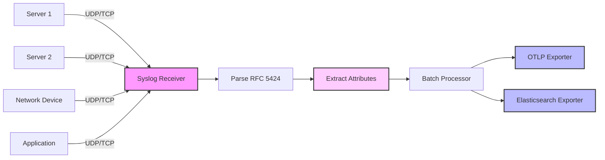

# How to Configure the Syslog Receiver in the OpenTelemetry Collector

Author: [nawazdhandala](https://www.github.com/nawazdhandala)

Tags: OpenTelemetry, Collector, Syslog, Logs, System Monitoring, Observability

Description: Learn how to configure the Syslog receiver in OpenTelemetry Collector for collecting system and application logs. Includes RFC 3164 and RFC 5424 protocol support with practical examples.

Syslog is a standard protocol for message logging that has been used in Unix-like systems for decades. The Syslog receiver in the OpenTelemetry Collector enables you to collect logs from systems, applications, and network devices that use the Syslog protocol. This guide covers configuration, protocol support, and best practices for production deployments.

## Understanding the Syslog Receiver

The Syslog receiver implements both RFC 3164 (BSD Syslog) and RFC 5424 (Syslog Protocol) standards. It can accept log messages over UDP or TCP, parse them according to the Syslog format, and convert them to OpenTelemetry's log data model.

Syslog messages contain several components:
- **Priority**: Facility and severity level
- **Timestamp**: When the message was generated
- **Hostname**: Source system identifier
- **Application**: Process or application name
- **Message**: The actual log content

The receiver extracts these components and maps them to OpenTelemetry log attributes, enabling unified log processing across diverse sources.

## Basic Configuration

Here's a minimal configuration to receive Syslog messages:

```yaml
receivers:
  syslog:
    # UDP endpoint for Syslog messages
    udp:
      listen_address: "0.0.0.0:514"

    # Syslog protocol (rfc3164 or rfc5424)
    protocol: rfc5424

processors:
  batch:
    timeout: 10s

exporters:
  logging:
    verbosity: detailed

service:
  pipelines:
    logs:
      receivers: [syslog]
      processors: [batch]
      exporters: [logging]
```

This configuration sets up the Syslog receiver on the standard port 514, using RFC 5424 protocol over UDP. Note that port 514 requires root privileges on Unix-like systems. For non-privileged operation, use a higher port number like 5140.

## Protocol Support

### RFC 3164 (BSD Syslog)

RFC 3164 is the older, simpler Syslog format:

```
<34>Oct 11 22:14:15 server1 sshd[1234]: Failed password for user from 192.168.1.1
```

Configuration for RFC 3164:

```yaml
receivers:
  syslog:
    udp:
      listen_address: "0.0.0.0:5140"

    # BSD Syslog format
    protocol: rfc3164

    # Location for timestamp parsing
    location: America/New_York

    # Enable octet counting
    enable_octet_counting: false
```

### RFC 5424 (Syslog Protocol)

RFC 5424 is the modern Syslog format with structured data:

```
<165>1 2024-02-06T10:30:00.123Z server1 app1 1234 ID47 [exampleSDID@32473 iut="3" eventSource="Application" eventID="1011"] Application started
```

Configuration for RFC 5424:

```yaml
receivers:
  syslog:
    udp:
      listen_address: "0.0.0.0:5140"

    # Modern Syslog format
    protocol: rfc5424

    # Location for timestamp parsing (optional for RFC 5424)
    location: UTC
```

## Transport Configuration

### UDP Transport

UDP is the traditional transport for Syslog, providing low overhead:

```yaml
receivers:
  syslog:
    # UDP configuration
    udp:
      # Listen address and port
      listen_address: "0.0.0.0:5140"

      # Maximum message size
      max_message_size: 8192

      # Number of worker goroutines
      workers: 1

    protocol: rfc5424
```

UDP advantages:
- Low overhead
- Fire-and-forget semantics
- Standard Syslog transport

UDP disadvantages:
- No delivery guarantee
- Messages can be lost
- No backpressure mechanism

### TCP Transport

TCP provides reliable delivery with connection-oriented communication:

```yaml
receivers:
  syslog:
    # TCP configuration
    tcp:
      # Listen address and port
      listen_address: "0.0.0.0:5140"

      # Maximum message size
      max_message_size: 8192

      # Maximum number of concurrent connections
      max_connections: 100

    protocol: rfc5424

    # Enable octet counting for TCP
    enable_octet_counting: true
```

TCP advantages:
- Guaranteed delivery
- Connection tracking
- Backpressure support

TCP disadvantages:
- Higher overhead
- Requires connection management
- More resource intensive

### Dual Transport Configuration

Run both UDP and TCP simultaneously:

```yaml
receivers:
  syslog/udp:
    udp:
      listen_address: "0.0.0.0:5140"
    protocol: rfc5424

  syslog/tcp:
    tcp:
      listen_address: "0.0.0.0:5140"
      max_connections: 100
    protocol: rfc5424
    enable_octet_counting: true

service:
  pipelines:
    logs:
      receivers: [syslog/udp, syslog/tcp]
      processors: [batch]
      exporters: [logging]
```

## Parsing and Attribute Extraction

The Syslog receiver automatically extracts standard fields and converts them to OpenTelemetry attributes:

```yaml
receivers:
  syslog:
    tcp:
      listen_address: "0.0.0.0:5140"

    protocol: rfc5424

    # Add operators for additional parsing
    operators:
      # Extract JSON from message body
      - type: json_parser
        parse_from: body
        parse_to: attributes

      # Parse severity from priority
      - type: severity_parser
        parse_from: attributes.priority

      # Add resource attributes
      - type: add
        field: resource["service.name"]
        value: EXPR(attributes.appname)
```

## Data Flow Architecture



## Advanced Configuration Options

### TLS Configuration

Secure Syslog transmission with TLS (RFC 5425):

```yaml
receivers:
  syslog:
    tcp:
      listen_address: "0.0.0.0:6514"

      # TLS configuration
      tls:
        # Server certificate
        cert_file: /etc/otel/certs/server.crt
        key_file: /etc/otel/certs/server.key

        # Client certificate verification
        client_ca_file: /etc/otel/certs/ca.crt

        # Minimum TLS version
        min_version: "1.2"

        # Maximum TLS version
        max_version: "1.3"

    protocol: rfc5424
    enable_octet_counting: true
```

### Structured Data Parsing

Extract structured data from RFC 5424 messages:

```yaml
receivers:
  syslog:
    tcp:
      listen_address: "0.0.0.0:5140"

    protocol: rfc5424

    # Operators for parsing structured data
    operators:
      # Extract structured data elements
      - type: regex_parser
        regex: '\[(?P<sd_id>[^ ]+) (?P<sd_params>.*?)\]'
        parse_from: body

      # Parse key-value pairs
      - type: key_value_parser
        parse_from: attributes.sd_params
        delimiter: " "
```

### Timestamp Location Configuration

Configure timezone for timestamp parsing:

```yaml
receivers:
  syslog:
    udp:
      listen_address: "0.0.0.0:5140"

    protocol: rfc3164

    # Timezone for RFC 3164 timestamps (no timezone info)
    location: America/Los_Angeles

    # Preserve raw timestamp
    preserve_timestamp: true
```

## Complete Production Configuration

Here's a comprehensive production-ready configuration:

```yaml
receivers:
  # UDP receiver for standard Syslog
  syslog/udp:
    udp:
      listen_address: "0.0.0.0:5140"
      max_message_size: 16384
      workers: 4

    protocol: rfc5424
    location: UTC

  # TCP receiver for reliable delivery
  syslog/tcp:
    tcp:
      listen_address: "0.0.0.0:5140"
      max_message_size: 16384
      max_connections: 200

      # TLS for secure transmission
      tls:
        cert_file: /etc/otel/certs/server.crt
        key_file: /etc/otel/certs/server.key
        client_ca_file: /etc/otel/certs/ca.crt
        min_version: "1.2"

    protocol: rfc5424
    enable_octet_counting: true

    # Advanced parsing
    operators:
      # Extract JSON from message
      - type: json_parser
        parse_from: body
        parse_to: attributes
        if: 'body matches "^\\{"'

      # Extract severity
      - type: severity_parser
        parse_from: attributes.priority
        preset: syslog

      # Add resource attributes
      - type: add
        field: resource["host.name"]
        value: EXPR(attributes.hostname)

      - type: add
        field: resource["service.name"]
        value: EXPR(attributes.appname)

processors:
  # Protect against memory overload
  memory_limiter:
    check_interval: 1s
    limit_mib: 2000
    spike_limit_mib: 400

  # Batch logs for efficiency
  batch:
    timeout: 10s
    send_batch_size: 1000
    send_batch_max_size: 2000

  # Add resource attributes
  resource:
    attributes:
      - key: collector.name
        value: syslog-collector-01
        action: insert
      - key: deployment.environment
        value: production
        action: insert

  # Transform attributes
  attributes/logs:
    actions:
      # Rename attributes
      - key: syslog.facility
        from_attribute: facility
        action: upsert

      - key: syslog.severity
        from_attribute: severity
        action: upsert

      # Add source identifier
      - key: log.source
        value: syslog
        action: insert

exporters:
  # Export to OTLP backend
  otlp:
    endpoint: backend.example.com:4317
    tls:
      insecure: false
      cert_file: /etc/otel/certs/client.crt
      key_file: /etc/otel/certs/client.key
    compression: gzip
    timeout: 10s

  # Export to Elasticsearch
  elasticsearch:
    endpoints:
      - https://elasticsearch.example.com:9200
    index: logs-syslog
    auth:
      authenticator: basicauth

extensions:
  # Basic authentication for Elasticsearch
  basicauth/elasticsearch:
    client_auth:
      username: elastic
      password: ${ELASTICSEARCH_PASSWORD}

service:
  extensions: [basicauth/elasticsearch]

  pipelines:
    logs:
      receivers: [syslog/udp, syslog/tcp]
      processors:
        - memory_limiter
        - batch
        - resource
        - attributes/logs
      exporters: [otlp, elasticsearch]

  telemetry:
    logs:
      level: info
      encoding: json
    metrics:
      address: 0.0.0.0:8888
```

## Configuring Syslog Clients

### Linux rsyslog

Configure rsyslog to forward logs to the collector:

```bash
# /etc/rsyslog.d/50-otel-collector.conf

# Forward all logs via TCP with TLS
$DefaultNetstreamDriver gtls
$ActionSendStreamDriverMode 1
$ActionSendStreamDriverAuthMode x509/name
$ActionSendStreamDriverPermittedPeer otel-collector.example.com

*.* @@otel-collector.example.com:6514

# Or forward via UDP (no TLS)
# *.* @otel-collector.example.com:5140

# Forward only specific facilities
# kern.* @otel-collector.example.com:5140
# auth,authpriv.* @otel-collector.example.com:5140
```

Restart rsyslog:

```bash
sudo systemctl restart rsyslog
```

### Linux syslog-ng

Configure syslog-ng:

```bash
# /etc/syslog-ng/conf.d/otel-collector.conf

destination d_otel_tcp {
    network(
        "otel-collector.example.com"
        port(5140)
        transport("tcp")
        flags(syslog-protocol)
    );
};

# Forward all logs
log {
    source(s_src);
    destination(d_otel_tcp);
};

# Or with TLS
destination d_otel_tls {
    network(
        "otel-collector.example.com"
        port(6514)
        transport("tls")
        tls(
            ca-file("/etc/ssl/certs/ca.crt")
            cert-file("/etc/ssl/certs/client.crt")
            key-file("/etc/ssl/private/client.key")
        )
        flags(syslog-protocol)
    );
};
```

### Application Logging (Python)

Send logs to Syslog from Python applications:

```python
import logging
import logging.handlers

# Create logger
logger = logging.getLogger('myapp')
logger.setLevel(logging.INFO)

# Create Syslog handler
syslog_handler = logging.handlers.SysLogHandler(
    address=('otel-collector.example.com', 5140),
    facility=logging.handlers.SysLogHandler.LOG_USER,
    socktype=socket.SOCK_STREAM  # Use TCP
)

# Set format
formatter = logging.Formatter(
    '%(name)s: %(levelname)s %(message)s'
)
syslog_handler.setFormatter(formatter)

# Add handler
logger.addHandler(syslog_handler)

# Use logger
logger.info('Application started')
logger.error('Error occurred', exc_info=True)
```

### Network Device Configuration

Configure network devices to send Syslog:

```bash
# Cisco IOS
logging host otel-collector.example.com transport udp port 5140
logging trap informational

# Cisco ASA
logging host inside otel-collector.example.com udp/5140
logging trap informational

# Juniper JunOS
set system syslog host otel-collector.example.com any info
set system syslog host otel-collector.example.com port 5140
```

## Filtering and Routing

Route logs based on facility or severity:

```yaml
processors:
  # Filter by severity
  filter/critical:
    logs:
      include:
        match_type: regexp
        record_attributes:
          - key: severity
            value: "(EMERG|ALERT|CRIT)"

  # Filter by facility
  filter/auth:
    logs:
      include:
        match_type: strict
        record_attributes:
          - key: facility
            value: "auth"

exporters:
  # Critical logs to PagerDuty
  otlphttp/pagerduty:
    endpoint: https://events.pagerduty.com/v2/enqueue

  # Auth logs to SIEM
  otlphttp/siem:
    endpoint: https://siem.example.com/api/logs

  # All logs to storage
  otlp:
    endpoint: backend.example.com:4317

service:
  pipelines:
    # Critical alerts
    logs/critical:
      receivers: [syslog/tcp]
      processors: [filter/critical, batch]
      exporters: [otlphttp/pagerduty]

    # Authentication logs
    logs/auth:
      receivers: [syslog/tcp]
      processors: [filter/auth, batch]
      exporters: [otlphttp/siem]

    # All logs
    logs/all:
      receivers: [syslog/udp, syslog/tcp]
      processors: [batch]
      exporters: [otlp]
```

## Performance Optimization

### UDP Buffer Sizing

Increase buffer sizes for high log volumes:

```bash
# Increase UDP receive buffer
sudo sysctl -w net.core.rmem_max=26214400
sudo sysctl -w net.core.rmem_default=26214400
```

### Worker Configuration

Adjust workers for concurrent processing:

```yaml
receivers:
  syslog:
    udp:
      listen_address: "0.0.0.0:5140"
      workers: 8  # Increase for high volume
    protocol: rfc5424
```

### Connection Limits

For TCP, configure connection limits:

```yaml
receivers:
  syslog:
    tcp:
      listen_address: "0.0.0.0:5140"
      max_connections: 500  # Adjust based on sources
    protocol: rfc5424
```

## Monitoring and Troubleshooting

### Health Checks

Monitor receiver health:

```yaml
extensions:
  health_check:
    endpoint: 0.0.0.0:13133

service:
  extensions: [health_check]
```

Check status:

```bash
curl http://localhost:13133/health
```

### Metrics Monitoring

Track receiver metrics:

```yaml
service:
  telemetry:
    metrics:
      address: 0.0.0.0:8888
      level: detailed
```

Key metrics:
- `otelcol_receiver_accepted_log_records`: Logs accepted
- `otelcol_receiver_refused_log_records`: Logs refused
- `syslog_parse_errors`: Parse errors

### Debug Logging

Enable debug logging:

```yaml
service:
  telemetry:
    logs:
      level: debug
      encoding: console
      output_paths:
        - stdout
        - /var/log/otel/collector.log
```

### Test Connectivity

Send test messages:

```bash
# UDP test
logger -n otel-collector.example.com -P 5140 -d "Test message"

# TCP test with netcat
echo "<165>1 2024-02-06T10:30:00Z host1 app1 - - - Test message" | nc otel-collector.example.com 5140
```

## Integration with OneUptime

Export Syslog messages to OneUptime:

```yaml
exporters:
  otlp:
    endpoint: otlp.oneuptime.com:4317
    headers:
      x-oneuptime-token: "your-token-here"

service:
  pipelines:
    logs:
      receivers: [syslog/udp, syslog/tcp]
      processors: [batch, resource]
      exporters: [otlp]
```

## Related Resources

Explore related OpenTelemetry Collector configurations:

- https://oneuptime.com/blog/post/tcp-log-receiver-opentelemetry-collector/view
- https://oneuptime.com/blog/post/statsd-receiver-opentelemetry-collector/view
- https://oneuptime.com/blog/post/kafka-receiver-opentelemetry-collector/view

## Conclusion

The Syslog receiver provides comprehensive support for collecting logs from systems, applications, and network devices using the standard Syslog protocol. Its support for both RFC 3164 and RFC 5424, along with UDP and TCP transports, makes it suitable for diverse logging scenarios.

Start with basic UDP configuration for simple deployments, then add TCP with TLS for production environments requiring reliable delivery and security. Use operators for advanced parsing and attribute extraction to enrich your logs with context.

With proper configuration, the Syslog receiver can handle high-volume log ingestion from multiple sources while maintaining compatibility with existing Syslog infrastructure and enabling migration to modern OpenTelemetry-based observability platforms.
