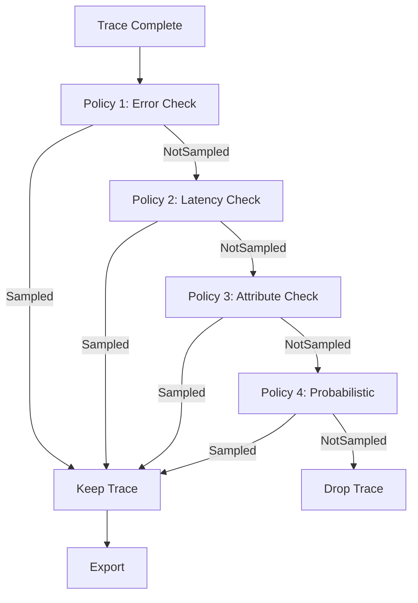

# How to Implement Tail-Based Sampling with Multiple Policies

Author: [nawazdhandala](https://www.github.com/nawazdhandala)

Tags: OpenTelemetry, Tail Sampling, Sampling Policies, Collector, Observability, Tracing, Cost Optimization, Distributed Tracing

Description: Learn how to configure and combine multiple tail-based sampling policies in the OpenTelemetry Collector for fine-grained trace retention control.

---

A single sampling policy rarely captures the full range of what you care about in production. You want to keep all errors, but you also want slow traces, traces from VIP customers, traces that hit specific services, and a random baseline of everything else. Tail-based sampling in the OpenTelemetry Collector supports multiple policies that work together to cover all of these scenarios.

This post covers how to design, configure, and operate a multi-policy tail sampling pipeline. You will learn how policies are evaluated, how to combine them effectively, and how to avoid common pitfalls that lead to missing data or excessive costs.

---

## How Policy Evaluation Works

The tail sampling processor in the OpenTelemetry Collector evaluates policies in order. Each policy independently examines the trace and returns one of three decisions: `Sampled`, `NotSampled`, or `InvertNotSampled`. The final decision follows an OR-like logic. If any policy says "keep this trace," the trace is kept.



This means you should put your most specific, highest-priority policies first and your catch-all probabilistic policy last. The order does not affect correctness since any match keeps the trace, but it makes the configuration easier to read and reason about.

---

## Building a Multi-Policy Configuration

Let's build a realistic configuration step by step. We will start with the most common policies and then add more specialized ones.

### Base Configuration

```yaml
# otel-collector-config.yaml
receivers:
  otlp:
    protocols:
      grpc:
        endpoint: 0.0.0.0:4317
      http:
        endpoint: 0.0.0.0:4318

processors:
  tail_sampling:
    decision_wait: 30s
    num_traces: 200000
    expected_new_traces_per_sec: 5000

    policies:
      # --- Priority 1: Always keep error traces ---
      # This catches any span with an ERROR status code.
      # In a typical system, errors represent less than 1% of traffic,
      # so this policy has minimal cost impact.
      - name: keep-all-errors
        type: status_code
        status_code:
          status_codes: [ERROR]

      # --- Priority 2: Keep high-latency traces ---
      # Traces where the total duration exceeds 3 seconds are
      # almost always worth investigating. The threshold should
      # be based on your SLO boundaries.
      - name: keep-slow-traces
        type: latency
        latency:
          threshold_ms: 3000

      # --- Priority 3: Baseline random sample ---
      # For all remaining healthy, fast traces, keep 5%.
      # This gives you a statistical baseline for understanding
      # normal system behavior.
      - name: baseline-probabilistic
        type: probabilistic
        probabilistic:
          sampling_percentage: 5

exporters:
  otlp:
    endpoint: "https://otel-backend.example.com:4317"

service:
  pipelines:
    traces:
      receivers: [otlp]
      processors: [tail_sampling]
      exporters: [otlp]
```

This gives you a solid foundation. Errors are always captured, latency outliers are always captured, and you get a 5% sample of normal traffic for baseline analytics.

---

## Adding Attribute-Based Policies

The real power of multi-policy sampling comes from attribute-based rules. You can sample based on any span attribute, which lets you implement business-aware sampling.

```yaml
    policies:
      # Keep all errors (same as before)
      - name: keep-all-errors
        type: status_code
        status_code:
          status_codes: [ERROR]

      # Keep all traces from the payment service.
      # Payment flows are business-critical and relatively
      # low volume, so keeping all of them is affordable.
      - name: keep-payment-traces
        type: string_attribute
        string_attribute:
          key: service.name
          values: [payment-service, billing-service]

      # Keep traces from enterprise customers.
      # This requires your application to set a user.tier
      # attribute on root spans.
      - name: keep-enterprise-customers
        type: string_attribute
        string_attribute:
          key: user.tier
          values: [enterprise, premium]

      # Keep traces for specific HTTP endpoints that are
      # under active development or investigation.
      - name: keep-monitored-endpoints
        type: string_attribute
        string_attribute:
          key: http.route
          values:
            - /api/v2/checkout
            - /api/v2/refund
            - /api/v1/webhooks/stripe

      # Keep high-latency traces
      - name: keep-slow-traces
        type: latency
        latency:
          threshold_ms: 3000

      # Baseline for everything else
      - name: baseline-probabilistic
        type: probabilistic
        probabilistic:
          sampling_percentage: 5
```

Notice how the policies layer together. A trace from the payment service that is also slow will match both `keep-payment-traces` and `keep-slow-traces`, but that is fine. The trace is kept once, not duplicated.

---

## Using Composite Policies for AND Logic

Individual policies use OR logic. If you need AND logic (for example, "keep traces that are from the payment service AND have an error"), use the `and` policy type.

```yaml
    policies:
      # Keep traces that are from the API gateway AND are slow.
      # This filters out slow traces from background workers
      # that you might not care about.
      - name: keep-slow-api-traces
        type: and
        and:
          and_sub_policy:
            # Sub-policy 1: Must be from the API gateway
            - name: is-api-gateway
              type: string_attribute
              string_attribute:
                key: service.name
                values: [api-gateway]

            # Sub-policy 2: Must be slow
            - name: is-slow
              type: latency
              latency:
                threshold_ms: 1000

      # Keep traces that are from a specific region AND have errors.
      # Useful when you are debugging region-specific issues.
      - name: keep-errors-us-east
        type: and
        and:
          and_sub_policy:
            - name: is-us-east
              type: string_attribute
              string_attribute:
                key: deployment.region
                values: [us-east-1]

            - name: has-error
              type: status_code
              status_code:
                status_codes: [ERROR]

      # Global error catch-all (keeps errors from all regions)
      - name: keep-all-errors
        type: status_code
        status_code:
          status_codes: [ERROR]

      # Baseline
      - name: baseline
        type: probabilistic
        probabilistic:
          sampling_percentage: 5
```

The `and` policy is powerful but keep it focused. Deeply nested AND conditions become hard to maintain and debug. If you find yourself nesting more than two or three levels, consider whether you can simplify your policy structure.

---

## Rate-Limited Policies

Sometimes you want to keep a category of traces but cap how many you keep per second. The `rate_limiting` policy type handles this.

```yaml
    policies:
      # Keep errors but cap at 100 traces per second.
      # This protects against error storms flooding your backend.
      - name: keep-errors-rate-limited
        type: and
        and:
          and_sub_policy:
            - name: has-error
              type: status_code
              status_code:
                status_codes: [ERROR]
            - name: rate-cap
              type: rate_limiting
              rate_limiting:
                spans_per_second: 100

      # Keep traces from the search service but cap at 50/sec.
      # Search is high-volume and you want visibility without
      # blowing your budget.
      - name: keep-search-limited
        type: and
        and:
          and_sub_policy:
            - name: is-search
              type: string_attribute
              string_attribute:
                key: service.name
                values: [search-service]
            - name: rate-cap-search
              type: rate_limiting
              rate_limiting:
                spans_per_second: 50

      # Baseline
      - name: baseline
        type: probabilistic
        probabilistic:
          sampling_percentage: 3
```

Rate limiting is especially useful during incident response. If a service starts throwing thousands of errors per second, the rate limit prevents your observability backend from being overwhelmed while still keeping a representative sample of the error traces.

---

## Debugging Policy Decisions

When your sampling configuration gets complex, you need to verify that policies are working as intended. The Collector exposes metrics that help with this.

```yaml
# Enable telemetry on the Collector itself
service:
  telemetry:
    metrics:
      address: 0.0.0.0:8888
    logs:
      level: info

  pipelines:
    traces:
      receivers: [otlp]
      processors: [tail_sampling]
      exporters: [otlp]
```

With telemetry enabled, the tail sampling processor emits metrics including:

- `otelcol_processor_tail_sampling_count_traces_sampled`: Count of traces sampled, labeled by policy name and decision
- `otelcol_processor_tail_sampling_count_traces_dropped`: Count of traces dropped
- `otelcol_processor_tail_sampling_new_trace_id_received`: Count of new trace IDs seen

You can scrape these with Prometheus or send them to your metrics backend to build dashboards that show which policies are firing and how much traffic each one retains.

```yaml
# Add a Prometheus exporter for Collector self-monitoring
exporters:
  otlp:
    endpoint: "https://otel-backend.example.com:4317"
  prometheus:
    endpoint: 0.0.0.0:9090

service:
  pipelines:
    traces:
      receivers: [otlp]
      processors: [tail_sampling]
      exporters: [otlp]
    metrics:
      receivers: [prometheus/self]
      exporters: [prometheus]
```

---

## A Complete Production Configuration

Here is a full configuration that brings together everything covered above. This is representative of what a mid-size engineering team might run in production.

```yaml
receivers:
  otlp:
    protocols:
      grpc:
        endpoint: 0.0.0.0:4317

processors:
  # Memory limiter prevents the Collector from running out of memory
  # during traffic spikes. Place it before tail_sampling.
  memory_limiter:
    check_interval: 5s
    limit_mib: 4096
    spike_limit_mib: 512

  tail_sampling:
    decision_wait: 30s
    num_traces: 300000
    expected_new_traces_per_sec: 8000

    policies:
      # 1. All errors, rate-limited to prevent storms
      - name: errors-capped
        type: and
        and:
          and_sub_policy:
            - name: has-error
              type: status_code
              status_code:
                status_codes: [ERROR]
            - name: rate-limit
              type: rate_limiting
              rate_limiting:
                spans_per_second: 200

      # 2. Critical service traces (always keep)
      - name: critical-services
        type: string_attribute
        string_attribute:
          key: service.name
          values:
            - payment-service
            - auth-service
            - order-service

      # 3. High-latency traces
      - name: slow-traces
        type: latency
        latency:
          threshold_ms: 2000

      # 4. Enterprise customer traces
      - name: enterprise-customers
        type: string_attribute
        string_attribute:
          key: user.tier
          values: [enterprise]

      # 5. Baseline sample
      - name: baseline
        type: probabilistic
        probabilistic:
          sampling_percentage: 3

  batch:
    send_batch_size: 8192
    timeout: 5s

exporters:
  otlp:
    endpoint: "https://otel-backend.example.com:4317"

service:
  pipelines:
    traces:
      receivers: [otlp]
      processors: [memory_limiter, tail_sampling, batch]
      exporters: [otlp]
```

Notice the `memory_limiter` processor before `tail_sampling`. This is important. If traffic spikes beyond what the Collector can handle, the memory limiter will start dropping data gracefully rather than letting the Collector crash with an out-of-memory error.

---

## Common Mistakes to Avoid

**Setting decision_wait too low.** If your p99 latency is 5 seconds and your decision_wait is 5 seconds, spans from the slowest traces will arrive after the decision is made. Set it to at least 2x your p99.

**Forgetting about trace ID routing.** Tail sampling requires all spans for a trace to arrive at the same Collector instance. Use the `loadbalancingexporter` to route by trace ID, or run a single Collector instance if your traffic allows it.

**Too many probabilistic policies.** If you have multiple probabilistic policies, each one independently samples, which makes the effective rate hard to predict. Use one probabilistic policy as a catch-all at the end.

**Not monitoring the Collector.** The Collector is now a stateful, memory-intensive component in your pipeline. Monitor its memory usage, span throughput, and policy hit rates. Set up alerts for when it approaches its memory limit.

---

## Conclusion

Multiple sampling policies let you capture exactly the traces you need without paying for everything. Start with the three essentials: errors, latency outliers, and a probabilistic baseline. Then layer on attribute-based policies for your specific business needs.

The key to success is iterating. Deploy your initial policies, monitor which ones fire, and adjust thresholds based on real traffic patterns. Sampling configuration is not a set-it-and-forget-it exercise. It evolves as your system and your understanding of it evolve.
