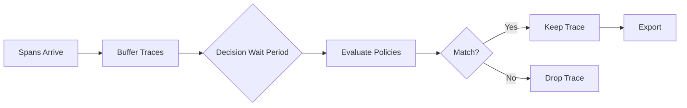

# How to Configure the Tail Sampling Processor in the OpenTelemetry Collector

Author: [nawazdhandala](https://www.github.com/nawazdhandala)

Tags: OpenTelemetry, Collector, Processors, Tail Sampling, Distributed Tracing, Observability

Description: Learn how to configure the tail sampling processor in OpenTelemetry Collector to make intelligent sampling decisions based on complete trace data, reducing costs while preserving critical traces.

The tail sampling processor is one of the most powerful features in the OpenTelemetry Collector. Unlike head-based sampling that makes decisions when a trace starts, tail sampling waits until a trace is complete before deciding whether to keep or drop it. This allows you to make intelligent sampling decisions based on trace characteristics like errors, latency, or custom attributes.

## Why Tail Sampling Matters

In production systems, capturing 100% of traces is often impractical due to storage costs and data volume. Head-based sampling drops traces randomly at the source, but this means you might lose traces for rare errors or high-latency requests. Tail sampling solves this by keeping important traces while dropping routine ones.

For more context on sampling strategies, see our guide on [reducing noise in OpenTelemetry](https://oneuptime.com/blog/post/2025-08-25-how-to-reduce-noise-in-opentelemetry/view).

## How Tail Sampling Works

The tail sampling processor batches incoming spans and waits for all spans in a trace to arrive. Once the decision wait period expires or all spans are received, it evaluates the trace against configured policies. If any policy matches, the entire trace is kept; otherwise, it's dropped.



## Basic Configuration

Here's a minimal tail sampling configuration that keeps error traces and samples 10% of successful traces:

```yaml
# Basic tail sampling configuration
# This waits for complete traces before making sampling decisions
receivers:
  otlp:
    protocols:
      grpc:
        endpoint: 0.0.0.0:4317

processors:
  # Tail sampling requires all spans from a trace to arrive
  # Configure sufficient wait time for distributed traces
  tail_sampling:
    # How long to wait for all spans in a trace to arrive
    # Increase this for traces spanning multiple services
    decision_wait: 10s

    # Number of traces to keep in memory while waiting
    # Set based on your throughput and decision_wait
    num_traces: 100000

    # Expected number of new traces per second
    # Used to optimize memory allocation
    expected_new_traces_per_sec: 1000

    # Policies define which traces to keep
    # Policies are evaluated in order; first match wins
    policies:
      # Policy 1: Always keep traces with errors
      # Critical for debugging production issues
      - name: error-traces
        type: status_code
        status_code:
          status_codes:
            - ERROR

      # Policy 2: Keep 10% of successful traces
      # Provides baseline visibility without overwhelming storage
      - name: sample-successful-traces
        type: probabilistic
        probabilistic:
          sampling_percentage: 10

exporters:
  otlp:
    endpoint: https://oneuptime.com/otlp
    headers:
      x-oneuptime-token: YOUR_ONEUPTIME_TOKEN

service:
  pipelines:
    traces:
      receivers: [otlp]
      processors: [tail_sampling]
      exporters: [otlp]
```

## Advanced Policy Types

### Latency-Based Sampling

Keep traces that exceed latency thresholds:

```yaml
processors:
  tail_sampling:
    decision_wait: 10s
    num_traces: 100000
    expected_new_traces_per_sec: 1000
    policies:
      # Keep all slow traces for performance analysis
      # Threshold in milliseconds
      - name: slow-traces
        type: latency
        latency:
          threshold_ms: 1000

      # Keep extremely fast traces too (might indicate errors)
      - name: very-fast-traces
        type: latency
        latency:
          threshold_ms: 10
          # Upper bound instead of lower bound
          upper_threshold_ms: true
```

### String Attribute Matching

Sample based on span attributes:

```yaml
processors:
  tail_sampling:
    decision_wait: 10s
    num_traces: 100000
    expected_new_traces_per_sec: 1000
    policies:
      # Keep all traces from premium customers
      - name: premium-customers
        type: string_attribute
        string_attribute:
          key: customer.tier
          values:
            - premium
            - enterprise

      # Keep traces for specific API endpoints
      - name: critical-endpoints
        type: string_attribute
        string_attribute:
          key: http.route
          values:
            - /api/v1/checkout
            - /api/v1/payment
            - /api/v1/order

          # Enable regex matching for flexible patterns
          enabled_regex_matching: true
          # Invert the match (keep everything except these)
          invert_match: false
```

### Numeric Attribute Policies

Filter traces based on numeric values:

```yaml
processors:
  tail_sampling:
    decision_wait: 10s
    num_traces: 100000
    expected_new_traces_per_sec: 1000
    policies:
      # Keep traces for large transactions
      - name: high-value-transactions
        type: numeric_attribute
        numeric_attribute:
          key: transaction.amount
          min_value: 10000

      # Keep traces with many database queries (potential N+1 issues)
      - name: many-db-queries
        type: numeric_attribute
        numeric_attribute:
          key: db.query.count
          min_value: 50
```

### Rate Limiting

Limit the number of traces per second:

```yaml
processors:
  tail_sampling:
    decision_wait: 10s
    num_traces: 100000
    expected_new_traces_per_sec: 1000
    policies:
      # Rate limit to control costs
      # Keeps first N traces per second that match other criteria
      - name: rate-limit-normal-traffic
        type: rate_limiting
        rate_limiting:
          # Maximum traces per second to keep
          spans_per_second: 100
```

### Span Count Policy

Sample based on the number of spans in a trace:

```yaml
processors:
  tail_sampling:
    decision_wait: 10s
    num_traces: 100000
    expected_new_traces_per_sec: 1000
    policies:
      # Keep complex traces (might indicate issues)
      - name: complex-traces
        type: span_count
        span_count:
          # Keep traces with at least 50 spans
          min_spans: 50

      # Keep traces with very few spans (might be errors)
      - name: incomplete-traces
        type: span_count
        span_count:
          # Keep traces with 3 or fewer spans
          max_spans: 3
```

### Composite Policies

Combine multiple conditions with AND logic:

```yaml
processors:
  tail_sampling:
    decision_wait: 10s
    num_traces: 100000
    expected_new_traces_per_sec: 1000
    policies:
      # Keep slow traces from production environment
      # All sub-policies must match (AND logic)
      - name: slow-production-traces
        type: and
        and:
          and_sub_policy:
            # Must be slow
            - name: is-slow
              type: latency
              latency:
                threshold_ms: 500

            # Must be from production
            - name: is-production
              type: string_attribute
              string_attribute:
                key: deployment.environment
                values:
                  - production

            # Must be an API call
            - name: is-api-call
              type: string_attribute
              string_attribute:
                key: span.kind
                values:
                  - server
```

### Always Sample Policy

Keep specific traces regardless of other criteria:

```yaml
processors:
  tail_sampling:
    decision_wait: 10s
    num_traces: 100000
    expected_new_traces_per_sec: 1000
    policies:
      # Always keep traces with specific header (debug traces)
      - name: debug-traces
        type: string_attribute
        string_attribute:
          key: http.header.x-debug
          values:
            - "true"

      # Fallback: sample remaining traces at low rate
      - name: baseline-sampling
        type: always_sample
```

## Production Configuration

Here's a comprehensive production setup combining multiple policies:

```yaml
receivers:
  otlp:
    protocols:
      grpc:
        endpoint: 0.0.0.0:4317
      http:
        endpoint: 0.0.0.0:4318

processors:
  # Add batch processor before tail sampling
  # Reduces memory usage and improves throughput
  batch:
    timeout: 1s
    send_batch_size: 1024
    send_batch_max_size: 2048

  tail_sampling:
    # Wait longer in production for distributed traces
    decision_wait: 30s

    # Size based on: expected_new_traces_per_sec * decision_wait * 1.2 (buffer)
    num_traces: 360000

    # Monitor your trace arrival rate
    expected_new_traces_per_sec: 10000

    policies:
      # Priority 1: Always keep errors
      - name: errors
        type: status_code
        status_code:
          status_codes:
            - ERROR

      # Priority 2: Keep slow requests
      - name: slow-requests
        type: latency
        latency:
          threshold_ms: 2000

      # Priority 3: Keep high-value transactions
      - name: high-value
        type: numeric_attribute
        numeric_attribute:
          key: transaction.amount
          min_value: 1000

      # Priority 4: Keep traces from critical endpoints
      - name: critical-apis
        type: string_attribute
        string_attribute:
          key: http.route
          values:
            - /api/v1/checkout
            - /api/v1/payment
            - /api/v1/auth
          enabled_regex_matching: true

      # Priority 5: Sample premium customer traces more heavily
      - name: premium-customers
        type: and
        and:
          and_sub_policy:
            - name: is-premium
              type: string_attribute
              string_attribute:
                key: customer.tier
                values:
                  - premium
                  - enterprise
            - name: sample-rate
              type: probabilistic
              probabilistic:
                sampling_percentage: 50

      # Priority 6: Rate limit normal traffic
      - name: normal-traffic-rate-limit
        type: rate_limiting
        rate_limiting:
          spans_per_second: 500

      # Priority 7: Sample remaining traffic at low rate
      - name: baseline
        type: probabilistic
        probabilistic:
          sampling_percentage: 1

exporters:
  otlp:
    endpoint: https://oneuptime.com/otlp
    headers:
      x-oneuptime-token: YOUR_ONEUPTIME_TOKEN

    # Timeout for export operations
    timeout: 30s

    # Retry configuration
    retry_on_failure:
      enabled: true
      initial_interval: 5s
      max_interval: 30s
      max_elapsed_time: 300s

service:
  pipelines:
    traces:
      receivers: [otlp]
      processors: [batch, tail_sampling]
      exporters: [otlp]

  # Monitor tail sampling performance
  telemetry:
    metrics:
      readers:
        - periodic:
            exporter:
              otlp:
                protocol: http/protobuf
                endpoint: https://oneuptime.com/otlp
                headers:
                  x-oneuptime-token: YOUR_ONEUPTIME_TOKEN
```

## Important Considerations

### Memory Requirements

Tail sampling keeps traces in memory during the decision wait period. Calculate memory needs:

```
Memory ≈ avg_trace_size * num_traces
       ≈ avg_trace_size * expected_new_traces_per_sec * decision_wait
```

If you have 1000 traces/sec, 30s decision wait, and 10KB average trace size:
```
Memory ≈ 10KB * 1000 * 30 = 300MB
```

Add 20-30% buffer for safety.

### Decision Wait Period

Set `decision_wait` based on your trace duration:
- **Monolithic apps**: 5-10 seconds
- **Microservices (< 5 hops)**: 10-20 seconds
- **Complex distributed systems**: 20-30 seconds
- **Across regions/availability zones**: 30-60 seconds

### Load Balancing Considerations

Tail sampling requires all spans from a trace to reach the same collector instance. Configure your load balancer to route by trace ID:

```yaml
# Example using load balancing exporter
exporters:
  loadbalancing:
    protocol:
      otlp:
        endpoint: collector-backend:4317
    resolver:
      dns:
        hostname: collector-backend
        port: 4317
    routing_key: "traceID"
```

### Policy Ordering

Policies are evaluated in order. Place more specific policies first:
1. Always keep (errors, debug traces)
2. Business-critical traces
3. Performance-based (latency)
4. Rate limiting
5. Probabilistic baseline

## Monitoring Tail Sampling

Track these metrics to ensure healthy operation:

- `otelcol_processor_tail_sampling_policy_decision` - Decisions per policy
- `otelcol_processor_tail_sampling_trace_data_age` - How old traces are when evaluated
- `otelcol_processor_tail_sampling_new_trace_id_received` - New traces arriving
- `otelcol_processor_tail_sampling_sampling_decision_latency` - Decision processing time

## Troubleshooting

### Traces Getting Dropped

**Issue**: Important traces are being dropped.

**Solutions**:
- Increase `decision_wait` if spans arrive after decisions are made
- Increase `num_traces` if buffer is full
- Add more specific policies for important traces
- Check if load balancer is routing traces to multiple collectors

### High Memory Usage

**Issue**: Collector consuming too much memory.

**Solutions**:
- Decrease `num_traces` or `decision_wait`
- Add more aggressive rate limiting policies
- Use probabilistic sampling before tail sampling
- Scale horizontally with more collector instances

### Incomplete Traces

**Issue**: Traces missing spans at evaluation time.

**Solutions**:
- Increase `decision_wait` to allow slower spans to arrive
- Check network latency between services and collector
- Verify load balancer routes by trace ID
- Check for clock skew between services

## Summary

| Policy Type | Use Case | Key Parameter |
|-------------|----------|---------------|
| **status_code** | Keep error traces | status_codes |
| **latency** | Keep slow requests | threshold_ms |
| **string_attribute** | Match span attributes | key, values |
| **numeric_attribute** | Numeric filtering | key, min_value, max_value |
| **probabilistic** | Random sampling | sampling_percentage |
| **rate_limiting** | Control throughput | spans_per_second |
| **span_count** | Complex traces | min_spans, max_spans |
| **and** | Combine conditions | and_sub_policy |

Tail sampling gives you intelligent control over which traces to keep, ensuring you capture critical data while managing storage costs. By configuring policies based on errors, latency, business metrics, and other attributes, you can maintain visibility into production issues without overwhelming your observability backend.

For more on trace management, see our guides on [traces and spans](https://oneuptime.com/blog/post/2025-08-27-traces-and-spans-in-opentelemetry/view) and [how to name spans](https://oneuptime.com/blog/post/2024-11-04-how-to-name-spans-in-opentelemetry/view).
