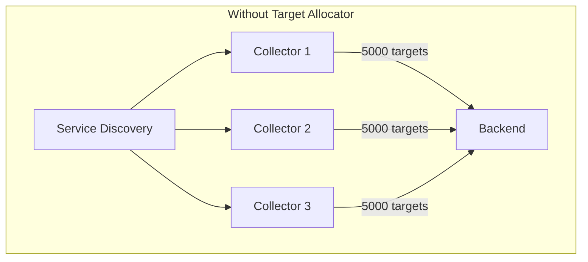
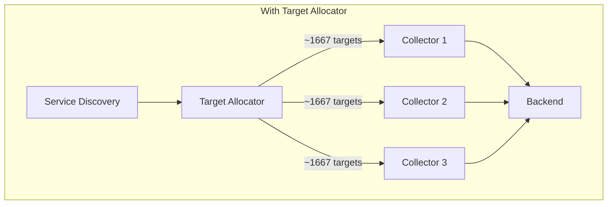
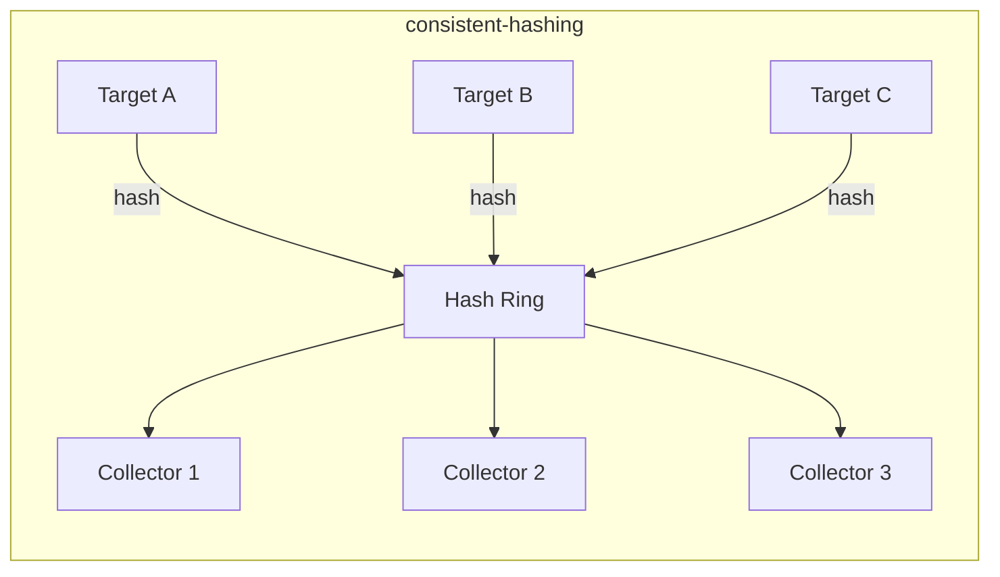

# How to Use the Target Allocator for Prometheus Scraping at Scale

Author: [nawazdhandala](https://www.github.com/nawazdhandala)

Tags: OpenTelemetry, Prometheus, Target Allocator, Kubernetes, Metrics, Scaling

Description: A practical guide to using the OpenTelemetry Target Allocator to distribute Prometheus scrape targets evenly across multiple collector replicas for large-scale metrics collection.

---

When you run a single Prometheus instance, target discovery is straightforward. Prometheus finds targets, scrapes them, and stores the metrics. But what happens when you have thousands of targets and need multiple collector replicas to handle the load? Each replica discovers the same targets and scrapes all of them, leading to duplicate metrics and wasted resources.

The OpenTelemetry Target Allocator solves this problem. It sits between your service discovery mechanism and your collector fleet, distributing scrape targets evenly across replicas so that each target gets scraped exactly once. This post shows you how to set it up and tune it for production scale.

## The Problem with Naive Scaling

Imagine you have 5,000 Prometheus scrape targets across your Kubernetes cluster. A single OpenTelemetry Collector with the Prometheus receiver can handle maybe 2,000 before it starts falling behind. The obvious answer is to run more replicas.

But if you simply scale the collector to 3 replicas, each one independently discovers all 5,000 targets and scrapes them all. You end up with triple the metrics, triple the network traffic, and triple the storage cost. That is the opposite of what you want.



What you actually need is a coordinator that divides the 5,000 targets among the 3 replicas, so each one scrapes roughly 1,667 targets.



## What the Target Allocator Does

The Target Allocator is a component that ships with the OpenTelemetry Operator for Kubernetes. It performs two main functions:

1. **Target discovery** - It runs Prometheus service discovery (the same mechanisms Prometheus uses) to find scrape targets.
2. **Target distribution** - It assigns each discovered target to exactly one collector replica using a configurable allocation strategy.

Collectors poll the Target Allocator's HTTP API to get their assigned targets instead of doing their own discovery. This keeps the scraping load balanced and prevents duplicates.

## Prerequisites

You need the OpenTelemetry Operator installed in your cluster. If you have not done that yet, install it via Helm.

```bash
# Add the OpenTelemetry Helm repository
helm repo add open-telemetry https://open-telemetry.github.io/opentelemetry-helm-charts
helm repo update

# Install the OpenTelemetry Operator with the Target Allocator enabled
helm install opentelemetry-operator open-telemetry/opentelemetry-operator \
  --namespace opentelemetry-operator-system \
  --create-namespace \
  --set "manager.collectorImage.repository=otel/opentelemetry-collector-contrib" \
  --set admissionWebhooks.certManager.enabled=false \
  --set admissionWebhooks.autoGenerateCert.enabled=true
```

You also need the OpenTelemetry Collector Contrib image, since the Target Allocator integration requires the contrib Prometheus receiver.

## Deploying the Collector with Target Allocator

The Target Allocator is configured as part of the `OpenTelemetryCollector` custom resource. You specify it in the `targetAllocator` section. Here is a complete example.

```yaml
# otel-collector-with-ta.yaml
# Deploys a collector fleet with a Target Allocator for distributed Prometheus scraping
apiVersion: opentelemetry.io/v1beta1
kind: OpenTelemetryCollector
metadata:
  name: prometheus-fleet
  namespace: monitoring
spec:
  mode: statefulset
  # Run 3 replicas of the collector
  replicas: 3
  targetAllocator:
    enabled: true
    # Use the consistent-hashing strategy for stable target assignment
    allocationStrategy: consistent-hashing
    # How often the allocator re-evaluates target assignments
    filterStrategy: relabel-config
    # The allocator runs as its own pod
    replicas: 1
    image: ghcr.io/open-telemetry/opentelemetry-operator/target-allocator:latest
    # Prometheus CR integration - discovers targets from ServiceMonitors and PodMonitors
    prometheusCR:
      enabled: true
      serviceMonitorSelector: {}
      podMonitorSelector: {}
  config:
    receivers:
      prometheus:
        config:
          scrape_configs:
            # This placeholder config is required but the Target Allocator
            # will override it with dynamically discovered targets
            - job_name: 'otel-collector'
              scrape_interval: 30s
              static_configs:
                - targets: ['localhost:8888']
        # This tells the Prometheus receiver to get targets from the allocator
        target_allocator:
          endpoint: http://prometheus-fleet-targetallocator
          interval: 30s
          collector_id: ${POD_NAME}
    processors:
      batch:
        send_batch_size: 1024
        timeout: 10s
      memory_limiter:
        # Prevent OOM by limiting memory usage
        check_interval: 5s
        limit_mib: 1500
        spike_limit_mib: 512
    exporters:
      otlp:
        endpoint: "https://your-backend.example.com:4317"
    service:
      pipelines:
        metrics:
          receivers: [prometheus]
          processors: [memory_limiter, batch]
          exporters: [otlp]
```

Apply it to your cluster.

```bash
# Deploy the collector fleet with the target allocator
kubectl apply -f otel-collector-with-ta.yaml
```

The operator will create two things: a StatefulSet for the collector replicas and a separate Deployment for the Target Allocator pod.

## Understanding Allocation Strategies

The Target Allocator supports two main strategies for distributing targets across collectors.

**least-weighted** is the default. It assigns each new target to the collector that currently has the fewest targets. This works well for most cases, but when a collector pod restarts or the fleet scales, many targets get reassigned. That can cause brief gaps in scraping.

**consistent-hashing** uses a hash ring to assign targets. When a collector is added or removed, only the targets that hash to that specific collector get reassigned. The rest stay put. This is the better choice for production environments where you want minimal disruption during scaling events.



In most cases, you should use `consistent-hashing`. Set it in the `allocationStrategy` field as shown in the configuration above.

## Using ServiceMonitors and PodMonitors

If you are coming from a Prometheus Operator setup, you probably already have ServiceMonitor and PodMonitor resources defining your scrape targets. The Target Allocator can discover these automatically when `prometheusCR.enabled` is set to `true`.

Here is a ServiceMonitor that the Target Allocator will pick up.

```yaml
# servicemonitor-example.yaml
# Defines a scrape target for all pods with the app=api-server label
apiVersion: monitoring.coreos.com/v1
kind: ServiceMonitor
metadata:
  name: api-server-metrics
  namespace: default
  labels:
    team: backend
spec:
  selector:
    matchLabels:
      app: api-server
  endpoints:
    - port: metrics
      interval: 15s
      path: /metrics
```

The Target Allocator discovers this ServiceMonitor, resolves the matching pods, and distributes those scrape targets across your collector fleet. You do not need to duplicate the configuration in the collector's `scrape_configs`.

You can filter which ServiceMonitors and PodMonitors the allocator picks up using label selectors.

```yaml
# Only discover ServiceMonitors with the team=backend label
prometheusCR:
  enabled: true
  serviceMonitorSelector:
    matchLabels:
      team: backend
  podMonitorSelector:
    matchLabels:
      team: backend
```

## RBAC Configuration

The Target Allocator needs permissions to discover targets across the cluster. Create a ClusterRole and bind it to the allocator's service account.

```yaml
# target-allocator-rbac.yaml
# Grants the Target Allocator permission to discover scrape targets
apiVersion: rbac.authorization.k8s.io/v1
kind: ClusterRole
metadata:
  name: target-allocator
rules:
  - apiGroups: [""]
    resources: ["pods", "nodes", "services", "endpoints", "namespaces"]
    verbs: ["get", "list", "watch"]
  - apiGroups: ["monitoring.coreos.com"]
    resources: ["servicemonitors", "podmonitors"]
    verbs: ["get", "list", "watch"]
  - apiGroups: ["discovery.k8s.io"]
    resources: ["endpointslices"]
    verbs: ["get", "list", "watch"]
---
apiVersion: rbac.authorization.k8s.io/v1
kind: ClusterRoleBinding
metadata:
  name: target-allocator
roleRef:
  apiGroup: rbac.authorization.k8s.io
  kind: ClusterRole
  name: target-allocator
subjects:
  - kind: ServiceAccount
    name: prometheus-fleet-targetallocator
    namespace: monitoring
```

## Verifying the Setup

Once everything is deployed, verify that the Target Allocator is distributing targets correctly. You can query its HTTP API directly.

```bash
# Port-forward to the Target Allocator pod
kubectl port-forward svc/prometheus-fleet-targetallocator -n monitoring 8080:80 &

# List all discovered targets and their assigned collectors
curl -s http://localhost:8080/jobs | jq .

# Check the targets assigned to a specific collector
curl -s http://localhost:8080/jobs/otel-collector/targets | jq .
```

You should see targets distributed roughly evenly. If one collector has significantly more targets, check that the allocation strategy is set to `consistent-hashing` and that all collector pods are healthy.

## Scaling Tips for Production

At scale, keep these points in mind:

- **Set memory limits on collectors** - Each collector scrapes a subset of targets, but the metrics still take memory. Use the `memory_limiter` processor as shown above.
- **Increase the scrape interval if needed** - Going from 15s to 30s halves the scrape load. Many metrics do not need sub-minute resolution.
- **Monitor the Target Allocator itself** - It exposes its own metrics on port 8080. Scrape those to track allocation health.
- **Use the `filterStrategy: relabel-config`** option so that relabeling rules in your scrape configs are applied before targets are allocated. This prevents the allocator from assigning targets that will be dropped by relabeling.

Running thousands of scrape targets across a fleet of OpenTelemetry Collectors does not have to be complicated. The Target Allocator handles the coordination so you can focus on the metrics themselves. Start with 2-3 replicas, monitor the distribution, and scale from there as your target count grows.
