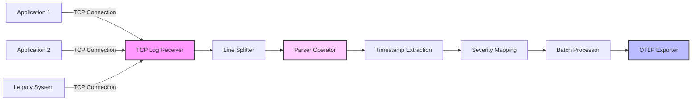

# How to Configure the TCP Log Receiver in the OpenTelemetry Collector

Author: [nawazdhandala](https://www.github.com/nawazdhandala)

Tags: OpenTelemetry, Collector, TCP, Logs, Network Logging, Observability

Description: Complete guide to configuring the TCP Log receiver in OpenTelemetry Collector. Learn about connection handling, parsing strategies, and production deployment patterns.

The TCP Log receiver in the OpenTelemetry Collector enables ingestion of log data over TCP connections. Unlike the Syslog receiver which implements specific protocols, the TCP Log receiver provides flexible log ingestion from any source that can send data over TCP. This makes it ideal for custom logging solutions, legacy applications, and scenarios requiring reliable log delivery.

## Understanding the TCP Log Receiver

The TCP Log receiver operates as a TCP server that accepts connections from clients and reads log data. It provides flexible parsing capabilities through operators, allowing you to handle various log formats including plain text, JSON, multiline logs, and custom formats.

TCP provides several advantages for log collection:
- **Reliable delivery**: Connection-oriented protocol ensures logs arrive
- **Backpressure**: Flow control prevents overwhelming the collector
- **Connection tracking**: Monitor and manage client connections
- **TLS support**: Encrypt logs in transit

The receiver buffers incoming data, applies parsing rules, converts logs to OpenTelemetry's format, and forwards them through the processing pipeline.

## Basic Configuration

Here's a minimal configuration to receive logs over TCP:

```yaml
receivers:
  tcplog:
    # TCP endpoint
    listen_address: "0.0.0.0:54525"

    # Add newline splitter operator
    operators:
      - type: regex_parser
        regex: '^(?P<message>.*)$'

processors:
  batch:
    timeout: 10s

exporters:
  logging:
    verbosity: detailed

service:
  pipelines:
    logs:
      receivers: [tcplog]
      processors: [batch]
      exporters: [logging]
```

This configuration sets up a TCP server on port 54525 that accepts log messages and forwards them through the pipeline.

## Connection Configuration

### Basic TCP Settings

Configure connection handling parameters:

```yaml
receivers:
  tcplog:
    # Listen address and port
    listen_address: "0.0.0.0:54525"

    # Maximum concurrent connections
    max_connections: 100

    # Connection read timeout
    read_timeout: 30s

    # TCP keep-alive settings
    tcp_keep_alive: true
    tcp_keep_alive_period: 30s

    operators:
      - type: regex_parser
        regex: '^(?P<message>.*)$'
```

### TLS Configuration

Secure log transmission with TLS encryption:

```yaml
receivers:
  tcplog:
    listen_address: "0.0.0.0:54525"

    # TLS configuration
    tls:
      # Server certificate and key
      cert_file: /etc/otel/certs/server.crt
      key_file: /etc/otel/certs/server.key

      # Client certificate verification (mutual TLS)
      client_ca_file: /etc/otel/certs/ca.crt

      # Minimum TLS version
      min_version: "1.2"

      # Maximum TLS version
      max_version: "1.3"

      # Cipher suites (optional)
      cipher_suites:
        - TLS_ECDHE_RSA_WITH_AES_128_GCM_SHA256
        - TLS_ECDHE_RSA_WITH_AES_256_GCM_SHA384

    operators:
      - type: regex_parser
        regex: '^(?P<message>.*)$'
```

## Parsing Strategies

### Plain Text Logs

Parse simple line-based text logs:

```yaml
receivers:
  tcplog:
    listen_address: "0.0.0.0:54525"

    operators:
      # Split on newlines
      - type: regex_parser
        regex: '^(?P<message>.*)$'
        parse_from: body
        parse_to: attributes.message

      # Add timestamp
      - type: add
        field: timestamp
        value: EXPR(now())
```

Example log:
```
Application started successfully
User logged in: john.doe
Database connection established
```

### JSON Logs

Parse JSON-formatted log messages:

```yaml
receivers:
  tcplog:
    listen_address: "0.0.0.0:54525"

    operators:
      # Parse JSON
      - type: json_parser
        parse_from: body
        parse_to: attributes

      # Extract timestamp
      - type: time_parser
        parse_from: attributes.timestamp
        layout: '%Y-%m-%dT%H:%M:%S.%f%z'

      # Extract severity
      - type: severity_parser
        parse_from: attributes.level
        mapping:
          debug: debug
          info: info
          warning: warn
          error: error
          critical: fatal
```

Example JSON log:
```json
{"timestamp":"2024-02-06T10:30:00.123Z","level":"info","service":"api","message":"Request processed","duration_ms":125}
```

### Structured Logs with Key-Value Pairs

Parse logs with key-value pairs:

```yaml
receivers:
  tcplog:
    listen_address: "0.0.0.0:54525"

    operators:
      # Parse key-value pairs
      - type: regex_parser
        regex: '^time="(?P<time>[^"]+)" level=(?P<level>\w+) msg="(?P<message>[^"]+)"'
        timestamp:
          parse_from: attributes.time
          layout: '%Y-%m-%d %H:%M:%S'

      # Map severity
      - type: severity_parser
        parse_from: attributes.level
```

Example log:
```
time="2024-02-06 10:30:00" level=info msg="Request processed" service=api duration=125ms
```

### Multiline Logs

Handle multiline log entries like stack traces:

```yaml
receivers:
  tcplog:
    listen_address: "0.0.0.0:54525"

    operators:
      # Combine multiline logs
      - type: recombine
        combine_field: body
        is_first_entry: body matches "^\\d{4}-\\d{2}-\\d{2}"
        max_batch_size: 1000

      # Parse combined log
      - type: regex_parser
        regex: '^(?P<timestamp>\d{4}-\d{2}-\d{2} \d{2}:\d{2}:\d{2}) \[(?P<level>\w+)\] (?P<message>.*)'
        timestamp:
          parse_from: attributes.timestamp
          layout: '%Y-%m-%d %H:%M:%S'
```

Example multiline log:
```
2024-02-06 10:30:00 [ERROR] Exception occurred
java.lang.NullPointerException: null
    at com.example.Service.process(Service.java:42)
    at com.example.Controller.handle(Controller.java:15)
```

## Data Flow Architecture



## Advanced Configuration Options

### Encoding Configuration

Specify character encoding for incoming logs:

```yaml
receivers:
  tcplog:
    listen_address: "0.0.0.0:54525"

    # Character encoding
    encoding: utf-8

    operators:
      - type: json_parser
        parse_from: body
```

Supported encodings include: `utf-8`, `utf-16le`, `utf-16be`, `ascii`, `big5`, and others.

### Add Attributes

Enrich logs with additional attributes:

```yaml
receivers:
  tcplog:
    listen_address: "0.0.0.0:54525"

    # Add custom attributes to all logs
    attributes:
      log.source: tcp
      environment: production
      collector.name: tcp-collector-01

    operators:
      - type: json_parser
        parse_from: body
```

### Resource Attributes

Map parsed fields to resource attributes:

```yaml
receivers:
  tcplog:
    listen_address: "0.0.0.0:54525"

    operators:
      # Parse JSON log
      - type: json_parser
        parse_from: body
        parse_to: attributes

      # Add resource attributes
      - type: add
        field: resource["service.name"]
        value: EXPR(attributes.service)

      - type: add
        field: resource["host.name"]
        value: EXPR(attributes.hostname)

      # Remove from log attributes
      - type: remove
        field: attributes.service

      - type: remove
        field: attributes.hostname
```

## Complete Production Configuration

Here's a comprehensive production-ready configuration:

```yaml
receivers:
  # JSON logs over TCP with TLS
  tcplog/json:
    listen_address: "0.0.0.0:54525"

    # Connection settings
    max_connections: 200
    read_timeout: 60s
    tcp_keep_alive: true
    tcp_keep_alive_period: 30s

    # TLS encryption
    tls:
      cert_file: /etc/otel/certs/server.crt
      key_file: /etc/otel/certs/server.key
      client_ca_file: /etc/otel/certs/ca.crt
      min_version: "1.2"

    # Add source attributes
    attributes:
      log.source: tcp
      log.format: json

    operators:
      # Parse JSON
      - type: json_parser
        parse_from: body
        parse_to: attributes

      # Extract timestamp
      - type: time_parser
        parse_from: attributes.timestamp
        layout: '%Y-%m-%dT%H:%M:%S.%LZ'

      # Map severity
      - type: severity_parser
        parse_from: attributes.level
        mapping:
          trace: trace
          debug: debug
          info: info
          warn: warn
          error: error
          fatal: fatal

      # Add resource attributes
      - type: add
        field: resource["service.name"]
        value: EXPR(attributes.service)

      - type: add
        field: resource["service.version"]
        value: EXPR(attributes.version)

  # Plain text logs over TCP
  tcplog/plaintext:
    listen_address: "0.0.0.0:54526"

    max_connections: 100
    read_timeout: 30s

    attributes:
      log.source: tcp
      log.format: plaintext

    operators:
      # Handle multiline logs
      - type: recombine
        combine_field: body
        is_first_entry: body matches "^\\[\\d{4}-\\d{2}-\\d{2}"
        max_batch_size: 500

      # Parse log format
      - type: regex_parser
        regex: '^\[(?P<timestamp>\d{4}-\d{2}-\d{2} \d{2}:\d{2}:\d{2}\.\d{3})\] \[(?P<level>\w+)\] \[(?P<logger>[^\]]+)\] (?P<message>.*)'
        timestamp:
          parse_from: attributes.timestamp
          layout: '%Y-%m-%d %H:%M:%S.%L'

      # Map severity
      - type: severity_parser
        parse_from: attributes.level

processors:
  # Protect against memory overload
  memory_limiter:
    check_interval: 1s
    limit_mib: 2000
    spike_limit_mib: 400

  # Batch logs for efficiency
  batch:
    timeout: 10s
    send_batch_size: 1000
    send_batch_max_size: 2000

  # Add resource attributes
  resource:
    attributes:
      - key: collector.name
        value: tcp-log-collector-01
        action: insert
      - key: deployment.environment
        value: production
        action: insert

  # Filter sensitive data
  attributes/logs:
    actions:
      # Redact passwords
      - key: password
        action: delete

      - key: api_key
        action: delete

      # Hash PII
      - key: email
        action: hash

exporters:
  # Export to OTLP backend
  otlp:
    endpoint: backend.example.com:4317
    tls:
      insecure: false
      cert_file: /etc/otel/certs/client.crt
      key_file: /etc/otel/certs/client.key
    compression: gzip
    timeout: 10s
    retry_on_failure:
      enabled: true
      initial_interval: 1s
      max_interval: 30s

  # Export to Loki
  loki:
    endpoint: http://loki.example.com:3100/loki/api/v1/push
    labels:
      resource:
        service.name: "service_name"
        host.name: "host_name"
      attributes:
        level: "level"
    timeout: 10s

service:
  pipelines:
    logs/json:
      receivers: [tcplog/json]
      processors:
        - memory_limiter
        - batch
        - resource
        - attributes/logs
      exporters: [otlp, loki]

    logs/plaintext:
      receivers: [tcplog/plaintext]
      processors:
        - memory_limiter
        - batch
        - resource
      exporters: [otlp]

  telemetry:
    logs:
      level: info
      encoding: json
    metrics:
      address: 0.0.0.0:8888
```

## Client Configuration Examples

### Python TCP Client

Send logs to the TCP Log receiver from Python:

```python
import socket
import json
import time

class TCPLogClient:
    def __init__(self, host, port):
        self.host = host
        self.port = port
        self.socket = None
        self.connect()

    def connect(self):
        """Establish TCP connection"""
        self.socket = socket.socket(socket.AF_INET, socket.SOCK_STREAM)
        self.socket.connect((self.host, self.port))

    def send_log(self, level, message, **kwargs):
        """Send JSON log message"""
        log_entry = {
            "timestamp": time.strftime("%Y-%m-%dT%H:%M:%S.000Z", time.gmtime()),
            "level": level,
            "message": message,
            **kwargs
        }

        # Send with newline delimiter
        log_json = json.dumps(log_entry) + "\n"
        self.socket.sendall(log_json.encode('utf-8'))

    def close(self):
        """Close connection"""
        if self.socket:
            self.socket.close()

# Usage
client = TCPLogClient('otel-collector.example.com', 54525)

try:
    client.send_log('info', 'Application started', service='api', version='1.0.0')
    client.send_log('error', 'Database connection failed', error='timeout')
finally:
    client.close()
```

### Python with Context Manager

```python
import socket
import json
from datetime import datetime
from contextlib import contextmanager

@contextmanager
def tcp_logger(host, port):
    """Context manager for TCP logging"""
    sock = socket.socket(socket.AF_INET, socket.SOCK_STREAM)
    try:
        sock.connect((host, port))
        yield sock
    finally:
        sock.close()

def log(sock, level, message, **kwargs):
    """Send log entry"""
    log_entry = {
        "timestamp": datetime.utcnow().isoformat() + "Z",
        "level": level,
        "message": message,
        **kwargs
    }
    log_json = json.dumps(log_entry) + "\n"
    sock.sendall(log_json.encode('utf-8'))

# Usage
with tcp_logger('otel-collector.example.com', 54525) as sock:
    log(sock, 'info', 'Processing started', task_id='12345')
    log(sock, 'info', 'Processing completed', task_id='12345', duration_ms=250)
```

### Node.js TCP Client

```javascript
const net = require('net');

class TCPLogger {
  constructor(host, port) {
    this.host = host;
    this.port = port;
    this.client = null;
    this.connect();
  }

  connect() {
    this.client = net.createConnection(
      { host: this.host, port: this.port },
      () => {
        console.log('Connected to log collector');
      }
    );

    this.client.on('error', (err) => {
      console.error('Connection error:', err);
    });
  }

  log(level, message, metadata = {}) {
    const logEntry = {
      timestamp: new Date().toISOString(),
      level: level,
      message: message,
      ...metadata
    };

    const logJson = JSON.stringify(logEntry) + '\n';
    this.client.write(logJson);
  }

  close() {
    if (this.client) {
      this.client.end();
    }
  }
}

// Usage
const logger = new TCPLogger('otel-collector.example.com', 54525);

logger.log('info', 'Application started', { service: 'api', version: '1.0.0' });
logger.log('error', 'Request failed', { url: '/api/users', status: 500 });

process.on('exit', () => logger.close());
```

### Go TCP Client

```go
package main

import (
    "encoding/json"
    "fmt"
    "net"
    "time"
)

type TCPLogger struct {
    conn net.Conn
}

type LogEntry struct {
    Timestamp string                 `json:"timestamp"`
    Level     string                 `json:"level"`
    Message   string                 `json:"message"`
    Metadata  map[string]interface{} `json:"metadata,omitempty"`
}

func NewTCPLogger(host string, port int) (*TCPLogger, error) {
    addr := fmt.Sprintf("%s:%d", host, port)
    conn, err := net.Dial("tcp", addr)
    if err != nil {
        return nil, err
    }

    return &TCPLogger{conn: conn}, nil
}

func (l *TCPLogger) Log(level, message string, metadata map[string]interface{}) error {
    entry := LogEntry{
        Timestamp: time.Now().UTC().Format(time.RFC3339Nano),
        Level:     level,
        Message:   message,
        Metadata:  metadata,
    }

    data, err := json.Marshal(entry)
    if err != nil {
        return err
    }

    // Add newline delimiter
    data = append(data, '\n')

    _, err = l.conn.Write(data)
    return err
}

func (l *TCPLogger) Close() error {
    return l.conn.Close()
}

func main() {
    logger, err := NewTCPLogger("otel-collector.example.com", 54525)
    if err != nil {
        panic(err)
    }
    defer logger.Close()

    logger.Log("info", "Application started", map[string]interface{}{
        "service": "api",
        "version": "1.0.0",
    })

    logger.Log("error", "Request failed", map[string]interface{}{
        "url":    "/api/users",
        "status": 500,
    })
}
```

## Performance Optimization

### Connection Pooling

For high-volume scenarios, use connection pooling in clients:

```python
import socket
from queue import Queue
from contextlib import contextmanager

class TCPLoggerPool:
    def __init__(self, host, port, pool_size=10):
        self.host = host
        self.port = port
        self.pool = Queue(maxsize=pool_size)

        # Initialize pool
        for _ in range(pool_size):
            sock = socket.socket(socket.AF_INET, socket.SOCK_STREAM)
            sock.connect((host, port))
            self.pool.put(sock)

    @contextmanager
    def get_connection(self):
        """Get connection from pool"""
        sock = self.pool.get()
        try:
            yield sock
        finally:
            self.pool.put(sock)

    def log(self, level, message, **kwargs):
        """Send log using pooled connection"""
        with self.get_connection() as sock:
            log_entry = {
                "timestamp": time.strftime("%Y-%m-%dT%H:%M:%S.000Z"),
                "level": level,
                "message": message,
                **kwargs
            }
            log_json = json.dumps(log_entry) + "\n"
            sock.sendall(log_json.encode('utf-8'))
```

### Batch Sending

Send logs in batches to reduce overhead:

```python
import socket
import json
import time
from threading import Thread, Lock

class BatchedTCPLogger:
    def __init__(self, host, port, batch_size=100, flush_interval=1.0):
        self.host = host
        self.port = port
        self.batch_size = batch_size
        self.flush_interval = flush_interval

        self.buffer = []
        self.lock = Lock()
        self.socket = None

        self.connect()
        self.start_flush_thread()

    def connect(self):
        """Establish connection"""
        self.socket = socket.socket(socket.AF_INET, socket.SOCK_STREAM)
        self.socket.connect((self.host, self.port))

    def log(self, level, message, **kwargs):
        """Add log to buffer"""
        log_entry = {
            "timestamp": time.strftime("%Y-%m-%dT%H:%M:%S.000Z"),
            "level": level,
            "message": message,
            **kwargs
        }

        with self.lock:
            self.buffer.append(log_entry)
            if len(self.buffer) >= self.batch_size:
                self._flush()

    def _flush(self):
        """Send buffered logs"""
        if not self.buffer:
            return

        # Send all logs in buffer
        for log_entry in self.buffer:
            log_json = json.dumps(log_entry) + "\n"
            self.socket.sendall(log_json.encode('utf-8'))

        self.buffer.clear()

    def start_flush_thread(self):
        """Start background flush thread"""
        def flush_loop():
            while True:
                time.sleep(self.flush_interval)
                with self.lock:
                    self._flush()

        thread = Thread(target=flush_loop, daemon=True)
        thread.start()
```

## Monitoring and Troubleshooting

### Connection Monitoring

Monitor active connections:

```yaml
service:
  telemetry:
    metrics:
      address: 0.0.0.0:8888
      level: detailed
```

Key metrics:
- `otelcol_receiver_accepted_log_records`: Logs received
- `otelcol_receiver_refused_log_records`: Logs refused
- `tcplog_active_connections`: Active TCP connections

### Debug Logging

Enable debug output:

```yaml
service:
  telemetry:
    logs:
      level: debug
      encoding: console
      output_paths:
        - stdout
        - /var/log/otel/tcp-receiver.log
```

### Test Connectivity

Test TCP connectivity:

```bash
# Send test log with netcat
echo '{"timestamp":"2024-02-06T10:30:00Z","level":"info","message":"test"}' | nc otel-collector.example.com 54525

# Test with telnet
telnet otel-collector.example.com 54525
# Then type: {"timestamp":"2024-02-06T10:30:00Z","level":"info","message":"test"}
```

## Integration with OneUptime

Export logs to OneUptime:

```yaml
exporters:
  otlp:
    endpoint: otlp.oneuptime.com:4317
    headers:
      x-oneuptime-token: "your-token-here"

service:
  pipelines:
    logs:
      receivers: [tcplog]
      processors: [batch, resource]
      exporters: [otlp]
```

## Related Resources

Learn about related OpenTelemetry Collector receivers:

- https://oneuptime.com/blog/post/syslog-receiver-opentelemetry-collector/view
- https://oneuptime.com/blog/post/kafka-receiver-opentelemetry-collector/view
- https://oneuptime.com/blog/post/statsd-receiver-opentelemetry-collector/view

## Conclusion

The TCP Log receiver provides flexible and reliable log ingestion capabilities for the OpenTelemetry Collector. Its support for custom parsing through operators makes it suitable for diverse log formats and sources.

Start with basic configuration and add TLS encryption for production deployments. Use operators to parse your specific log format and extract relevant attributes. Configure connection limits and timeouts based on your expected load.

With proper configuration and client implementation, the TCP Log receiver can handle high-volume log ingestion while providing reliable delivery and flexible parsing for various log formats and sources.
